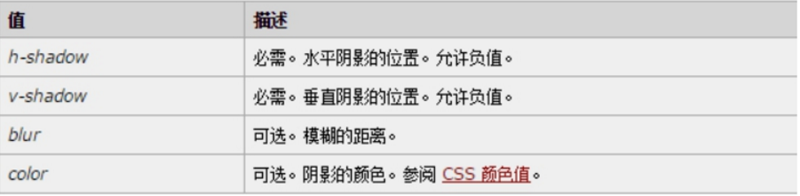
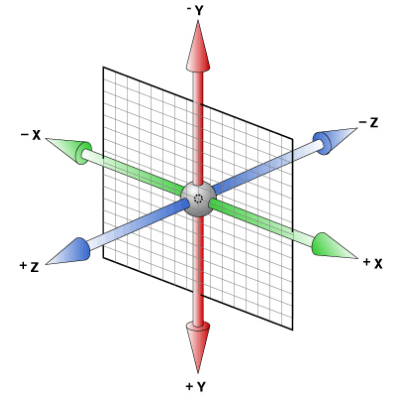

CSS的发展历程

# 引入CSS样式表

## 内部样式表

内嵌式是将CSS代码集中写在HTML文档的head头部标签中，并且用style标签定义

```html
<head>
    <style type="text/CSS">
        选择器 {属性1:属性值1; 属性2:属性值2; 属性3:属性值3;}
    </style>
</head>
```

语法中，style标签一般位于head标签中**title标签之后**，也可以把他放在HTML文档的任何地方。

type="text/CSS"  在html5中可以省略， 写上也比较符合规范， 所以这个地方可以写也可以省略。

## 行内式（内联样式）

内联样式，又有人称行内样式、行间样式、内嵌样式。是通过标签的style属性来设置元素的样式

```html
<标签名 style="属性1:属性值1; 属性2:属性值2; 属性3:属性值3;"> 内容 </标签名>
```

语法中style是标签的属性，实际上任何HTML标签都拥有style属性，用来设置行内式。其中属性和值的书写规范与CSS样式规则相同，行内式只对其所在的标签及嵌套在其中的子标签起作用。

## 外部样式表（外链式）

链入式是将所有的样式放在一个或多个以.CSS为扩展名的外部样式表文件中，通过link标签将外部样式表文件链接到HTML文档中，其基本语法格式如下：

```html
<head>
  <link href="CSS文件的路径" type="text/CSS" rel="stylesheet" />
</head>
```

注意：  link 是个单标签哦!!!

该语法中，link标签需要放在head头部标签中，并且必须指定link标签的三个属性，具体如下：

```
href：定义所链接外部样式表文件的URL，可以是相对路径，也可以是绝对路径。
type：定义所链接文档的类型，在这里需要指定为“text/CSS”，表示链接的外部文件为CSS样式表。
rel：定义当前文档与被链接文档之间的关系，在这里需要指定为“stylesheet”，表示被链接的文档是一个样式表文件。
```

## 三种样式表总结

| 样式表     | 优点                     | 缺点                     | 使用情况       | 控制范围           |
| ---------- | ------------------------ | ------------------------ | -------------- | ------------------ |
| 行内样式表 | 书写方便，权重高         | 没有实现样式和结构相分离 | 较少           | 控制一个标签（少） |
| 内部样式表 | 部分结构和样式相分离     | 没有彻底分离             | 较多           | 控制一个页面（中） |
| 外部样式表 | 完全实现结构和样式相分离 | 需要引入                 | 最多，强烈推荐 | 控制整个站点（多） |

# CSS书写规范

# CSS注释

```
CSS规则是使用     /*  需要注释的内容  */  进行注释的。
```

# CSS qulified Rule

## 字体样式-font

- font-size:字号大小

font-size属性用于设置字号，该属性的值可以使用相对长度单位，也可以使用绝对长度单位。

- font-family:字体

font-family属性用于设置字体。`p{ font-family:"微软雅黑";}`

可以同时指定多个字体，中间以**逗号**隔开，表示如果浏览器不支持第一个字体，则会尝试下一个，直到找到合适的字体。

```
1. 现在网页中普遍使用12px+。
2. 尽量使用偶数的数字字号。ie6等老式浏览器支持奇数会有bug。
4. 中文字体需要加引号，英文字体一般不需要加引号。如果字体名中包含空格、#、$等符号，则该字体必须引号，例如font-family: "Times New Roman";。
5. 当需要设置英文字体时，英文字体名必须位于中文字体名之前。
6. 尽量使用系统默认字体，保证在任何用户的浏览器中都能正确显示。
```

- CSS Unicode字体

在 CSS 中设置字体名称，直接写中文是可以的。但是在文件编码（GB2312、UTF-8 等）不匹配时会产生乱码的错误。xp 系统不支持 类似微软雅黑的中文。

1. 你可以使用英文来替代。 比如 font-family:"Microsoft Yahei"。 

2. 在 CSS 直接使用 Unicode 编码来写字体名称可以避免这些错误。
`font-family: "\5FAE\8F6F\96C5\9ED1"`，表示设置字体为“微软雅黑”。

| 字体名称    | 英文名称        | Unicode 编码         |
| ----------- | --------------- | -------------------- |
| 宋体        | SimSun          | \5B8B\4F53           |
| 新宋体      | NSimSun         | \65B0\5B8B\4F53      |
| 黑体        | SimHei          | \9ED1\4F53           |
| 微软雅黑    | Microsoft YaHei | \5FAE\8F6F\96C5\9ED1 |
| 楷体_GB2312 | KaiTi_GB2312    | \6977\4F53_GB2312    |
| 隶书        | LiSu            | \96B6\4E66           |
| 幼园        | YouYuan         | \5E7C\5706           |
| 华文细黑    | STXihei         | \534E\6587\7EC6\9ED1 |
| 细明体      | MingLiU         | \7EC6\660E\4F53      |
| 新细明体    | PMingLiU        | \65B0\7EC6\660E\4F53 |

- font-weight:字体粗细

字体加粗除了用 b 和 strong 标签之外，可以使用CSS 来实现，但是CSS 是没有语义的。

```html
font-weight属性用于定义字体的粗细，其可用属性值：normal、bold、bolder、lighter、100~900（100的整数倍）。

数字 400 等价于 normal，而 700 等价于 bold。  但是我们更喜欢用数字来表示。
```

- font-style:字体风格

字体倾斜除了用 i  和 em 标签之外，可以使用CSS 来实现，但是CSS 是没有语义的。

font-style属性用于定义字体风格，其可用属性值如下：

1. normal：默认值，浏览器会显示标准的字体样式。

2. italic：浏览器会显示斜体的字体样式。

```
平时我们很少给文字加斜体，反而喜欢给斜体标签（em，i）改为普通模式。
```

- font:综合设置字体样式

font属性用于对字体样式进行综合设置，其基本语法格式如下：

```css
选择器{font: font-style  font-weight  font-size/line-height  font-family;}
行高不写单位的情况：line-height=n*font-size
```

使用font属性时，必须按上面语法格式中的顺序书写，**不能更换顺序**，各个属性以空格隔开。

注意：其中不需要设置的属性可以省略（取默认值），但**必须保留font-size和font-family属性**，否则font属性将不起作用。

## 文本颜色-color

color属性用于定义文本的颜色，其取值方式有如下3种：

1. 预定义的颜色值，如red，green，blue等。
2. 十六进制，如#FF0000，#FF6600，#29D794等。
3. RGB/RGBA，如红色可以表示为rgb(255,0,0)或rgb(100%,0%,0%)。

需要注意的是，如果使用RGB代码的百分比颜色值，取值为0时也不能省略百分号，必须写为0%。

## 行间距-line-height

行间距就是行与行之间的距离，即字符的垂直间距，一般称为行高。line-height常用的属性值单位有三种，分别为像素px，相对值em和百分比%，实际工作中使用最多的是像素px。

一般情况下，行距比字号大7.8像素左右就可以了。

### 行高的测量

行高可以调整文字在盒子内垂直方向的位置

## 水平对齐方式-text-align

| 值      | 描述             |
| ------- | ---------------- |
| left    | 左对齐（默认值） |
| right   |                  |
| center  |                  |
| justify | 两端对齐         |
| inherit |                  |

## 首行缩进-text-indent

其属性值可为不同单位的数值、em或相对于浏览器窗口宽度的百分比%，允许使用负值, 建议使用em作为设置单位，1em 就是一个字的宽度 。

## 文本装饰-text-decoration 

| 值           | 描述                                          |
| ------------ | --------------------------------------------- |
| none         | 默认。定义标准的文本。                        |
| underline    | 定义文本下的一条线。下划线 也是我们链接自带的 |
| overline     | 定义文本上的一条线。                          |
| line-through | 定义穿过文本下的一条线。                      |

## 字间距-letter-spacing

letter-spacing属性用于定义字间距，所谓字间距就是字符与字符之间的空白。其属性值可为不同单位的数值，允许使用负值，默认为normal。

## 单词间距-word-spacing

word-spacing属性用于定义英文单词之间的间距，对中文字符无效。和letter-spacing一样，其属性值可为不同单位的数值，允许使用负值，默认为normal。

word-spacing和letter-spacing均可对英文进行设置。不同的是letter-spacing定义的为字母之间的间距，而word-spacing定义的为英文单词之间的间距。

## 自动换行-word-break

| 值        | 描述                           |
| --------- | ------------------------------ |
| normal    | 使用浏览器默认的换行规则。     |
| break-all | 允许在单词内换行。             |
| keep-all  | 只能在半角空格或连字符处换行。 |

主要处理英文单词

## 文本显示-white-space

设置或检索对象内文本显示方式。通常我们使用于强制一行显示内容 

```
normal : 默认处理方式
nowrap : 强制在同一行内显示所有文本，直到文本结束或者遭遇br标签对象才换行。可以处理中文
```

## 文本方向-writing-mode

定义了文本水平或垂直排布以及在块级元素中文本的行进方向。

`writing-mode:horizontal-tb` 定义了内容从左到右水平流动，从上到下垂直流动。下一条水平线位于上一条线下方。

`writing-mode:vertical-rl` 定义了内容从上到下垂直流动，从右到左水平流动。下一条垂直线位于上一行的左侧。

`writing-mode:vertical-lr`定义了内容从上到下垂直流动，从左到右水平流动。下一条垂直线位于上一行的右侧。

`writing-mode:sideways-rl`(仅Firefox41+实现)定义了内容从上到下垂直流动，所有字形，甚至是垂直脚本中的字形，都设置在右侧。

`writing-mode:sideways-lr`(仅Firefox41+实现)内容从上到下垂直流动，所有字形，甚至是垂直脚本中的字形，都设置在左侧。

## 文本对齐-direction

`direction: ltr;`

默认值，让文本和其他元素从左到右显示。

`direction: rtl;`

让文本和其他元素从右到左显示。

## 文字溢出-text-overflow

```
clip : 　不显示省略标记（...），而是简单的裁切 
ellipsis : 　当对象内文本溢出时显示省略标记（...）
```

注意：一定要首先强制一行内显示，再和overflow属性  搭配使用

### 溢出的文字隐藏

```
p {
	white-space: nowrap;
	overflow: hidden;
	text-overflow: ellipsis;
}
```

## 颜色透明度(CSS3)

1. RGBA：此色彩模式与RGB相同，只是新增了Alpha透明度(0-1)。 不会影响子代的透明度

```css
color: rgba(r,g,b,a)  
```

2. HSLA(H,S,L,A)：

H：Hue(色调)。0(或360)表示红色，120表示绿色，240表示蓝色。取值为：0 - 360 

S：Saturation(饱和度)。取值为：0.0% - 100.0% 

L：Lightness(亮度)。取值为：0.0% - 100.0% ，一般取50%

A：Alpha（0-1）

## 文字阴影(CSS3)

以后我们可以给我们的文字添加阴影效果了  Shadow  影子  

```css
text-shadow:水平位置 垂直位置 模糊距离 阴影颜色;
```

 

**前两项是必须写的**, 后两项可以选写。

### 凹凸文字 

```css
<head>
        <meta charset="utf-8">
        <style>
        body {
        	background-color: #ccc;
        }
		div {
			color: #ccc;
			font: 700 80px "微软雅黑";
		}
		div:first-child {
			/* text-shadow: 水平位置  垂直位置  模糊距离 阴影颜色; */
			text-shadow: 1px 1px 1px #000, -1px -1px 1px #fff;
		}
		div:last-child {
			/* text-shadow: 水平位置  垂直位置  模糊距离 阴影颜色; */
			text-shadow: -1px -1px 1px #000, 1px 1px 1px #fff;
		}
        </style>
    </head>
    <body>
    <div>我是凸起的文字</div>
    <div>我是凹下的文字</div>
    </body>
```


## 背景-background

CSS 可以添加背景颜色和背景图片，以及来进行图片设置。

| 属性名称                                                    | 描述             |
| ----------------------------------------------------------- | ---------------- |
| background-color                                            | 背景颜色         |
| background-image                                            | 背景图片地址     |
| background-repeat                                           | 是否平铺         |
| background-position                                         | 背景位置         |
| background-attachment                                       | 背景固定还是滚动 |
| 背景的合写（复合属性）                                      |                  |
| background:背景颜色 背景图片地址 背景平铺 背景滚动 背景位置 |                  |

- 背景图片（image）

```css
background-image : none | url (url) 

none : 　无背景图（默认的）
url : 　使用绝对或相对地址指定背景图像 
```

background-image 属性允许指定一个图片展示在背景中（只有CSS3才可以多背景）可以和background-color 连用。 如果图片不重复地话，图片覆盖不到地地方都会被背景色填充。 如果有背景图片平铺，则会覆盖背景颜色。

提倡背景图片后面的url不要加引号。

- 背景平铺（repeat）

```css
background-repeat : repeat | no-repeat | repeat-x | repeat-y | round | space

repeat : 　背景图像在纵向和横向上平铺（默认的）
no-repeat : 　背景图像不平铺
repeat-x : 　背景图像在横向上平铺
repeat-y : 　背景图像在纵向平铺 
```

- 背景位置（position）

```css
background-position : length || length
background-position : position || position 

length : 　百分数 | 由浮点数字和单位标识符组成的长度值。请参阅长度单位 
position : 　top | center | bottom | left | center | right 
```

设置或检索对象的背景图像位置。必须先指定background-image属性。默认值为：(0% 0%)。
如果只指定了一个值，该值将用于横坐标。纵坐标将默认为50%。第二个值将用于纵坐标。

注意：

1. position 后面是x坐标和y坐标。 可以使用方位名词或者 精确单位。
2. 如果和精确单位和方位名字混合使用，则必须是x坐标在前，y坐标后面。比如 background-position: 15px top;   则 15px 一定是  x坐标   top是 y坐标。

- 背景附着（attachment）

```css
background-attachment : scroll | fixed  

scroll : 　背景图像是随对象内容滚动
fixed : 　背景图像固定 
```

- 背景简写

background属性的值的书写顺序官方并没有强制标准的。为了可读性，建议大家如下写：

background：背景颜色 背景图片地址 背景平铺 背景滚动 背景位置

```css
background: transparent url(image.jpg) repeat-y  scroll 50% 0 ;
```

### 背景透明 CSS3

CSS3支持背景半透明的写法语法格式是:

```css
background: rgba(0,0,0,0.3);
```

最后一个参数是alpha 透明度  取值范围 0~1之间

注意：  背景半透明是指盒子背景半透明， 盒子里面的内容不收影响。

了解ie低版本浏览器 半透明

`filter:Alpha(opacity=50) ；   // opacity值为0 到 100`

但是 此属性是盒子半透明，不是背景半透明哦，因为里面的内容也一起半透明了

因此，低版本的 ie6.7浏览器，我们不需要透明了，直接采用优雅降级的做法。

`background: gary;`

`background: rgba(0,0,0,.2);`

写上两句背景， 低版本ie只执行gray， 其他浏览器执行 半透明下面这一句。

### 背景缩放-size CSS3

通过**background-size**设置背景图片的尺寸，就像我们设置img的尺寸一样，在移动Web开发中做屏幕适配应用非常广泛。

其参数设置如下：

```css
number/percentage：可以设置长度单位(px)或百分比（设置百分比时，参照盒子的宽高）当只取一个值时，第二个值相当于auto 。
cover：会自动调整缩放比例，保证图片始终填充满背景区域，如有溢出部分则会被隐藏。我们平时用的cover 最多
contain：会自动调整缩放比例，保证图片始终完整显示在背景区域。
```

```css
background-image: url('images/gyt.jpg');
background-size: 300px 100px;
/* background-size: contain; */
/* background-size: cover; */
```

### 背景参考原点-origin CSS3

1. 作用：background-origin 属性规定 background-position 属性相对于什么位置来定位。默认值是left top左上角（border-box）

   `background-origin: padding-box|border-box|content-box;`

2. 属性值说明：

| padding-box | 背景图像相对于内边距框来定位。 |
| ----------- | ------------------------------ |
| border-box  | 背景图像相对于边框盒来定位。   |
| content-box | 背景图像相对于内容框来定位。   |

### 背景裁剪-clip CSS3

1. background-clip 属性规定背景的绘制区：虽然是设置裁切，但是控制的是显示。就是设置最终显示那些区域

   `background-clip: border-box|padding-box|content-box;`

2. 属性值说明：

| **值**      | **描述**               |
| ----------- | ---------------------- |
| border-box  | 背景被裁剪到边框盒。   |
| padding-box | 背景被裁剪到内边距框。 |
| content-box | 背景被裁剪到内容框。   |

结合background-origin应用：为块设置精灵图背景，以更大的范围响应用户的需要。

### 多背景 CSS3

以逗号分隔可以设置多背景，可用于自适应布局  做法就是 用逗号隔开就好了。

- 一个元素可以设置多重背景图像。 
- 每组属性间使用逗号分隔。 
- 如果设置的多重背景图之间存在着交集（即存在着重叠关系），前面的背景图会覆盖在后面的背景图之上。
- 为了避免背景色将图像盖住，背景色通常都定义在最后一组上，

```css
缩写：background:url(test1.jpg) no-repeat scroll 10px 20px/50px 60px content-box padding-box,
	   url(test1.jpg) no-repeat scroll 10px 20px/70px 90px content-box padding-box,
	   url(test1.jpg) no-repeat scroll 10px 20px/110px 130px content-box padding-box #aaa;
拆分：background-image:url(test1.jpg),url(test2.jpg),url(test3.jpg);
background-repeat:no-repeat,no-repeat,no-repeat;
background-attachment:scroll,scroll,scroll;
background-position:10px 20px,10px 20px,10px 20px;
background-size:50px 60px,70px 90px,110px 130px;
background-origin:content-box,content-box,content-box;
background-clip:padding-box,padding-box,padding-box;
background-color:#aaa;

```

也可以这么写：

```
background-image:url("1.jpg"),url("2.jpg"),url("3.jpg");
background-repeat: no-repeat, no-repeat, no-repeat;  
background-position: 0 0, 200px 0, 400px 201px;  
```

### 背景渐变

在线性渐变过程中，颜色沿着一条直线过渡：从左侧到右侧、从右侧到左侧、从顶部到底部、从底部到顶部或着沿任何任意轴。

兼容性问题很严重

线性渐变语法格式： 

```css
background:-webkit-linear-gradient(渐变的起始位置， 起始颜色， 结束颜色)；
```

```css
background:-webkit-linear-gradient(渐变的起始位置， 颜色 位置， 颜色位置....)；
```

## 用户界面样式

 所谓的界面样式， 就是更改一些用户操作样式， 比如 更改用户的鼠标样式， 表单轮廓，防止表单域拖拽等。但是比如滚动条的样式改动受到了很多浏览器的抵制，因此我们就放弃了。 

### 鼠标样式cursor

 设置或检索在对象上移动的鼠标指针采用何种系统预定义的光标形状。 

```css
cursor :  default  小白 | pointer  小手  | move  移动  |  text  文本
```

```html
<ul>
  <li style="cursor:default">我是小白</li>
  <li style="cursor:pointer">我是小手</li>
  <li style="cursor:move">我是移动</li>
  <li style="cursor:text">我是文本</li>
</ul>
```

 尽量不要用hand  因为 火狐不支持     pointer ie6以上都支持的尽量用

### 轮廓- outline

 是绘制于元素周围的一条线，位于边框边缘的外围，可起到突出元素的作用。

```css
 outline : outline-color ||outline-style || outline-width 
```

我们平时都是去掉的，最直接的写法是 ：  outline: 0;   或者  outline: none;

```html
 <input  type="text"  style="outline: 0;"/>
```

### 防止拖拽文本域-resize

resize：none    这个单词可以防止 火狐 谷歌等浏览器随意的拖动 文本域。

右下角不可以拖拽： 

```html
<textarea  style="resize: none;"></textarea>
```

### 垂直对齐-vertical-align 

以前我们讲过让带有宽度的块级元素居中对齐，是margin: 0 auto;

以前我们还讲过让文字居中对齐，是 text-align: center;

```css
vertical-align : baseline |top |middle |bottom 
```

设置或检索对象内容的垂直对其方式。 

vertical-align 不影响块级元素中的内容对齐，它只针对于 行内元素或者行内块元素，特别是行内块元素， **通常用来控制图片/表单与文字的对齐**。

### 图片、表单和文字对齐

所以我们知道，我们可以通过vertical-align 控制图片和文字的垂直关系了。 默认的图片会和文字基线对齐。

### 去除图片底侧空白缝隙

图片或者表单等行内块元素，他的底线会和父级盒子的基线对齐。这样会造成一个问题，就是图片底侧会有一个空白缝隙。

解决的方法就是：  

1. 给img vertical-align:middle | top等等。  让图片不要和基线对齐；
2. 给img 添加 display：block; 转换为块级元素就不会存在问题了；
3. 给父元素添加font-size： 0；
4. 给父元素添加line-height： 0；

# CSS @-rule

## @charset

`@charset`用于定义样式表中使用的字符编码。它必须写在样式表的**最开头**且前面**不可**有别的字符。

`@charset "UTF-8";`

## @import

`@import`用于导入外部 `CSS样式表`文件。

与link的区别：@import先加载html后加载css

1. link属于XHTML标签，而@import完全是css提供的一种方式。link标签除了可以加载css外，还可以做很多其他的事情，比如定义RSS，定义rel连接属性等，@import只能加载CSS。

2. 加载顺序的差别：当一个页面被加载的时候（就是被浏览者浏览的时候），link引用的CSS会同时被加载，而@import引用的CSS会等到页面全部被下载完再加载。所以有时候浏览@import加载CSS的页面时会没有样式（就是闪烁），网速慢的时候还挺明显。

3. 兼容性的差别。由于@import是CSS2.1提出的只有在IE5以上的才能识别，而link标签无此问题，完全兼容。

4. 使用dom控制样式时的差别。当时用JavaScript控制dom去改变样式的时候，只能使用link标签，因为@import不是dom可以控制的（不支持）。

```css
/* @import url; */
/* @import url list-of-media-queries; */
@importm'custom.css';
@import url("fineprint.css") print ;
```

## @media

`@media`用于定义在一个或多个**设备类型**、**具体特点**和**环境**的媒体查询来应用样式。

```css
@media screen and (min-width: 900px) {
    h1 { color: red; }
}
```

## @page

`@page`用于在打印文档时修改某些CSS属性。 `@page`规则只能修改 `margin`、 `orphans`、 `widow` 和 `page breaks of the document`，对其他属性的修改是无效的。

```css
@page {
    size: 10in 20in;
    margin: 10% 20%;
}
```

## @keyframes

`@keyframs`通过定义动画序列中的**关键帧**来控制 `CSS动画`不同步骤的状态。

```css
@keyframes slidein {
    from { width: 300%; }
    to { width: 100%; }
}
```

## @fontface

`@font-face`用于给网页指定文本字体。

```css
@font-face {
    font-family: "xxx";
    src: url("xxx");
}
body {
    font-family: "xx";
}
```

## @supports

`@supports`用来检测规则组的**规则**是否生效。规则与 `@media`类似

```css
@supports (display: flex) {
    div { display: flex; }
}
```

## @namespace

`@namespace`是用来定义使用在 `CSS样式表`中的 `XML`命名空间的@规则。

```css
/* 默认命名空间 */
@namespace "XML-namespace-URL";
@namespace url(XML-namespace-URL);

/* 命名空间前缀 */
@namespace prefix url(XML-namespace-URL);
@namespace prefix "XML-namespace-URL";

@namespace svg url(http://www.w3.org/2000/svg);

/* 匹配所有的XHTML <a> 元素, 因为 XHTML 是默认无前缀命名空间 */
a {}

/* 匹配所有的 SVG <a> 元素 */
svg|a {}

/* 匹配 XHTML 和 SVG <a> 元素 */
*|a {}
```

## @viewport

```css
@viewport {
    min-width: 640px;
 	/* 初始缩放系数 */   
    zoom: 0.75;
    /* 文档方向 */
 	/* landscape文件应锁定在横向。portrait文档应该锁定在纵向方向上 */ 
    orientation: landscape;
}
```

## @counter-style

`@counter-style`用于自定义 `counter`的样式

```css
/*
 * @counter-style <counter-style-name> {
 *   <group-rule-body>
 * }
 */
@count-style circled-alpha {
    system: fixed;
    symbols: Ⓐ;
	suffix: " ";
}
.items {
    list-style: circled-alpha
}
```

## @doucment

`@document`如果满足条件组的**条件**，则规则生效（推延至 CSS Level 4 规范）

```css
@document url(http://www.w3.org/),
               url-prefix(http://www.w3.org/Style/),
               domain(mozilla.org),
               regexp("https:.*")
{
  /* 该条CSS规则会应用在下面的网页:
     + URL为"http://www.w3.org/"的页面.
     + 任何URL以"http://www.w3.org/Style/"开头的网页
     + 任何主机名为"mozilla.org"或者主机名以".mozilla.org"结尾的网页     
     + 任何URL以"https:"开头的网页 */

  /* make the above-mentioned pages really ugly */
  body { color: purple; background: yellow; }
}
```

# 选择器

## 基础选择器

- 标签选择器（元素选择器）

标签选择器是指用HTML标签名称作为选择器，为页面中某一类标签指定统一的CSS样式。

```
标签名{属性1:属性值1; 属性2:属性值2; 属性3:属性值3; } 
```

- 类选择器

类选择器使用“.”（英文点号）进行标识，后面紧跟类名

```
.类名{属性1:属性值1; 属性2:属性值2; 属性3:属性值3; }
```

小技巧：

```
1.长名称或词组可以使用中横线来为选择器命名。
2.不要纯数字、中文等命名，尽量使用英文字母来表示。
```

命名规范：  见附件（Web前端开发规范手册.doc）

- 多类名选择器

我们可以给标签指定多个类名，从而达到更多的选择目的。

```
1. 样式显示效果跟HTML元素中的类名先后顺序没有关系,受CSS样式书写的上下顺序有关。
2. 各个类名中间用空格隔开。
```

- id选择器

id选择器使用“#”进行标识，后面紧跟id名。

```
#id名{属性1:属性值1; 属性2:属性值2; 属性3:属性值3; }
```

大多数HTML元素都可以定义id属性，元素的id值是唯一的，只能对应于文档中某一个具体的元素。

- 通配符选择器

通配符选择器用“*”号表示，他是所有选择器中作用范围最广的，能匹配页面中所有的元素。

例如下面的代码，使用通配符选择器定义CSS样式，清除所有HTML标记的默认边距。

```css
* {
  margin: 0;                    /* 定义外边距*/
  padding: 0;                   /* 定义内边距*/
}
```

## 伪类选择器

  伪类选择器用于向某些选择器添加特殊的效果。比如给链接添加特殊效果， 比如可以选择 第1个，第n个元素。

### 链接伪类选择器

- E:link      /* 未访问的链接 */

- E:visited   /* 已访问的链接 */

- E:hover     /* 鼠标移动到链接上 */

- E:active    /* 选定的链接 */

- :focus 表示焦点落在这个元素之上。

- :target 用于选中浏览器 URL 的 hash 部分所指示的元素。

  注意写的时候，他们的顺序尽量不要颠倒  按照  lvha 的顺序。   love   hate  爱上了讨厌 记忆法

### 结构(位置)伪类选择器（CSS3)

- :root :表示树的根元素，在选择器是针对完整的 html 文档情况，我们一般用 html 标签即可选中根元素。但是随着 scoped css 和 shadow root 等场景出现，选择器可以针对某一子树来选择，这时候就很需要 root 伪类了。
- E:first-child :选取属于其父元素的首个子元素的指定选择器（CSS2）
- E:last-child :选取属于其父元素的最后一个子元素的指定选择器
- E:nth-child(n) ： 匹配属于其父元素的第 N 个子元素，不论元素的类型
  - -n+5：表示前5个
- E:nth-last-child(n) ：选择器匹配属于其元素的第 N 个子元素的每个元素，不论元素的类型，从最后一个子元素开始计数。  
- E:nth-child(even): 所有的偶数
- E:nth-child(odd): 所有的奇数
- E:nth-of-type(n):指定类型
- E:nth-last-of-type(n):指定类型，从最后一个子元素开始计数。  
- E:empty 选中没有任何子节点的E元素，注意，空格也算子元素。
- :only-child :按字面意思理解即可，选中唯一一个子元素。

**重点：n遵循线性变化，其取值0、1、2、3、4、... 但是当n<=0时，选取无效 **

### 逻辑伪类选择器

- E:not()

```css
/* 类名不是 `.fancy` 的 <p> 元素 */
p:not(.fancy) {
  color: green;
}

/* 非 <p> 元素 */ 
body :not(p) {
  text-decoration: underline;
}

/* 非 <div> 或 <span> 的元素 */
body :not(div):not(span) {
  font-weight: bold;
}

/* 类名不是 `.crazy` or `.fancy` 的元素 */
/* 注意，此语法尚未被较好地支持。 */
body :not(.crazy, .fancy) {
  font-family: sans-serif;
}
```


## 目标伪类选择器(CSS3)

 E:target目标伪类选择器 :为锚点目标元素添加样式，当E为当前锚链接目标时的样式。

```css
h1:target {
		color: red;
		font-size: 30px;
}
```

## 组合选择器

- 交集选择器

EE：交集选择器由两个选择器构成，选择器之间不能有空格。

- 并集选择器

E，E：并集选择器（CSS选择器分组）是各个选择器通过**逗号**连接而成的。

- 后代选择器

E E：后代选择器又称为包含选择器，用来选择元素或元素组的后代，中间用**空格**分隔。

- 子元素选择器

E > E：子元素选择器只能选择作为某元素子元素的元素。中间跟一个 **&gt;** 进行连接。

- 相邻选择器

E + E：选中符合条件的**相邻**元素

- 兄弟选择器（CSS3）

E ~ E：选中符合条件的兄弟元素

```html
<p>p1</p>
<p>p2</p>
<h3>这是一个标题</h3>
<p>p3</p>
<h3>这是一个标题</h3>
<p>p4</p>
<p>p5</p>

如果使用p + p{color:#f00;}，那么p2, p5将会变成红色
如果使用p ~ p{color:#f00;}，那么p2,p3,p4,p5将会变成红色；
```

- **|**: 命名空间选择器

例如：`.a|.b`。在例子中选中的就是属于 `.a`的 `.b`，跟 `.a.b`一样，属于**Selectors Leve 3**的内容。

- **||**：列选择器

例如：`.a||.b`。在例子中选中的就是由 `.a`表示的列的网格/表中的单元格的 `.b`，属于 `SelectorsLevel4`的内容。

## 属性选择器

选取标签带有某些特殊属性的选择器 我们成为属性选择器

E[attr]：选中带有attr属性的标签

E[attr='val']：选中带有attr属性值等于val的标签

E[attr~='val']：选中带有attr属性值为用空格分隔的字词列表，其中包括val的标签

CSS3：

E[attr^='val']：选中带有attr属性值以val开头的标签

E[attr$='val']：选中带有attr属性值以val结尾的标签

E[attr*='val']：选中带有attr属性值包含val字符的标签

E[attr|='val']：选中带有attr属性值为以val开头并用连接符"-"分隔的字符串的E元素，如果属性值仅为val，也将被选择

```css
/* 获取到 拥有 该属性的元素 */
div[class^=font] { /*  class^=font 表示 font 开始位置 */
	color: pink;
}
div[class$=footer] { /*  class$=footer 表示 footer 结束位置 */
	color: skyblue;
}
div[class*=tao] { /* class*=tao  *=  表示tao 在任意位置都可以 */
	color: green;
}
```

```html
<div class="font12">属性选择器</div>
<div class="font12">属性选择器</div>
<div class="font24">属性选择器</div>
<div class="font24">属性选择器</div>
<div class="font24">属性选择器</div>
<div class="24font">属性选择器123</div>
<div class="sub-footer">属性选择器footer</div>
<div class="jd-footer">属性选择器footer</div>
<div class="news-tao-nav">属性选择器</div>
<div class="news-tao-header">属性选择器</div>
<div class="tao-header">属性选择器</div>
```

## 伪元素选择器（CSS3)

1. E::first-letter文本的第一个单词或字（如中文、日文、韩文等）
2. E::first-line 文本第一行；
3. E::selection 可改变选中文本的样式；

```css
p::first-letter {
  font-size: 20px;
  color: hotpink;
}
/* 首行特殊样式 */
p::first-line {
  color: skyblue;
}
p::selection {
  /* font-size: 50px; */
  color: orange;
}
```

4、E::before和E::after

在E元素内部的开始位置和结束位创建一个元素，该元素为行内元素，且必须要结合content属性使用。

```css
div::befor {
  content:"开始";
}
div::after {
  content:"结束";
}
```

E:after、E:before 在旧版本里是伪元素，CSS3的规范里“:”用来表示伪类，“::”用来表示伪元素，但是在高版本浏览器下E:after、E:before会被自动识别为E::after、E::before，这样做的目的是用来做兼容处理。

## 其他

**:root选择器**用匹配文档的根元素。

在HTML中根元素始终是HTML元素。

# 函数

根据MDN所陈列的关键字索引，**css函数**一共有**86**个。

根据w3cplus中可以划分为以下几类：

- **属性函数**：`attr()`；
- **背景图片函数**：`linear-gradient()`、 `radial-gradient()`、 `conic-gradient()`、 `repeating-linear-gradient()`、 `repeating-radial-gradient()`、 `repeating-conic-gradient()`、 `image-set()`、 `image()`、 `url()`、 `element()`；
- **颜色函数**：`rgb()`、 `rgba()`、 `hsl()`、 `hsla()`、 `hwb()`、 `color-mod()`；
- **图形函数**：`circle()`、 `ellipse()`、 `inset()`、 `polygon()`、 `path()`
- **滤镜函数**：`blur()`、 `brightness()`、 `contrast()`、 `drop-shadow()`、 `grayscale()`、 `hue-rotate()`、 `invert()`、 `opacity()`、 `saturate()`、 `sepia()`；
- **转换函数**：`matrix()`、 `matrix3d()`、 `perspective()`、 `rotate()`、 `rotate3d()`、 `rotateX()`、 `rotateY()`、 `rotateZ()`、 `scale()`、 `scale3d()`、 `scaleX()`、 `scaleY()`、 `scaleZ()`、 `skew()`、 `skewX()`、 `skewY()`、 `translate()`、 `translateX()`、 `translateY()`、 `translateZ()`、 `translate3d()`；
- **数学函数**：`calc()`、 `min()`、 `max()`、 `mixmax()`、 `repeat()`；
- **缓动函数**：`cubic-bezier()`、 `steps()`；
- **其他函数**：`counter()`、 `counters()`、 `toggle()`、 `var()`、 `symbols()`。

这些函数各有各的功能，按需排列组合可以实现很多很酷炫的效果。在这里一定要安利大漠老师的CSS中的函数以及张鑫旭老师在**CSS CONF**中的分享，里面就讲了很多关于**CSS 函数**的应用。

## 背景图片函数

### element()

`element()`是属于CSS Image Value and Replaced Content Module Level 4中的背景函数。

`element()`可以将网站中的部分内容当成图片渲染。

```html
<!DOCTYPE html>
<html lang="en">
<head>
    <meta charset="UTF-8">
    <title>Document</title>
    <style>
    .edit,
    .show {
        width: 200px;
        height: 200px;
        margin: 10px;
        border: 1px solid #ccc;
    }
    .show {
      background: -moz-element(#edit);
      background-size: 100% 100%;
    }
    </style>
</head>
<body>
    <h1>限火狐浏览器</h1>
    <div contenteditable class="edit" id="edit"></div>
    <div class="show" id="show"></div>
</body>
</html>
```

### conic-gradient()

```html
<!DOCTYPE html>
<html lang="en">
<head>
    <meta charset="UTF-8">
    <title>Document</title>
    <style>
    .colorful {
        width: 300px;
        height: 300px;
        background: conic-gradient(
            #9ED110,
            #50B517,
            #179067,
            #476EAF,
            #9f49ac,
            #CC42A2,
            #FF3BA7,
            #FF5800,
            #FF8100,
            #FEAC00,
            #FFCC00,
            #EDE604
        );
        border-radius: 50%;
        cursor: pointer;
        transition: all 0.5s ease;
    }
    .colorful:hover {
        /* filter：滤镜 */
        /* blur()：调整模糊度 */
        /* contrast()：调整对比度 */
        /* brightness()：调整亮度 */
        /* drop-shadow()：调整阴影 */
        /* hue-rotate（）：色调旋转 */
        /* grayscale()：转换为灰度 */
        filter: hue-rotate(180deg)
    }
    </style>
</head>
<body>
    <div class="colorful"></div>
</body>
</html>
```

# 其他

## 自定义属性

参考：[http://verymuch.site/2019/04/15/CSS%E8%87%AA%E5%AE%9A%E4%B9%89%E5%B1%9E%E6%80%A7%E5%8F%8A%E5%85%B6%E7%94%A8%E6%B3%95/#more](http://verymuch.site/2019/04/15/CSS自定义属性及其用法/#more)

### 自定义属性名

预处理器的变量也有一些缺点和限制，如下：

1. **不能动态修改变量**：预处理器是在编译时进行变量的处理，编译后变量其实就不存在了。
2. **没有DOM结构，无法级联继承**。
3. **不能用JavaScript进行读写**。

CSS自定义属性的语法格式为`--*`，双横线加上具体的自定义属性名，属性名是一个合法的CSS[标识符](https://www.w3.org/TR/css-syntax-3/#identifier)即可。

自定义属性没有具体的CSS含义，其用途完全由作者和使用者决定。自定义属性可以**应用于任何元素，其可以被继承，并且支持级联，不支持动画**。

注意：与CSS属性不同，自定义属性是**大小写敏感的**。

### 自定义属性值

可以是任何有效的CSS值，如颜色、字符、布局的值、甚至是表达式。

通过`var()`函数，自定义属性的值可以用作另一个属性的值。

`var( <custom-property-name> [, <declaration-value> ]? )`

其中第一个参数为自定义属性名，第二个参数为后备值。当传入的自定义属性无效或者不存在时，会使用后备值。

注意：

1. 自定义属性不能作为一个独立属性值的一部分

2. 会导致动画瑕疵，因为其只会在指定帧影响使用了自定义属性的可动画属性。
3. 如果在计算属性的时候，发现了依赖依赖循环，则**依赖循环中的所有自定义属性值都使用初始值代替**。

### 优势

1. **可以动态修改自定义属性**
2. **有DOM结构的概念，可以级联继承**。
3. **可以用JavaScript进行读写**。

CSS自定义属非常适合用来实现**主题的切换**

# 单位

# 布局

## 双飞翼布局

见代码

## 正常流

正常流的盒子属于**格式化上下文(FC)**，在**CSS2.2**中可以是**表格**、**块**或**内联**。 在**CSS3**中引入了**flex**跟**grid**，当然以后会引入得更多。

**块级盒子(block-level boxes)** 与创建 **块级格式化上下文(BFC)** 有关；

**行内级盒子(inline-level boxes)** 与创建 **行内级格式化上下文(IFC)** 有关。

### BFC

https://www.cnblogs.com/lhb25/p/inside-block-formatting-ontext.html

BFC(Block formatting context)：直译为"块级格式化上下文"。

创建了 BFC的元素就是一个独立的盒子，它是一个独立的渲染区域，只有Block-level box参与， 它规定了内部的Block-level Box如何布局，并且与这个区域外部毫不相干。

> Box是CSS布局的对象和基本单位，就是一个页面是由很多个Box(即boxes)组成的。**元素的类型和display属性，决定了这个Box的类型。** 不同类型的Box， 会参与不同的Formatting context(一个决定如何渲染文档的容器)，因此Box内的元素会以不同的方式渲染。

常见的盒子类型：

block-level box: display属性为block, list-item, table的元素，会生成block-level box。并且参与block fomatting context。 

inline-level box: display属性为inline, inline-block, inline-table的元素，会生成inline-level box。并且参与inline formatting context。

#### Formatting context

Formatting context是W3C CSS2.1规范中的一个概念。它是页面中的一块渲染区域，并且有一套渲染规则，它决定了其子元素将如何定位，以及和其他元素的关系和相互作用。  

#### W3C定义

​	浮动元素和绝对定位元素，非块级盒子的块级容器（例如 inline-blocks, table-cells, 和 table-captions），以及overflow值不为“visiable”的块级盒子，都会为他们的内容创建新的块级格式化上下文。 
​	在一个块级格式化上下文里，盒子从包含块的顶端开始垂直地一个接一个地排列，两个盒子之间的垂直的间隙是由他们的margin 值所决定的。两个相邻的块级盒子的垂直外边距会发生叠加。 

​	在块级格式化上下文中，每一个盒子的左外边缘（margin-left）会触碰到容器的左边缘(border-left)（对于从右到左的格式来说，则触碰到右边缘），即使存在浮动也是如此，除非这个盒子创建一个新的块级格式化上下文。 

#### 元素的显示模式

素的显示模式 display，分为 块级元素行内元素行内块元素，其实，它还有很多其他显示模式。


#### 参与BFC的条件

**display 属性为 block, list-item, table 的元素，生成block-level box，可以参与BFC.**

#### 什么情况可以产生BFC

要给这些元素添加如下属性就可以触发BFC。

```
-根元素
-float属性不为none
-position为absolute或fixed
-display为inline-block, table-cell, table-caption, flex, inline-flex
-overflow不为visible。
```

#### BFC元素所具有的特性

BFC布局规则特性：

1. 在BFC中，盒子从顶端开始垂直地一个接一个地排列。
2. 盒子**垂直**方向的距离由margin决定。**属于同一个BFC**的两个相邻盒子的margin会发生重叠。==》消除margin重叠问题
3. 在BFC中，每一个盒子的左外边缘（margin-left）会触碰到容器的左边缘(border-left)不会压住边框（对于从右到左的格式来说，则触碰到右边缘）。
4. BFC的区域不会与浮动盒子产生交集，而是紧贴浮动边缘。==》两栏右侧自适应效果
5. 计算BFC的高度时，自然也会检测浮动或者定位的盒子高度。==》清除浮动效果

#### BFC的主要用途

(1) 清除元素内部浮动

计算BFC的高度时，自然也会检测浮动或者定位的盒子高度。所以只要把父元素设为BFC就可以清理子元素的浮动了，最常见的用法就是在父元素上设置overflow: hidden样式，对于IE6加上zoom:1就可以了。

主要用到 

```
计算BFC的高度时，自然也会检测浮动或者定位的盒子高度。
```


(2) 解决外边距合并问题

外边距合并的问题。

主要用到 

```
盒子垂直方向的距离由margin决定。属于同一个BFC的两个相邻盒子的margin会发生重叠

```

属于同一个BFC的两个相邻盒子的margin会发生重叠，那么我们创建不属于同一个BFC，就不会发生margin重叠了。


(3) 制作右侧自适应的盒子问题


(4) 多列布局中防止最后一列因为浏览器四舍五入了列宽使总宽度会超出容器而掉下来，我们在多列布局中的最后一列里创建一个新的BFC，它将总是占据其他列先占位完毕后剩下的空间。 

```html
<div class="container">
    <div class="column">column 1</div>
    <div class="column">column 2</div>
    <div class="column">column 3</div>
</div>
<style>
.column {
    width: 31.33%;
    background-color: green;
    float: left;
    margin: 0 1%;
}
/*  Establishing a new block formatting 
    context in the last column */
.column:last-child {
    float: none;
	overflow: hidden; 
}
</style>
```

现在尽管盒子的宽度稍有改变，但布局不会打破。当然，对多列布局来说这不一定是个好办法，但能避免最后一列下掉。这个问题上弹性盒或许是个更好的解决方案，但这个办法可以用来说明元素在这些环境下的行为。

### IFC

IFC(Inline Formatting Contexts)直译为"内联格式化上下文"，IFC的line box(线框)高度由其包含行内元素中最高的实际高度计算而来(不受到竖直方向的padding/margin影响)

跟**BFC**不一样，**IFC**内的盒子会从**包含块**的顶部一个接着一个地水平排列。这些盒子会考虑水平 `margin`， `border`跟 `padding`。垂直对齐的方式也略有复杂。然后，包含形成一条线的框的矩形区域称为**线盒（line box）**。 

**线盒（line box）的宽度**：由浮动情况跟它所在的包含块决定。

**线盒（line box）的高度**：由 `line-height`的计算结果决定。

#### 基线（baseline）

**线盒（line box）** 的高度由 `line-height`的计算结果决定。

`line-height`的定义就是**线盒（line box）**内两**基线（baseline）**（W3C原文）的间距。

`vertical-align`的默认值就是基线。


如上图所示，我们看到小写字母**x**的位置，它的上下边缘就是我们的**基线（baseline）**，但下边缘才是我们日常使用的属性值。顺便一提，CSS单位 `ex`便是指的这个**字母x**的高度。

### FFC和GFC

FFC(Flex Formatting Contexts)直译为"自适应格式化上下文"，display值 为flex或者inline-flex的元素将会生成自适应容器(flex container)，

GFC(GridLayout Formatting Contexts)直译为"网格布局格式化上下文"， 当为一个元素设置display值为grid的时候，此元素将会获得一个独立 的渲染区域，我们可以通过在网格容器(grid container)上定义网格 定义行(grid definition rows)和网格定义列(grid definition columns) 属性各在网格项目(grid item)上定义网格行(grid row)和网格列 (grid columns)为每一个网格项目(grid item)定义位置和空间。

## 层叠上下文与层叠顺序


上面便是在同样的上下文中，元素的层叠规则（CSS3以后的除外，那规则会比较复杂）。元素的 **z-index 值**只在父级层叠上下文中有意义。级层叠上下文被自动视为父级层叠上下文的一个独立单元。

文档中的层叠上下文由满足以下任意一个条件的元素形成：

- 根元素 (HTML),
- z-index 值不为 `auto` 的 绝对/相对定位，
- 一个 z-index 值不为 `auto` 的 flex 项目 (flex item)，即：父元素 `display:flex|inline-flex`，
- `opacity` 属性值小于 1 的元素，
- `transform` 属性值不为 `none` 的元素，
- `mix-blend-mode` 属性值不为 "normal"的元素，
- `filter`值不为 `none` 的元素，
- `perspective`值不为 `none` 的元素，
- `isolation` 属性被设置为 `isolate` 的元素，
- `position:fixed`
- 在 `will-change` 中指定了任意 CSS 属性，即便你没有直接指定这些属性的值
- `-webkit-overflow-scrolling` 属性被设置 `touch` 的元素

## 弹性布局

这个是 **CSS** 史上第一个以 **start-end** 来定义方向的属性，这是一个可伸缩的布局模型，使得我们对块级元素的布局排列变得十分灵活，适应性非常强，其强大的伸缩性，在响应式开中可以发挥极大的作用。

一个设有 `display:flex` 或 `display:inline-flex` 的元素是一个伸缩容器，伸缩容器的子元素被称为为伸缩项目，这些子元素使用伸缩布局模型来排版。

主轴：Flex容器的主轴主要用来配置Flex项目，默认是水平方向

侧轴：与主轴垂直的轴称作侧轴，默认是垂直方向的

方向：默认主轴从左向右，侧轴默认从上到下

主轴和侧轴并不是固定不变的，通过flex-direction可以互换。


- flex子项目在主轴的缩放比例，不指定flex属性，则不参与伸缩分配

min-width: 280px  最小宽度  不能小于 280

max-width: 1280px  最大宽度  不能大于 1280

### flex-direction

调整主轴方向（默认为水平方向）

flex-direction: column 垂直排列

flex-direction: row  水平排列

http://m.ctrip.com/html5/   携程网手机端地址

### justify-content

调整主轴对齐（水平对齐）

| 值            | 描述                                             | 白话文                                         |
| ------------- | ------------------------------------------------ | ---------------------------------------------- |
| flex-start    | 默认值。项目位于容器的开头。                     | 让子元素从父容器的开头开始排序但是盒子顺序不变 |
| flex-end      | 项目位于容器的结尾。                             | 让子元素从父容器的后面开始排序但是盒子顺序不变 |
| center        | 项目位于容器的中心。                             | 让子元素在父容器中间显示                       |
| space-between | 项目位于各行之间留有空白的容器内。               | 左右的盒子贴近父盒子，中间的平均分布空白间距   |
| space-around  | 项目位于各行之前、之间、之后都留有空白的容器内。 | 相当于给每个盒子添加了左右margin外边距         |

### align-items

调整侧轴对齐（垂直对齐）

子盒子如何在父盒子里面垂直对齐（单行）

| 值         | 描述                           | 白话文                                                |
| ---------- | ------------------------------ | ----------------------------------------------------- |
| stretch    | 默认值。项目被拉伸以适应容器。 | 让子元素的高度拉伸适用父容器（子元素不给高度的前提下) |
| center     | 项目位于容器的中心。           | 垂直居中                                              |
| flex-start | 项目位于容器的开头。           | 垂直对齐开始位置 上对齐                               |
| flex-end   | 项目位于容器的结尾。           | 垂直对齐结束位置 底对齐                               |

### flex-wrap

控制是否换行

当我们子盒子内容宽度多于父盒子的时候如何处理

| 值           | 描述                                                         |
| ------------ | ------------------------------------------------------------ |
| nowrap       | 默认值。规定灵活的项目不拆行或不拆列。  不换行，则 收缩（压缩） 显示  强制一行内显示 |
| wrap         | 规定灵活的项目在必要的时候拆行或拆列。                       |
| wrap-reverse | 规定灵活的项目在必要的时候拆行或拆列，但是以相反的顺序。     |

### flex-flow

是flex-direction、flex-wrap的简写形式

```css
flex-flow: flex-direction  flex-wrap;  
```

例如：

```css
display: flex;
/* flex-direction: row;
flex-wrap: wrap;   这两句话等价于下面的这句话*/
flex-flow: column wrap;  /* 两者的综合 */
```

### flex

flex属性是flex-grow, flex-shrink 和 flex-basis的简写，默认值为0 1 auto。后两个属性可选

- flex-grow：设置子元素所占宽度的比例
- flex-shrink: 宽度不够时收缩的比例
- flex-basis：宽度多余时的比例

`flex` 属性可以指定1个，2个或3个值。

**单值语法**: 值必须为以下其中之一:

- 一个无单位 **数( <number>)** : 它会被当作 `<flex-grow>的值`。
- 一个有效的 **宽度(width)** 值: 它会被当作 `<flex-basis>的值`。
- 关键字 `none`、 `auto`, 或 `initial` 。

**双值语法**: 第一个值必须为一个无单位数，并且它会被当作 `<flex-grow>` 的值。第二个值必须为以下之一：

- 一个无单位数：它会被当作 `<flex-shrink>` 的值。
- 一个有效的宽度值: 它会被当作 `<flex-basis>` 的值。

**三值语法:**

- 第一个值必须为一个无单位数，并且它会被当作 `<flex-grow>` 的值。
- 第二个值必须为一个无单位数，并且它会被当作 `<flex-shrink>` 的值。
- 第三个值必须为一个有效的宽度值， 并且它会被当作 `<flex-basis>` 的值。

### align-content

堆栈（由flex-wrap产生的独立行）多行垂直对齐方式齐

align-content是针对flex容器里面多轴(多行)的情况,align-items是针对一行的情况进行排列。

必须对父元素设置自由盒属性display:flex;，并且设置排列方式为横向排列flex-direction:row;并且设置换行，flex-wrap:wrap;这样这个属性的设置才会起作用。

| 值            | 描述                                             | 测试 |
| ------------- | ------------------------------------------------ | ---- |
| stretch       | 默认值。项目被拉伸以适应容器。                   |      |
| center        | 项目位于容器的中心。                             |      |
| flex-start    | 项目位于容器的开头。                             |      |
| flex-end      | 项目位于容器的结尾。                             |      |
| space-between | 项目位于各行之间留有空白的容器内。               |      |
| space-around  | 项目位于各行之前、之间、之后都留有空白的容器内。 |      |

9、order控制子项目的排列顺序，正序方式排序，从小到大

用css 来控制盒子的前后顺序。  用order 就可以

用整数值来定义排列顺序，数值小的排在前面。可以为负值。 默认值是 0

```css
order: 1;
```

游戏：xxx网址

## Grid布局

**Flex**是一维布局，**Grid**是二维布局。意思就是**Flex**只能同时在一个方向进行作用，而**Grid**却可以在纵横两个方向同时工作。

### 网格轨道

我们通过 **grid-template-columns** 和 **grid-template-rows** 属性来定义网格中的行和列。这些属性定义了网格的轨道。一个网格轨道就是网格中任意两条线之间的空间。

#### fr单位

轨道可以使用任何长度单位进行定义。 网格还引入了一个另外的长度单位来帮助我们创建灵活的网格轨道。新的`fr`单位代表网格容器中可用空间的一等份。下一个网格定义将创建三个相等宽度的轨道，这些轨道会随着可用空间增长和收缩。

#### repeat()

有着多轨道的大型网格可使用 `repeat()` 标记来重复部分或整个轨道列表。

有规律的重复：

`grid-template-columns: repeat(3, 1fr 2fr);`

#### grid-auto-rows

grid-template-rows/columns没有定义时，网格将会在隐式网格中创建行和列。按照默认，这些轨道将自动定义尺寸，所以会根据它里面的内容改变尺寸。 

可以在隐式网格中用 grid-auto-rows 和 grid-auto-columns 属性来定义一个设置大小尺寸的轨道。 

#### minmax()

在设置一个显式的网格或者定义自动创建的行和列的大小的时候，我们也许想给网格一个最小的尺寸，确保他们能扩大到容纳他里面添加的内容。

### 网格线

应该注意的是，当我们定义网格时，我们定义的是网格轨道，而不是网格线。Grid 会为我们创建编号的网格线来让我们来定位每一个网格元素


### 网格单元

一个网格单元是在一个网格元素中最小的单位， 从概念上来讲其实它和表格的一个单元格很像。现在再看回我们前面的一个例子, 一旦一个网格元素被定义在一个父级元素当中，那么他的子级元素将会排列在每个事先定义好的网格单元中。

### 网格区域

网格元素可以向行或着列的方向扩展一个或多个单元，并且会创建一个网格区域。网格区域的形状应该是一个矩形 - 也就是说你不可能创建出一个类似于“L”形的网格区域。

### 网格间距

在两个网格单元之间的 *网格横向间距*  或 *网格纵向间距*  可使用 [`grid-column-gap`](https://developer.mozilla.org/zh-CN/docs/Web/CSS/grid-column-gap) 和 [`grid-row-gap`](https://developer.mozilla.org/zh-CN/docs/Web/CSS/grid-row-gap) 属性来创建，或者直接使用两个合并的缩写形式 [`grid-gap`](https://developer.mozilla.org/zh-CN/docs/Web/CSS/grid-gap)。

# 标签显示模式（display）

HTML标签一般分为块标签和行内标签两种类型，它们也称块元素和行内元素。具体如下：

## 块级元素(block-level)

每个块元素通常都会独自占据一整行或多整行，可以对其设置宽度、高度、对齐等属性，常用于网页布局和网页结构的搭建。

```
常见的块元素有<h1>~<h6>、<p>、<div>、<ul>、<ol>、<li>等，其中<div>标签是最典型的块元素。

```

块级元素的特点：

（1）总是从新行开始

（2）高度，行高、外边距以及内边距都可以控制。

（3）宽度默认是容器的100%

（4）可以容纳内联元素和其他块元素。

## 行内元素(inline-level)

行内元素（内联元素）不占有独立的区域，仅仅靠自身的字体大小和图像尺寸来支撑结构，一般不可以设置宽度、高度、对齐等属性，常用于控制页面中文本的样式。

```
常见的行内元素有<a>、<strong>、<b>、<em>、<i>、<del>、<s>、<ins>、<u>、<span>等，其中<span>标签最典型的行内元素。

```

行内元素的特点：

（1）和相邻行内元素在一行上。

（2）高、宽无效，但水平方向的padding和margin可以设置，垂直方向的无效。

（3）默认宽度就是它本身内容的宽度。

（4）行内元素只能容纳文本或则其他行内元素。（a特殊可以放块级元素）

**注意：**

1. 只有 文字才 能组成段落  因此 p  里面不能放块级元素，同理还有这些标签h1,h2,h3,h4,h5,h6,dt，他们都是**文字类块级标签**，里面不能放其他块级元素。
2. 链接里面不能再放链接。

## 块级元素和行内元素区别

```
块级元素的特点：
（1）总是从新行开始
（2）高度，行高、外边距以及内边距都可以控制。
（3）宽度默认是容器的100%
（4）可以容纳内联元素和其他块元素。

```

```
行内元素的特点：
（1）和相邻行内元素在一行上。
（2）高、宽无效，但水平方向的padding和margin可以设置，垂直方向的无效。
（3）默认宽度就是它本身内容的宽度。
（4）行内元素只能容纳文本或则其他行内元素。

```

## 行内块元素（inline-block）

```
在行内元素中有几个特殊的标签——、<input />、<td>，可以对它们设置宽高和对齐属性，有些资料可能会称它们为行内块元素。

行内块元素的特点：
（1）和相邻行内元素（行内块）在一行上,但是之间会有空白缝隙。
（2）默认宽度就是它本身内容的宽度。
（3）高度，行高、外边距以及内边距都可以控制。

```

**行内元素和行内块元素可以当成文本，可以用text-align居中**

## 标签显示模式转换 display

块转行内：display:inline;

行内转块：display:block;

块、行内元素转换为行内块： display: inline-block;

# CSS 三大特性

层叠 继承  优先级 是我们学习CSS 必须掌握的三个特性。

## CSS层叠性

所谓层叠性是指多种CSS样式的叠加。

是浏览器处理冲突的一个能力,如果一个属性通过两个相同选择器设置到同一个元素上产生了样式冲突，那么这个时候一个属性就会将另一个属性层叠掉

一般情况下，如果出现样式冲突，则会按照CSS书写的顺序，以最后的样式为准。

1. 样式冲突，遵循的原则是就近原则。 那个样式离着结构近，就执行那个样式。
2. 样式不冲突，不会层叠

## CSS继承性

所谓继承性是指书写CSS样式表时，子标签会继承父标签的某些样式，如文本颜色和字号。想要设置一个可继承的属性，只需将它应用于父元素即可。

简单的理解就是：  子承父业。

不可继承的：```display、margin、border、padding、background、height、min-height、max- height、width、min-width、max-width、overflow、position、left、right、top、 bottom、z-index、float、clear、table-layout、vertical-align、page-break-after、 page-bread-before和unicode-bidi```

**所有元素**可继承：```visibility和cursor```

**内联元素**可继承：```letter-spacing、word-spacing、white-space、line-height、color、font、 font-family、font-size、font-style、font-variant、font-weight、text- decoration、text-transform、direction```

**块状元素**可继承：```text-indent和text-align```

**列表元素**可继承：```list-style、list-style-type、list-style-position、list-style-image```

**表格元素**可继承：```border-collapse```

注意：

```
恰当地使用继承可以简化代码，降低CSS样式的复杂性。子元素可以继承父元素的样式（text-，font-，line-这些元素开头的都可以继承，以及color属性）

```

## CSS优先级

定义CSS样式时，经常出现两个或更多规则应用在同一元素上，这时就会出现优先级的问题。

权重：内联>ID>class>标签>通用

在考虑权重时，还需要注意一些特殊的情况，具体如下：

```
继承样式的权重为0。也就是说子元素定义的样式会覆盖继承来的样式。
权重相同时，CSS遵循就近原则。
CSS定义了一个!important命令，该命令被赋予最大的优先级。
```

其实像 `max-width`、 `mix-width`、 `max-height`、 `min-height`等条件属性是可以覆盖 `!important`的。

## CSS特殊性（Specificity）

关于CSS权重，我们需要一套计算公式来去计算，这个就是 CSS Specificity，我们称为CSS 特性或称非凡性，它是一个衡量CSS值优先级的一个标准 具体规范入如下：

specificity用一个四位的数 字串(CSS2是三位)来表示，更像四个级别，值从左到右，左面的最大，一级大于一级，数位之间没有进制，级别之间不可超越。 

| 继承或者* 的贡献值       | 0,0,0,0  |
| ------------------------ | -------- |
| 每个元素（标签）贡献值为 | 0,0,0,1  |
| 每个类，伪类贡献值为     | 0,0,1,0  |
| 每个ID贡献值为           | 0,1,0,0  |
| 每个行内样式贡献值       | 1,0,0,0  |
| 每个!important贡献值     | ∞ 无穷大 |

权重是可以叠加的

 比如的例子：

```
.nav ul li   ------>      0,0,1,2
.nav a       ------>      0,0,1,1   
#nav p       ----->       0,1,0,1
```

```
总结：权重是优先级的算法，层叠是优先级的表现
```

# 盒子模型

CSS就三个大模块：  盒子模型 、 浮动 、 定位，其余的都是细节。

所谓盒子模型就是把HTML页面中的元素看作是一个矩形的盒子，也就是一个盛装内容的容器。每个矩形都由元素的内容、内边距（padding）、边框（border）和外边距（margin）组成。 

## 基础盒模型（Box Model）

当浏览器对一个**render tree**进行渲染时，浏览器的渲染引擎就会根据**基础盒模型(CSS basic box model)**，将所有元素划分为一个个矩形的盒子，这些盒子的外观，属性由 `CSS`来决定。

规定了元素框处理元素内容、内边距、边框 和 外边距 的方式。

### 标准盒模型

**width，height指content的宽高**

**box-sizing: content-box**对应的盒模型

 

### IE盒模型

**width表示content+padding+border这三个部分的宽度** 

**box-sizing: border-box**对应的盒模型

 

## 盒子边框（border）

语法： 

```css
border : border-width || border-style || border-color 
```

边框属性—设置边框样式（border-style）

边框样式用于定义页面中边框的风格，常用属性值如下：

```
none：没有边框即忽略所有边框的宽度（默认值）
solid：边框为单实线(最为常用的)
dashed：边框为虚线  
dotted：边框为点线
double：边框为双实线
```

### 表格的细线边框

以前学过的html表格边框很粗，这里只需要CSS一句话就可以美观起来。

table{ border-collapse:collapse; }  collapse 单词是合并的意思

border-collapse:collapse; 表示边框合并在一起。

### 圆角边框(CSS3)

从此以后，我们的世界不只有矩形。radius 半径（距离）

语法格式：

```css
border-radius: 左上角  右上角  右下角  左下角;
```

## 内边距（padding）

padding属性用于设置内边距。是指边框与内容之间的距离。

padding-top，padding-right，padding-bottom，padding-left

padding: 上右下左/上下  左右 /上  左右  下/上  右  下  左

## 外边距（margin）

margin属性用于设置外边距。  设置外边距会在元素之间创建“空白”， 这段空白通常不能放置其他内容。

margin-top，margin-right，margin-bottom，margin-left

margin:上外边距 右外边距  下外边距  左外边

取值顺序跟内边距相同。

### 外边距实现盒子居中

可以让一个盒子实现水平居中，需要满足以下两个条件：

1. 必须是块级元素。     
2. 盒子必须指定了宽度（width）

然后就给**左右的外边距都设置为auto**，就可使块级元素水平居中。

```css
.header{ width:960px; margin:0 auto;}

```

### 文字盒子居中，图片和背景区别

1. 文字水平居中是  text-align: center
2. 盒子水平居中  左右margin 改为 auto 

```css
text-align: center; /*  文字居中水平 */
margin: 10px auto;  /* 盒子水平居中  左右margin 改为 auto 就阔以了 */

```

3. 插入图片 我们用的最多 比如产品展示类
4. 背景图片我们一般用于小图标背景 或者 超大背景图片

```css
section img {  
		width: 200px;/* 插入图片更改大小 width 和 height */
		height: 210px;
		margin-top: 30px;  /* 插入图片更改位置可以用 margin 或 padding 盒模型 */
		margin-left: 50px; /* 插入图片也是一个盒子 */
	}
aside {
		width: 400px;
		height: 400px;
		border: 1px solid purple;
		background: #fff url(images/sun.jpg) no-repeat;
		background-size: 200px 210px; /*  背景图片更改大小只能用 background-size */
		background-position: 30px 50px; /* 背景图片更该位置用 background-position */
	}

```

### 清除元素的默认内外边距

为了更方便地控制网页中的元素，制作网页时，可使用如下代码清除元素的默认内外边距： 

```css
* {
   padding:0;         /* 清除内边距 */
   margin:0;          /* 清除外边距 */
}

```

注意：  行内元素是只有左右外边距的，是没有上下外边距的。 内边距，在ie6等低版本浏览器也会有问题。

我们尽量不要给行内元素指定上下的内外边距就好了。

## 外边距合并

使用margin定义块元素的垂直外边距时，可能会出现外边距的合并。

解决方案：让这两个元素处于不同的BFC

### 相邻块元素垂直外边距的合并

当上下相邻的两个块元素相遇时，如果上面的元素有下外边距margin-bottom，下面的元素有上外边距margin-top，则他们之间的垂直间距不是margin-bottom与margin-top之和，而是两者中的**较大者**。这种现象被称为相邻块元素垂直外边距的合并（也称外边距塌陷）。

解决方案：  避免就好了。

### 嵌套块元素垂直外边距的合并

对于两个嵌套关系的块元素，如果父元素没有上内边距及边框，则父元素的上外边距会与子元素的上外边距发生合并，合并后的外边距为两者中的较大者，即使父元素的上外边距为0，也会发生合并。

解决方案：

1. 可以为父元素定义1像素的上边框或上内边距。
2. 可以为父元素添加overflow:hidden。（创建不同的BFC）

## content宽度和高度

使用宽度属性width和高度属性height可以对盒子的大小进行控制。

width和height的属性值可以为不同单位的数值或相对于父元素的百分比%，实际工作中最常用的是像素值。

大多数浏览器，如Firefox、IE6及以上版本都采用了W3C规范，符合CSS规范的盒子模型的总宽度和总高度的计算原则是：

```css
  /*外盒尺寸计算（元素空间尺寸）*/
  Element空间高度 = content height + padding + border + margin
  Element 空间宽度 = content width + padding + border + margin
  /*内盒尺寸计算（元素实际大小）*/
  Element Height = content height + padding + border （Height为内容高度）
  Element Width = content width + padding + border （Width为内容宽度）
```

注意：

1、宽度属性width和高度属性height仅适用于块级元素，对行内元素无效（ img 标签和 input除外）。

2、计算盒子模型的总高度时，还应考虑上下两个盒子**垂直外边距合并**的情况。

3、**如果一个盒子没有给定宽度/高度或者占满父亲的宽度/高度，则padding 不会影响本盒子大小**。

## 盒子模型布局稳定性

 分不清内外边距大部分情况下是可以混用的。但是，总有一个最好用的吧，我们根据稳定性来分，建议如下：

按照 优先使用  宽度 （width）  其次 使用内边距（padding）    再次  外边距（margin）。   

```
  width >  padding  >   margin   
```

原因：

1. margin 会有外边距合并 还有 ie6下面浮动后margin 加倍的bug所以最后使用。
2. padding  会影响盒子大小， 需要进行加减计算 其次使用。
3. width   没有问题我们经常使用宽度剩余法 高度剩余法来做。

## 盒子阴影

语法格式：

```css
box-shadow:水平阴影 垂直阴影 模糊距离 阴影尺寸 阴影颜色  内/外阴影；
```

1. 前两个属性是必须写的。其余的可以省略。
2. 外阴影 (outset) 但是不能写    默认   想要内阴影  inset 

```css
div {
	width: 200px;
	height: 200px;
	border: 10px solid red;
	/* box-shadow: 5px 5px 3px 4px rgba(0, 0, 0, .4);  */
	/* box-shadow:水平位置 垂直位置 模糊距离 阴影尺寸（影子大小） 阴影颜色  内/外阴影； */
	box-shadow: 0 15px 30px  rgba(0, 0, 0, .4);	
}
```

## 盒子居中

http://www.cnblogs.com/2050/p/3392803.html

### 水平居中

1. margin：0 auto；
2. （display: table-cell;）text-align:center;
3. flex布局；
4. 定位+transform；

### 垂直居中

1. margin-top+top定位
2. dispaly：table-cell；vertical-align：middle；
3. margin-top

## 视觉格式化模型

> `CSS`的**视觉格式化模型(visual formatting model)** 是根据 **基础盒模型(CSS basic box model)**将 **文档(doucment)** 中的元素转换一个个盒子的**实际算法**。
>
> 官方说法就是：**它规定了用户端在媒介中如何处理文档树( document tree )。**

每个盒子的布局由以下因素决定：

- 盒子的尺寸
- 盒子的类型：**行内盒子 (inline)**、**行内级盒子 (inline-level)**、**原子行内级盒子 (atomic inline-level)**、**块盒子 (block)**
- 定位：**普通流**、**浮动**、**绝对定位**
- 文档树中当前盒子的**子元素** 或 **兄弟元素**
- **视口(viewport)** 的**尺寸** 和**位置**
- 盒子内部图片的**尺寸**
- 其他某些外部因素

**视觉格式化模型(visual formatting model)** 的计算，都取决于一个矩形的边界，这个矩形，被称作是 **包含块( containing block )** 。 一般来说，(元素)生成的框会扮演它子孙元素包含块的角色；我们称之为：一个(元素的)框为它的子孙节点建造了包含块。包含块是一个相对的概念。

例子如下：

```html
<div>
    <table>
        <tr>
        	<td>hi</td>
        </tr>
    </table>
</div>
```

以上代码为例， `div` 和 `table` 都是包含块。 `div` 是 `table` 的包含块，同时 `table` 又是 `td`的包含块，不是绝对的。


## 盒子的生成

盒子的生成是 **CSS视觉格式化模型** 的一部分，用于从文档元素生成盒子。盒子的类型取决于 `CSS display` 属性。

- **块级元素**

  当元素的 `display` 为 `block`、 `list-item` 或 `table` 时，它就是块级元素。

- **块级盒子**

  块级盒子用于描述它与父、兄弟元素之间的关系。

- 每个块级盒子都会参与**块格式化上下文（block formatting context）**的创建。

- 每个块级元素都会至少生成一个块级盒子，即**主块级盒子（principal block-level box）**，包含由后代元素生成的盒子以及内容，同时它也会参与定位方案。

- 一个同时是块容器盒子的块级盒子称为**块盒子（block box）**。

- **匿名盒子**

- 某些情况下需要进行视觉格式化时，需要添加一些增补性的盒子，这些盒子不能被 `CSS选择器`选中，也就是所有可继承的 CSS 属性值都为 `inherit` ，而所有不可继承的 CSS 属性值都为 `initial`。因此称为**匿名盒子(anonymous boxes)**。

- **行内元素**

- 当元素的 `display` 为 `inline`、 `inline-block` 或 `inline-table` 时，它就是行内级元素。

- 显示时可以与其他行内级内容一起显示为多行。

- **行内盒子**

- 行内级元素会生成行内级盒子，该盒子同时会参与**行内格式化上下文（inlineformatting context）**创建。

- **匿名行内盒子**

- 类似于块盒子，CSS引擎有时候也会自动创建一些行内盒子。这些行内盒子无法被选择符选中，因此是匿名的，它们从父元素那里继承那些可继承的属性，其他属性保持默认值 `initial`。

- **行盒子**

- 行盒子**由行内格式化上下文创建**，用来显示一行文本。在块盒子内部，行盒子总是从块盒子的一边延伸到另一边（译注：即占据整个块盒子的宽度）。当有浮动元素时，行盒子会从向左浮动的元素的右边缘延伸到向右浮动的元素的左边缘。

- **run-in 盒子**（在CSS 2.1的标准中移除了）

- run-in盒子可以通过 `display:run-in`来设置，它既可以是块盒子，又可以是行内盒子，这取决于它后面的盒子的类型。

# 浮动(float)

## 普通流(normal flow)

CSS的定位机制有3种：普通流（标准流）、浮动和定位。

html语言当中另外一个相当重要的概念----------标准流！或者普通流。普通流实际上就是一个网页内标签元素正常从上到下，从左到右排列顺序的意思，比如块级元素会独占一行，行内元素会按顺序依次前后排列；按照这种大前提的布局排列之下绝对不会出现例外的情况叫做普通流布局。

## 浮动(float)

## 什么是浮动？

元素的浮动是指设置了浮动属性的元素会脱离标准普通流的控制，移动到其父元素中指定位置的过程。

在CSS中，通过float属性来定义浮动，其基本语法格式如下：

```
选择器{float:属性值;}
```

| 属性值 | 描述                 |
| ------ | -------------------- |
| left   | 元素向左浮动         |
| right  | 元素向右浮动         |
| none   | 元素不浮动（默认值） |

## 浮动详细内幕特性

1. 浮动脱离标准流，**不占位置，漂浮在后面的标准流盒子上面**，会影响标准流。浮动只有左右浮动。
2. 浮动首先创建包含块的概念（包裹）。就是说， 浮动的元素总是找离它最近的父级元素对齐。但是**不会超出内边距**的范围。 
3. 浮动的盒子需要和标准流的父级搭配使用，如果其中一个子级有浮动的，则其他子级**都需要浮动**。这样才能一行对齐显示。

```
浮动的元素排列位置，跟上一个元素（块级）有关系。如果上一个元素有浮动，则A元素顶部会和上一个元素的顶部对齐；如果上一个元素是标准流，则A元素的顶部会和上一个元素的底部对齐。
因此一个父盒子里面的子盒子，如果其中一个子级有浮动的，则其他子级都需要浮动。这样才能一行对齐显示。
浮动的目的就是为了让多个块级元素同一行上显示。

```

4. 浮动可以使元素显示模式体现为**行内块特性**。
5. 并列的盒子边框重叠的地方会变粗，可以加margin-left：-1结合浮动变细。要使用hover变色时可以用relative或z-index提升层级避免遮盖。

# 版心和布局流程

“版心”(可视区) 是指网页中主体内容所在的区域。一般在浏览器窗口中水平居中显示，常见的宽度值为960px、980px、1000px、1200px等。

## 布局流程

为了提高网页制作的效率，布局时通常需要遵守一定的布局流程，具体如下：

（1）为了保证主要布局容器优先级，应将主要布局容器写在次要布局容器之前。

（2）将布局容器进行水平排列；

（3）设置宽度，即次要容器宽度固定，主要容器撑满；

（4）消除布局方式的副作用，如浮动造成的高度塌陷；

（5）为了在窄屏下也能正常显示，可以通过媒体查询进行优化。

## 一列固定宽度且居中

单列布局是最常用的一种布局，它的实现效果就是将一个元素作为布局容器，通常设置一个较小的（最大）宽度来保证不同像素宽度屏幕下显示一致。

## 两列左窄右宽型

​    <a href="http://www.mi.com" target="_blank"> 小米官网 </a>

```html
<style>
  .wrap {
    display: flex;
    flex-direction: row-reverse;
    flex-wrap: wrap;
  }
  .main {
    flex: 1;
  }
  .aside {
    width: 200px;
  }
  @media only screen and (max-width: 1000px) {
    .wrap {
      flex-direction: row;
    }
    .main {
      flex: 100%;
    }
  }
</style>
<div class="wrap">
  <main class="main">主要布局容器</main>
  <aside class="aside">次要布局容器</aside>
</div>
```

## 三列布局

“圣杯布局”，标准的圣杯布局没有添加媒体查询。

```html
<style>
  .main, .left, .right {
    float: left;
  }
  .wrap {
    padding: 0 200px 0 300px;
  }
  .wrap::after {
    content: '';
    display: block;
    clear: both;
  }
  .main {
    width: 100%;
  }
  .left {
    width: 300px;
    position: relative;
    left: -300px;
    margin-left: -100%;
  }
  .right {
    position: relative;
    width: 200px;
    margin-left: -200px;
    right: -200px;
  }
  @media only screen and (max-width: 1000px) {
    .wrap {
      padding: 0;
    }
    .left {
      left: 0;
      margin-left: 0;
    }
    .right {
      margin-left: 0;
      right: 0;
    }
  }
</style>
<div class="wrap">
  <main class="main">main</main>
  <aside class="left">left</aside>
  <aside class="right">right</aside>
</div>
```

## 垂直方向布局

这种布局将页面分成上、中、下三个部分，上、下部分都为固定高度，中间部分高度不定。当页面高度小于浏览器高度时，下部分应固定在屏幕底部；当页面高度超出浏览器高度时，下部分应该随中间部分被撑开，显示在页面最底部。

这种布局也称之为”sticky footer“，意思是下部分粘黏在屏幕底部。要实现这个功能，最简单的就是使用 flex 或 grid 进行布局。下面是使用 flex 的主要代码：

```html
<style>
  .container {
    display: flex;
    height: 100%;
    flex-direction: column;
  }
  header, footer {
    min-height: 100px;
  }
  main {
    flex: 1;
  }
</style>
<div class="container">
  <header></header>
  <main>
      <div>...</div>
  </main>
  <footer></footer>
</div>
```

如果要考虑兼容性的话，其实现起来要复杂些，下面是主要代码：

```html
<style>
  .container {
    box-sizing: border-box;
    min-height: 100vh;
    padding-bottom: 100px;
  }
  header, footer {
    height: 100px;
  }
  footer {
    margin-top: -100px;
  }
</style>
<div class="container">
  <header></header>
  <main></main>
</div>
<footer></footer>
```

# 清除浮动

## 为什么要清除浮动

由于浮动元素不再占用原文档流的位置，所以它会对后面的元素排版产生影响，为了解决这些问题，此时就需要在该元素中清除浮动。

准确地说，并不是清除浮动，而是**清除浮动后造成的影响**

## 清除浮动本质

清除浮动主要为了解决父级元素因为子级浮动引起内部高度变化的问题。

## 清除浮动的方法

其实本质叫做闭合浮动更好一些, 记住，清除浮动就是把浮动的盒子圈到里面，让父盒子闭合出口和入口不让他们出来影响其他元素。

在CSS中，clear属性用于清除浮动，其基本语法格式如下：

```
选择器{clear:属性值;}

```

| 属性值 | 描述                                       |
| ------ | ------------------------------------------ |
| left   | 不允许左侧有浮动元素（清除左侧浮动的影响） |
| right  | 不允许右侧有浮动元素（清除右侧浮动的影响） |
| both   | 同时清除左右两侧浮动的影响                 |

### 额外标签法

```html
是W3C推荐的做法是通过在浮动元素末尾添加一个空的标签例如 <div style=”clear:both”></div>，或则其他标签br等亦可。
```

优点： 通俗易懂，书写方便

缺点： 添加许多无意义的标签，结构化较差。	

### 父级添加overflow属性方法

可以通过触发BFC的方式，可以实现清除浮动效果。

```css
可以给父级添加： overflow为 hidden|auto|scroll  都可以实现。

```

优点：  代码简洁

缺点：  内容增多时候容易造成不会自动换行导致内容被隐藏掉，无法显示需要溢出的元素。

[BFC神奇的背后原理](https://www.cnblogs.com/lhb25/p/inside-block-formatting-ontext.html)

### 使用after伪元素清除浮动

**:after 方式为空元素的升级版，好处是不用单独加标签了** 

使用方法：

```css
 .clearfix:after {  
     content: "";
     display: block;
     height: 0;
     clear: both;
     visibility: hidden;
}   

 .clearfix {*zoom: 1;}   /* IE6、7 专有 * ie7以下版本识别 */

```

优点： 符合闭合浮动思想  结构语义化正确

缺点： 由于IE6-7不支持:after，使用 zoom:1触发 hasLayout。

代表网站： 百度、淘宝网、网易等

注意： content:""  

### 使用before和after双伪元素清除浮动

使用方法：

```css
.clearfix:before,.clearfix:after { 
  content:"";
  display:table;  /* 这句话可以触发BFC BFC可以清除浮动 */
}
.clearfix:after {
 clear:both;
}
.clearfix {
  *zoom:1;
}

```

优点：  代码更简洁

缺点：  由于IE6-7不支持:after，使用 zoom:1触发 hasLayout。

代表网站： 小米、腾讯等

# 定位(position)

如果，说浮动， 关键在一个 “浮” 字上面， 那么 我们的定位，关键在于一个 “位” 上。

## 元素的定位属性

元素的定位属性主要包括定位模式和边偏移两部分。

1、边偏移

| 边偏移属性 | 描述                                           |
| ---------- | ---------------------------------------------- |
| top        | 顶端偏移量，定义元素相对于其父元素上边线的距离 |
| bottom     | 底部偏移量，定义元素相对于其父元素下边线的距离 |
| left       | 左侧偏移量，定义元素相对于其父元素左边线的距离 |
| right      | 右侧偏移量，定义元素相对于其父元素右边线的距离 |

也就说，以后定位要和这边偏移搭配使用了， 比如 top: 100px;  left: 30px; 等等

2、定位模式(定位的分类)

在CSS中，position属性用于定义元素的定位模式，其基本语法格式如下：

选择器{position:属性值;}

position属性的常用值

| 值       | 描述                                             |
| -------- | ------------------------------------------------ |
| static   | 自动定位（默认定位方式）                         |
| relative | 相对定位，相对于其原文档流的位置进行定位         |
| absolute | 绝对定位，相对于其上一个已经定位的父元素进行定位 |
| fixed    | 固定定位，相对于浏览器窗口进行定位               |

## 静态定位(static)

静态定位是所有元素的默认定位方式，当position属性的取值为static时，可以将元素定位于静态位置。 所谓静态位置就是各个元素在HTML文档流中默认的位置。

在静态定位状态下，无法通过边偏移属性（top、bottom、left或right）来改变元素的位置。

应用：取消定位

## 相对定位relative

相对定位是将元素相对于它在标准流中的位置进行定位，当position属性的取值为relative时，可以将元素定位于相对位置。

定位时的百分比是相对父元素宽度的百分比

注意：   

1. 相对定位最重要的一点是，它可以通过边偏移移动位置，但是原来的所占的位置，继续占有。
2. 其次，每次移动的位置，是以自己的左上角为基点移动（相对于自己来移动位置）

就是说，相对定位的盒子仍在标准流中，它后面的盒子仍以标准流方式对待它。（相对定位不脱标）

如果说浮动的主要目的是 让多个块级元素一行显示，那么定位的主要价值就是 移动位置， 让盒子到我们想要的位置上去。

## 绝对定位absolute 

如果文档可滚动，绝对定位元素会随着它滚动，因为元素最终会相对于正常流的某一部分定位。

当position属性的取值为absolute时，可以将元素的定位模式设置为绝对定位。

注意： 绝对定位最重要的一点是，它可以通过边偏移移动位置，但是它完全脱标，完全不占位置。

绝对定位是将元素依据最近的已经定位（绝对、固定或相对定位）的父元素（祖先）进行定位。 若所有父元素都没有定位，以浏览器为准对齐(document文档)。

### 子绝父相

这句话的意思是 子级是绝对定位的话， 父级要用相对定位。

子绝父相：因为子级是绝对定位，不会占有位置， 可以放到父盒子里面的任何一个地方。父盒子布局时，需要占有位置，因此父亲只能是相对定位。

## 绝对定位的盒子水平/垂直居中

普通的盒子是左右margin 改为 auto就可， 但是对于绝对定位就无效了

定位的盒子也可以水平或者垂直居中，有一个算法。

1. 首先left 50%   父盒子的一半大小
2. 然后走自己外边距负的一半值就可以了 margin-left。

## 固定定位fixed

固定定位是绝对定位的一种特殊形式，类似于 正方形是一个特殊的 矩形。它以浏览器窗口作为参照物来定义网页元素。当position属性的取值为fixed时，即可将元素的定位模式设置为固定定位。

固定定位有两点：

1. 固定定位的元素跟父亲没有任何关系，只认浏览器。
2. 固定定位完全脱标，不占有位置，不随着滚动条滚动。

ie6等低版本浏览器不支持固定定位。

## 叠放次序（z-index）

当对多个元素同时设置定位时，定位元素之间有可能会发生重叠。

在CSS中，要想调整重叠定位元素的堆叠顺序，可以对定位元素应用z-index层叠等级属性，其取值可为正整数、负整数和0。

比如：  z-index: 2;

注意：

1. z-index的默认属性值是0，取值越大，定位元素在层叠元素中越居上。
2. 如果取值相同，则根据书写顺序，后来居上。
3. 后面数字一定不能加单位。
4. 只有相对定位，绝对定位，固定定位有此属性。

## 四种定位总结

| 定位模式         | 是否脱标占有位置     | 是否可以使用边偏移 | 移动位置基准                     |
| ---------------- | -------------------- | ------------------ | -------------------------------- |
| 静态static       | 不脱标，正常模式     | 不可以             | 正常模式                         |
| 相对定位relative | 不脱标，占有位置     | 可以               | 相对自身位置移动（自恋型）       |
| 绝对定位absolute | 完全脱标，不占有位置 | 可以               | 相对于定位父级移动位置（拼爹型） |
| 固定定位fixed    | 完全脱标，不占有位置 | 可以               | 相对于浏览器移动位置（认死理型） |

## 定位模式转换

跟浮动一样， 元素添加了 绝对定位和固定定位之后， 元素模式也会发生转换， 都转换为行内块模式。

**因此 比如 行内元素 如果添加了 绝对定位或者 固定定位后 浮动后，可以不用转换模式，直接给高度和宽度就可以了。**

# 元素的显示与隐藏

在CSS中有三个显示和隐藏的单词比较常见，我们要区分开，他们分别是 display visibility 和 overflow。

## display 显示

display 设置或检索对象是否及如何显示。

display : none 隐藏对象 与它相反的是 display:block 除了转换为块级元素之外，同时还有显示元素的意思。

特点： 隐藏之后，**不再保留位置**。

## visibility 可见性

设置或检索是否显示对象。

visible : 　对象可视

hidden : 　对象隐藏

特点： 隐藏之后，继续**保留原有位置**。（停职留薪）

## overflow 溢出

检索或设置当对象的内容超过其指定高度及宽度时如何管理内容。

visible : 　不剪切内容也不添加滚动条。

auto : 　 超出自动显示滚动条，不超出不显示滚动条

hidden : 　不显示超过对象尺寸的内容，超出的部分隐藏掉

scroll : 　不管超出内容否，总是显示滚动条

# CSS是如何工作的

## 页面渲染机制

页面渲染可分为下面5个步骤：

1. 处理 `HTML`来创建 `DOM tree`；
2. 处理 `CSS`来创建 `CSSOM tree；`
3. 根据 `DOM`跟 `CSSOM`来合并 `render tree；`
4. 根据 `render tree`来布局；
5. 绘制 `render tree`。

## CSS的工作流程

从上面的页面渲染流程可以知道浏览器在解析了 `HTML`跟 `CSS`之后便开始合并渲染，简单来说就是绘制带有样式的 `HTML`规则。

`CSS`的工作流程就是把 `CSS`规则定义到 `DOM tree`上。

在 `CSS`工作的过程中有两个词值得注意的就是**重排（reflow）**跟**重绘（repaint）**。

- **重排**： `render tree`的重新构建叫**重排**。也就是当页面布局或者 `DOM`元素的几何属性发生变化时，就会发生浏览器重排。以下几种情况便会引发浏览器回流：
  - 页面渲染初始化；
  - `DOM`元素的增删；
  - `DOM`元素的位置、尺寸以及引起尺寸变化的内容改变；
  - `resize`事件发生时。
- **重绘**： `render tree`中只影响外观而不影响风格的属性改变就叫**重绘**。例如 `color`与 `background-color`的改变。

[前端性能优化 —— reflow(回流)和repaint(重绘)](https://www.cnblogs.com/zhutao/p/6551216.html)

[回流(reflow)与重绘(repaint)](https://www.cnblogs.com/dll-ft/p/5810639.html)

# 逻辑属性

 `CSS逻辑属性`的变革，从**物理概念**跳跃到了**逻辑概念**，也就是从 `top`、 `right` 、 `bottom`、 `left`更新为 `block`、 `inline`、 `start`、 `end`。由于**Flex box**跟**Grid box**是 `CSS3`的布局模式，所以自然而然会使用更加适应于新时代的语言属性。

> 2017年5月18日，W3C的 CSS工作组(CSS Working Group) 发布了 CSS逻辑属性和值(CSS Logical Properties and Values Level 1) 的首份工作草案(First Public Working Draft)。不同的书写模式(writing mode)中，可以抽取出共性的抽象概念(如开始位置，或行)，这些逻辑抽象概念需要在不同书写模式下映射到左或右、上或下等物理的概念上。一些CSS布局可能依赖这些共性的逻辑概念。该 CSS 模块给出了用于通过逻辑方式(而不是基于物理坐标、书写方向和维映射等)控制布局的逻辑属性和取值(logical properties and values)。这个模块来源于CSS21中关于逻辑属性和值的特性。

| 旧的逻辑属性   | 新的逻辑属性         |
| :------------- | :------------------- |
| margin-top     | margin-block-start   |
| margin-right   | margin-inline-end    |
| margin-bottom  | margin-block-end     |
| margin-left    | margin-inline-start  |
| border-top     | border-block-start   |
| border-right   | border-inline-end    |
| border-bottom  | border-block-end     |
| border-left    | border-inline-start  |
| padding-top    | padding-block-start  |
| padding-right  | padding-inline-end   |
| padding-bottom | padding-block-end    |
| padding-left   | padding-inline-start |
| width          | inline-size          |
| height         | block-size           |

`CSS`的定位属性变化如下：

| 旧的逻辑属性 | 新的逻辑属性       |
| :----------- | :----------------- |
| top          | inset-block-start  |
| bottom       | inset-block-end    |
| left         | inset-inline-start |
| right        | inset-inline-end   |

浮动 `float`的属性也改了。

| 旧的逻辑属性 | 新的逻辑属性        |
| :----------- | :------------------ |
| float: left  | float: inline-start |
| float: right | float: inline-end   |

文本 `text-align`的属性也改了。

| 旧的逻辑属性      | 新的逻辑属性      |
| :---------------- | :---------------- |
| text-align: left  | text-align: start |
| text-align: right | text-align: end   |

# 浏览器的试图与坐标

## 关于设备屏幕

### 像素(Pixel)

像素(pixel)是影像显示的基本单位，一个像素通常被视为影像的最小的完整取样。用来表示一幅影像的像素越多，结果更接近原始的影像。

### 分辨率(Image resolution)

分辨率越高代表影像质量越好，越能表现出更多的细节。

### 每英寸像素(PPI)

每英寸像素（英语：**P**ixels **P**er **I**nch，缩写：**PPI**），又被称为**像素密度**，是一个表示打印图像或显示器单位面积上像素数量的指数。一般用于计量电子设备屏幕的精细程度。通常情况下，每英寸像素值越高，屏幕能显示的图像也越精细。

### 视网膜显示屏(Retina Display)

视网膜显示屏(Retina Display)是一种由**苹果公司**设计和委托制造的显示屏。有研究表明，人类肉眼能够分辨的最高**PPI**是**300PPI**，所以超过**PPI**超过**300**的往往被称为**Retina显示屏**，这个概念是不对的，**Retina显示屏**指的是在人体正常使用距离下，无法用肉眼看到屏幕像素的显示屏。

### 每英寸点数(DPI)

**DPI**（英语：**D**ots **P**er **I**nch，每英寸点数）是一个量度单位，用于点阵数位影像，意思是指每一英寸长度中，取样或可显示或输出点的数目。如：打印机输出可达600DPI的分辨率，表示打印机可以在每一平方英寸的面积中可以输出**600X600＝360000**个输出点。

### 设备独立像素(DIP, DP)

设备独立像素(Device Independent Pixels，DIP，又称设备无关像素)是一种物理测量单位，基于计算机控制的坐标系统和抽象像素（虚拟像素），是定义UI布局时使用的虚拟像素单位。

### 设备像素比(DPR)

设备像素比(DPR)是设备上**物理像素**和**DIP**的比例。公式如下：

`window.devicePixelRatio = 物理像素 / dips`

### CSS像素(CSS Pixels)

**CSS像素(CSS Pixels)**是**WEB**编程中诞生的概念，用于定于浏览器中每个模型不同 `CSS`的值大小。由于**CSS像素（CSS Pixels）**是个**逻辑性**的像素，而非物理性的像素，所以1个**CSS像素**在不同设备上大小可能会有不同。但即便是如此，对于**CSS**来说，还是希望在不同设备上大小尽可能地看起来相同。

> 对于CSS设备而言，这些尺寸要么锚定(i)通过将物理单元与其物理测量关联起来，或者锚定(ii)通过将像素单元与参考像素关联起来。对于打印介质和类似的高分辨率设备，锚单元应该是标准物理单位之一（像英尺，厘米等）。对于低分辨率的设备和具有不寻常观看距离的设备，建议将锚单元作为像素大圆。对于此类设备，建议像素单元参考最接近参考像素的设备像素的整数。

以上就是**1px CSS像素**的定义。也合理的解释了为什么显示设备的物理尺寸与物理像素不同，但是同样CSS值的元素大小却相差无几了。这是因为不同设备的**px**实现的参考锚点不同。

## 视图

### 视口(viewport)

视口(viewport)代表当前可见的计算机图形区域。

#### 设置视口

1. HTML标签

   `<meta name='viewport' content=''>`

   `<meta name="viewport" content="width=device-width, initial-scale=1.0, minimum-scale=0.5, maximum-scale=2.0, user-scalable=yes">`

   | Value           | 可能值                               | 描述                                                         |
   | :-------------- | :----------------------------------- | :----------------------------------------------------------- |
   | `width`         | 一个正整数或者字符串 `device-width`  | 以pixels（像素）为单位， 定义viewport（视口）的宽度。        |
   | `height`        | 一个正整数或者字符串 `device-height` | 以pixels（像素）为单位， 定义viewport（视口）的高度。        |
   | `initial-scale` | `一个0.0` 到 `10.0之间的正数`        | 定义设备宽度（纵向模式下的设备宽度或横向模式下的设备高度）与视口大小之间的缩放比率。 |
   | `maximum-scale` | `一个0.0` 到 `10.0之间的正数`        | 定义缩放的最大值；它必须大于或等于 `minimum-scale`的值，不然会导致不确定的行为发生。 |
   | `minimum-scale` | 一个 `0.0` 到 `10.0`之间的正数       | 定义缩放的最小值；它必须小于或等于 `maximum-scale`的值，不然会导致不确定的行为发生。 |
   | `user-scalable` | 一个布尔值（ `yes`或者 `no`）        | 如果设置为 `no`，用户将不能放大或缩小网页。默认值为 `yes`。  |

2. css的伪类选择器@viewport

   语法如下：

   ```css
   @viewport {
       <group-rule-body>
   }
   ```
   
   ```css
   @viewport {
       width: device-width;
       zoom: 1.0;
       min-zoom: 0.5;
       max-zoom: 2;
       user-zoom: zoom;
   }
   ```
   
   | 属性值         | 描述                                  |
| :------------- | :------------------------------------ |
   | `min-width`    | 设置viewport的最小宽度                |
   | `max-width`    | 设置viewport的最大宽度                |
   | `width`        | 同时设置 `min-width` 和 `max-width`   |
   | `min-height`   | 设置viewport的最小高度                |
   | `max-height`   | 设置viewport的最大高度                |
   | `height`       | 同时设置 `min-height` 和 `max-height` |
   | `zoom`         | 设置初始缩放系数                      |
   | `min-zoom`     | 设置最小缩放系数                      |
   | `max-zoom`     | 设置最大缩放系数                      |
   | `user-zoom`    | 设置用户是能更改缩放系数              |
   | `orientation`  | 控制文档的方向                        |
   | `viewport-fit` | 控制非矩形显示屏上文档的显示。        |

3. VisualViewport

   Window.visualViewport

   这是一个**只读**的实验性的**web api**，目前只有**chrome 60 +**跟**Opera 47+**支持。

   属性如下：

   ```css
   {    
       height: 936, // 视觉视口高度，返回值为CSS像素值。    
       offsetLeft: 0, // 视觉视口边缘与布局视口左边的偏移量    
       offsetTop: 0, // 视觉视口边缘与布局视口顶边的偏移量    
       onresize: null, // 视觉视口大小变化时触发    
       onscroll: null, // 滚动视觉视口时触发。    
       pageLeft: 0, // 视觉视口边缘的初始化包含原点的X坐标，返回值为CSS像素值。    
       pageTop: 6680, // 视觉视口边缘的初始化包含原点的Y坐标，返回值为CSS像素值。    
       scale: 1, // 返回值为视觉视口的缩放比例   
       width: 1364, // 视觉视口宽度，返回值为CSS像素值。
   }
   ```

### 坐标系

# CSS精灵技术（sprite） 小妖精  雪碧

## 精灵技术本质

简单地说，CSS精灵是一种处理网页背景图像的方式。它将一个页面涉及到的所有零星背景图像都集中到一张大图中去，然后将大图应用于网页，这样，当用户访问该页面时，只需向服务发送一次请求，网页中的背景图像即可全部展示出来。

## 精灵技术的使用

CSS 精灵其实是将网页中的一些背景图像整合到一张大图中（精灵图），但是各个网页元素通常只需要精灵图中不同位置的某个小图，要想精确定位到精灵图中的某个小图，就需要使用CSS的background-image、background-repeat和background-position属性进行背景定位，其中最关键的是使用background-position属性精确地定位。

## 制作精灵图

```
我们精灵图的宽度取决于最宽的那个背景。 
我们可以横向摆放也可以纵向摆放，但是每个图片之间，间隔至少隔开偶数像素合适。
在我们精灵图的最低端，留一片空隙，方便我们以后添加其他精灵图。

```

结束语：   小公司，背景图片很少的情况，没有必要使用精灵技术，维护成本太高。 如果是背景图片比较多，可以建议使用精灵技术。

# Ｗeb字体

## 字体格式

不同浏览器所支持的字体格式是不一样的，我们有必要了解一下有关字体格式的知识。

1、TureType(.ttf)格式

.ttf字体是Windows和Mac的最常见的字体，是一种RAW格式，支持这种字体的浏览器有IE9+、Firefox3.5+、Chrome4+、Safari3+、Opera10+、iOS Mobile、Safari4.2+；

2、OpenType(.otf)格式

.otf字体被认为是一种原始的字体格式，其内置在TureType的基础上，支持这种字体的浏览器有Firefox3.5+、Chrome4.0+、Safari3.1+、Opera10.0+、iOS Mobile、Safari4.2+；

3、Web Open Font Format(.woff)格式

woff字体是Web字体中最佳格式，他是一个开放的TrueType/OpenType的压缩版本，同时也支持元数据包的分离，支持这种字体的浏览器有IE9+、Firefox3.5+、Chrome6+、Safari3.6+、Opera11.1+；

4、Embedded Open Type(.eot)格式

.eot字体是IE专用字体，可以从TrueType创建此格式字体，支持这种字体的浏览器有IE4+；

5、SVG(.svg)格式

.svg字体是基于SVG字体渲染的一种格式，支持这种字体的浏览器有Chrome4+、Safari3.1+、Opera10.0+、iOS Mobile Safari3.2+；

了解了上面的知识后，我们就需要为不同的浏览器准备不同格式的字体，通常我们会通过字体生成工具帮我们生成各种格式的字体，因此无需过于在意字体格式间的区别差异。

# 字体图标

图片是有诸多优点的，但是缺点很明显，比如图片不但增加了总文件的大小，还增加了很多额外的"http请求"，这都会大大降低网页的性能的。更重要的是图片不能很好的进行“缩放”，因为图片放大和缩小会失真。 

no-image时代 不超过纯色为2的图像

## 字体排版

宋体非宋体 黑体非黑体 WIndows下的宋体叫中易宋体 SimSun，Mac是华文宋体STSong。WIndows下的黑体叫中易黑 体SimHei，Mac是华文黑体STHeiti。

不要只写中文字体名，保证西文字体在中文字体前面。Mac- >Linux->Windows

切忌不要直接使用设计师PSD的设计font-family，关键时刻再 去启动font-face(typo.css 、 Entry.css 、Type.css )

`font-family: sans-serif;`系统默认，字体多个单词组成加引号。

## 字体图标优点

```
可以做出跟图片一样可以做的事情,改变透明度、旋转度，等..
但是本质其实是文字，可以很随意的改变颜色、产生阴影、透明效果等等...
本身体积更小，但携带的信息并没有削减。
几乎支持所有的浏览器
移动端设备必备良药...

```

### 上传生成字体包

   当UI设计人员给我们svg文件的时候，我们需要转换成我们页面能使用的字体文件， 而且需要生成的是兼容性的适合各个浏览器的。

​    推荐网站： http://icomoon.io

**icomoon字库**

IcoMoon成立于2011年，推出的第一个自定义图标字体生成器，它允许用户选择他们所需要的图标，使它们成一字型。 内容种类繁多，非常全面，唯一的遗憾是国外服务器，打开网速较慢。

   推荐网站： http://icomoon.io

**阿里icon font字库**

http://www.iconfont.cn/

这个是阿里妈妈M2UX的一个icon font字体图标字库，包含了淘宝图标库和阿里妈妈图标库。可以使用AI制作图标上传生成。 一个字，免费，免费！！

**fontello**

[http://fontello.com/](http://fontello.com/)

在线定制你自己的icon font字体图标字库，也可以直接从GitHub下载整个图标集，该项目也是开源的。

**Font-Awesome**

[http://fortawesome.github.io/Font-Awesome/](http://fortawesome.github.io/Font-Awesome/)

这是我最喜欢的字库之一了，更新比较快。目前已经有369个图标了。

**Glyphicon Halflings**

[http://glyphicons.com/](http://glyphicons.com/)

这个字体图标可以在Bootstrap下免费使用。自带了200多个图标。

**Icons8**

[https://icons8.com/](https://icons8.com/)

提供PNG免费下载，像素大能到500PX

### 下载兼容字体包

上传完毕， 网站会给我们把UI做的svg图片转换为我们的字体格式， 然后下载下来就好了

当然，我们不需要自己专门的图标，是想网上找几个图标使用，以上2步可以直接省略了， 直接到刚才的网站上找喜欢的下载使用吧。

### 字体引入到HTML

得到压缩包之后，最后一步，是最重要的一步了， 就是字体文件已经有了，我们需要引入到我们页面中。

1. 首先把文件放入到 fonts文件夹里面。 通俗的做法

   #### 第一步：在样式里面声明字体： 告诉别人我们自己定义的字体

   ```css
   @font-face {
     font-family: 'icomoon';
     src:  url('fonts/icomoon.eot?7kkyc2');
     src:  url('fonts/icomoon.eot?7kkyc2#iefix') format('embedded-opentype'),
       url('fonts/icomoon.ttf?7kkyc2') format('truetype'),
       url('fonts/icomoon.woff?7kkyc2') format('woff'),
       url('fonts/icomoon.svg?7kkyc2#icomoon') format('svg');
     font-weight: normal;
     font-style: normal;
   }
   
   ```

   #### 第二步：给盒子使用字体

   ```css
   span {
   		font-family: "icomoon";
   	}
   
   ```

   #### 第三步：盒子里面添加结构

   ```css
   span::before {
   		 content: "\e900";
   	}
   或者  
   <span></span>  
   
   ```

   ## 追加新图标到原来库里面

   如果工作中，原来的字体图标不够用了，我们需要添加新的字体图标，但是原来的不能删除，继续使用，此时我们需要这样做

   把压缩包里面的selection.json 从新上传，然后，选中自己想要新的图标，从新下载压缩包，替换原来文件即可。

# CSS ICON

比svg还快

http://cssicon.space/#/

# 滑动门

## 滑动门出现的背景

为了使各种特殊形状的背景能够自适应元素中文本内容的多少，出现了CSS滑动门技术。它从新的角度构建页面，使各种特殊形状的背景能够自由拉伸滑动，以适应元素内部的文本内容，可用性更强。 最常见于各种导航栏的滑动门。

## 核心技术

核心技术就是利用CSS精灵（主要是背景位置）和盒子padding撑开宽度, 以便能适应不同字数的导航栏。

一般的经典布局都是这样的：

```html
<li>
  <a href="#">
    <span>导航栏内容</span>
  </a>
</li>

```

总结： 

1. a 设置 背景左侧，padding撑开合适宽度。    
2. span 设置背景右侧， padding撑开合适宽度 剩下由文字继续撑开宽度。
3. 之所以a包含span就是因为 整个导航都是可以点击的。

# before和after伪元素(详解)

之所以被称为伪元素，是因为他们不是真正的页面元素，html没有对应的元素，但是其所有用法和表现行为与真正的页面元素一样，可以对其使用诸如页面元素一样的css样式，表面上看上去貌似是页面的某些元素来展现，实际上是css样式展现的行为，因此被称为伪元素。是伪元素在html代码机构中的展现，可以看出伪元素的结构无法审查

**注意**

伪元素:before和:after添加的内容默认是**inline元素**；这个两个伪元素的`content`属性，表示伪元素的内容,设置:before和:after时必须设置其`content`属性，否则伪元素就不起作用。

# 过渡(CSS3)

过渡（transition)是CSS3中具有颠覆性的特征之一，我们可以在不使用 Flash 动画或 JavaScript 的情况下，当元素从一种样式变换为另一种样式时为元素添加效果。

帧动画：通过一帧一帧的画面按照固定顺序和速度播放。如电影胶片

在CSS3里使用transition可以实现补间动画（过渡效果），并且当前元素只要有“属性”发生变化时即存在两种状态(我们用A和B代指），就可以实现平滑的过渡。

语法格式:

```
transition: 要过渡的属性  花费时间  运动曲线  何时开始;
如果有多组属性变化，还是用逗号隔开。

```

| 属性                       | 描述                                         | CSS  |
| -------------------------- | -------------------------------------------- | ---- |
| transition                 | 简写属性，用于在一个属性中设置四个过渡属性。 | 3    |
| transition-property        | 规定应用过渡的 CSS 属性的名称。              | 3    |
| transition-duration        | 定义过渡效果花费的时间。默认是 0。           | 3    |
| transition-timing-function | 规定过渡效果的时间曲线。默认是 "ease"。      | 3    |
| transition-delay           | 规定过渡效果何时开始。默认是 0。             | 3    |

如果想要所有的属性都变化过渡， 写一个all 就可以

transition-duration  花费时间  单位是  秒     s    比如 0.5s    这个s单位必须写      ms 毫秒

运动曲线   默认是 ease

何时开始  默认是 0s  立马开始

运动曲线示意图：


```css
div {
			width: 200px;
			height: 100px;
			background-color: pink;
			/* transition: 要过渡的属性  花费时间  运动曲线  何时开始; */
			transition: width 0.6s ease 0s, height 0.3s ease-in 1s;
			/* transtion 过渡的意思  这句话写到div里面而不是 hover里面 */
  
			
}
div:hover {  /* 鼠标经过盒子，我们的宽度变为400 */

			width: 600px;
			height: 300px
}

transition: all 0.6s;  /* 所有属性都变化用all 就可以了  后面俩个属性可以省略 */

```

# 边框图片

border-image-source: url();默认只是填充到四个角点

border-image-slice:27px fill;指从四个方向往图形内部裁切27px放到背景的对应位置，fill指填充

border-image-width:27px;边框图片的宽度，本质是背景不会影响内容放置，一般设为原始边框宽度

border-image-outset:0px;边框延伸

border-image-repeat:repeat/round/stretch(默认);round会进行缩放

缩写：border-image: url() slice / width / outset repeat

应用：消息背景

# 2D变形(CSS3) transform

transform是CSS3中具有颠覆性的特征之一，可以实现元素的位移、旋转、倾斜、缩放，甚至支持矩阵方式，配合过渡和即将学习的动画知识，可以取代大量之前只能靠Flash才可以实现的效果。

变形转换 transform    transform  变换 变形的意思             《 transformers 变形金刚》

## 移动 translate(x, y)    

translate 移动平移的意思


```css
translate(50px,50px);

```

使用translate方法来将文字或图像在水平方向和垂直方向上分别垂直移动50像素。

可以改变元素的位置，x、y可为负值；

```
 translate(x,y)水平方向和垂直方向同时移动（也就是X轴和Y轴同时移动）
 translateX(x)仅水平方向移动（X轴移动）
 translateY(Y)仅垂直方向移动（Y轴移动）

```

```css
.box {
  width: 499.9999px;
  height: 400px;
  background: pink;
  position: absolute;
  left:50%;
  top:50%;
  transform:translate(-50%,-50%);  /* 走的自己的一半 */
}

```

 让定位的盒子水平居中

## 缩放 scale(x, y) 


```css
transform:scale(0.8,1);

```

可以对元素进行水平和垂直方向的缩放。该语句使用scale方法使该元素在水平方向上缩小了20%，垂直方向上不缩放。

```
scale(X,Y)使元素水平方向和垂直方向同时缩放（也就是X轴和Y轴同时缩放）
scaleX(x)元素仅水平方向缩放（X轴缩放）
scaleY(y)元素仅垂直方向缩放（Y轴缩放）

```

 scale()的取值默认的值为1，当值设置为0.01到0.99之间的任何值，作用使一个元素缩小；而任何大于或等于1.01的值，作用是让元素放大

## 旋转 rotate(deg) 

可以对元素进行旋转，正值为顺时针，负值为逆时针；


```css
transform:rotate(45deg);

```

 注意单位是 deg 度数  	

## 元素转换变形原点（origin）


```css
 div{transform-origin: left top;transform: rotate(45deg); }  /* 改变元素原点到左上角，然后进行顺时旋转45度 */    

```

 如果是4个角，可以用 left top这些，如果想要精确的位置， 可以用  px 像素。

```css
 div{transform-origin: 10px 10px;transform: rotate(45deg); }  /* 改变元素原点到x 为10  y 为10，然后进行顺时旋转45度 */ 

```

案例旋转

```css
div {
			width: 250px;
			height: 170px;
			border: 1px solid pink;
			margin: 200px auto;
			position: relative;

		}
		div img {
			width: 100%;
			height: 100%;
			position: absolute;
			top: 0;
			left: 0;
			transition: all 0.6s;
			transform-origin: top right;
		
		}
		div:hover img:nth-child(1) {  /* 鼠标经过div  第一张图片旋转 */
			transform: rotate(60deg);
		}
		div:hover img:nth-child(2) {  
			transform: rotate(120deg);
		}
		div:hover img:nth-child(3) {  
			transform: rotate(180deg);
		}
		div:hover img:nth-child(4) {  
			transform: rotate(240deg);
		}
		div:hover img:nth-child(5) {  
			transform: rotate(300deg);
		}
		div:hover img:nth-child(6) {  
			transform: rotate(360deg);
		}

```

## 倾斜 skew(deg, deg) 


```css
transform:skew(30deg,0deg);

```

该实例通过skew方法把元素水平方向上倾斜30度，处置方向保持不变。

可以使元素按一定的角度进行倾斜，可为负值，第二个参数不写默认为0。


# 3D变形(CSS3) transform

左手坐标系

伸出左手，让拇指和食指成“L”形，大拇指向右，食指向上，中指指向前方。这样我们就建立了一个左手坐标系，拇指、食指和中指分别代表X、Y、Z轴的正方向。如下图


CSS3中的3D坐标系与上述的3D坐标系是有一定区别的，相当于其绕着X轴旋转了180度，如下图



简单记住他们的坐标：

 x左边是负的，右边是正的

y 上面是负的， 下面是正的

z 里面是负的， 外面是正的

## rotateX() 

 就是沿着 x 立体旋转.

```css
img {
  transition:all 0.5s ease 0s;
}
img:hove {

  transform:rotateX(180deg);
}

```

## rotateY()

沿着y轴进行旋转

```css
img {
  transition:all 0.5s ease 0s;
}
img:hove {

  transform:rotateX(180deg);
}

```

## rotateZ()

沿着z轴进行旋转

```css
img {
  transition:all .25s ease-in 0s;
}
img:hover {
  /* transform:rotateX(180deg); */
  /* transform:rotateY(180deg); */
  /* transform:rotateZ(180deg); */
  /* transform:rotateX(45deg) rotateY(180deg) rotateZ(90deg) skew(0,10deg); */
}

```

## 透视(perspective)

电脑显示屏是一个2D平面，图像之所以具有立体感（3D效果），其实只是一种视觉呈现，通过透视可以实现此目的。

透视可以将一个2D平面，在转换的过程当中，呈现3D效果。

- 透视原理： 近大远小 。
- 浏览器透视：把近大远小的所有图像，透视在屏幕上。
- perspective：视距，表示视点距离屏幕的长短。视点，用于模拟透视效果时人眼的位置

注：并非任何情况下需要透视效果，根据开发需要进行设置。

perspective 一般作为一个属性，设置给父元素，作用于所有3D转换的子元素

理解透视距离原理：


## translateX(x)

仅水平方向移动**（X轴移动）


主要目的实现移动效果

## translateY(y)

仅垂直方向移动（Y轴移动）


## translateZ(z)

transformZ的直观表现形式就是大小变化，实质是XY平面相对于视点的远近变化（说远近就一定会说到离什么参照物远或近，在这里参照物就是perspective属性）。比如设置了perspective为200px;那么transformZ的值越接近200，就是离的越近，看上去也就越大，超过200就看不到了，因为相当于跑到后脑勺去了，我相信你正常情况下，是看不到自己的后脑勺的。

## translate3d(x,y,z)

[注意]其中，x和y可以是长度值，也可以是百分比，百分比是相对于其本身元素水平方向的宽度和垂直方向的高度和；z只能设置长度值

## backface-visibility 

backface-visibility：visible/hidden 属性定义当元素不面向屏幕时是否可见。

# css3D

## 发展

参考：

https://720yun.com/

http://www.h5doo.com/cpp

## 陀螺仪

又叫角速度传感器，不同于加速度计

手机正面朝上的坐标系xyz轴

角度：沿y轴转gamma（90~-90），沿z轴转alpha（0~360），沿x轴转beta（180~-180）

1. deviceorientation		
   设备的物理⽅向信息，表示为⼀系列本地坐标系的旋⻆。
2. devicemotion
   提供设备的加速信息
3. compassneedscalibration	
   用于通知Web站点使罗盘信息校准上述事件 

**获取旋转角**


```js
window.addEventListener('deviceorientation',	
function(event)	{	
	// 处理event.alpha、 event.beta及event.gamma
  // 在项目中需要控制这几个值，否则会剧烈晃动
},	true);
```

**校准罗盘**

```js
window.addEventListener("compassneedscalibration", function(event)	{	
    alert('您的罗盘需要校准');	
    event.preventDefault();	
},	true);	
```

**获取重力加速度**

```js
window.addEventListener("devicemotion",	
function(event)	{	
    // 处理event.acceleration	
    // x(y,z):设备在x(y,z)方向上的移动加速度值
    // event.accelerationIncludingGravity	
    // 考虑了重力加速度后设备在x(y,z)方向上的移动加速度值
    // 在手机运动时获取alpha,beta,gamma，上面的方法是静止时获取
    // event.rotationRate	
    // alpha,beta,gamma:设备绕x,y,z轴旋转的⻆度
},	true);
```

**重力加速度**

重力加速度(Gravitational acceleration)是一个物体受 重力作用的情况下所具有的加速度。

与质量有关，(G=mg) (其中g=9.80665 m/s^2，为标准重力加速度)

GMm/r2=mg当忽略地球自身重力时可导出黄金代换方程：GM=gr2从而得出：g=GM/r2,这个公式是用来求重力加速的!

**摇一摇**

```js
var speed = 30;//speed
var x = y = z = lastX = lastY = lastZ = 0;
function deviceMotionHandler(eventData) {
    var acceleration =event.accelerationIncludingGravity;
    x = acceleration.x;
    y = acceleration.y;
    z = acceleration.z;
    if(Math.abs(x-lastX) > speed || Math.abs(y-lastY) >
    speed || Math.abs(z-lastZ) > speed) {
        //简单的摇一摇触发代码
        alert(1);
    }
}
```

## 3D模型

### 投影

**球形投影**

在三维空间，每个 3D 模型都等同于一个多面体(即 3D 模型只能由不弯曲的平面组成)。你只能以一个正多边形表示圆:边越 多，圆就越“完美”。


**立方体投影**


### 原理

球面投影：将图片切为n等分然后再进行旋转平移


## Touch事件

```js
viewer.on('touchstart', function(e) {
  x1 = e.targetTouches[0].pageX; //$(this).offset().left;
  y1 = e.targetTouches[0].pageY; //$(this).offset().top; 
});
viewer.on('touchmove',function(){
  var dist_x = x2 - x1,
      dist_y = y2 - y1,
      deg_x = Math.atan2(dist_y, perspective) / Math.PI * 180, deg_y = -Math.atan2(dist_x, perspective) / Math.PI * 180,
      i,
      c_x_deg += deg_x;
  		c_y_deg += deg_y;
  cube.css('transform', 'rotateX(' + deg_x + 'deg) rotateY(' + deg_y + 'deg)');
})
```

## 3D库

css3D库：css3d-engine

```js
// 创建舞台
s = new C3D.Stage();
  s.size(window.innerWidth, window.innerHeight).material({
  color: "#cccccc"
}).update();
// 添加舞台到页面
document.getElementById('main').appendChild(s.el);

//创建1个立方体放入场景
var c = new C3D.Skybox(); c.size(1024).position(0, 0, 0).material({
  front: {image: "images/cube_FR.jpg"},
  back: {image: "images/cube_BK.jpg"},
  left: {image: "images/cube_LF.jpg"},
  right: {image: "images/cube_RT.jpg"},
  up: {image: "images/cube_UP.jpg"},
  down: {image: "images/cube_DN.jpg"},
}).update();
s.addChild(c);
```

js3D库：做视觉差，parallax.js

```jsx
<ul id="scene">
  <li class="layer" data-depth=“0.00">
   </li>
  <li class="layer" data-depth=“0.20">
    
  </li>
  <li class="layer" data-depth=“0.40">
    
  </li>
</ul>

var scene = document.getElementById('scene');
var parallax = new Parallax(scene);
 
```

案例（见demo-collection中css部分的代码）：3D魔方，造物节

# 动画(CSS3) animation

动画是CSS3中具有颠覆性的特征之一，可通过设置多个节点来精确控制一个或一组动画，常用来实现复杂的动画效果。

语法格式：

```css
animation:动画名称 动画时间 运动曲线  何时开始  播放次数  是否反方向;
```


关于几个值，除了名字，动画时间，延时有严格顺序要求其它随意

```css
@keyframes 动画名称 {
  from{ 开始位置 }  0%
  to{  结束  }  100%
}
```

```
animation-iteration-count:infinite;  无限循环播放
animation-play-state:paused;   暂停动画"
```

## 贝赛尔曲线

https://cubic-bezier.com/#.17,.67,.83,.67

```html
<!DOCTYPE html>
<html lang="en">
<head>
	<meta charset="UTF-8">
	<meta name="viewport" content="width=device-width, initial-scale=1.0">
	<meta http-equiv="X-UA-Compatible" content="ie=edge">
	<title>Document</title>
</head>
<style>
	* { margin: 0; padding: 0; }

	@keyframes ver {
		0% {
			/* transform: translateY(0) */
			transform: matrix(1, 0, 0, 1, 0, 0)
		}

		100% {
			/* transform: translateY(400px) */
			transform: matrix(1, 0, 0, 1, 0, 400)
		}
	}
	@keyframes hor {
		0% {
			/* transform: translateX(0) */
			transform: matrix(1, 0, 0, 1, 0, 0)
		}

		100% {
			/* transform: translateX(400px) */
			transform: matrix(1, 0, 0, 1, 400, 0)
		}
	}
	.wrapper {
		padding: 10px;
		animation: hor 2s cubic-bezier(.1, 1.29, .88, .27);
	}
	.item {
		height: 20px;
		width: 20px;
		background-color: #ccc;
		border-radius: 50%;
		animation: ver 2s linear;
	}
</style>
<body>
	<div class="wrapper">
		<div class="item"></div>
	</div>
</body>
</html>
```

## 小汽车案例

```css
body {
  background: white;
}
img {
  width: 200px;
}
.car {
  animation-name: goback;
  animation-duration: 5s;
  animation-timing-function: ease;
  animation-iteration-count: infinite;
}
@keyframes goback {
  0%{}
  49%{
    transform: translateX(1000px);
  }
  55%{
    transform: translateX(1000px) rotateY(180deg);
  }
  95%{
    transform: translateX(0) rotateY(180deg);
  }
  100%{
    transform: translateX(0) rotateY(0deg);
  }
}

```

# CSS管理

## CSS模块化

https://blog.csdn.net/Jsoning/article/details/103787035/

### OOCSS

Object Oriented CSS 面向对象的CSS

OOCSS主要提倡两种规范

- 结构和样式分开（定义一个元素的时候，将本身的结构和对元素外观的样式分开，增强css的复用性）

```css
<div class="header bg"></div>
.header{
  width: 500px;
  height: 100px;
}
.bg{
  background: #f00;
}
```

- 容器和内容分开（最好不要直接使用标签名定义样式，减少对html的依赖）

### AMCSS

Attribute Modules for CSS CSS的属性模块
AM是一种使用HTML 属性及其值而非样式元素的类的技术。这样，每个属性都可以有效地声明一个单独的命名空间来封装样式信息，从而使HTML和CSS更具可读性和可维护性。

简单来说就是通过css属性选择器来模块化CSS

```css
<div am-blockName>
  <div am-blockname-chilElement></div>
  <p am-tritName="one two">hello</p>
</div>
[am-blockName] {
  width: 500px;
}

[am-blockname-chilElement] {
  height: 50px;
}

[am-tritName~="one"] {
  font-size: 30px;
}
```

### SMACSS

http://smacss.com

Scalable and Modular Architecture for CSS 可扩展的模块化架构的CSS，像OOCSS一样以减少重复样式为基础。划分为5个层次来划分css

Base-标签元素的预设值

Layout-整个网站**大架构**的外观

Module-不同页面的公共模块

State-元素的不同状态

Theme-画面上所有**主视觉**的定义

修饰符使用--子模块使用__

### BEM

http://en.bem.info/

主要用来给项目命名，案例：elementUI

block-代表更高级别的抽象或组件，比如选项卡导航

block__element-代表其后代，比如选项卡其中一个标签

block--modifier-代表其不同状态或版本，比如当前选项卡

只使用BEM，还不能够完全表达出class的所有含义，因此可以使用部分命名空间来增强class的表达

.l-: 布局(layouts)
.o-: 对象(objects)
.c-: 组件(components)
.js: js的钩子(JavaScript hooks)
.is-|.has-: 状态类(state classes)
.t1|.s1: 排版大小(typography sizes)
.u-: 实用类(utility classes)

### SUIT

http://suitcss.github.io/

起源于BEM

### ACSS

http://patternlab.io

原子css

### ITCSS

**nverted Triangle CSS 倒三角CSS**
可扩展和可维护的CSS架构

**ITCSS的主要原则之一是将CSS代码库分为几个部分（称为layer），这些部分采用倒三角形的形式：**

Settings –与预处理器一起使用，并包含字体，颜色定义等。

Tools–全局使用的mixin和功能。重要的是不要在前2层中输出任何CSS。

Generic –重置或规范化样式，框大小定义等。这是生成实际CSS的第一层。

Elements –HTML元素（例如H1，A等）的样式。这些带有浏览器的默认样式，因此我们可以在此处重新定义它们

Objects –定义未装饰设计模式的基于类的选择器，例如OOCSS已知的媒体对象

Components –特定的UI组件。这是我们大部分工作的地方，我们的UI组件通常由对象和组件组成

Utilities –工具程序类能够覆盖三角形中之前发生的样式

## 推荐目录结构

```html
src/
|
|– abstracts/
|   |– _variables.scss    
|   |– _functions.scss    
|   |– _mixins.scss       
|   |– _placeholders.scss 
|
|– base/
|   |– _reset.scss        
|   |– _typography.scss   
|   …                     
|
|– components/
|   |– _buttons.scss      
|   |– _carousel.scss     
|   |– _cover.scss        
|   |– _dropdown.scss     
|   |- header/
|      |- header.tsx
|      |- header.sass
|   |- footer/
|      |- footer.tsx
|      |- footer.sass
|   …                     
|
|– pages/
|   |– _home.scss         
|   |– _contact.scss      
|   …                     
|
```

这只是推荐的一种目录结构，具体使用可以根据实际情况进行调整。比如我在项目的 src 目录下创建了模块目录，按照模块来拆分路由以及页面、组件，所以每个模块目录下都会有 pages/ 目录和 components/ 目录。

### reset的选择

Reset.css重制，Normaliza.css修复，Neat.css融合

移动端

```css
html {
  box-sizing: border-box;
}
*,*:before,*:after {
  box-sizing: inherit;
}
```

## 避免样式冲突

由于 CSS 的规则是全局的，任何一个样式规则，都对整个页面有效，所以如果不对选择器的命名加以管控会很容易产生冲突。

### 手动命名

最简单有效的命名管理方式就是制定一些命名规则，比如 OOCSS、BEM、AMCSS，其中推荐比较常用的 BEM。

这里简单补充一下 BEM 相关知识，熟悉 BEM 的可以直接跳过。

BEM 是 Block、Element、Modifier 三个单词的缩写，Block 代表独立的功能组件，Element 代表功能组件的一个组成部分，Modifier 对应状态信息。

### 工具命名

通过命名规范来避免冲突的方式固然是好的，但这种规范约束也不能绝对保证样式名的唯一性，而且也没有有效的校验工具来保证命名正确无冲突。所以，聪明的开发者想到了通过插件将原命名转化成不重复的随机命名，从根本上避免命名冲突。比较著名的解决方案就是 CSS Modules。

借助 css Modules 插件，可以将 css 以 JSON 对象的形式引用和使用。

```js
<div class="_3zyde4l1yATCOkgn-DBWEL"></div>
<style>
._3zyde4l1yATCOkgn-DBWEL {
  color: green;
}
</style>
```

但这种命名方式带来了一个问题，那就是如果想在引用组件的同时，覆盖它的样式会变得困难，因为编译后的样式名是随机。例如，在上面的示例代码中，如果想在另一个组件中覆盖 className 样式就很困难，而在手动命名情况下则可以直接重新定义 className 样式进行覆盖。

## CSS代码规范

### CSS HINT

csshint包，在线：csslint.net

1. 不要使用多个class选择元素，如a.foo.boo，这在ie6及以下不能正确解析

2. 移除空的css规则，如a{}

3. 正确的使用显示属性，如display:inline不要和width，height，float，margin,padding同时使用，display:inline-block不要和float 同时使用等

4. 避免过多的浮动，当浮动次数超过十次时，会显示警告

5. 避免使用过多的字号，当字号声明超过十种时，显示警告

6. 避免使用过多web字体，当使用超过五次时，显示警告

7. 避免使用id作为样式选择器

8. 标题元素只定义一次

9. 使用width:100%时要小心

10. 属性值为0时不要写单位

11. 各浏览器专属的css属性要有规范， 例如.foo{-moz-border-radius:5px;border-radius:5px}

12. 避免使用看起来像正则表达式的css3选择器

13. 遵守盒模型规则

## 高效复用样式

某些样式会经常被重复使用，比如：

- display:inline-block
- clear:both
- position:relative
- ......

这违背了 DRY（Don't Repeat Yourself）原则，完全可以通过设置为全局公共样式来减少重复定义。

哪些样式规则可以设置为全局公共样式呢？

- 首先是具有枚举值的属性，除了上面提到的，还包括 cursor:pointer、float:left 等。
- 其次是那些特定数值的样式属性值，比如 margin: 0、left: 0、height: 100%。
- 最后是设计规范所使用的属性，比如设计稿中规定的几种颜色。

样式按照小粒度拆分之后命名规范也很重要，合理的命名规范可以避免公共样式重复定义，开发时方便快速引用。

前面提到的语义化命名方式 BEM 显然不太适合。首先全局样式是基于样式属性和值的，是无语义的；其次对于这种复用率很高的样式应该尽量保证命名简短方便记忆，所以推荐使用更简短、更方便记忆的命名规则。比如我们团队所使用的就是“属性名首字母 + 横线 + 属性值首字母”的方式进行命名。

举个例子，比如对于 display:inline-block 的样式属性值，它的属性为“display”缩写为“d”，值为“inline-block”，缩写为“ib”，通过短横线连接起来就可以命名成“d-ib”；同样，如果工程师想设置一个 float:left 的样式，也很容易想到使用“f-l”的样式名。

那会不会出现重复定义呢？这个问题很好解决，按照字母序升序定义样式类就可以了。

# 矩阵

性能高，应用：svg，canvas，webgl，css

## css

### 2D

transform，矩阵为3*3，无论是旋转还是位移，本质上都是由matrix()实现的

```js
matrix(sx,tan(θy),tan(θx),sy,n,m) // n:水平偏移，m:垂直偏移，sx:缩放x，sy:缩放y
// 旋转
Math.cos(this.value * Math.PI / 180);
Math.sin(this.value * Math.PI / 180); 
```

### 3D

矩阵为4*4

## 工具

matrix3d
http://ds-overdesign.com/transform/matrix3d.html 

CSS-Matrix3d：webpack转换
https://github.com/Zhangdroid/CSS-Matrix3d 

matrix
http://meyerweb.com/eric/tools/matrix/ 

tools：设计动画
http://www.f2e.name/case/css3/tools.html 

css 3d

tridiv.com

# 其他

## CSS W3C 统一验证工具

CssStats 是一个在线的 CSS 代码分析工具

```
网址是：  http://www.cssstats.com/
```

如果你想要更全面的，这个神奇，你值得拥有：

W3C 统一验证工具：    http://validator.w3.org/unicorn/  ☆☆☆☆☆

因为它可以检测本地文件哦！！