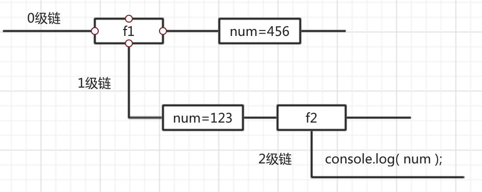

# 介绍 JavaScript

## JavaScript是什么

[MDN-JavaScript](https://developer.mozilla.org/zh-CN/docs/Web/JavaScript)

JavaScript运行在客户端(浏览器)的脚本语言

- 轻量级解释性脚本语言（其源代码在发往客户端运行之前不需编译，而是将文本格式的字符代码发送给浏览器由浏览器解释运行）
- 动态性（采用事件驱动的脚本语言,它不需要经过Web服务器就可以对用户的输入做出响应）  
- 基于对象  （可以创建对象,也能使用现有的对象 ）
- 跨平台（不依赖于操作系统,仅需要浏览器的支持）
- 动态类型（变量只有再赋值后才确定了类型 ）
- 头等函数 (First-class Function)
  - 又称函数是 JavaScript 中的一等公民
- 执行环境：在宿主环境（host environment）下运行，浏览器是最常见的 JavaScript 宿主环境
  - 但是在很多非浏览器环境中也使用 JavaScript ，例如 `node.js`

JavaScript的解释器被称为JavaScript引擎，为浏览器的一部分，广泛用于客户端的脚本语言。

Netscape在最初将其脚本语言命名为`LiveScript`，后来Netscape在与Sun合作之后将其改名为JavaScript。JavaScript最初受Java启发而开始设计的，因此语法上有类似之处，一些名称和命名规范也借自Java。JavaScript与Java名称上的近似，是当时Netscape为了营销考虑与Sun微系统达成协议的结果。

### JavaScript的应用

最初的目的是为了处理表单的验证操作，JavaScript 发展到现在几乎无所不能。

1. 网页特效
2. 服务端开发(Node.js)
3. 命令行工具(Node.js)
4. 桌面程序(Electron)
5. App(Cordova)
6. 控制硬件-物联网(Ruff)
7. 游戏开发(cocos2d-js)

## JavaScript 的组成

- ECMAScript  - 语法规范：JavaScript的核心，描述了语言的基本语法和数据类型，ECMAScript是一套标准，定义了一种语言的标准与具体实现无关
  - 变量、数据类型、类型转换、操作符
  - 流程控制语句：判断、循环语句
  - 数组、函数、作用域、预解析
  - 对象、属性、方法、简单类型和复杂类型的区别
  - 内置对象：Math、Date、Array，基本包装类型String、Number、Boolean
- Web APIs
  - `BOM` - 浏览器对象模型一套操作浏览器功能的`API`：可以操作浏览器窗口，比如：弹出框、控制浏览器跳转、获取分辨率等
    - onload页面加载事件，window顶级对象
    - 定时器
    - location、history
  - `DOM` - 文档对象模型一套操作页面元素的`API`：可以把HTML看做是文档树，通过`API`可以对树上的节点进行操作
    - 获取页面元素，注册事件
    - 属性操作，样式操作
    - 节点属性，节点层级
    - 动态创建元素
    - 事件：注册事件的方式、事件的三个阶段、事件对象 

### 浏览器是如何工作的

[参考链接](http://www.2cto.com/kf/201202/118111.html)

### JavaScript 执行过程

JavaScript 运行分为两个阶段：

- 预解析
  - 全局预解析（所有变量和函数声明都会提前；同名的函数和变量函数的优先级高）
  - 函数内部预解析（所有的变量、函数和形参都会参与预解析）
    - 函数
    - 形参
    - 普通变量
- 执行

  - 先预解析全局作用域，然后执行全局作用域中的代码
  - 在执行全局代码的过程中遇到函数调用就会先进行函数预解析，然后再执行函数内代码。

## JavaScript的引入

- 写在行内

```html
<input type="button" value="按钮" onclick="alert('Hello World')" />
```

- 写在script标签中

```html
<head>
  <script>
    alert('Hello World!');
  </script>
</head>
```

- 写在外部js文件中，在页面引入

```html
<script src="main.js"></script>
```

- 注意点

  **引用外部js文件的script标签中不可以写JavaScript代码**

  一对script标签中有错，错误代码之后不会执行，但不会影响其他script标签

# 进行时

## 数据结构

### 简单数据类型

首先简单数据类型存储的都是值，是没有函数可以调用的，比如 `undefined.toString()` 会报错

`'1'.toString()` 是可以使用的。其实在这种情况下，`'1'` 已经不是原始类型了，而是**被强制转换成了 `String` 类型**也就是字符串的对象包装类型，所以可以调用 `toString` 函数。 

Number、String、Boolean、Undefined、Null

#### Number类型

- 数值字面量：数值的固定值的表示法    110 1024  60.5
- 进制

```js
十进制
	var num = 9;
	进行算数计算时，八进制和十六进制表示的数值最终都将被转换成十进制数值。
十六进制
	var num = 0xA;
	数字序列范围：0~9以及A~F
八进制
    var num2 = 0o11;  // 对应十进制的9
    数字序列范围：0~7
    如果字面值中的数值超出了范围，那么前导零将被忽略，后面的数值将被当作十进制数值解析
二进制
    var num2 = 0b11;  // 对应十进制的3
```

- 浮点数
  - 浮点数需要的内存空间为整数的两倍，所以没有小数或小数为零都会被转换为整数
  - 浮点数的精度问题

```js
浮点数
	var n = 5e-324;   // 科学计数法  5乘以10的-324次方  
浮点数值的最高精度是 17 位小数，但在进行算术计算时其精确度远远不如整数
   var result = 0.1 + 0.2;    // 结果不是 0.3，而是：0.30000000000000004
   console.log(0.07 * 100);
   不要判断两个浮点数是否相等
```

- 数值范围

```js
最小值：Number.MIN_VALUE，这个值为： 5e-324
最大值：Number.MAX_VALUE，这个值为： 1.7976931348623157e+308
两个可表示(representable)数之间的最小间隔：Number.EPSILON
无穷大：Infinity，在某些场景下比较有用，比如通过数值来表示权重或者优先级，Infinity 可以表示最高优先级或最大权重
无穷小：-Infinity
如果计算中超过数值范围会转换成Infinity/-Infinity，无法继续计算，isInfinity(xx)判断是否超过范围
```

- NaN
  - 表示**本来要返回数值的操作数未返回的情况**
  - NaN：not a number
    - 任何数除以0，都会返回NaN  
    - NaN 与任何值都不相等，包括他本身
    - 涉及到的 任何关于NaN的操作，都会返回NaN  
  - isNaN(): 函数用于检查其参数是否是非数字值。 
  
- 数值转换
  - Number()可以转换数字字符串或Date对象
  
    ```js
    var d = new Date("December 17, 1995 03:24:00");
    print(Number(d));
    Number('123')     // 123
    Number('12.3')    // 12.3
    Number('12.00')   // 12
    Number('123e-1')  // 12.3
    Number('')        // 0
    Number(null)      // 0
    Number('0x11')    // 17
    Number('0b11')    // 3
    Number('0o11')    // 9
    Number('foo')     // NaN
    Number('100a')    // NaN
    Number('-Infinity') //-Infinity
    ```
  
  - parseInt()忽略空格找到第一个非空字符，如果不是数字或负号返回NaN，可以解析八进制和十六进制，ECMAScript5之后不能解析八进制，可以传入**第二个参数**表示`var num = parseInt("070", 8)`建议明确指定基数，可以将其他进制的整数转换成十进制显示
  
    ```js
    ['0', '1', '2'].map(parseInt) // [0, NaN, NaN]，如果在数组的 map 函数的回调函数中直接调用 parseInt，那么会将数组元素和索引值都作为参数传入。
    ```
  
  - parseFloat()只能解析十进制，如果是可解析为整数的值则返回整数
  
  - 其他可以将字符串转换为数字的方法：`+str/-str/str-0`
  
  - 将十进制转换成其他进制时，可以通过 toString 函数来实现：`(10).toString(2) // "1010"`
  
-  +0 和 -0

  JavaScript 中有 +0 和 -0，在加法类运算中它们没有区别，但是除法的场合则需要特别留意区分，“忘记检测除以 -0，而得到负无穷大”的情况经常会导致错误，而区分 +0 和 -0 的方式，正是检测 1/x 是 Infinity 还是 -Infinity。

##### 0.1 + 0.2 != 0.3

先说原因，因为 JS 采用 IEEE 754 双精度版本（64位），并且只要采用 IEEE 754 的语言都有该问题。根据浮点数的定义，非整数的 Number 类型无法用 ==（=== 也不行） 来比较。

我们都知道计算机是通过二进制来存储东西的，那么 `0.1` 在二进制中会表示为

```js
// (0011) 表示循环
0.1 = 2^-4 * 1.10011(0011)
```

我们可以发现，`0.1` 在二进制中是无限循环的一些数字，其实不只是 `0.1`，其实**很多十进制小数用二进制表示都是无限循环的**。这样其实没什么问题，但是 JS 采用的浮点数标准**由于存储空间有限会裁剪掉我们的数字，所以在计算机中0.1只能存储成一个近似值**。在js中如果这个近似值足够近似，那么js就会认为他就是那个值。

```js
console.log(0.1000000000000001)  
// 0.1000000000000001 (中间14个0，会打印出它本身)

console.log(0.10000000000000001)  
// 0.1 (中间15个0，js会认为这两个值足够接近，所以会显示0.1)
```

另外说一句，除了那些能表示成 `x/2^n` 的数可以被精确表示以外，其余小数都是以近似值得方式存在的。

所以 `0.1` 不再是 `0.1` 了，而是变成了  `0.100000000000000002`

```js
0.100000000000000002 === 0.1 // true
```

那么同样的，`0.2` 在二进制也是无限循环的，被裁剪后也失去了精度变成了 `0.200000000000000002`

```js
0.200000000000000002 === 0.2 // true
```

在0.1 + 0.2这个式子中，0.1和0.2都是近似表示的，在他们相加的时候，两个近似值进行了计算，所以这两者相加不等于 `0.3` 而是 `0.300000000000000004`

```js
0.1 + 0.2 === 0.30000000000000004 // true
```

此时对于JS来说，其不够近似于0.3，于是就出现了`0.1 + 0.2 != 0.3` 这个现象。 

那么可能你又会有一个疑问，既然 `0.1` 不是 `0.1`，那为什么 `console.log(0.1)` 却是正确的呢？

因为**在输入内容的时候，二进制被转换为了十进制，十进制又被转换为了字符串，在这个转换的过程中发生了取近似值的过程**，所以打印出来的其实是一个近似值，你也可以通过以下代码来验证

```js
console.log(0.100000000000000002) // 0.1
```

- **解决方法：**

所以实际上，这里错误的不是结论，而是比较的方法，正确的比较方法是使用 JavaScript提供的最小精度值：`console.log( Math.abs(0.1 + 0.2 - 0.3) <= Number.EPSILON);`

其实解决的办法还有很多

- 一种方式是先转换成整数进行计算，然后再转换回小数，这种方式适合在小数位不是很多的时候。比如一些程序的支付功能 API 以“分”为单位，从而避免使用小数进行计算。
- 还有另一种方法就是舍弃末尾的小数位。比如对上面的加法就可以先调用 toPrecision 截取 12 位，然后调用 parseFloat 函数转换回浮点数。

```js
// toFixed() 方法可把 Number 四舍五入为指定小数位数的数字。
// 规定小数的位数，是 0 ~ 20 之间的值，包括 0 和 20，有些实现可以支持更大的数值范围。如果省略了该参数，将用 0 代替。
parseFloat((0.1 + 0.2).toFixed(10)) === 0.3 // true
// toPrecision() 以定点表示法或指数表示法表示的一个数值对象的字符串表示，四舍五入到 precision 参数指定的显示数字位数
parseFloat((0.1 + 0.2).toPrecision(12)) // 0.3
```

#### ES11 BigInt

BigInt 只用来表示整数，没有位数的限制，任何位数的整数都可以精确表示。

为了与 Number 类型区别，BigInt 类型的数据必须添加后缀`n`。

```javascript
1234 // 普通整数
1234n // BigInt

// BigInt 的运算
1n + 2n // 3n
```

BigInt 同样可以使用各种进制表示，都要加上后缀`n`。

```javascript
0b1101n // 二进制
0o777n // 八进制
0xFFn // 十六进制
```

BigInt 与普通整数是两种值，它们之间并不相等。

`typeof`运算符对于 BigInt 类型的数据返回`bigint`。

BigInt 可以使用负号（`-`），但是不能使用正号（`+`），因为会与 asm.js 冲突。

```javascript
-42n // 正确
+42n // 报错
```

JavaScript 以前不能计算70的阶乘（即`70!`），因为超出了可以表示的精度。

现在支持大整数了，就可以算了，浏览器的开发者工具运行下面代码，就OK。

```javascript
let p = 1n;
for (let i = 1n; i <= 70n; i++) {
  p *= i;
}
console.log(p); // 11978571...00000000n
```

##### BigInt 对象

JavaScript 原生提供`BigInt`对象，可以用作构造函数生成 BigInt 类型的数值。转换规则基本与`Number()`一致，将其他类型的值转为 BigInt。

```javascript
BigInt(123) // 123n
BigInt('123') // 123n
BigInt(false) // 0n
BigInt(true) // 1n
```

`BigInt()`构造函数必须有参数，而且参数必须可以正常转为数值，下面的用法都会报错。

```javascript
new BigInt() // TypeError
BigInt(undefined) //TypeError
BigInt(null) // TypeError
BigInt('123n') // SyntaxError
BigInt('abc') // SyntaxError
```

上面代码中，尤其值得注意字符串`123n`无法解析成 Number 类型，所以会报错。

参数如果是小数，也会报错。

BigInt 对象继承了 Object 对象的两个实例方法。

- `BigInt.prototype.toString()`
- `BigInt.prototype.valueOf()`

它还继承了 Number 对象的一个实例方法。

- `BigInt.prototype.toLocaleString()`

此外，还提供了三个静态方法。

- `BigInt.asUintN(width, BigInt)`： 给定的 BigInt 转为 0 到 2^(width - 1) 之间对应的值。
- `BigInt.asIntN(width, BigInt)`：给定的 BigInt 转为 -2^(width - 1 )到 2^(width - 1) - 1 之间对应的值。
- `BigInt.parseInt(string[, radix])`：近似于`Number.parseInt()`，将一个字符串转换成指定进制的 BigInt。

```javascript
const max = 2n ** (64n - 1n) - 1n;

BigInt.asIntN(64, max)
// 9223372036854775807n
BigInt.asIntN(64, max + 1n)
// -9223372036854775808n
BigInt.asUintN(64, max + 1n)
// 9223372036854775808n
```

上面代码中，`max`是64位带符号的 BigInt 所能表示的最大值。如果对这个值加`1n`，`BigInt.asIntN()`将会返回一个负值，因为这时新增的一位将被解释为符号位。而`BigInt.asUintN()`方法由于不存在符号位，所以可以正确返回结果。

如果`BigInt.asIntN()`和`BigInt.asUintN()`指定的位数，小于数值本身的位数，那么头部的位将被舍弃。

```javascript
const max = 2n ** (64n - 1n) - 1n;

BigInt.asIntN(32, max) // -1n
BigInt.asUintN(32, max) // 4294967295n
```

上面代码中，`max`是一个64位的 BigInt，如果转为32位，前面的32位都会被舍弃。

下面是`BigInt.parseInt()`的例子。

```javascript
// Number.parseInt() 与 BigInt.parseInt() 的对比
Number.parseInt('9007199254740993', 10)
// 9007199254740992
BigInt.parseInt('9007199254740993', 10)
// 9007199254740993n
```

上面代码中，由于有效数字超出了最大限度，`Number.parseInt`方法返回的结果是不精确的，而`BigInt.parseInt`方法正确返回了对应的 BigInt。

对于二进制数组，BigInt 新增了两个类型`BigUint64Array`和`BigInt64Array`，这两种数据类型返回的都是64位 BigInt。`DataView`对象的实例方法`DataView.prototype.getBigInt64()`和`DataView.prototype.getBigUint64()`，返回的也是 BigInt。

##### 转换规则

可以使用`Boolean()`、`Number()`和`String()`这三个方法，将 BigInt 可以转为布尔值、数值和字符串类型。

```javascript
Boolean(0n) // false
Boolean(1n) // true
Number(1n)  // 1
String(1n)  // "1"
```

上面代码中，注意最后一个例子，转为字符串时后缀`n`会消失。

另外，取反运算符（`!`）也可以将 BigInt 转为布尔值。

```javascript
!0n // true
!1n // false
```

##### 数学运算

数学运算方面，BigInt 类型的`+`、`-`、`*`和`**`这四个二元运算符，与 Number 类型的行为一致。除法运算`/`会舍去小数部分，返回一个整数。

```javascript
9n / 5n
// 1n
```

几乎所有的数值运算符都可以用在 BigInt，但是有两个例外。

- 不带符号的右移位运算符`>>>`
- 一元的求正运算符`+`

上面两个运算符用在 BigInt 会报错。前者是因为`>>>`运算符是不带符号的，但是 BigInt 总是带有符号的，导致该运算无意义，完全等同于右移运算符`>>`。后者是因为一元运算符`+`在 asm.js 里面总是返回 Number 类型，为了不破坏 asm.js 就规定`+1n`会报错。

BigInt 不能与普通数值进行混合运算。

```javascript
1n + 1.3 // 报错
```

上面代码报错是因为无论返回的是 BigInt 或 Number，都会导致丢失精度信息。比如`(2n**53n + 1n) + 0.5`这个表达式，如果返回 BigInt 类型，`0.5`这个小数部分会丢失；如果返回 Number 类型，有效精度只能保持 53 位，导致精度下降。

同样的原因，如果一个标准库函数的参数预期是 Number 类型，但是得到的是一个 BigInt，就会报错。

```javascript
// 错误的写法
Math.sqrt(4n) // 报错

// 正确的写法
Math.sqrt(Number(4n)) // 2
```

上面代码中，`Math.sqrt`的参数预期是 Number 类型，如果是 BigInt 就会报错，必须先用`Number`方法转一下类型，才能进行计算。

asm.js 里面，`|0`跟在一个数值的后面会返回一个32位整数。根据不能与 Number 类型混合运算的规则，BigInt 如果与`|0`进行运算会报错。

```javascript
1n | 0 // 报错
```

##### 其他运算

BigInt 对应的布尔值，与 Number 类型一致，即`0n`会转为`false`，其他值转为`true`。

```javascript
if (0n) {
  console.log('if');
} else {
  console.log('else');
}
// else
```

上面代码中，`0n`对应`false`，所以会进入`else`子句。

比较运算符（比如`>`）和相等运算符（`==`）允许 BigInt 与其他类型的值混合计算，因为这样做不会损失精度。

```javascript
0n < 1 // true
0n < true // true
0n == 0 // true
0n == false // true
0n === 0 // false
```

BigInt 与字符串混合运算时，会先转为字符串，再进行运算。

```javascript
'' + 123n // "123"
```

#### String类型

- 字符串字面量:'abc'   "abc"

- 转义符

  

- **字符串不可变**，改变变量保存的字符串时会创建新字符串，销毁旧字符串，然后再用新字符串填充变量，也是旧版本浏览器**字符拼接速度慢**的原因

- 字符串长度

  **length属性**用来获取字符串的长度

- 字符串拼接

  字符串拼接使用 + 连接

  1. 两边只要有一个是字符串，那么+就是字符串拼接功能
  2. 两边如果都是数字，那么就是算术功能。

- 类型转换：

  1. String()：适用于任何数据类型（null,undefined 转换后为null和undefined）；
  2. xx.toString()：null,defined没有toString()方法，参数是基数默认为10。 
  
- 字符串的最大长度

  String 有最大长度是 `2^53 - 1`，这在一般开发中都是够用的，但是这个所谓最大长度，并不完全是你理解中的字符数。因为 String 的意义并非“字符串”，而是字符串的 UTF16 编码，我们字符串的操作charAt、charCodeAt、length 等方法针对的都是 UTF16 编码。所以，字符串的最大长度，实际上是受字符串的编码长度影响的。

  JavaScript 字符串把每个 UTF16 单元当作一个字符来处理，所以处理非 BMP（超出U+0000 - U+FFFF 范围）的字符时，应该格外小心。

- 字符串操作

  ```js
  // 获取单个字符
  return 'cat'.charAt(1); // returns "a"
  return 'cat'[1]; // returns "a" ES5
  ```

- 实现千位分隔符

  一种很容易想到的方法就是从右往左遍历数值每一位，每隔 3 位添加分隔符。为了操作方便，我们可以将数值转换成字符数组，而要实现从右往左遍历，一种实现方式是通过 for 循环的索引值找到对应的字符；而另一种方式是通过数组反转，从而变成从左到右操作。

  ```js
  function sep(n) {
    let [i, c] = n.toString().split(/(\.\d+)/)
    return i.split('').reverse().map((c, idx) => (idx+1) % 3 === 0 ? ',' + c: c).reverse().join('').replace(/^,/, '') + c
  }
  ```

  第二种方式则是通过引用类型，即用正则表达式对字符进行替换来实现。

  ```js
  function sep2(n){
    let str = n.toString()
    str.indexOf('.') < 0 ? str+= '.' : void 0
    return str.replace(/(\d)(?=(\d{3})+\.)/g, '$1,').replace(/\.$/, '')
  }
  ```

#### Boolean类型

- Boolean字面量：  true和false，区分大小写
- Boolean()可以将一个值转换为相应的Boolean值，会被转换为false的有：null，undefined，0，“”，false，NaN
- 流程控制语句（如if）会自动执行转换

#### Undefined和Null（空类型）

##### undefined

Undefined类型只有一个值即undefined，为了区分空对象指针和未初始化的变量，没有必要将一个变量显示得设置为undefined

- 获得undefined

1. undefined表示一个**声明了没有赋值的变量**，对没有声明的变量使用`typeof`也返回undefined
2. 函数参数未传递时也是undefined
3. 执行无返回值函数；
4. 执行 void 表达式；推荐**void 0**，同时它作为表达式还可以配合三目运算符使用，代表不执行任何操作。
5. 引用未定义的对象属性；
6. 全局常量 window.undefined 或 undefined。

**用void 0 代替undefined：**

任何变量在赋值前是 Undefined 类型、值为 undefined，一般我们可以用全局变量 undefined（就是名为undefined 的这个变量）来表达这个值，或者 void 运算来把任一一个表达式变成undefined 值。

但是呢，因为 JavaScript 的代码 **undefined 是一个变量**，而并非是一个关键字，这是JavaScript 语言公认的设计失误之一，所以，我们为了避免无意中被篡改，建议使用void 0 来获取 undefined 值。

undefined和数值计算结果是NaN

```js
var a; // undefined
var o = {}
o.b // undefined
(() => {})() // undefined
void 0 // undefined
window.undefined // undefined
```

- 判断undefined

```js
// 方式1：虽然通过 “===” 和 undefined 值做比较是可行的，但如果 x 未定义则会抛出错误 “ReferenceError: x is not defined” 导致程序执行终止，这对于代码的健壮性显然是不利的
if(x===undefined) {
  ...
}
// 方式2：推荐
if(typeof x === 'undefined') {
  ...
}
```

##### Null

Null类型只有一个值即null，如果变量将用于保存对象，最好初始化为null

Null 数据类型和 Undefined 类似，只有唯一的一个值 null，都可以表示空值，甚至我们通过 “==” 来比较它们是否相等的时候得到的结果都是 true，但 null 是 JavaScript 保留关键字，而 undefined 只是一个常量。

1. null表示一个**空对象指针**，变量的值如果想为null，必须手动设置

   ```js
   var null = null
   typeof null // object
   // 可以理解为空对象，实际上只是JS的一个悠久 Bug。在JS的最初版本中使用的是 32 位系统，为了性能考虑使用低位存储变量的类型信息，000 开头代表是对象，然而 null 表示为全零，所以将它错误的判断为 object。
   ```

2. undefined的值派生自null因此相等性测试返回true（==会转换操作数）

   `undefined == null // true`

#### ES6 Symbol

目的：保证属性的名字都是独一无二的，从根本上防止属性名的冲突。 

Symbol 值**通过`Symbol`函数生成**。这就是说，对象的属性名现在可以有两种类型，一种是原来就有的字符串，另一种就是新增的 Symbol 类型。凡是属性名属于 Symbol 类型，就都是**独一无二**的。

```js
let s = Symbol();
typeof s
// "symbol"
```

注意，`Symbol`函数前**不能使用`new`命令**，否则会报错。这是因为生成的 Symbol 是一个原始类型的值，不是对象，不能添加属性。基本上，它是一种类似于字符串的数据类型。

`Symbol`函数可以**接受一个字符串作为参数，表示对 Symbol 实例的描述**，主要是为了在控制台显示，或者转为字符串时，比较容易区分。

```js
let s1 = Symbol('foo');
let s2 = Symbol('bar');

s1.toString() // "Symbol(foo)"
s2.toString() // "Symbol(bar)"
```

如果 Symbol 的参数是一个对象，就会调用该对象的`toString`方法，将其转为字符串，然后才生成一个 Symbol 值。

```js
const obj = {
  toString() {
    return 'abc';
  }
};
const sym = Symbol(obj);
sym // Symbol(abc)
```

注意，`Symbol`函数的参数只是表示对当前 Symbol 值的描述，因此相同参数的`Symbol`函数的返回值是不相等的。

```js
let s1 = Symbol('foo');
let s2 = Symbol('foo');

s1 === s2 // false
```

Symbol 值**不能与其他类型的值进行运算**，会报错。

```js
let sym = Symbol('My symbol');

"your symbol is " + sym
// TypeError: can't convert symbol to string
```

但是，Symbol 值**可以显式转为字符串**。

```
let sym = Symbol('My symbol');

String(sym) // 'Symbol(My symbol)'
sym.toString() // 'Symbol(My symbol)'
```

另外，Symbol 值也可以转为布尔值，但是不能转为数值。

```js
let sym = Symbol();
Boolean(sym) // true
!sym  // false

if (sym) {
  // ...
}

Number(sym) // TypeError
sym + 2 // TypeError
```

##### 作为属性名

Symbol 值作为标识符，用于对象的属性名，就能保证不会出现同名的属性。这对于一个对象由多个模块构成的情况非常有用，能防止某一个键被不小心改写或覆盖。

```js
let mySymbol = Symbol();

// 第一种写法
let a = {};
a[mySymbol] = 'Hello!';

// 第二种写法
let a = {
  [mySymbol]: 'Hello!' // Symbol 值必须放在方括号之中
};

// 第三种写法
let a = {};
Object.defineProperty(a, mySymbol, { value: 'Hello!' });

// 以上写法都得到同样结果
a[mySymbol] // "Hello!"
```

注意，Symbol 值作**为对象属性名时，不能用点运算符**。

```js
const mySymbol = Symbol();
const a = {};

a.mySymbol = 'Hello!'; // 点运算符后面总是字符串，所以不会读取mySymbol作为标识名所指代的那个值，导致a的属性名实际上是一个字符串，而不是一个 Symbol 值。
a[mySymbol] // undefined
a['mySymbol'] // "Hello!"
```

同理，在对象的内部，使用 Symbol 值定义属性时，Symbol 值必须放在方括号之中

还有一点需要注意，Symbol 值作为属性名时，该属性还是公开属性，不是私有属性。

###### 属性名遍历

Symbol 作为属性名，该属性**不会出现在`for...in`、`for...of`循环中，也不会被`Object.keys()`、`Object.getOwnPropertyNames()`、`JSON.stringify()`返回**。

`Object.getOwnPropertySymbols`方法返回一个数组，成员是当前对象的所有用作属性名的 Symbol 值。

```js
const obj = {};
let a = Symbol('a');
let b = Symbol('b');

obj[a] = 'Hello';
obj[b] = 'World';

const objectSymbols = Object.getOwnPropertySymbols(obj);

objectSymbols
// [Symbol(a), Symbol(b)]
```

另一个新的 API，`Reflect.ownKeys`方法可以返回所有类型的键名，包括常规键名和 Symbol 键名。

```js
let obj = {
  [Symbol('my_key')]: 1,
  enum: 2,
  nonEnum: 3
};

Reflect.ownKeys(obj)
//  ["enum", "nonEnum", Symbol(my_key)]
```

由于以 Symbol 值作为名称的属性，不会被常规方法遍历得到。我们**可以利用这个特性，为对象定义一些非私有的、但又希望只用于内部的方法**。

##### 定义一组常量

```js
const log = {};

log.levels = {
  DEBUG: Symbol('debug'),
  INFO: Symbol('info'),
  WARN: Symbol('warn')
};
console.log(log.levels.DEBUG, 'debug message');
console.log(log.levels.INFO, 'info message');
```

下面是另外一个例子。

```js
const COLOR_RED    = Symbol();
const COLOR_GREEN  = Symbol();

function getComplement(color) {
  switch (color) {
    case COLOR_RED:
      return COLOR_GREEN;
    case COLOR_GREEN:
      return COLOR_RED;
    default:
      throw new Error('Undefined color');
    }
}
```

**常量使用 Symbol 值最大的好处，就是其他任何值都不可能有相同的值了，因此可以保证上面的`switch`语句会按设计的方式工作。**

应用：消除魔术字符串，魔术字符串指的是，在代码之中多次出现、与代码形成强耦合的某一个具体的字符串或者数值。风格良好的代码，应该尽量消除魔术字符串，改由含义清晰的变量代替。 

##### Symbol.for()，Symbol.keyFor()

有时，我们希望重新使用同一个 Symbol 值，`Symbol.for`方法可以做到这一点。它接受一个字符串作为参数，然后搜索有没有以该参数作为名称的 Symbol 值。如果有，就返回这个 Symbol 值，否则就新建并返回一个以该字符串为名称的 Symbol 值。

```js
let s1 = Symbol.for('foo');
let s2 = Symbol.for('foo');

s1 === s2 // true
```

`Symbol.for()`与`Symbol()`这两种写法，都会生成新的 Symbol。它们的区别是，前者**会被登记在全局环境中供搜索**，后者不会。`Symbol.for()`不会每次调用就返回一个新的 Symbol 类型的值，而是会先检查给定的`key`是否已经存在，如果不存在才会新建一个值。

`Symbol.keyFor`方法返回一个已登记的 Symbol 类型值的`key`。

```js
let s1 = Symbol.for("foo");
Symbol.keyFor(s1) // "foo"

let s2 = Symbol("foo");
Symbol.keyFor(s2) // undefined
```

需要注意的是，`Symbol.for`为 Symbol 值登记的名字，是**全局环境**的，可以在不同的 iframe 或 service worker 中取到同一个值。

```js
iframe = document.createElement('iframe');
iframe.src = String(window.location);
document.body.appendChild(iframe);

iframe.contentWindow.Symbol.for('foo') === Symbol.for('foo')
// true
// iframe 窗口生成的 Symbol 值，可以在主页面得到。
```

##### 实例：消除魔术字符串

魔术字符串指的是，在代码之中多次出现、与代码形成强耦合的某一个具体的字符串或者数值。风格良好的代码，应该尽量消除魔术字符串，改由含义清晰的变量代替。

```javascript
function getArea(shape, options) {
  let area = 0;

  switch (shape) {
    case 'Triangle': // 魔术字符串
      area = .5 * options.width * options.height;
      break;
    /* ... more code ... */
  }

  return area;
}

getArea('Triangle', { width: 100, height: 100 }); // 魔术字符串
```

上面代码中，字符串`Triangle`就是一个魔术字符串。它多次出现，与代码形成“强耦合”，不利于将来的修改和维护。

常用的消除魔术字符串的方法，就是把它写成一个变量。

```javascript
const shapeType = {
  triangle: 'Triangle'
};

function getArea(shape, options) {
  let area = 0;
  switch (shape) {
    case shapeType.triangle:
      area = .5 * options.width * options.height;
      break;
  }
  return area;
}

getArea(shapeType.triangle, { width: 100, height: 100 });
```

上面代码中，我们把`Triangle`写成`shapeType`对象的`triangle`属性，这样就消除了强耦合。

如果仔细分析，可以发现`shapeType.triangle`等于哪个值并不重要，只要确保不会跟其他`shapeType`属性的值冲突即可。因此，这里就很适合改用 Symbol 值。

```javascript
const shapeType = {
  triangle: Symbol()
};
```

上面代码中，除了将`shapeType.triangle`的值设为一个 Symbol，其他地方都不用修改。

##### 实例：模块的 Singleton 模式（单例模式）

Singleton 模式指的是调用一个类，任何时候返回的都是同一个实例。

对于 Node 来说，模块文件可以看成是一个类。怎么保证每次执行这个模块文件，返回的都是同一个实例呢？

很容易想到，可以把实例放到顶层对象`global`。

```js
// mod.js
function A() {
  this.foo = 'hello';
}

if (!global._foo) {
  global._foo = new A();
}

module.exports = global._foo;
```

然后，加载上面的`mod.js`。

```js
const a = require('./mod.js');
console.log(a.foo);
```

但是，全局变量`global._foo`是可写的，任何文件都可以修改。

为了防止这种情况出现，我们就可以使用 Symbol。

```js
// mod.js
const FOO_KEY = Symbol.for('foo');

function A() {
  this.foo = 'hello';
}

if (!global[FOO_KEY]) {
  global[FOO_KEY] = new A();
}

module.exports = global[FOO_KEY];
```

上面代码中，可以保证`global[FOO_KEY]`不会被无意间覆盖，但还是可以被改写。

```js
global[Symbol.for('foo')] = { foo: 'world' };

const a = require('./mod.js');
```

如果键名使用`Symbol`方法生成，那么外部将无法引用这个值，当然也就无法改写。

```js
// mod.js
const FOO_KEY = Symbol('foo');

// 后面代码相同 ……
```

上面代码将导致其他脚本都无法引用`FOO_KEY`。但这样也有一个问题，就是如果多次执行这个脚本，每次得到的`FOO_KEY`都是不一样的。虽然 Node 会将脚本的执行结果缓存，一般情况下，不会多次执行同一个脚本，但是用户可以手动清除缓存，所以也不是绝对可靠。

### 复杂数据类型

复杂数据类型类型和原始类型不同的是，简单数据类型存储的是值，复杂数据类型存储的是地址。

复杂类型进行赋值或作为参数时传递的也是地址 

#### Object

Object每个实例都有以下方法和属性

```js
constructor // 保存用于创建当前对象的构造函数
hasOwnProperty(propertyName) // 属性是否在实例中而非实例原型
isPrototypeOf(object) // 是否传入对象原型
propertyIsEnumrable(propertyName) // 是否可用for-in枚举
toLocalString() // 返回对象的字符串表示，该字符串与执行环境对应
toString() // 返回对象的字符串表示
valueOf() // 返回对象的字符串，数值或布尔值表示
```

### 引用类型

### 简单类型和复杂类型的区别

> 基本类型又叫做值类型，复杂类型又叫做引用类型
>
> 值类型：简单数据类型，基本数据类型，在存储时，变量中存储的是值本身，因此叫做值类型。
>
> 引用类型：复杂数据类型，在存储是，变量中存储的仅仅是地址（引用），因此叫做引用数据类型。

- 堆和栈	

  ```js
  堆栈空间分配区别：
  　　1、栈（操作系统）：先进后出，由操作系统自动分配释放 ，存放函数的参数值，局部变量的值等。 
  　　2、堆（操作系统）： 存储复杂类型的值(对象)，一般由程序员分配释放， 若程序员不释放，由垃圾回收机制回收。
  // 栈的运行速度大于堆，由于对象结构复杂且可扩展，所以将引用类型的真实对象放到堆中是为了不影响栈的效率。值的查找也是先栈后堆
  // 闭包中的变量保存在堆内存中，这也就解释了函数执行之后为什么闭包还能引用到函数内的变量。
  ```

- 注意：JavaScript中没有堆和栈的概念，此处我们用堆和栈来讲解，目的方便理解和方便以后的学习。

#### 基本类型在内存中的存储

原始类型存储的是值，因为值类型在内存中分别占有固定大小的空间。64位浮点数储存到栈中


#### 复杂类型在内存中的存储

对象类型存储的是地址（指针）。这种值的大小不固定，但内存地址大小的固定的，因此在栈内存中存放访问地址，堆中储存数据，由于js不允许直接访问堆内存中的数据，要按引用访问引用数据类型，即先从栈中读取内存地址， 然后再通过地址找到堆中的值。


#### 基本类型作为函数的参数


#### 复杂类型作为函数的参数


```javascript
// 下面代码输出的结果?
function Person(name,age,salary) {
  this.name = name;
  this.age = age;
  this.salary = salary;
}
function f1(person) {
  person.name = "ls";
  person = new Person("aa",18,10);
}

var p = new Person("zs",18,1000);
console.log(p.name);// zs
f1(p);
console.log(p.name);// aa
```

思考：

```javascript
var num = 50;
function f1(num) {
    num = 60;
    console.log(num);// 60
}
f1(num);
console.log(num);// 60
```

### 获取变量的类型

#### typeof操作符

操作数可以是变量或数值字面量

```
typeof（xx）/typeof  xx
```

返回的结果用该类型的字符串(全小写字母)形式表示，包括以下 7 种：number、boolean、symbol、string、object、undefined、function 等

```javascript
typeof null//Object 无效 null类型进行typeof操作符后，结果是object，原因在于，null类型被当做一个空对象引用。在 JS 的最初版本中使用的是 32 位系统，为了性能考虑使用低位存储变量的类型信息，000 开头代表是对象，然而 null 表示为全零，所以将它错误的判断为 object 。虽然现在的内部类型判断代码已经改变了，但是对于这个 Bug 却是一直流传下来。 
typeof { }//Object 无效
typeof [ ]//Object 无效
typeof new Function(); // function 有效
typeof new Date(); //object 无效
typeof new RegExp(); //function/object 无效
```

有些时候，typeof 操作符会返回一些令人迷惑但技术上却正确的值：

- 对于基本类型，除 null 以外，均可以返回正确的结果。
- 对于引用类型，除 function 以外，一律返回 object 类型。
- 对于 null ，返回 object 类型。
- 对于 function 返回  function 类型。

#### instanceof操作符

内部机制是通过原型链来判断的

```js
[] instanceof Array; // true
{} instanceof Object;// true
new Date() instanceof Date;// true
 
function Person(){};
new Person() instanceof Person;
 
[] instanceof Object; // true
new Date() instanceof Object;// true
new Person instanceof Object;// true
```

instanceof 只能用来判断两个对象是否属于实例关系， 而不能判断一个对象实例具体属于哪种类型。

ES5 提供了 Array.isArray() 方法是更好的判断数组的方法

[判断数据类型的四种方法](http://www.cnblogs.com/onepixel/p/5126046.html)

[web前端知识体系精简](https://www.cnblogs.com/onepixel/p/7021506.html)

## 数据类型转换

 

### 对象转原始类型

对象在转换类型的时候，会**调用内置的 `[[ToPrimitive]]` 函数**，对于该函数来说，算法逻辑一般来说如下：

- 如果已经是原始类型了，那就不需要转换了
- 调用 **`x.valueOf()**`，如果转换为基础类型，就返回转换的值
- 调用 **`x.toString()**`，如果转换为基础类型，就返回转换的值
- 如果都没有返回原始类型，就会报错

当然你也可以重写 `Symbol.toPrimitive` ，该方法在转原始类型时调用优先级最高。

```js
let a = {
  valueOf() {
    return 0
  },
  toString() {
    return '1'
  },
  [Symbol.toPrimitive]() {
    return 2
  }
}
1 + a // => 3
```

### 转换成字符串类型

- toString()

  ```
  var num = 5;
  console.log(num.toString());
  ```

- String()

  ```
  String()函数存在的意义：有些值没有toString()，这个时候可以使用String()。比如：undefined和null
  ```

- 拼接字符串方式

  num  +  ""，当 + 两边一个操作符是字符串类型，一个操作符是其它类型的时候，会先把其它类型转换成字符串再进行字符串拼接，返回字符串

  - 运算中其中一方为字符串，那么就会把另一方也转换为字符串

  - 如果一方不是字符串或者数字，那么会将它转换为数字或者字符串

    ```js
    1 + '1' // '11' 
    true + true // 2 
    4 + [1,2,3] // "41,2,3" 
    ```

  另外对于加法还需要注意这个表达式 `'a' + + 'b'`

  ```
  'a' + + 'b' // -> "aNaN"
  ```

  因为 `+ 'b'` 等于 `NaN`，所以结果为 `"aNaN"`，你可能也会在一些代码中看到过 **`+ '1'` 的形式来快速获取 `number` 类型**。

  那么对于除了加法的运算符来说，只要其中一方是数字，那么另一方就会被转为数字

  ```
  4 * '3' // 12
  4 * [] // 0
  4 * [1, 2] // NaN
  ```

### 转换成数值类型

- Number()

  ```
  Number()可以把任意值转换成数值，如果要转换的字符串中有一个不是数值的字符，返回NaN
  ```

- parseInt()

  ```javascript
  var num1 = parseInt("12.3abc");  // 返回12，如果第一个字符是数字会解析知道遇到非数字结束
  var num2 = parseInt("abc123");   // 返回NaN，如果第一个字符不是数字或者符号就返回NaN
  ```

- parseFloat()

  ```
  parseFloat()把字符串转换成浮点数
  parseFloat()和parseInt非常相似，不同之处在与
  	parseFloat会解析第一个. 遇到第二个.或者非数字结束
  	如果解析的内容里只有整数，解析成整数
  ```

- +，-0等运算

  ```javascript
  var str = '500';
  console.log(+str);		// 取正
  console.log(-str);		// 取负
  console.log(str - 0);
  ```

思考：

```js
{}+[] // 0 如果{}被放在运算的最前面一位，他就会被当作代码块来处理，不论里面有什么，都不会影响计算结果 
[]+{} // "[object Object]"  []数组转换成字符串''+对象转换成字符串`[object Object]`
console.log({}+[]) // [object Object]
```

### 转换成布尔类型

- Boolean()    0 (空字符串) null undefined NaN 会转换成false  其它都会转换成true

## 执行过程（算法）

# 文法


## 变量

### 什么是变量

- 什么是变量

  变量是计算机内存中存储数据的标识符，根据变量名称可以获取到内存中存储的数据

- 为什么要使用变量

  使用变量可以方便的获取或者修改内存中的数据

### 如何使用变量

```javascript
// var声明变量
var age;
// 变量的赋值
age = 18;
// 同时声明多个变量
var age, name, sex;
age = 10;
name = 'zs';
// 同时声明多个变量并赋值
var age = 10, name = 'zs';
```

### 变量的命名规则和规范

- 规则 - 必须遵守的，不遵守会报错

  - 由字母、数字、下划线、$符号组成，不能以数字开头

  - 不能是关键字和保留字，例如：for、while。

  - 区分大小写

- 规范 - 建议遵守的，不遵守不会报错

  - 变量名必须有意义
  - 遵守驼峰命名法。


### 案例

1. 交换两个变量的值

   ``````html
   ES5
   <script>
     var a = 10, b = 20
     var tem = a
     a = b
     b = tem
     console.log(a)
     console.log(b)
   </script>
   ES6
   <script>
     let a = 10, b = 20
     ;[a, b] = [b, a]
     console.log(a)
     console.log(b)
   </script>
   ``````

2. 不使用临时变量，交换两个数值变量的值

   ``````js
    // 交换数值
     var a = 10, b = 20
     a = b + a
     b = a - b
     a = a - b
     console.log(a)
     console.log(b)
   ``````

## 操作符

运算符  operator

表达式  组成 操作数和操作符，会有一个结果

### 一元运算符

一元运算符：只有一个操作数的运算符

++  自身加1

--  自身减1

### 算术运算符

```
+ - * / %  
```

加法运算符不同于其他几个运算符，它有以下几个特点：

- 运算中其中一方为字符串，那么就会把另一方也转换为字符串
- 如果一方不是字符串或者数字，那么会将它转换为数字(两个都是简单类型)或者字符串

```
1 + '1' // '11'
true + true // 2
4 + [1,2,3] // "41,2,3"
```

如果你对于答案有疑问的话，请看解析：

- 对于第一行代码来说，触发特点一，所以将数字 `1` 转换为字符串，得到结果 `'11'`
- 对于第二行代码来说，触发特点二，所以将 `true` 转为数字 `1`
- 对于第三行代码来说，触发特点二，所以将数组通过 `toString` 转为字符串 `1,2,3`，得到结果 `41,2,3`

另外对于加法还需要注意这个表达式 `'a' + + 'b'`

```
'a' + + 'b' // -> "aNaN"
```

因为 `+ 'b'` 等于 `NaN`，所以结果为 `"aNaN"`，你可能也会在一些代码中看到过 `+ '1'` 的形式来快速获取 `number` 类型。

那么对于除了加法的运算符来说，只要其中一方是数字，那么另一方就会被转为数字

```
4 * '3' // 12
4 * [] // 0
4 * [1, 2] // NaN
```

### 逻辑运算符(布尔运算符)
	&& 与 两个操作数同时为true，结果为true，否则都是false
	|| 或 两个操作数有一个为true，结果为true，否则为false
	!  非  取反


短路运算：&&左边为true返回右边，否则返回左边

||左边为false返回右边，否则返回左边

### 关系运算符(比较运算符)

1. 如果是对象，就通过 `toPrimitive` 转换对象
2. 如果是字符串，就通过 `unicode` 字符索引来比较

```js
let a = {
  valueOf() {
    return 0
  },
  toString() {
    return '1'
  }
}
a > -1 // true
```

在以上代码中，因为 `a` 是对象，所以会通过 `valueOf` 转换为原始类型再比较值。

	<  >  >=  <=  == != === !==
#### ==与===的区别

==只进行值得比较，===类型和值同时相等，则相等

对于 `==` 来说，如果对比双方的类型**不一样**的话，就会进行**类型转换**。 

假如我们需要对比 `x` 和 `y` 是否相同，就会进行如下判断流程：

1. 首先会判断两者类型是否**相同**。相同的话就是比大小了
2. 类型不相同的话，那么就会进行类型转换
3. 会先判断是否在对比 `null` 和 `undefined`，是的话就会返回 `true`
4. 判断两者类型是否为 `string` 和 `number`，是的话就会**将字符串转换为 `number`** 
5. 判断其中一方是否为 `boolean`，是的话就会把 **`boolean` 转为 `number` 再进行判断** 
6. 判断其中一方是否为 `object` 且另一方为 `string`、`number` 或者 `symbol`，是的话就会把 `object` 转为原始类型再进行判断 

 

当然了，这个流程图并没有将所有的情况都列举出来，只将常用到的情况列举了，如果想了解更多的内容可以参考 [标准文档](https://link.juejin.im/?target=https%3A%2F%2Fwww.ecma-international.org%2Fecma-262%2F5.1%2F%23sec-11.9.1)。

对于 `===` 来说就简单多了，就是判断两者类型和值是否相同。

思考：

``` js
[] == ![]  
// ![]=>false=>0   
// [].valueof()=>[]=>[].toString()=>'' 
// ''==0 Nmber('')=>0 
// 0==0
// true
```

### 赋值运算符

赋值表达式本身的值为其完成后被赋值的变量的值

=   +=   -=   *=   /=   %=
```javascript
例如：
var num = 0;
num += 5;	//相当于  num = num + 5;
```

### 逗号运算符

逗号运算符（ `,`）用来评估其每个操作数（从左到右）并返回最后一个操作数的值。

```js
let x = 1;

x = (x++, x);

console.log(x);
// expected output: 2

x = (2, 3);

console.log(x);
// expected output: 3
```

### 运算符的优先级

	优先级从高到底
		1. ()  优先级最高
		2. 一元运算符  ++   --   !
		3. 算数运算符  先*  /  %   后 +   -
		4. 关系运算符  >   >=   <   <=
		5. 相等运算符   ==   !=    ===    !==
		6. 逻辑运算符 先&&   后||
		7. 赋值运算符

### 位运算

常用的位运算

> 请注意 位运算适用于 32 位整数，所以精度可能会丢失

- 用 "|" 取整

```
let num=1.5
num=num|0; // 1
```

- 用 ">>" 取半

```
let num=4;
num=num>>1; // 2
```

- 用 "<<" 加倍

```
let num=2;
num=num<<1; / / 4
```

- 用 "^" 两值交换

```
let a=1;
let b=2;

a^=b;
b^=a;
a^=b;

// a===2,b===1
```

- 用 "&" 判断奇数

```
let n=3;
let m=4;

n&1===1; // true 奇数
m&1===1; // false 偶数
```

- 用 "~" 判断项是否存在

```
let firstname="Ma";
let fullname="Jack Ma";

let isExist=!!~fullname.indexOf(firstname); // true
```

## label:statement

语法如上所示，用标签label去定义一个操作。

```js
var temp=0;  
start:  
for(var i=0; i<5; i++) {  
    for(var m=0; m<5; m++) {  
        if(m==1) {  
            break start;  
        }  
        temp++;  
    }  
}  
```

alert(temp);这个标签，并且在break时加上start，则弹窗是1，去掉start，则弹窗是5.

## 表达式和语句 

js语句优先，如果有歧义优先解释为语句

```js
a:1 // 1
(a:1,b:2) //报错，逗号两边必须是表达式，
```

### 表达式

一个表达式可以产生一个值，有可能是运算、函数调用、有可能是字面量。表达式可以放在任何需要值的地方。

### 语句

语句可以理解为一个行为，循环语句和判断语句就是典型的语句。一个程序有很多个语句组成，一般情况下;分割一个一个的语句

## 流程控制

程序的三种基本结构：顺序（默认）、分支、循环

## 分支结构

判断数字比判断字符的效率高

### if语句

语法结构

```javascript
if (/* 条件1 */){
  // 成立执行语句
} else if (/* 条件2 */){
  // 成立执行语句
} else if (/* 条件3 */){
  // 成立执行语句
} else {
  // 最后默认执行语句
}
```
### 三元运算符
	表达式1 ? 表达式2 : 表达式3
	是对if……else语句的一种简化写法

### switch语句

语法格式:
```javascript
switch (expression) {
  case 常量1:
    语句;
    break;
  …
  case 常量n:
    语句;
    break;
  default:
    语句;
    break;
}
```
	break可以省略，如果省略，代码会继续执行下一个case
	switch 语句在比较值时使用的是全等操作符, 因此不会发生类型转换（例如，字符串'10' 不等于数值 10）

## 循环结构

> 在javascript中，循环语句有三种，while、do..while、for循环。

### while语句

基本语法：

```javascript
// 当循环条件为true时，执行循环体，
// 当循环条件为false时，结束循环。
while (循环条件) {
  //循环体
}
```

### do...while语句

> do..while循环和while循环非常像，二者经常可以相互替代，但是do..while的特点是不管条件成不成立，都会执行一次。

基础语法：

```javascript
do {
  // 循环体;
} while (循环条件);
```

### for语句

>  while和do...while一般用来解决无法确认次数的循环。for循环一般在循环次数确定的时候比较方便

for循环语法：

```javascript
// for循环的表达式之间用的是;号分隔的，千万不要写成,
for (初始化表达式1; 判断表达式2; 自增表达式3) {
  // 循环体4
}
```

执行顺序：1243  ----  243   -----243(直到循环条件变成false)

1. 初始化表达式
2. 判断表达式
3. 自增表达式
4. 循环体


### continue和break

> break:立即跳出整个循环，即循环结束，开始执行循环后面的内容（直接跳到大括号）
>
> continue:立即跳出当前循环，继续下一次循环（跳到i++的地方）


### 调试

- 过去调试JavaScript的方式
  - alert()
  - console.log()
- 断点调试

>断点调试是指自己在程序的某一行设置一个断点，调试时，程序运行到这一行就会停住，然后你可以一步一步往下调试，调试过程中可以看各个变量当前的值，出错的话，调试到出错的代码行即显示错误，停下。

- 调试步骤

```javascript
浏览器中按F12-->sources-->找到需要调试的文件-->在程序的某一行设置断点
```

- 调试中的相关操作

```javascript
Watch: 监视，通过watch可以监视变量的值的变化，非常的常用。
F10: 程序单步执行，让程序一行一行的执行，这个时候，观察watch中变量的值的变化。
F8：跳到下一个断点处，如果后面没有断点了，则程序执行结束。
```

tips: ***监视变量，不要监视表达式，因为监视了表达式，那么这个表达式也会执行。***


## 数组

### 数组的定义
> 数组是一个有序的列表，可以在数组中存放任意的数据，并且数组的长度可以动态的调整。
>
> js没有真正意义上的数组，所有的数组其实是对象，其“索引”看起来是数组，其实会被转换为字符串，作为属性名来使用

通过数组字面量创建数组

```javascript
// 创建一个空数组
var arr1 = []; 
// 创建一个包含3个数值的数组，多个数组项以逗号隔开
var arr2 = [1, 3, 4]; 

// 可以通过数组的length属性获取数组的长度
console.log(arr3.length);
// 可以设置length属性改变数组中元素的个数
arr3.length = 0;
```

### 获取数组元素

数组的取值

```javascript
// 格式：数组名[下标]	下标又称索引
// 功能：获取数组对应下标的那个值，如果下标不存在，则返回undefined。
var arr = ['red',, 'green', 'blue'];
arr[0];	// red
arr[2]; // blue
arr[3]; // 这个数组的最大下标为2,因此返回undefined
```

### 数组中新增元素
数组的赋值

```javascript
// 格式：数组名[下标/索引] = 值;
// 如果下标有对应的值，会把原来的值覆盖，如果下标不存在，会给数组新增一个元素。
var arr = ["red", "green", "blue"];
// 把red替换成了yellow
arr[0] = "yellow";
// 给数组新增加了一个pink的值
arr[3] = "pink";
```
## 函数
### 什么是函数

把一段相对独立的具有特定功能的代码块封装起来，形成一个独立实体，就是函数，起个名字（函数名），在后续开发中可以反复调用

函数的作用就是封装一段代码，将来可以重复使用

### 函数的定义

- 函数声明

```javascript
function 函数名() {
  // 函数体
}
```

- 函数表达式

```javascript
var fn = function () {
  // 函数体
}
```

- new Function
- 箭头函数

### 函数的调用

- 调用函数的语法：

函数名();

### 函数的参数

- 形参和实参

  > 1. 形式参数：在声明一个函数的时候，有些值是固定不了的，对于这些固定不了的值。我们可以给函数设置参数。这个参数没有具体的值，仅仅起到一个占位置的作用，我们通常称之为形式参数，也叫形参。
  > 2. 实际参数：如果函数在声明时，设置了形参，那么在函数调用的时候就需要传入对应的参数，我们把传入的参数叫做实际参数，也叫实参。

```javascript
var x = 5, y = 6;
fn(x,y); 
function fn(a, b) {
  console.log(a + b);
}
// x,y实参，有具体的值。函数执行的时候会把x,y复制一份给函数内部的a和b，函数内部的值是复制的新值，无法修改外部的x,y
```

### 函数的返回值

>当函数执行完的时候，并不是所有时候都要把结果打印。我们期望函数给我一些反馈（比如计算的结果返回进行后续的运算），这个时候可以让函数返回一些东西。也就是返回值。函数通过return返回一个返回值

函数的调用结果就是返回值，因此我们可以直接对函数调用结果进行操作。

返回值详解：

    如果函数没有显示的使用 return语句 ，那么函数有默认的返回值：undefined
    如果函数使用 return语句，那么跟再return后面的值，就成了函数的返回值
    如果函数使用 return语句，但是return后面没有任何值，那么函数的返回值也是：undefined
    函数使用return语句后，这个函数会在执行完 return 语句之后停止并立即退出，也就是说return后面的所有其他代码都不会再执行。

### 案例

```javascript
求斐波那契数列Fibonacci中的第n个数是多少？      1 1 2 3 5 8 13 21...
翻转数组，返回一个新数组
冒泡排序
判断素数
```

### 匿名函数

> 匿名函数：没有名字的函数

匿名函数如何使用：

	将匿名函数赋值给一个变量，这样就可以通过变量进行调用
	匿名函数自调用

### 自调用函数
匿名函数不能通过直接调用来执行，因此可以通过匿名函数的自调用的方式来执行

> 第一个括号是让按照表达式解释内容，如果不加js会认为是一个语句，但是语句不允许函数没有函数名

```javascript
(function () {
  alert(123);
})();
// 第二种写法：让整体当作表达式执行
(function () {
  alert(123);
}())
```

## 作用域
### 执行环境

### 全局变量和局部变量

- 全局变量

  在任何地方都可以访问到的变量就是全局变量，对应全局作用域

- 局部变量

  只在固定的代码片段内可访问到的变量，最常见的例如函数内部。对应局部作用域(函数作用域)

```
不使用var声明的变量是隐式全局变量，不推荐使用，可以删除。全局变量不能被删除
变量退出作用域之后会销毁，全局变量关闭网页或浏览器才会销毁
```

### 块级作用域

任何一对花括号（｛和｝）中的语句集都属于一个块，在这之中定义的所有变量在代码块外都是不可见的，我们称之为块级作用域。
**在es5之前没有块级作用域的的概念,只有函数作用域**

### 作用域链
	只有函数可以制造作用域结构， 那么只要是代码，就至少有一个作用域, 即全局作用域。凡是代码中有函数，那么这个函数就构成另一个作用域。如果函数中还有函数，那么在这个作用域中就又可以诞生一个作用域。
	
	将这样的所有的作用域列出来，可以有一个结构: 函数内指向函数外的链式结构。就称作作用域链。变量使用时，从里到外检索，检索到了就可以使用
```javascript
function f1() {
    var num = 123;
    function f2() {
        console.log(num); 
    }
    f2();
}
var num = 456;
f1();
```



## 预解析和变量提升

> JavaScript代码的执行是由浏览器中的JavaScript解析器来执行的。JavaScript解析器执行JavaScript代码的时候，分为两个过程：预解析过程和代码执行过程

预解析过程：

1. 把变量的声明提升到当前作用域的最前面，只会提升声明，不会提升赋值。
2. 把函数的声明提升到当前作用域的最前面，只会提升声明，不会提升调用。
3. **函数提升优先于变量提升**，函数提升会把整个函数挪到作用域顶部，变量提升只会把声明挪到作用域顶部

```javascript
// 案例1
var a = 25;
function abc() {
  alert(a); //undefinded
  var a = 10;
}
abc();
// 案例2
console.log(a);//function a()
function a() {
  console.log('aaaaa');
}
var a = 1;
console.log(a);//1
```

- 变量提升

根本原因就是为了解决函数间互相调用的情况 

```js
function test1() {
    test2()
}
function test2() {
    test1()
}
test1()
```

```javascript
// 1、-----------------------------------
var num = 10;
fun();
function fun() {
  console.log(num);// undefinded
  var num = 20;
}
//2、-----------------------------------
var a = 18;
f1();
function f1() {
  var b = 9;
  console.log(a);// undefinded
  console.log(b);// 9
  var a = '123';
}
// 3、-----------------------------------
f1();
console.log(c);// 9
console.log(b);// 9
console.log(a);// 报错
function f1() {
  var a = b = c = 9;// 只提升a，bc为隐式全局变量
  console.log(a);// 9
  console.log(b);// 9
  console.log(c);// 9
}
// 4、------------------------------------
f1()// 报错，f1提升后是一个变量
var f1 = function() {
    console.log(a)
    var a = 10
}
```

## 对象

### JavaScript中的对象
```
JavaScript的对象是无序属性的集合。
其属性可以包含基本值、对象或函数。对象就是一组没有顺序的值。我们可以把JavaScript中的对象想象成键值对，其中值可以是数据和函数。
对象的行为和特征
    特征---属性
    行为---方法
```

JavaScript有3大对象，分别是`本地对象`、`内置对象`和`宿主对象`。

在此引用ECMA-262（ECMAScript的制定标准）对于他们的定义：

- 本地对象
  - 与宿主无关，独立于宿主环境的ECMAScript实现提供的对象。
  - 简单来说，本地对象就是 ECMA-262 定义的类（引用类型）。
  - 这些引用类型在运行过程中需要通过new来创建所需的实例对象。
  - 包含：`Object`、`Array`、`Date`、`RegExp`、`Function`、`Boolean`、`Number`、`String`等。
- 内置对象
  - 与宿主无关，独立于宿主环境的ECMAScript实现提供的对象。
  - 在 ECMAScript 程序开始执行前就存在，本身就是实例化内置对象，开发者无需再去实例化。
  - 内置对象是本地对象的子集。
  - 包含：`Global`和`Math`。
  - ECMAScript5中增添了`JSON`这个存在于全局的内置对象。
- 宿主对象
  - 由 ECMAScript 实现的宿主环境提供的对象，包含两大类，一个是宿主提供，一个是自定义类对象。
  - 所有非本地对象都属于宿主对象。
  - 对于嵌入到网页中的JS来说，其宿主对象就是浏览器提供的对象，浏览器对象有很多，如`Window`和`Document`等。
  - 所有的`DOM`和`BOM`对象都属于宿主对象。

> 关于专业名词：本地对象也经常被叫做原生对象或内部对象，包含Global和Math在内的内置对象在《JavaScript高级程序设计》里也被叫做单体内置对象，很多时候，干脆也会直接把本地对象和内置对象统称为“内置对象”，也就是说除了宿主对象，剩下的都是ECMAScript的内部的“内置”对象。

### 对象创建方式

- 对象字面量

```javascript
var o = {
  name: 'zs',
  age: 18,
  sex: true,
  sayHi: function () {
    console.log(this.name);
  }
};   
```

- new Object()创建对象

```javascript
var person = new Object();
person.name = 'lisi';
person.age = 35;
person.job = 'actor';
person.sayHi = function() {
  console.log('Hello,everyBody');
}
```
- 工厂函数创建对象，本质还是new Object()
```javascript
function createPerson(name, age, job) {
  var person = new Object();
  person.name = name;
  person.age = age;
  person.job = job;
  person.sayHi = function(){
    console.log('Hello,everyBody');
  }
  return person;
}
var p1 = createPerson('张三', 22, 'actor');
```
- 构造函数创建对象
```javascript
function Person(name, age, job){
  this.name = name;
  this.age = age;
  this.job = job;
  this.sayHi = function(){
  	console.log('Hello,everyBody');
  }
}
var p1 = new Person('张三', 22, 'actor');
```
### 属性和方法

	如果一个变量属于一个对象所有，那么该变量就可以称之为该对象的一个属性，属性一般是名词，用来描述事物的特征
	如果一个函数属于一个对象所有，那么该函数就可以称之为该对象的一个方法，方法是动词，描述事物的行为和功能
### new关键字

#### 构造函数

> 构造函数 ，是一种特殊的函数。主要用来在创建对象时初始化对象， 即为对象成员变量赋初始值，总与new运算符一起使用在创建对象的语句中。

1. 构造函数用于创建一类对象，首字母要大写。
2. 构造函数要和new一起使用才有意义。
3. 注意：构造函数有返回值，默认且返回实例对象，this指向这个对象，如果显式返回对象，this指向返回的对象，否则this指向实例对象

> 涉及面试题：new 的原理是什么？通过 new 的方式创建对象和通过字面量创建有什么区别？

在调用 `new` 的过程中会发生以上四件事情：

1. 新生成了一个对象
2. 链接到原型
3. 绑定 this 并执行构造函数
4. 返回新对象

#### 自己实现一个 `new`

```js
function create() {
  // 创建一个空对象
  let obj = {}
  // 获取构造函数
  let Con = [].shift.call(arguments)
  // 设置空对象的原型
  obj.__proto__ = Con.prototype
  // 绑定 this 并执行构造函数
  let result = Con.apply(obj, arguments)
  // 如果返回值是对象，返回构造函数返回的对象否则返回实例（确保返回值为对象）
  return result instanceof Object ? result : obj
}
// var person = create(构造函数, 'Kevin', '18')
```

对于对象来说，其实都是通过 `new` 产生的，无论是 `function Foo()` 还是 `let a = { b : 1 }` 。

对于创建一个对象来说，更推荐使用字面量的方式创建对象（无论性能上还是可读性）。因为你使用 `new Object()` 的方式创建对象需要通过作用域链一层层找到 `Object`，但是你使用字面量的方式就没这个问题。

```js
function Foo() {}
// function 就是个语法糖
// 内部等同于 new Function()
let a = { b: 1 }
// 这个字面量内部也是使用了 new Object()
```

### this详解

什么是 this？this 是 JavaScript 的一个关键字，一般指向调用它的对象。

这句话其实有两层意思，首先 this 指向的应该是一个对象，更具体地说是函数执行的“上下文对象”。其次这个对象指向的是“调用它”的对象，如果调用它的不是对象或对象不存在，则会指向全局对象（严格模式下为 undefined）。

	1. 函数在定义的时候this是不确定的，只有在调用的时候才可以确定
	2. 一般函数直接执行，内部this指向全局window，严格模式下为undefined
	3. 函数作为一个对象的方法，被该对象所调用，那么this指向的是该对象
	4. 构造函数中的this其实是一个隐式对象，类似一个初始化的模型，所有方法和属性都挂载到了这个隐式对象身上，后续通过new关键字来调用，从而实现实例化，new之后this不会改变
	5. 箭头函数没有this，箭头函数中的this取决包裹箭头函数的第一个普通函数，不会改变
	6. bind，call，aplay等改变上下文的函数，this为第一个参数，不管我们给函数 bind 几次，fn 中的 this 永远由第一次 bind 决定
	7. new 的方式优先级最高，接下来是 bind 这些函数，然后是 obj.foo() 这种调用方式
如果你还是觉得有点绕，那么就看以下的这张流程图吧，图中的流程只针对于单个规则。


### 对象的使用

#### 遍历对象的属性
> 通过for..in语法可以遍历一个对象

```javascript
var obj = {};
for (var i = 0; i < 10; i++) {
  obj[i] = i * 2;
}
for(var key in obj) {
  console.log(key + "==" + obj[key]);
}
```
#### 获取和修改对象属性值

通过点或者[]获取修改

[]可以写变量，用来遍历，点不行

#### 删除对象的属性

```javascript
function fun() { 
  this.name = 'mm';
}
var obj = new fun(); 
console.log(obj.name); // mm 
delete obj.name;
console.log(obj.name); // undefined
```

### 内置对象

对象只是带有**属性**和**方法**的特殊数据类型。

#### Object对象

- 属性

  constructor

  prototype

- 实例方法

  **toString()**：返回当前对象的字符串形式

  示例：

  ```js
  [1,'2',true].toString(); //"1,2,true"
  (new Date()).toString(); //"Sun Sep 24 2017 14:52:20 GMT+0800 (CST)"
  ({name:'ryan'}).toString(); //"[object Object]"
  ```

  > 由于所有的对象都"继承"了Object的对象实例，因此几乎所有的实例对象都可以使用该方法。
  >
  > JavaScript的许多内置对象都重写了该函数，以实现更适合自身的功能需要。

  **toLocalString()**

  **valueOf()**：返回指定对象的原始值

- 静态方法

  `Object.assign(target, source)`：把一个或多个源对象的可枚举、自有属性值复制到目标对象中，返回值为目标对象。 
  
  [`Object.create()`](https://developer.mozilla.org/zh-CN/docs/Web/JavaScript/Reference/Global_Objects/Object/create)
  
  使用指定的原型对象和属性创建一个新对象。
  
  [`Object.defineProperty()`](https://developer.mozilla.org/zh-CN/docs/Web/JavaScript/Reference/Global_Objects/Object/defineProperty)
  
  给对象添加一个属性并指定该属性的配置。
  
  [`Object.defineProperties()`](https://developer.mozilla.org/zh-CN/docs/Web/JavaScript/Reference/Global_Objects/Object/defineProperties)
  
  给对象添加多个属性并分别指定它们的配置。
  
  [`Object.entries()`](https://developer.mozilla.org/zh-CN/docs/Web/JavaScript/Reference/Global_Objects/Object/entries)
  
  返回给定对象自身可枚举属性的 `[key, value]` 数组。
  
  ```js
  const object1 = {
    a: 'somestring',
    b: 42
  };
  
  for (const [key, value] of Object.entries(object1)) {
    console.log(`${key}: ${value}`);
  }
  ```
  
  [`Object.freeze()`](https://developer.mozilla.org/zh-CN/docs/Web/JavaScript/Reference/Global_Objects/Object/freeze)
  
  冻结对象：其他代码不能删除或更改任何属性。
  
  [`Object.getOwnPropertyDescriptor()`](https://developer.mozilla.org/zh-CN/docs/Web/JavaScript/Reference/Global_Objects/Object/getOwnPropertyDescriptor)
  
  返回对象指定的属性配置。
  
  [`Object.getOwnPropertyNames()`](https://developer.mozilla.org/zh-CN/docs/Web/JavaScript/Reference/Global_Objects/Object/getOwnPropertyNames)
  
  返回一个数组，它包含了指定对象所有的可枚举或不可枚举的属性名。
  
  [`Object.getOwnPropertySymbols()`](https://developer.mozilla.org/zh-CN/docs/Web/JavaScript/Reference/Global_Objects/Object/getOwnPropertySymbols)
  
  返回一个数组，它包含了指定对象自身所有的符号属性。
  
  [`Object.getPrototypeOf()`](https://developer.mozilla.org/zh-CN/docs/Web/JavaScript/Reference/Global_Objects/Object/getPrototypeOf)
  
  返回指定对象的原型对象。
  
  [`Object.is()`](https://developer.mozilla.org/zh-CN/docs/Web/JavaScript/Reference/Global_Objects/Object/is)
  
  比较两个值是否相同。所有 NaN 值都相等（这与==和===不同）。
  
  [`Object.isExtensible()`](https://developer.mozilla.org/zh-CN/docs/Web/JavaScript/Reference/Global_Objects/Object/isExtensible)
  
  判断对象是否可扩展。
  
  [`Object.isFrozen()`](https://developer.mozilla.org/zh-CN/docs/Web/JavaScript/Reference/Global_Objects/Object/isFrozen)
  
  判断对象是否已经冻结。
  
  [`Object.isSealed()`](https://developer.mozilla.org/zh-CN/docs/Web/JavaScript/Reference/Global_Objects/Object/isSealed)
  
  判断对象是否已经密封。
  
  [`Object.keys()`](https://developer.mozilla.org/zh-CN/docs/Web/JavaScript/Reference/Global_Objects/Object/keys)
  
  返回一个包含所有给定对象**自身**可枚举属性名称的数组。
  
  [`Object.preventExtensions()`](https://developer.mozilla.org/zh-CN/docs/Web/JavaScript/Reference/Global_Objects/Object/preventExtensions)
  
  防止对象的任何扩展。
  
  [`Object.seal()`](https://developer.mozilla.org/zh-CN/docs/Web/JavaScript/Reference/Global_Objects/Object/seal)
  
  防止其他代码删除对象的属性。
  
  [`Object.setPrototypeOf()`](https://developer.mozilla.org/zh-CN/docs/Web/JavaScript/Reference/Global_Objects/Object/setPrototypeOf)
  
  设置对象的原型（即内部 `[[Prototype]]` 属性）。
  
  [`Object.values()`](https://developer.mozilla.org/zh-CN/docs/Web/JavaScript/Reference/Global_Objects/Object/values)
  
  返回给定对象自身可枚举值的数组。

#### Math对象

Math对象不是构造函数，它具有数学常数和函数的属性和方法，都是以静态成员的方式提供

跟数学相关的运算来找Math中的成员（求绝对值，取整）

[Math](https://developer.mozilla.org/zh-CN/docs/Web/JavaScript/Reference/Global_Objects/Math)

演示：Math.PI、Math.random()、Math.floor()/Math.ceil()、Math.round()、Math.abs()	、Math.max()

```javascript
Math.PI						// 圆周率
Math.random()				// 返回0到1之间的伪随机数.
Math.floor()/Math.ceil()	 // 向下取整/向上取整
Math.round()				// 取整，四舍五入
Math.abs()					// 绝对值
Math.max()/Math.min()		 // 求最大和最小值

Math.sin()/Math.cos()		 // 正弦/余弦
Math.pow()/Math.sqrt()	 // 求指数次幂/求平方根
```

#### Date对象

创建 `Date` 实例用来处理日期和时间。Date 对象基于1970年1月1日（世界标准时间）起的毫秒数。

~~~javascript
// 获取当前时间，UTC世界时间
var now = new Date();
console.log(now.valueOf());	// 获取距1970年1月1日（世界标准时间）起的毫秒数

Date构造函数的参数
1. 毫秒数 1498099000356		new Date(1498099000356)
2. 日期格式字符串  '2015-5-1'	 new Date('2015-5-1')
3. 年、月、日……				  new Date(2015, 4, 1)   // 月份从0开始
~~~

- 获取日期的毫秒形式，用于时间的计算

```javascript
var now = new Date();
// valueOf用于获取对象的原始值
console.log(date.valueOf())	

// HTML5中提供的方法，有兼容性问题
var now = Date.now();	

// 不支持HTML5的浏览器，可以用下面这种方式
var now = + new Date();			// 调用 Date对象的valueOf() 
```

- 日期格式化方法

```javascript
toString()		// 转换成字符串
valueOf()		// 获取毫秒值
// 下面格式化日期的方法，在不同浏览器可能表现不一致，一般不用
toDateString()
toTimeString()
toLocaleDateString()
toLocaleTimeString()
```

- 获取日期指定部分

```javascript
getTime()  	  // 返回毫秒数和valueOf()结果一样
getMilliseconds() // 返回毫秒 0-999
getSeconds()  // 返回0-59
getMinutes()  // 返回0-59
getHours()    // 返回0-23
getDay()      // 返回星期几 0周日   6周6
getDate()     // 返回当前月的第几天
getMonth()    // 返回月份，***从0开始***，要+！
getFullYear() //返回4位的年份  如 2016
```

##### 案例

- 写一个函数，格式化日期对象，返回yyyy-MM-dd HH:mm:ss的形式

```javascript
function formatDate(d) {
  //如果date不是日期对象，返回
  if (!date instanceof Date) {
    return;
  }
  var year = d.getFullYear(),
      month = d.getMonth() + 1, 
      date = d.getDate(), 
      hour = d.getHours(), 
      minute = d.getMinutes(), 
      second = d.getSeconds();
  month = month < 10 ? '0' + month : month;
  date = date < 10 ? '0' + date : date;
  hour = hour < 10 ? '0' + hour : hour;
  minute = minute < 10 ? '0' + minute:minute;
  second = second < 10 ? '0' + second:second;
  return year + '-' + month + '-' + date + ' ' + hour + ':' + minute + ':' + second;
}
```

- 计算时间差，返回相差的天/时/分/秒

```javascript
// 传入毫秒数
function getInterval(start, end) {
  var day, hour, minute, second, interval;
  interval = end - start;
  interval /= 1000;
  day = Math.round(interval / 60 / 60 / 24);
  hour = Math.round(interval / 60 / 60 % 24);
  minute = Math.round(interval / 60 % 60);
  second = Math.round(interval % 60);
  return {
    day: day,
    hour: hour,
    minute: minute,
    second: second
  }
}
```

#### Array对象

- 创建数组对象的两种方式
  - 字面量方式
  - new Array()

```javascript
// 1. 使用构造函数创建数组对象
// 创建了一个空数组
var arr = new Array();
// 创建了一个数组，里面存放了3个字符串
var arr = new Array('zs', 'ls', 'ww');
// 创建了一个长度为3的数组
var arr = new Array(3);


// 2. 使用字面量创建数组对象
var arr = [1, 2, 3];

// 获取数组中元素的个数
console.log(arr.length);

// ES6
// 将一个类似数组的对象（有length属性）或可遍历的对象（部署了 Iterator 接口的数据结构比如：字符串和Set）转为数组
// 常用于转换document.qureySelectorAll()得到的对象和arguments对象
// 可接收第二个参数，类似于map对每个项目进行处理
// 扩展运算符也可以转换成数组，如[...arguments],[...document.querySelectorAll('')]
let arr = Array.from({'0':'a','1':'b',length:2})
// Array.of()可以将一组值转换为数组
let arr = Array.of(1,2,3)
```

- 检测一个对象是否是数组

  - instanceof
  - Array.isArray()     HTML5中提供的方法，有兼容性问题
  - Object.prototype.toString.call(arr) = '[object array]'

  函数的参数，如果要求是一个数组的话，可以用这种方式来进行判断

- toString()/valueOf()

  - toString()	把数组转换成字符串，逗号分隔每一项
  - valueOf()        方法返回指定对象的原始值  

- 数组常用方法


```javascript
// 1 栈操作(先进后出)
push() 		//添加元素到最后 返回添加后数组长度
pop() 		//删除数组中的最后一项，修改length属性 返回这一项的值
// 2 队列操作(先进先出)
shift()		//删除数组中的第一个元素，修改length属性 返回这一项的值
unshift() 	//在数组最前面插入项，返回数组的长度 返回添加后数组长度
// 3 排序方法
reverse()	//翻转数组
sort(); 	//即使是数组sort也是根据字符，从小到大排序，不稳定有时候不起作用
// 传入回调函数（固定写法）
return a-b //a-b为真交换顺序，升序
// 4 操作方法
concat()  	//把参数拼接到当前数组
slice() 	//从当前数组中截取一个新的数组，不影响原来的数组，参数start从0开始,end从1开始，slice(0)可以实现数组的浅拷贝，JSON.parse( JSON.stringify(arr) )可以实现数组的深拷贝
splice(开始索引,删除个数,要添加的元素)	//插入删除或替换当前数组的某些项目，参数start, deleteCount, options(要替换的项目)
//方法将数组的所有元素连接到一个字符串中。
join()// 参数是连接的符号
// 5 位置方法
indexOf(要匹配的元素，起始位置)、lastIndexOf()   //如果没找到返回-1，适用于简单类型
// 6 迭代方法 不会修改原数组(可选)  html5
forEach(cb)、//cb(item, i, arr)  ie8不支持
every(cb)、//cb(item, i, arr)	检测所有元素是否符合条件 返回布尔
some(cb)、//检测是否有符合条件的元素，任意一项符合就停止遍历返回true 返回布尔
filter(cb)、//cb(item, i, arr)	检测元素是否符合条件 返回符合条件的新元素数组
map()、//对每个元素进行操作后返回新数组
// ES6
find(cd) //cb(item, i, arr) {return 条件}      返回符合条件的第一个遍历项 非数组 没有返回undefined
findIndex(cd) //cb(item, i, arr) {return 条件}      返回符合条件的第一个索引 没有返回-1
includes(要匹配的元素，起始位置)
```

- 清空数组

```javascript
// 方式1 推荐 
arr = [];
// 方式2 
arr.length = 0; // length可以调整数组大小或清空数组。
// 方式3
arr.splice(0, arr.length);
```

##### 数组去重

```js
// ES5
function unique(arr) {
    var narr = []
    for(var i = 0; i<arr.length; i++) {
        if(n.indexOf(arr[i])===-1) {
            n.push(arr[i])
        }
    }
    return narr
}
// ES6
new Set([...arr])
```

##### 案例

- 将一个字符串数组输出为|分割的形式，比如“刘备|张飞|关羽”。使用两种方式实现

```javascript
function myJoin(array, seperator) {
  seperator = seperator || ',';
  array = array || [];
  if (array.length == 0){
    return '';
  }
  var str = array[0];
  for (var i = 1; i < array.length; i++) {
    str += seperator + array[i];
  }
  return str;
}
var array = [6, 3, 5, 6, 7, 8, 0];
console.log(myJoin(array, '-'));

console.log(array.join('-'))
```

- 将一个字符串数组的元素的顺序进行反转。["a", "b", "c", "d"] -> [ "d","c","b","a"]。使用两种方式实现。提示：第i个和第length-i-1个进行交换

```javascript
function myReverse(arr) {
  if (!arr || arr.length == 0) {
    return [];
  }
  for (var i = 0; i < arr.length / 2; i++) {
    var tmp = arr[i];
    arr[i] = arr[arr.length - i - 1];
    arr[arr.length - i - 1] = tmp;
  }
  return arr;
}

var array = ['a', 'b', 'c'];
console.log(myReverse(array));

console.log(array.reverse());
```

- 工资的数组[1500, 1200, 2000, 2100, 1800],把工资超过2000的删除

```javascript
// 方式1
var array =  [1500,1200,2000,2100,1800];
var tmpArray = [];
for (var i = 0; i < array.length; i++) {
  if(array[i] < 2000) {
    tmpArray.push(array[i]);
  }
}
console.log(tmpArray);
// 方式2
var array =  [1500, 1200, 2000, 2100, 1800];
array = array.filter(function (item, index) {
  if (item < 2000) {
    return true;
  }
  return false;
});
console.log(array);
```

- ["c", "a", "z", "a", "x", "a"]找到数组中每一个a出现的位置

```javascript
var array =  ['c', 'a', 'z', 'a', 'x', 'a'];
do {
  var index = array.indexOf('a',index + 1);
  if (index != -1){
    console.log(index);
  }
} while (index > 0);
```

- 编写一个方法去掉一个数组的重复元素

```javascript
var array =  ['c', 'a', 'z', 'a', 'x', 'a'];
function clear() {
  var o = {};
  for (var i = 0; i < array.length; i++) {
    var item = array[i];
    if (o[item]) {
      o[item]++;
    }else{
      o[item] = 1;
    }
  }
  var tmpArray = [];
  for(var key in o) {
    if (o[key] == 1) {
      tmpArray.push(key);
    }else{
      if(tmpArray.indexOf(key) == -1){
        tmpArray.push(key);
      }
    }
  }
  return tmpArray;
}

console.log(clear(array));
```

#### 基本包装类型

普通变量不能直接调用属性或方法，调用属性或方法后变为基本包装类型，变量成为基本包装类型对象

为了方便操作简单数据类型，JavaScript还提供了三个特殊的简单类型类型：**String/Number/Boolean**

```javascript
// s1是基本类型，基本类型是没有方法的
var s1 = 'zhangsan';
var s2 = s1.substring(5);

// 当调用s1.substring(5)的时候，先把s1包装成String类型的临时对象，再调用substring方法，最后销毁临时对象, 相当于：
var s1 = new String('zhangsan');
var s2 = s1.substring(5);
s1 = null;
```

```javascript
// 创建基本包装类型的对象
var num = 18;  				//数值，基本类型
var num = Number('18'); 	//类型转换，基本类型
var num = new Number(18); 	//基本包装类型，对象
// Number和Boolean基本包装类型基本不用，使用的话可能会引起歧义。例如：
var b1 = new Boolean(false);
var b2 = b1 && true;		// true 第一个是对象结果是后面的
```

#### String对象

- 字符串的不可变

```javascript
var str = 'abc';
str = 'hello';
// 当重新给str赋值的时候，常量'abc'不会被修改，依然在内存中
// 重新给字符串赋值，会重新在内存中开辟空间，这个特点就是字符串的不可变
// 由于字符串的不可变，在大量拼接字符串的时候会有效率问题，新的浏览器没有，可以使用数组
```

- 创建字符串对象

```javascript
var str = new String('Hello World');

// 获取字符串中字符的个数
console.log(str.length);
```

- 字符串对象的常用方法

  字符串所有的方法，都不会修改字符串本身(字符串是不可变的)，操作完成会返回一个新的字符串

```javascript
// 1 字符方法
charAt()    	//获取指定位置处字符
charCodeAt()  	//获取指定位置处字符的ASCII码
str[0]   		//HTML5，IE8+支持 和charAt()等效
// 2 字符串操作方法
concat()   		//拼接字符串，等效于+，+更常用
slice()    		//从start位置开始，截取到end位置，end取不到，返回新的字符串，可接收负数
substring() 	//从start位置开始，截取到end位置，end取不到，负数无效，第二个参数大时会交换位置
substr()   		//从start位置开始，截取length个字符
// 3 位置方法
indexOf()   	//返回指定内容在元字符串中的位置 lastIndexOf() 第二个参数指开始的索引位置 取不到返回-1
lastIndexOf() 	//从后往前找，只找第一个匹配的
// 4 去除空白   
trim()  		//只能去除字符串前后的空白
// 5 大小写转换方法
to(Locale)UpperCase() 	//转换大写
to(Locale)LowerCase() 	//转换小写
// 6 其它
search() 
replace()
split() // 以某字符进行分割，返回数组
"Webkit Moz O ms Khtml".split( " " )   // ["Webkit", "Moz", "O", "ms", "Khtml"]
//ES6
startsWith('前缀', '开始查找的位置以0开始')
endsWith()
includes()
// 补全字符串
padStart(补全后长度,补全字符)
padEnd(补全后长度,补全字符)
```

- 通过new创建的字符串是引用类型

##### 案例

- 截取字符串"我爱中华人民共和国"，中的"中华"

```javascript
var s = "我爱中华人民共和国";
s = s.substr(2,2);
console.log(s);
```

- "abcoefoxyozzopp"查找字符串中所有o出现的位置

```javascript
var s = 'abcoefoxyozzopp';
var array = [];
do {
  var index = s.indexOf('o', index + 1);
  if (index != -1) {
    array.push(index);
  }
} while (index > -1);
console.log(array);
```

- 把字符串中所有的o替换成!

```javascript
var s = 'abcoefoxyozzopp';
var index = -1;
do {
  index = s.indexOf('o', index + 1);
  if (index !== -1) {
    // 替换
    s = s.replace('o', '!');
  }
} while(index !== -1);
console.log(s);
```

- 把字符串中的所有空白去掉'   abc       xyz  a    123   '

```js
var s = '   abc       xyz  a    123   ';   
var arr = s.split(' ');
console.log(arr.join(''));
```


- 判断一个字符串中出现次数最多的字符，统计这个次数

```javascript
var s = 'abcoefoxyozzopp';
var o = {};

for (var i = 0; i < s.length; i++) {
  var item = s.charAt(i);
  if (o[item]) {
    o[item] ++;
  }else{
    o[item] = 1;
  }
}

var max = 0;
var char ;
for(var key in o) {
  if (max < o[key]) {
    max = o[key];
    char = key;
  }
}

console.log(max);
console.log(char);
```

- 获取url中?后面的内容，并转化成对象的形式。例如：http://www.itheima.com/login?name=zs&age=18&a=1&b=2

```js
var url = 'http://www.itheima.com/login?name=zs&age=18&a=1&b=2';
// 获取url后面的参数
function getParams(url) {
  // 获取? 后面第一个字符的索引
  var index = url.indexOf('?') + 1;
  // url中?后面的字符串 name=zs&age=18&a=1&b=2
  var params = url.substr(index);
  // 使用& 切割字符串 ，返回一个数组
  var arr = params.split('&');
  var o = {};
  // 数组中每一项的样子 key = value
  for (var i = 0; i < arr.length; i++) {
    var tmpArr = arr[i].split('=');
    var key = tmpArr[0];
    var value = tmpArr[1];

    o[key] = value;
  }
  return o;
}

var obj = getParams(url);
console.log(obj);

console.log(obj.name);
console.log(obj.age);
```

## ES5

es5shim

参考：https://www.zhangxinxu.com/wordpress/2012/01/introducing-ecmascript-5-1/

### 严格模式

开启：“use strict”

- 未声明的变量赋值抛出一个`ReferenceError`, 而不是创建一个全局变量。
- 不止一次对对象字面量分配相同的属性会抛出`SyntaxError`.（Chrome未重现）
- 使用`with`语句抛出`SyntaxError`.

https://developer.mozilla.org/zh-CN/docs/Web/JavaScript/Reference/Strict_mode

### JSON

ES5提供一个全局的`JSON`对象，用来序列化(`JSON.stringify`)和反序列化(JSON.parse)对象为JSON格式。

之前使用eval反序列化json

- `let str = JSON.strinify(json)`会做标准化处理
- `let json = JSON.parse(str)`

**JSON.parse(text [, reviver])**

`JSON.parse`接受文本(JSON格式)并转换成一个ECMAScript值。该可选的reviver参数是有带有`key`和`value`两个参数的函数，其作用于结果——让过滤和转换返回值成为可能。

如果我们想确保解析的值是个整数，我们可以使用reviver方法。

```js
var result = JSON.parse('{"a": 1, "b": "2"}', function(key, value){
  if (typeof value == 'string'){
    return parseInt(value);
  } else {
    return value; 
  }
})

>> result.b
2
```

**JSON.stringify(value [, replacer [, space]])**

`JSON.stringify`允许作者接受一个ECMAScript值然后转换成JSON格式的字符串。 在其最简单的形式中，`JSON.stringify`接受一个值返回一个字符串，如果我们需要改变值字符串化的方式，或是对我们选择的提供过滤，我们可以将其传给replacer函数。

```js
var nums = {
  "first": 7,
  "second": 14,
  "third": 13
}

var luckyNums = JSON.stringify(nums, function(key, value){
  if (value == 13) {
    return undefined;
  } else {
    return value;
  }
});

>> luckyNums
'{"first": 7, "second": 14}'
```

如果replacer方法返回`undefined`, 则键值对就不会包含在最终的JSON中。我们同样可以传递一个space参数以便获得返回结果的可读性帮助。space参数可以是个数字，表明了作缩进的JSON字符串或字符串每个水平上缩进的空格数。如果参数是个超过10的数值，或是超过10个字符的字符串，将导致取数值10或是截取前10个字符。

```js
var luckyNums = JSON.stringify(nums, function(key, value) {
  if (value == 13) {
    return undefined;
  } else {
    return value;
  }
}, 2);

>> luckyNums
'{
  "first":7,
  "second":14
}'
```

### 新增对象

下面的方法是添加到`Object`上的构造器：

- `Object.getPrototypeOf`
- `Object.getOwnPropertyDescriptor`
- `Object.getOwnPropertyNames`
- `Object.create` // 生成副本，实现继承
- `Object.defineProperty`
- `Object.defineProperties`
- `Object.seal`
- `Object.freeze`
- `Object.preventExtensions`
- `Object.isSealed`
- `Object.isFrozen`
- `Object.isExtensible`
- `Object.keys` // 返回所有属性值

这些新增的好处之一是对象的属性有了更多控制，例如哪些是允许被修改的，哪些是可以枚举的，哪些是可以删除的等。这个的实现通过程序访问对象的*属性描述符(property descriptors)*. 例如：

```js
var cat = {};

Object.defineProperty(cat, "name", {
  value: "Maru",
  writable: false,
  enumerable: true,
  configurable: false
});

Object.defineProperty(cat, "skill", {
  value: "exploring boxes",
  writable: true,
  enumerable: true,
  configurable: true
});
```

对于我们的`cat`对象, 其名字`name`不能被改变，但是会出现在`for-in`循环中。

### 新增数组

以下方法添加到了Array `prototype`对象上:

- `Array.prototype.indexOf`
- `Array.prototype.lastIndexOf`
- `Array.prototype.every`
- `Array.prototype.some`
- `Array.prototype.forEach`
- `Array.prototype.map`
- `Array.prototype.filter`
- `Array.prototype.reduce`
- `Array.prototype.reduceRight`

关于[ES5数组”extras”](http://dev.opera.com/articles/view/javascript-array-extras-in-detail/) Dmitry Soshnikov写过一篇有深度的参考文章。

Dmitry的文章中有一个没有提到，就是`Array.isArray`, 正如你看到的，这厮直接写在了`Array`构造器上，而不是`prototype`对象上。`Array.isArray`会按照你所期待的那样去做 — 这是一个根据参数的[[Class]]内部属性是否是”Array”返回`true`或`false`.

```js
Array.isArray("NO U")
>> false

Array.isArray(["NO", "U"])
>> true
```

在ES3中，唯一可靠的确定一个值是数组的方式就是使用[“the Miller Device”](http://www.songhaysystem.com/kb/number/2076072056/subject/htmlscrp), 即比对一个数组其内在的`[[Class]]`属性。

```js
Object.prototype.toString.apply(value) === '[object Array]'
```

### bind

`Function.prototype.bind(thisArg [, arg1 [, arg2, …]])`

`Function.prototype.bind`返回一个新的函数对象，该函数对象的*this*绑定到了`thisArg`参数上。从本质上讲，这允许你在其他对象链中执行一个函数。

```js
function locate(){
  console.log(this.location);
}

function Maru(location){
  this.location = location;
}

var kitty = new Maru("cardboard box");

var locateMaru = locate.bind(kitty);

locateMaru();
```

在这个例子中，我们将Maru对象的上下文应用在`location`函数中。因为`location`是个全局对象的属性，其`this`值就是全局对象(`window`)。在这种情况下，我们向上寻找cat, 并不是`Location`对象，因为我们可以通过绑定的总是`kitty`的`this`值创建一个新方法`locateMaru`.

## ES6+

参考：https://es6.ruanyifeng.com/#docs/intro

### 环境

#### babel

安装`npm install --save-dev @babel/core`和命令行转码工具`npm install --save-dev @babel/cli`

Babel 的配置文件是`.babelrc`，存放在项目的根目录下。使用 Babel 的第一步，就是配置这个文件。

该文件用来设置转码规则和插件，基本格式如下。

```javascript
{
  "presets": [],
  "plugins": []
}
```

`presets`字段设定转码规则，官方提供以下的规则集，你可以根据需要安装。

```bash
# 最新转码规则
$ npm install --save-dev @babel/preset-env

# react 转码规则
$ npm install --save-dev @babel/preset-react
```

然后，将这些规则加入`.babelrc`。

```javascript
  {
    "presets": [
      "@babel/env",
      "@babel/preset-react"
    ],
    "plugins": []
  }
```

使用：

```bash
# 转码结果输出到标准输出
$ npx babel example.js

# 转码结果写入一个文件
# --out-file 或 -o 参数指定输出文件
$ npx babel example.js --out-file compiled.js
# 或者
$ npx babel example.js -o compiled.js

# 整个目录转码
# --out-dir 或 -d 参数指定输出目录
$ npx babel src --out-dir lib
# 或者
$ npx babel src -d lib

# -s 参数生成source map文件
$ npx babel src -d lib -s
```

> shim是一个库，将一个新的API引入到旧的环境，靠已有的手段实现
>
> 一个polyfill就是一个浏览器API上的shim，通常我们会先检查浏览器是否支持，不支持就引用对应的polyfill

traceur：在线/命令行（不常用）

### 面向对象

class实现面向对象，可以看做构造函数的另一种写法，将类和构造函数区分开

1. class 中 `constructor` 就是构造函数
2. 内部定义的方法都不可枚举，与ES5不一致

```javascript
// 在类中只能写构造器实例静态方法和属性
// 本质和之前的构造函数一致
class Animal {
    // 每一个类都有构造器，没有指定时有默认的构造器
    // new的时候优先执行构造器中的代码
    constructor(参数1, 参数2) {
        // 实例属性
        this.aa = 参数1
        this.bb = 参数2
    }
    // 静态属性，通过构造函数调用
    static name = 'name'
	// 实例方法
	foo() {}
	// 静态方法
	static foo() {}
}
```

### 解构赋值

#### 数组的解构赋值

```js
// 右边必须是可遍历的结构,可指定默认值	
// 根据位置赋值
let [a,b,c,d=4] = [1,2,3]
// 默认值可以是表达式，只有在用到时才会执行
```

本质上，这种写法属于“模式匹配”，只要等号两边的模式相同或部分相同，左边的变量就会被赋予对应的值。下面是一些使用嵌套数组进行解构的例子。如果解构不成功，变量的值就等于`undefined`。

```javascript
let [foo, [[bar], baz]] = [1, [[2], 3]];
foo // 1
bar // 2
baz // 3

let [ , , third] = ["foo", "bar", "baz"];
third // "baz"
```

#### 对象的解构赋值

```js
// 与数组不同的是，数组变量的值与位置有关系，对象则是根据变量名
// 冒号前是解构的变量名，后面是赋值的变量名，相同时可以简写
function test() {
  return {
    a: 1,
    b: 2
  }
}
const {a: one, b: two} = test()
console.log(one)
```

与数组一样，解构也可以用于嵌套结构的对象。

#### 字符串的解构赋值

字符串也可以解构赋值。这是因为此时，字符串被转换成了一个类似数组的对象。

```javascript
const [a, b, c, d, e] = 'hello';
a // "h"
b // "e"
c // "l"
d // "l"
e // "o"
```

类似数组的对象都有一个`length`属性，因此还可以对这个属性解构赋值。

```javascript
let {length : len} = 'hello';
len // 5
```

#### 注意

声明语句和赋值语句的模式不能使用圆括号

#### 应用

交换，获取返回值，函数参数或参数设置默认值，获取json数据，遍历map结构，按需加载模块

### let,const

var存在的问题：

1. 可以重复声明
2. 没有块级作用域
3. 不能限制修改，比如不能定义常量

首先在全局作用域下使用 `let` 和 `const` 声明变量，变量并不会被挂载到 `window` 上，这一点就和 `var` 声明有了区别。 

#### let 

- 块级作用域
- 不能重复赋值
- 没有变量提升
- 暂时性死区：只要块级作用域内存在`let`命令，它所声明的变量就“绑定”（binding）这个区域，不再受外部的影响。 因为暂时性死区的原因，不能在声明前使用。

```js
var a = 1
let b = 1
const c = 1
console.log(window.b) // undefined
console.log(window. c) // undefined

function test(){
  console.log(a)
  let a
}
test()
```

报错的原因是存在暂时性死区 

#### const

- 定义常量，特点和let相同
- 对于复合类型只保证指针不能改变，引用的值还是可以改变
- const比较符合函数式编程
- 与let的本质区别是编译器内部的处理机制

### 作用域

块级作用域：{}

应用例子：for循环

### 系统对象

#### Function

##### 参数默认值

简洁，清晰，易于维护

一个容易忽略的地方是，参数默认值不是传值的，而是每次都重新计算默认值表达式的值。也就是说，参数默认值是惰性求值的。

```javascript
let x = 99;
function foo(p = x + 1) {
  console.log(p);
}

foo() // 100

x = 100;
foo() // 101
```

参数默认值可以与解构赋值的默认值，结合起来使用。

```javascript
function foo({x, y = 5}) {
  console.log(x, y);
}

foo({}) // undefined 5
foo({x: 1}) // 1 5
foo({x: 1, y: 2}) // 1 2
foo() // TypeError: Cannot read property 'x' of undefined
```

如果函数`foo`调用时没提供参数，变量`x`和`y`就不会生成，从而报错。通过提供函数参数的默认值，就可以避免这种情况。

```javascript
function foo({x, y = 5} = {}) {
  console.log(x, y);
}

foo() // undefined 5
```

通常情况下，**定义了默认值的参数，应该是函数的尾参数**。因为这样比较容易看出来，到底省略了哪些参数。如果非尾部的参数设置默认值，实际上这个参数是没法省略的。

指定了默认值以后，**函数的`length`属性**，将返回没有指定默认值的参数个数。也就是说，指定了默认值后，`length`属性将失真。这是因为`length`属性的含义是，该函数预期传入的参数个数。某个参数指定默认值以后，预期传入的参数个数就不包括这个参数了。同理，后文的 rest 参数也不会计入`length`属性。

如果设置了默认值的参数不是尾参数，那么`length`属性也不再计入后面的参数了。

```javascript
(function (a = 0, b, c) {}).length // 0
(function (a, b = 1, c) {}).length // 1
(function (a, b, c = 5) {}).length // 2
```

**作用域**

一旦设置了参数的默认值，函数进行声明初始化时，参数会形成一个单独的作用域（context）。等到初始化结束，这个作用域就会消失。这种语法行为，在不设置参数默认值时，是不会出现的。

```javascript
let x = 1;

function f(y = x) {
  let x = 2;
  console.log(y);
}

f() // 1
```

上面代码中，函数`f`调用时，参数`y = x`形成一个单独的作用域。这个作用域里面，变量`x`本身没有定义，所以指向外层的全局变量`x`。函数调用时，函数体内部的局部变量`x`影响不到默认值变量`x`。

如果此时没有传入参数x，并且全局变量`x`不存在，就会报错。

**应用：指定某一参数不可省略**

```javascript
function throwIfMissing() {
  throw new Error('Missing parameter');
}

function foo(mustBeProvided = throwIfMissing()) {
  return mustBeProvided;
}

foo()
// Error: Missing parameter
```

##### rest

ES6 引入 rest 参数（形式为`...变量名`），用于获取函数的多余参数，这样就不需要使用`arguments`对象了。rest 参数搭配的变量是一个数组，该变量将多余的参数放入数组中。

下面是一个 rest 参数代替`arguments`变量的例子。

```javascript
// arguments变量的写法
function sortNumbers() {
  return Array.prototype.slice.call(arguments).sort();
}

// rest参数的写法
const sortNumbers = (...numbers) => numbers.sort();
```

必须是最后一个参数，函数的`length`属性，不包括 rest 参数。

##### 严格模式

从 ES5 开始，函数内部可以设定为严格模式。

ES2016 做了一点修改，规定只要函数参数使用了默认值、解构赋值、或者扩展运算符，那么函数内部就不能显式设定为严格模式，否则会报错。

这样规定的原因是，函数内部的严格模式，同时适用于函数体和函数参数。但是，函数执行的时候，先执行函数参数，然后再执行函数体。这样就有一个不合理的地方，只有从函数体之中，才能知道参数是否应该以严格模式执行，但是参数却应该先于函数体执行。

虽然可以先解析函数体代码，再执行参数代码，但是这样无疑就增加了复杂性。因此，标准索性禁止了这种用法，只要参数使用了默认值、解构赋值、或者扩展运算符，就不能显式指定严格模式。

两种方法可以规避这种限制。第一种是设定全局性的严格模式，这是合法的。

第二种是把函数包在一个无参数的立即执行函数里面。

##### name属性

函数的`name`属性，返回该函数的函数名。

这个属性早就被浏览器广泛支持，但是直到 ES6，才将其写入了标准。

需要注意的是，ES6 对这个属性的行为做出了一些修改。如果将一个匿名函数赋值给一个变量，ES5 的`name`属性，会返回空字符串，而 ES6 的`name`属性会返回实际的函数名。

```javascript
var f = function () {};

// ES5
f.name // ""

// ES6
f.name // "f"
```

如果将一个具名函数赋值给一个变量，则 ES5 和 ES6 的`name`属性都返回这个具名函数原本的名字。

##### 箭头函数

1. 简化函数
2. 固定this

箭头函数和普通函数相比，有以下几个区别，在开发中应特别注意：

- 函数体内的`this`对象，就是定义时所在的对象，而不是使用时所在的对象。
- 不绑定 arguments 对象，也就是说在箭头函数内对象不存在，可以用rest代替；
- 不能用作构造器，也就是说不能通过关键字 new 来创建实例；
- 默认不会创建 prototype 原型属性；
- 不能用作 Generator() 函数，不能使用 yeild 关键字。

`this`指向的固定化，并不是因为箭头函数内部有绑定`this`的机制，实际原因是箭头函数根本没有自己的`this`，导致内部的`this`就是外层代码块的`this`。正是因为它没有`this`，所以也就不能用作构造函数。

所以，箭头函数转成 ES5 的代码如下。

```javascript
// ES6
function foo() {
  setTimeout(() => {
    console.log('id:', this.id);
  }, 100);
}

// ES5
function foo() {
  var _this = this;

  setTimeout(function () {
    console.log('id:', _this.id);
  }, 100);
}
```

除了`this`，以下三个变量在箭头函数之中也是不存在的，指向外层函数的对应变量：`arguments`、`super`、`new.target`。

如果箭头函数只有一行语句，且不需要返回值，可以采用下面的写法，就不用写大括号了。

```javascript
let fn = () => void doesNotReturn();
```

**不适用的场合**

第一个场合是定义对象的方法，且该方法内部包括`this`。

```javascript
const cat = {
  lives: 9,
  jumps: () => {
    this.lives--;
  }
}
```

第二个场合是需要动态`this`的时候，也不应使用箭头函数。

```javascript
var button = document.getElementById('press');
button.addEventListener('click', () => {
  this.classList.toggle('on');
});
```

上面代码运行时，点击按钮会报错，因为`button`的监听函数是一个箭头函数，导致里面的`this`就是全局对象。如果改成普通函数，`this`就会动态指向被点击的按钮对象。

##### 尾调用优化

尾调用（Tail Call）是函数式编程的一个重要概念，本身非常简单，一句话就能说清楚，就是指某个函数的最后一步是调用另一个函数。

```javascript
function f(x){
  return g(x);
}
```

上面代码中，函数`f`的最后一步是调用函数`g`，这就叫尾调用。

以下三种情况，都不属于尾调用。

```javascript
// 情况一
function f(x){
  let y = g(x);
  return y;
}
// 情况二
function f(x){
  return g(x) + 1;
}
// 情况三
function f(x){
  g(x);
  // 相当于
  // return undefined
}
```

尾调用不一定出现在函数尾部，只要是最后一步操作即可。

```javascript
function f(x) {
  if (x > 0) {
    return m(x)
  }
  return n(x);
}
```

上面代码中，函数`m`和`n`都属于尾调用，因为它们都是函数`f`的最后一步操作。

尾调用之所以与其他调用不同，就在于它的特殊的调用位置。

我们知道，函数调用会在内存形成一个“调用记录”，又称“调用帧”（call frame），保存调用位置和内部变量等信息。如果在函数`A`的内部调用函数`B`，那么在`A`的调用帧上方，还会形成一个`B`的调用帧。等到`B`运行结束，将结果返回到`A`，`B`的调用帧才会消失。如果函数`B`内部还调用函数`C`，那就还有一个`C`的调用帧，以此类推。所有的调用帧，就形成一个“调用栈”（call stack）。

尾调用由于是函数的最后一步操作，所以不需要保留外层函数的调用帧，因为调用位置、内部变量等信息都不会再用到了，只要直接用内层函数的调用帧，取代外层函数的调用帧就可以了。

```javascript
function f() {
  let m = 1;
  let n = 2;
  return g(m + n);
}
f();

// 等同于
function f() {
  return g(3);
}
f();

// 等同于
g(3);
```

这就叫做“尾调用优化”（Tail call optimization），即只保留内层函数的调用帧。如果所有函数都是尾调用，那么完全可以做到每次执行时，调用帧只有一项，这将大大节省内存。这就是“尾调用优化”的意义。

注意，只有不再用到外层函数的内部变量，内层函数的调用帧才会取代外层函数的调用帧，否则就无法进行“尾调用优化”。

```javascript
function addOne(a){
  var one = 1;
  function inner(b){
    return b + one;
  }
  return inner(a);
}
```

上面的函数不会进行尾调用优化，因为内层函数`inner`用到了外层函数`addOne`的内部变量`one`。

注意，目前只有 Safari 浏览器支持尾调用优化，Chrome 和 Firefox 都不支持。

###### 尾递归

函数调用自身，称为递归。如果尾调用自身，就称为尾递归。

递归非常耗费内存，因为需要同时保存成千上百个调用帧，很容易发生“栈溢出”错误（stack overflow）。但对于尾递归来说，由于只存在一个调用帧，所以永远不会发生“栈溢出”错误。

```javascript
function factorial(n) {
  if (n === 1) return 1;
  return n * factorial(n - 1);
}

factorial(5) // 120
```

上面代码是一个阶乘函数，计算`n`的阶乘，最多需要保存`n`个调用记录，复杂度 O(n) 。

如果改写成尾递归，只保留一个调用记录，复杂度 O(1) 。

```javascript
function factorial(n, total) {
  if (n === 1) return total;
  return factorial(n - 1, n * total);
}

factorial(5, 1) // 120
```

还有一个比较著名的例子，就是计算 Fibonacci 数列，也能充分说明尾递归优化的重要性。

非尾递归的 Fibonacci 数列实现如下。

```javascript
function Fibonacci (n) {
  if ( n <= 1 ) {return 1};

  return Fibonacci(n - 1) + Fibonacci(n - 2);
}

Fibonacci(10) // 89
Fibonacci(100) // 超时
Fibonacci(500) // 超时
```

尾递归优化过的 Fibonacci 数列实现如下。

```javascript
function Fibonacci2 (n , ac1 = 1 , ac2 = 1) {
  if( n <= 1 ) {return ac2};

  return Fibonacci2 (n - 1, ac2, ac1 + ac2);
}

Fibonacci2(100) // 573147844013817200000
Fibonacci2(1000) // 7.0330367711422765e+208
Fibonacci2(10000) // Infinity
```

由此可见，“尾调用优化”对递归操作意义重大，所以一些函数式编程语言将其写入了语言规格。ES6 亦是如此，第一次明确规定，所有 ECMAScript 的实现，都必须部署“尾调用优化”。这就是说，ES6 中只要使用尾递归，就不会发生栈溢出（或者层层递归造成的超时），相对节省内存。

###### 递归函数的改写

尾递归的实现，往往需要改写递归函数，确保最后一步只调用自身。做到这一点的方法，就是把所有用到的内部变量改写成函数的参数。这样做的缺点就是不太直观，第一眼很难看出来，为什么计算`5`的阶乘，需要传入两个参数`5`和`1`？

两个方法可以解决这个问题。方法一是在尾递归函数之外，再提供一个正常形式的函数。

```javascript
function tailFactorial(n, total) {
  if (n === 1) return total;
  return tailFactorial(n - 1, n * total);
}

function factorial(n) {
  return tailFactorial(n, 1);
}

factorial(5) // 120
```

函数式编程有一个概念，叫做柯里化（currying），意思是将多参数的函数转换成单参数的形式。这里也可以使用柯里化。

```javascript
function currying(fn, n) {
  return function (m) {
    return fn.call(this, m, n);
  };
}

function tailFactorial(n, total) {
  if (n === 1) return total;
  return tailFactorial(n - 1, n * total);
}

const factorial = currying(tailFactorial, 1);

factorial(5) // 120
```

第二种方法就简单多了，就是采用 ES6 的函数默认值。

```javascript
function factorial(n, total = 1) {
  if (n === 1) return total;
  return factorial(n - 1, n * total);
}

factorial(5) // 120
```

总结一下，递归本质上是一种循环操作。纯粹的函数式编程语言没有循环操作命令，所有的循环都用递归实现，这就是为什么尾递归对这些语言极其重要。对于其他支持“尾调用优化”的语言（比如 Lua，ES6），只需要知道循环可以用递归代替，而一旦使用递归，就最好使用尾递归。

###### 严格模式

ES6 的尾调用优化只在严格模式下开启，正常模式是无效的。

这是因为在正常模式下，函数内部有两个变量，可以跟踪函数的调用栈。

- `func.arguments`：返回调用时函数的参数。
- `func.caller`：返回调用当前函数的那个函数。

尾调用优化发生时，函数的调用栈会改写，因此上面两个变量就会失真。严格模式禁用这两个变量，所以尾调用模式仅在严格模式下生效。

###### 尾递归优化的实现

尾递归优化只在严格模式下生效，那么正常模式下，或者那些不支持该功能的环境中，就是自己实现尾递归优化。

它的原理非常简单。尾递归之所以需要优化，原因是调用栈太多，造成溢出，那么只要减少调用栈，就不会溢出。怎么做可以减少调用栈呢？就是**采用“循环”换掉“递归”**。

下面是一个正常的递归函数。

```javascript
function sum(x, y) {
  if (y > 0) {
    return sum(x + 1, y - 1);
  } else {
    return x;
  }
}

sum(1, 100000)
// Uncaught RangeError: Maximum call stack size exceeded(…)
```

**蹦床函数（trampoline）**可以将递归执行转为循环执行。

```javascript
function trampoline(f) {
  while (f && f instanceof Function) {
    f = f();
  }
  return f;
}
```

上面就是蹦床函数的一个实现，它接受一个函数`f`作为参数。只要`f`执行后返回一个函数，就继续执行。注意，这里是返回一个函数，然后执行该函数，而不是函数里面调用函数，这样就避免了递归执行，从而就消除了调用栈过大的问题。

然后，要做的就是将原来的递归函数，改写为每一步返回另一个函数。

```javascript
function sum(x, y) {
  if (y > 0) {
    return sum.bind(null, x + 1, y - 1);
  } else {
    return x;
  }
}
```

现在，使用蹦床函数执行`sum`，就不会发生调用栈溢出。

```javascript
trampoline(sum(1, 100000))
// 100001
```

蹦床函数并不是真正的尾递归优化，下面的实现才是。

```javascript
function tco(f) {
  var value;
  var active = false;
  var accumulated = [];

  return function accumulator() {
    // accumulated：[[1,10000]]->[[2,9999]]维持循环
    accumulated.push(arguments);
    // 保证只执行一次，其余返回undefined防止进入递归
    if (!active) {
      // 激活状态变量
      active = true;
      while (accumulated.length) {
        // accumulated：[]
        // f(1,10000)->sum(2,9999)->f(2,9999)->undefined终止递归
        value = f.apply(this, accumulated.shift());
      }
      active = false;
      return value;
    }
  };
}

var sum = tco(function(x, y) {
  if (y > 0) {
    return sum(x + 1, y - 1)
  }
  else {
    return x
  }
});

sum(1, 100000)
// 100001
```

上面代码中，`tco`函数是尾递归优化的实现，它的奥妙就在于状态变量`active`。默认情况下，这个变量是不激活的。一旦进入尾递归优化的过程，这个变量就激活了。然后，每一轮递归`sum`返回的都是`undefined`，所以就避免了递归执行；而`accumulated`数组存放每一轮`sum`执行的参数，总是有值的，这就保证了`accumulator`函数内部的`while`循环总是会执行。这样就很巧妙地将“递归”改成了“循环”，而后一轮的参数会取代前一轮的参数，保证了调用栈只有一层。

###### catch 命令的参数省略

以前的`try...catch`结构，以前明确要求`catch`命令后面必须跟参数，接受`try`代码块抛出的错误对象。

```javascript
try {
  // ...
} catch (err) {
  // 处理错误
}
```

很多时候，`catch`代码块可能用不到这个参数。但是，为了保证语法正确，还是必须写。[ES2019](https://github.com/tc39/proposal-optional-catch-binding) 做出了改变，允许`catch`语句省略参数。

```javascript
try {
  // ...
} catch {
  // ...
}
```

###### ES10 实例toString()

[ES2019](https://github.com/tc39/Function-prototype-toString-revision) 对函数实例的`toString()`方法做出了修改。

`toString()`方法返回函数代码本身，以前会省略注释和空格

修改后的`toString()`方法，明确要求返回一模一样的原始代码。

```javascript
function /* foo comment */ foo () {}

foo.toString()
// "function /* foo comment */ foo () {}"
```

#### Object

```js
Object.is() // 可以判断NaN === NaN

const eat = {
    getEat() {
        console.log('eat')
    }
}
const drink = {
    getDrink() {
        console.log('drink')
    }
}
// 指定原型创建对象
const person = Object.create(eat)
person.eat()
// 旧：获取原型
Object.getPrototypeOf(person)
// 更改原型
Object.setPrototypeOf(person, drink)

let person = {
    __proto__: drink,
    getDrink() {
        super.getDrink()
        console.log('hehe')
    }
}
person.__proto__ = eat
```

##### 简洁表示法

ES6 允许在大括号里面，直接写入变量和函数，作为对象的属性和方法。这样的书写更加简洁。

##### 属性名表达式

ES6 允许字面量定义对象时，用方法二（表达式）作为对象的属性名，即把表达式放在方括号内。

##### 方法的name属性

函数的`name`属性，返回函数名。对象方法也是函数，因此也有`name`属性。

```javascript
const person = {
  sayName() {
    console.log('hello!');
  },
};

person.sayName.name   // "sayName"
```

如果对象的方法使用了取值函数（`getter`）和存值函数（`setter`），则`name`属性不是在该方法上面，而是该方法的属性的描述对象的`get`和`set`属性上面，返回值是方法名前加上`get`和`set`。

```javascript
const obj = {
  get foo() {},
  set foo(x) {}
};

obj.foo.name
// TypeError: Cannot read property 'name' of undefined

const descriptor = Object.getOwnPropertyDescriptor(obj, 'foo');

descriptor.get.name // "get foo"
descriptor.set.name // "set foo"
```

有两种特殊情况：`bind`方法创造的函数，`name`属性返回`bound`加上原函数的名字；`Function`构造函数创造的函数，`name`属性返回`anonymous`。

```javascript
(new Function()).name // "anonymous"

var doSomething = function() {
  // ...
};
doSomething.bind().name // "bound doSomething"
```

如果对象的方法是一个 Symbol 值，那么`name`属性返回的是这个 Symbol 值的描述。

##### 对象的可枚举性和遍历

**可枚举性**

对象的每个属性都有一个描述对象（Descriptor），用来控制该属性的为。`Object.getOwnPropertyDescriptor`方法可以获取该属性的描述对象。

```javascript
let obj = { foo: 123 };
Object.getOwnPropertyDescriptor(obj, 'foo')
//  {
//    value: 123,
//    writable: true,
//    enumerable: true,
//    configurable: true
//  }
```

描述对象的`enumerable`属性，称为“可枚举性”，如果该属性为`false`，就表示某些操作会忽略当前属性。

目前，有四个操作会忽略`enumerable`为`false`的属性。

- `for...in`循环：只遍历对象自身的和继承的可枚举的属性。
- `Object.keys()`：返回对象自身的所有可枚举的属性的键名。
- `JSON.stringify()`：只串行化对象自身的可枚举的属性。
- `Object.assign()`： 忽略`enumerable`为`false`的属性，只拷贝对象自身的可枚举的属性。

这四个操作之中，前三个是 ES5 就有的，最后一个`Object.assign()`是 ES6 新增的。实际上，引入“可枚举”（`enumerable`）这个概念的最初目的，就是让某些属性可以规避掉`for...in`操作，不然所有内部属性和方法都会被遍历到。比如，对象原型的`toString`方法，以及数组的`length`属性。

另外，ES6 规定，所有 Class 的原型的方法都是不可枚举的。

```javascript
Object.getOwnPropertyDescriptor(class {foo() {}}.prototype, 'foo').enumerable
// false
```

总的来说，操作中引入继承的属性会让问题复杂化，大多数时候，我们只关心对象自身的属性。所以，尽量不要用`for...in`循环，而用`Object.keys()`代替。

**遍历**

ES6 一共有 5 种方法可以遍历对象的属性。

**（1）for...in**

`for...in`循环遍历对象自身的和继承的可枚举属性（不含 Symbol 属性）。

**（2）Object.keys(obj)**

`Object.keys`返回一个数组，包括对象自身的（不含继承的）所有可枚举属性（不含 Symbol 属性）的键名。

**（3）Object.getOwnPropertyNames(obj)**

`Object.getOwnPropertyNames`返回一个数组，包含对象自身的所有属性（不含 Symbol 属性，但是包括不可枚举属性）的键名。

**（4）Object.getOwnPropertySymbols(obj)**

`Object.getOwnPropertySymbols`返回一个数组，包含对象自身的所有 Symbol 属性的键名。

**（5）Reflect.ownKeys(obj)**

`Reflect.ownKeys`返回一个数组，包含对象自身的（不含继承的）所有键名，不管键名是 Symbol 或字符串，也不管是否可枚举。

以上的 5 种方法遍历对象的键名，都遵守同样的属性遍历的次序规则。

- 首先遍历所有数值键，按照数值升序排列。
- 其次遍历所有字符串键，按照加入时间升序排列。
- 最后遍历所有 Symbol 键，按照加入时间升序排列。

##### super关键字

我们知道，`this`关键字总是指向函数所在的当前对象，ES6 又新增了另一个类似的关键字`super`，指向当前对象的原型对象。

```javascript
const proto = {
  foo: 'hello'
};

const obj = {
  foo: 'world',
  find() {
    return super.foo;
  }
};

Object.setPrototypeOf(obj, proto);
obj.find() // "hello"
```

上面代码中，对象`obj.find()`方法之中，通过`super.foo`引用了原型对象`proto`的`foo`属性。

注意，`super`关键字表示原型对象时，只能用在对象的方法之中，用在其他地方都会报错。

JavaScript 引擎内部，`super.foo`等同于`Object.getPrototypeOf(this).foo`（属性）或`Object.getPrototypeOf(this).foo.call(this)`（方法）。

##### ES9 扩展运算符

对象的扩展运算符（`...`）用于取出参数对象的所有可遍历属性，拷贝到当前对象之中。ES2018 将这个运算符[引入](https://github.com/sebmarkbage/ecmascript-rest-spread)了对象。

由于数组是特殊的对象，所以对象的扩展运算符也可以用于数组。

```javascript
let foo = { ...['a', 'b', 'c'] };
foo
// {0: "a", 1: "b", 2: "c"}
```

如果扩展运算符后面是一个空对象，则没有任何效果。

如果扩展运算符后面不是对象，则会自动将其转为对象。

```javascript
// 等同于 {...Object(1)}
{...1} // {}
```

上面代码中，扩展运算符后面是整数`1`，会自动转为数值的包装对象`Number{1}`。由于该对象没有自身属性，所以返回一个空对象。

```javascript
// 等同于 {...Object(true)}
{...true} // {}

// 等同于 {...Object(undefined)}
{...undefined} // {}

// 等同于 {...Object(null)}
{...null} // {}
```

但是，如果扩展运算符后面是字符串，它会自动转成一个类似数组的对象，因此返回的不是空对象。

```javascript
{...'hello'}
// {0: "h", 1: "e", 2: "l", 3: "l", 4: "o"}
```

**应用：克隆对象**

对象的扩展运算符等同于使用`Object.assign()`方法。

```javascript
let aClone = { ...a };
// 等同于
let aClone = Object.assign({}, a);
```

上面的例子只是拷贝了对象实例的属性，如果想完整克隆一个对象，还拷贝对象原型的属性，可以采用下面的写法。

```javascript
// 写法一
const clone1 = {
  __proto__: Object.getPrototypeOf(obj),
  ...obj
};

// 写法二
const clone2 = Object.assign(
  Object.create(Object.getPrototypeOf(obj)),
  obj
);

// 写法三
const clone3 = Object.create(
  Object.getPrototypeOf(obj),
  Object.getOwnPropertyDescriptors(obj)
)
```

上面代码中，写法一的`__proto__`属性在非浏览器的环境不一定部署，因此推荐使用写法二和写法三。

**应用：合并对象或修改现有属性**

```javascript
let ab = { ...a, ...b };
// 等同于
let ab = Object.assign({}, a, b);
```

**解构赋值**

解构赋值必须是最后一个参数，否则会报错。

注意，解构赋值的拷贝是浅拷贝，即如果一个键的值是复合类型的值（数组、对象、函数）、那么解构赋值拷贝的是这个值的引用，而不是这个值的副本。

```javascript
let obj = { a: { b: 1 } };
let { ...x } = obj;
obj.a.b = 2;
x.a.b // 2
```

上面代码中，`x`是解构赋值所在的对象，拷贝了对象`obj`的`a`属性。`a`属性引用了一个对象，修改这个对象的值，会影响到解构赋值对它的引用。

另外，扩展运算符的解构赋值，不能复制继承自原型对象的属性。

```javascript
let o1 = { a: 1 };
let o2 = { b: 2 };
o2.__proto__ = o1;
let { ...o3 } = o2;
o3 // { b: 2 }
o3.a // undefined
```

##### ES11 链判断运算符

```javascript
// 错误的写法
const  firstName = message.body.user.firstName;

// 正确的写法
const firstName = (message
  && message.body
  && message.body.user
  && message.body.user.firstName) || 'default';
```

三元运算符`?:`也常用于判断对象是否存在。

```javascript
const fooInput = myForm.querySelector('input[name=foo]')
const fooValue = fooInput ? fooInput.value : undefined
```

这样的层层判断非常麻烦，因此 [ES2020](https://github.com/tc39/proposal-optional-chaining) 引入了“链判断运算符”（optional chaining operator）`?.`，简化上面的写法。

```javascript
const firstName = message?.body?.user?.firstName || 'default';
const fooValue = myForm.querySelector('input[name=foo]')?.value
```

上面代码使用了`?.`运算符，直接在链式调用的时候判断，左侧的对象是否为`null`或`undefined`。如果是的，就不再往下运算，而是返回`undefined`。

下面是判断对象方法是否存在，如果存在就立即执行的例子。

```javascript
iterator.return?.()
```

对于那些可能没有实现的方法，这个运算符尤其有用。

```javascript
if (myForm.checkValidity?.() === false) {
  // 表单校验失败
  return;
}
```

上面代码中，老式浏览器的表单可能没有`checkValidity`这个方法，这时`?.`运算符就会返回`undefined`。

链判断运算符有三种用法。

- `obj?.prop` // 对象属性
- `obj?.[expr]` // 同上
- `func?.(...args)` // 函数或对象方法的调用

下面是`obj?.[expr]`用法的一个例子。

```bash
let hex = "#C0FFEE".match(/#([A-Z]+)/i)?.[1];
```

**注意**

（1）短路机制

`?.`运算符相当于一种短路机制，只要不满足条件，就不再往下执行。

```javascript
a?.[++x]
// 等同于
a == null ? undefined : a[++x]
```

（2）delete 运算符

```javascript
delete a?.b
// 等同于
a == null ? undefined : delete a.b
```

上面代码中，如果`a`是`undefined`或`null`，会直接返回`undefined`，而不会进行`delete`运算。

（3）括号的影响

如果属性链有圆括号，链判断运算符对圆括号外部没有影响，只对圆括号内部有影响，圆括号后面总是会执行。

一般来说，使用`?.`运算符的场合，不应该使用圆括号。

（4）报错场合

以下写法是禁止的，会报错。

```javascript
// 构造函数
new a?.()
new a?.b()

// 链判断运算符的右侧有模板字符串
a?.`{b}`
a?.b`{c}`

// 链判断运算符的左侧是 super
super?.()
super?.foo

// 链运算符用于赋值运算符左侧
a?.b = c
```

（5）右侧不得为十进制数值

为了保证兼容以前的代码，允许`foo?.3:0`被解析成`foo ? .3 : 0`，因此规定如果`?.`后面紧跟一个十进制数字，那么`?.`不再被看成是一个完整的运算符，而会按照三元运算符进行处理，也就是说，那个小数点会归属于后面的十进制数字，形成一个小数。

##### ES11 Null判断运算符

读取对象属性的时候，如果某个属性的值是`null`或`undefined`，有时候需要为它们指定默认值。常见做法是通过`||`运算符指定默认值。但是这样写是错的。开发者的原意是，只要属性的值为`null`或`undefined`，默认值就会生效，但是属性的值如果为空字符串或`false`或`0`，默认值也会生效。

为了避免这种情况，[ES2020](https://github.com/tc39/proposal-nullish-coalescing) 引入了一个新的 Null 判断运算符`??`。它的行为类似`||`，但是只有运算符左侧的值为`null`或`undefined`时，才会返回右侧的值。

这个运算符的一个目的，就是跟链判断运算符`?.`配合使用，为`null`或`undefined`的值设置默认值。

```javascript
const animationDuration = response.settings?.animationDuration ?? 300;
```

`??`有一个运算优先级问题，它与`&&`和`||`的优先级孰高孰低。现在的规则是，如果多个逻辑运算符一起使用，必须用括号表明优先级，否则会报错。

##### Object新增方法

[Object.is()](https://es6.ruanyifeng.com/?search=Math&x=0&y=0#docs/object-methods#Object.is())

[Object.assign()](https://es6.ruanyifeng.com/?search=Math&x=0&y=0#docs/object-methods#Object.assign())

[Object.getOwnPropertyDescriptors()](https://es6.ruanyifeng.com/?search=Math&x=0&y=0#docs/object-methods#Object.getOwnPropertyDescriptors())

###### ES8 Object.getOwnPropertyDescriptors()

ES5 的`Object.getOwnPropertyDescriptor()`方法会返回某个对象属性的描述对象（descriptor）。ES2017 引入了`Object.getOwnPropertyDescriptors()`方法，返回指定对象所有自身属性（非继承属性）的描述对象。

```javascript
const obj = {
  foo: 123,
  get bar() { return 'abc' }
};

Object.getOwnPropertyDescriptors(obj)
// { foo:
//    { value: 123,
//      writable: true,
//      enumerable: true,
//      configurable: true },
//   bar:
//    { get: [Function: get bar],
//      set: undefined,
//      enumerable: true,
//      configurable: true } }
```

该方法的引入目的，主要是为了解决`Object.assign()`无法正确拷贝`get`属性和`set`属性的问题。

```javascript
const source = {
  set foo(value) {
    console.log(value);
  }
};

const target1 = {};
Object.assign(target1, source);

Object.getOwnPropertyDescriptor(target1, 'foo')
// { value: undefined,
//   writable: true,
//   enumerable: true,
//   configurable: true }
```

上面代码中，`source`对象的`foo`属性的值是一个赋值函数，`Object.assign`方法将这个属性拷贝给`target1`对象，结果该属性的值变成了`undefined`。这是因为`Object.assign`方法总是拷贝一个属性的值，而不会拷贝它背后的赋值方法或取值方法。

这时，`Object.getOwnPropertyDescriptors()`方法配合`Object.defineProperties()`方法，就可以实现正确拷贝。

```javascript
const shallowMerge = (target, source) => Object.defineProperties(
  target,
  Object.getOwnPropertyDescriptors(source)
);
```

`Object.getOwnPropertyDescriptors()`方法的另一个用处，是配合`Object.create()`方法，将对象属性克隆到一个新对象。这属于浅拷贝。

```javascript
const clone = Object.create(Object.getPrototypeOf(obj),
  Object.getOwnPropertyDescriptors(obj));
// 或者
const shallowClone = (obj) => Object.create(
  Object.getPrototypeOf(obj),
  Object.getOwnPropertyDescriptors(obj)
);
```

另外，`Object.getOwnPropertyDescriptors()`方法可以实现一个对象继承另一个对象。

```javascript
const obj = Object.create(
  prot,
  Object.getOwnPropertyDescriptors({
    foo: 123,
  })
);
```

`Object.getOwnPropertyDescriptors()`也可以用来实现 Mixin（混入）模式。

```javascript
let mix = (object) => ({
  with: (...mixins) => mixins.reduce(
    (c, mixin) => Object.create(
      c, Object.getOwnPropertyDescriptors(mixin)
    ), object)
});

// multiple mixins example
let a = {a: 'a'};
let b = {b: 'b'};
let c = {c: 'c'};
let d = mix(c).with(a, b);

d.c // "c"
d.b // "b"
d.a // "a"
```

[\_\_proto\_\_属性，Object.setPrototypeOf()，Object.getPrototypeOf()](https://es6.ruanyifeng.com/?search=Math&x=0&y=0#docs/object-methods#__proto__属性，Object.setPrototypeOf()，Object.getPrototypeOf())

[Object.keys()，Object.values()，Object.entries()](https://es6.ruanyifeng.com/?search=Math&x=0&y=0#docs/object-methods#Object.keys()，Object.values()，Object.entries())

###### ES8 Object.values和Object.entries

ES5 引入了`Object.keys`方法，返回一个数组，成员是参数对象自身的（不含继承的）所有可遍历（enumerable）属性的键名。

```javascript
var obj = { foo: 'bar', baz: 42 };
Object.keys(obj)
// ["foo", "baz"]
```

ES2017 [引入](https://github.com/tc39/proposal-object-values-entries)了跟`Object.keys`配套的`Object.values`和`Object.entries`，作为遍历一个对象的补充手段，供`for...of`循环使用。

```javascript
let {keys, values, entries} = Object;
let obj = { a: 1, b: 2, c: 3 };

for (let key of keys(obj)) {
  console.log(key); // 'a', 'b', 'c'
}

for (let value of values(obj)) {
  console.log(value); // 1, 2, 3
}

for (let [key, value] of entries(obj)) {
  console.log([key, value]); // ['a', 1], ['b', 2], ['c', 3]
}
```

[Object.fromEntries()](https://es6.ruanyifeng.com/?search=Math&x=0&y=0#docs/object-methods#Object.fromEntries())

###### ES10 Object.fromEntries()

`Object.fromEntries()`方法是`Object.entries()`的逆操作，用于将一个键值对数组转为对象。

```javascript
Object.fromEntries([
  ['foo', 'bar'],
  ['baz', 42]
])
// { foo: "bar", baz: 42 }
```

该方法的主要目的，是将键值对的数据结构还原为对象，因此特别适合将 Map 结构转为对象。

```javascript
// 例一
const entries = new Map([
  ['foo', 'bar'],
  ['baz', 42]
]);

Object.fromEntries(entries)
// { foo: "bar", baz: 42 }

// 例二
const map = new Map().set('foo', true).set('bar', false);
Object.fromEntries(map)
// { foo: true, bar: false }
```

该方法的一个用处是配合`URLSearchParams`对象，将查询字符串转为对象。

```javascript
Object.fromEntries(new URLSearchParams('foo=bar&baz=qux'))
// { foo: "bar", baz: "qux" }
```

#### Array

##### 扩展运算符

扩展运算符（spread）是三个点（`...`）。它好比 rest 参数的逆运算，将一个数组转为用逗号分隔的参数序列。主要用于函数调用。

由于扩展运算符可以展开数组，所以不再需要`apply`方法，将数组转为函数的参数了。

```javascript
// ES5 的写法
function f(x, y, z) {
  // ...
}
var args = [0, 1, 2];
f.apply(null, args);

// ES6的写法
function f(x, y, z) {
  // ...
}
let args = [0, 1, 2];
f(...args);
```

##### Array.from

`Array.from`方法用于将两类对象转为真正的数组：类似数组的对象（array-like object）和可遍历（iterable）的对象（包括 ES6 新增的数据结构 Set 和 Map）。

值得提醒的是，扩展运算符（`...`）也可以将某些数据结构转为数组。扩展运算符背后调用的是遍历器接口（`Symbol.iterator`），如果一个对象没有部署这个接口，就无法转换。

`Array.from`还可以接受第二个参数，作用类似于数组的`map`方法，用来对每个元素进行处理，将处理后的值放入返回的数组。

```javascript
Array.from(arrayLike, x => x * x);
// 等同于
Array.from(arrayLike).map(x => x * x);

Array.from([1, 2, 3], (x) => x * x)
// [1, 4, 9]
```

如果`map`函数里面用到了`this`关键字，还可以传入`Array.from`的第三个参数，用来绑定`this`。

`Array.from()`可以将各种值转为真正的数组，并且还提供`map`功能。这实际上意味着，只要有一个原始的数据结构，你就可以先对它的值进行处理，然后转成规范的数组结构，进而就可以使用数量众多的数组方法。

```javascript
Array.from({ length: 2 }, () => 'jack')
// ['jack', 'jack']
```

`Array.from()`的另一个应用是，将字符串转为数组，然后返回字符串的长度。因为它能正确处理各种 Unicode 字符，可以避免 JavaScript 将大于`\uFFFF`的 Unicode 字符，算作两个字符的 bug。

```javascript
function countSymbols(string) {
  return Array.from(string).length;
}
```

##### Array.of()

`Array.of()`方法用于将一组值，转换为数组。

```javascript
Array.of(3, 11, 8) // [3,11,8]
Array.of(3) // [3]
Array.of(3).length // 1
```

这个方法的主要目的，是弥补数组构造函数`Array()`的不足。因为参数个数的不同，会导致`Array()`的行为有差异。

```javascript
Array() // []
Array(3) // [, , ,]
Array(3, 11, 8) // [3, 11, 8]
```

`Array.of()`基本上可以用来替代`Array()`或`new Array()`，并且不存在由于参数不同而导致的重载。它的行为非常统一。

`Array.of()`总是返回参数值组成的数组。如果没有参数，就返回一个空数组。

`Array.of()`方法可以用下面的代码模拟实现。

```javascript
function ArrayOf(){
  return [].slice.call(arguments);
}
```

##### 数组实例的 copyWithin()

数组实例的`copyWithin()`方法，在当前数组内部，将指定位置的成员复制到其他位置（会覆盖原有成员），然后返回当前数组。也就是说，使用这个方法，会修改当前数组。

它接受三个参数。

- target（必需）：从该位置开始替换数据。如果为负值，表示倒数。
- start（可选）：从该位置开始读取数据，默认为 0。如果为负值，表示从末尾开始计算。
- end（可选）：到该位置前停止读取数据，默认等于数组长度。如果为负值，表示从末尾开始计算。

这三个参数都应该是数值，如果不是，会自动转为数值。

```javascript
// 将3号位复制到0号位
[1, 2, 3, 4, 5].copyWithin(0, 3, 4)
// [4, 2, 3, 4, 5]

// -2相当于3号位，-1相当于4号位
[1, 2, 3, 4, 5].copyWithin(0, -2, -1)
// [4, 2, 3, 4, 5]

// 将3号位复制到0号位
[].copyWithin.call({length: 5, 3: 1}, 0, 3)
// {0: 1, 3: 1, length: 5}

// 将2号位到数组结束，复制到0号位
let i32a = new Int32Array([1, 2, 3, 4, 5]);
i32a.copyWithin(0, 2);
// Int32Array [3, 4, 5, 4, 5]

// 对于没有部署 TypedArray 的 copyWithin 方法的平台
// 需要采用下面的写法
[].copyWithin.call(new Int32Array([1, 2, 3, 4, 5]), 0, 3, 4);
// Int32Array [4, 2, 3, 4, 5]
```

##### 数组实例的 find() 和 findIndex()

数组实例的`find`方法，所有数组成员依次执行该回调函数，直到找出第一个返回值为`true`的成员，然后返回该成员。如果没有符合条件的成员，则返回`undefined`。

```javascript
[1, 5, 10, 15].find(function(value, index, arr) {
  return value > 9;
}) // 10
```

数组实例的`findIndex`方法的用法与`find`方法非常类似，返回第一个符合条件的数组成员的位置，如果所有成员都不符合条件，则返回`-1`。

```javascript
[1, 5, 10, 15].findIndex(function(value, index, arr) {
  return value > 9;
}) // 2
```

这两个方法都可以接受第二个参数，用来绑定回调函数的`this`对象。

```javascript
function f(v){
  return v > this.age;
}
let person = {name: 'John', age: 20};
[10, 12, 26, 15].find(f, person);    // 26
```

上面的代码中，`find`函数接收了第二个参数`person`对象，回调函数中的`this`对象指向`person`对象。

另外，这两个方法都可以发现`NaN`，弥补了数组的`indexOf`方法的不足。

```javascript
[NaN].indexOf(NaN)
// -1

[NaN].findIndex(y => Object.is(NaN, y))
// 0
```

##### 数组实例的 fill()

`fill`方法使用给定值，填充一个数组。

```javascript
['a', 'b', 'c'].fill(7)
// [7, 7, 7]

new Array(3).fill(7)
// [7, 7, 7]
```

上面代码表明，`fill`方法用于空数组的初始化非常方便。数组中已有的元素，会被全部抹去。

`fill`方法还可以接受第二个和第三个参数，用于指定填充的起始位置和结束位置。

```javascript
['a', 'b', 'c'].fill(7, 1, 2)
// ['a', 7, 'c']
```

注意，如果填充的类型为对象，那么被赋值的是同一个内存地址的对象，而不是深拷贝对象。

```javascript
let arr = new Array(3).fill({name: "Mike"});
arr[0].name = "Ben";
arr
// [{name: "Ben"}, {name: "Ben"}, {name: "Ben"}]

let arr = new Array(3).fill([]);
arr[0].push(5);
arr
// [[5], [5], [5]]
```

##### ES7 数组实例的 includes()

`Array.prototype.includes`方法返回一个布尔值，表示某个数组是否包含给定的值，与字符串的`includes`方法类似。ES2016 引入了该方法。

```javascript
[1, 2, 3].includes(2)     // true
[1, 2, 3].includes(4)     // false
[1, 2, NaN].includes(NaN) // true
```

该方法的第二个参数表示搜索的起始位置，默认为`0`。如果第二个参数为负数，则表示倒数的位置，如果这时它大于数组长度（比如第二个参数为`-4`，但数组长度为`3`），则会重置为从`0`开始。

```javascript
[1, 2, 3].includes(3, 3);  // false
[1, 2, 3].includes(3, -1); // true
```

没有该方法之前，我们通常使用数组的`indexOf`方法，检查是否包含某个值。

```javascript
if (arr.indexOf(el) !== -1) {
  // ...
}
```

`indexOf`方法有两个缺点，一是不够语义化，它的含义是找到参数值的第一个出现位置，所以要去比较是否不等于`-1`，表达起来不够直观。二是，它内部使用严格相等运算符（`===`）进行判断，这会导致对`NaN`的误判。

`includes`使用的是不一样的判断算法，就没有这个问题。

下面代码用来检查当前环境是否支持该方法，如果不支持，部署一个简易的替代版本。

```javascript
const contains = (() =>
  Array.prototype.includes
    ? (arr, value) => arr.includes(value)
    : (arr, value) => arr.some(el => el === value)
)();
contains(['foo', 'bar'], 'baz'); // => false
```

另外，Map 和 Set 数据结构有一个`has`方法，需要注意与`includes`区分。

- Map 结构的`has`方法，是用来查找键名的，比如`Map.prototype.has(key)`、`WeakMap.prototype.has(key)`、`Reflect.has(target, propertyKey)`。
- Set 结构的`has`方法，是用来查找值的，比如`Set.prototype.has(value)`、`WeakSet.prototype.has(value)`。

##### ES10 实例的 flat()，flatMap()

数组的成员有时还是数组，`Array.prototype.flat()`用于将嵌套的数组“拉平”，变成一维的数组。该方法返回一个新数组，对原数据没有影响。

```javascript
[1, 2, [3, 4]].flat()
// [1, 2, 3, 4]
```

`flat()`默认只会“拉平”一层，如果想要“拉平”多层的嵌套数组，可以将`flat()`方法的参数写成一个整数，表示想要拉平的层数，默认为1。

```javascript
[1, 2, [3, [4, 5]]].flat()
// [1, 2, 3, [4, 5]]

[1, 2, [3, [4, 5]]].flat(2)
// [1, 2, 3, 4, 5]
```

如果不管有多少层嵌套，都要转成一维数组，可以用`Infinity`关键字作为参数。

```javascript
[1, [2, [3]]].flat(Infinity)
// [1, 2, 3]
```

如果原数组有空位，`flat()`方法会跳过空位。

```javascript
[1, 2, , 4, 5].flat()
// [1, 2, 4, 5]
```

`flatMap()`方法对原数组的每个成员执行一个函数（相当于执行`Array.prototype.map()`），然后对返回值组成的数组执行`flat()`方法。该方法返回一个新数组，不改变原数组。

```javascript
// 相当于 [[2, 4], [3, 6], [4, 8]].flat()
[2, 3, 4].flatMap((x) => [x, x * 2])
// [2, 4, 3, 6, 4, 8]
```

`flatMap()`只能展开一层数组。

```javascript
// 相当于 [[[2]], [[4]], [[6]], [[8]]].flat()
[1, 2, 3, 4].flatMap(x => [[x * 2]])
// [[2], [4], [6], [8]]
```

上面代码中，遍历函数返回的是一个双层的数组，但是默认只能展开一层，因此`flatMap()`返回的还是一个嵌套数组。

`flatMap()`方法的参数是一个遍历函数，该函数可以接受三个参数，分别是当前数组成员、当前数组成员的位置（从零开始）、原数组。

```javascript
arr.flatMap(function callback(currentValue[, index[, array]]) {
  // ...
}[, thisArg])
```

`flatMap()`方法还可以有第二个参数，用来绑定遍历函数里面的`this`。

##### 数组的空位

数组的空位指，数组的某一个位置没有任何值。比如，`Array`构造函数返回的数组都是空位。

```javascript
Array(3) // [, , ,]
```

注意，空位不是`undefined`，一个位置的值等于`undefined`，依然是有值的。空位是没有任何值，`in`运算符可以说明这一点。

```javascript
0 in [undefined, undefined, undefined] // true
0 in [, , ,] // false
```

ES5 对空位的处理，已经很不一致了，大多数情况下会忽略空位。

- `forEach()`, `filter()`, `reduce()`, `every()` 和`some()`都会跳过空位。
- `map()`会跳过空位，但会保留这个值
- `join()`和`toString()`会将空位视为`undefined`，而`undefined`和`null`会被处理成空字符串。

ES6 则是明确将空位转为`undefined`。

`Array.from`方法会将数组的空位，转为`undefined`，也就是说，这个方法不会忽略空位。

扩展运算符（`...`）也会将空位转为`undefined`。

`copyWithin()`会连空位一起拷贝。

`fill()`会将空位视为正常的数组位置。

`for...of`循环也会遍历空位。如果改成`map`方法遍历，空位是会跳过的。

`entries()`、`keys()`、`values()`、`find()`和`findIndex()`会将空位处理成`undefined`。

由于空位的处理规则非常不统一，所以建议避免出现空位。

##### Array.prototype.sort() 的排序稳定性

排序稳定性（stable sorting）是排序算法的重要属性，指的是排序关键字相同的项目，排序前后的顺序不变。早先的 ECMAScript 没有规定，`Array.prototype.sort()`的默认排序算法是否稳定，留给浏览器自己决定，这导致某些实现是不稳定的。[ES2019](https://github.com/tc39/ecma262/pull/1340) 明确规定，`Array.prototype.sort()`的默认排序算法必须稳定。这个规定已经做到了，现在 JavaScript 各个主要实现的默认排序算法都是稳定的。

##### ES5 map，filter和reduce

`map` 作用是生成一个新数组，遍历原数组，将每个元素拿出来做一些变换然后放入到新的数组中。

`map` 的回调函数接受三个参数，分别是当前索引元素，索引，原数组

```js
['1','2','3'].map(parseInt)
```

- 第一轮遍历 `parseInt('1', 0) -> 1`
- 第二轮遍历 `parseInt('2', 1) -> NaN // parseInt把传过来的索引值当成进制数来使用.从而返回了NaN `
- 第三轮遍历 `parseInt('3', 2) -> NaN`

`filter` 的作用也是生成一个新数组，在遍历数组的时候将返回值为 `true` 的元素放入新数组，我们可以利用这个函数删除一些不需要的元素

```js
let array = [1, 2, 4, 6]
let newArray = array.filter(item => item !== 6)
console.log(newArray) // [1, 2, 4]
```

和 `map` 一样，`filter` 的回调函数也接受三个参数，用处也相同。

最后我们来讲解 `reduce` 这块的内容，同时也是最难理解的一块内容。`reduce` 可以将数组中的元素通过回调函数最终转换为一个值。

如果我们想实现一个功能将函数里的元素全部相加得到一个值，可能会这样写代码

```
const arr = [1, 2, 3]
let total = 0
for (let i = 0; i < arr.length; i++) {
  total += arr[i]
}
console.log(total) //6 

```

但是如果我们使用 `reduce` 的话就可以将遍历部分的代码优化为一行代码

```
const arr = [1, 2, 3]
const sum = arr.reduce((acc, current) => acc + current, 0)
console.log(sum)

```

对于 `reduce` 来说，它接受两个参数，分别是回调函数和初始值，接下来我们来分解上述代码中 `reduce` 的过程

- 首先初始值为 `0`，该值会在执行第一次回调函数时作为第一个参数传入
- 回调函数接受四个参数，分别为累计值、当前元素、当前索引、原数组，后三者想必大家都可以明白作用，这里着重分析第一个参数
- 在一次执行回调函数时，当前值和初始值相加得出结果 `1`，该结果会在第二次执行回调函数时当做第一个参数传入
- 所以在第二次执行回调函数时，相加的值就分别是 `1` 和 `2`，以此类推，循环结束后得到结果 `6`

想必通过以上的解析大家应该明白 `reduce` 是如何通过回调函数将所有元素最终转换为一个值的，当然 `reduce` 还可以实现很多功能，接下来我们就通过 `reduce` 来实现 `map` 函数

```js
const arr = [1, 2, 3]
const mapArray = arr.map(value => value * 2)
const reduceArray = arr.reduce((acc, current) => {
  acc.push(current * 2)
  return acc
}, [])
console.log(mapArray, reduceArray) // [2, 4, 6]

```

**总结**

```js
map(i => i>3)                   映射   1对1   返回对应的true和false的新数组
reduce((tmp, i, index)=>tmp+i)  减少   多对1：求和，平均数等
forEach((i, index)=>{})         遍历
filter                          过滤

// 求平均数
arr.reduce((tmp, i, index)=>{
    if(index < arr.length-1) {
        return tmp+i
    }else {
        return (tmp+1)/arr.length
    }           
})
```

##### entries()，keys() 和 values()

ES6 提供三个新的方法——`entries()`，`keys()`和`values()`——用于遍历数组。它们都返回一个遍历器对象，可以用`for...of`循环进行遍历，唯一的区别是`keys()`是对键名的遍历、`values()`是对键值的遍历，`entries()`是对键值对的遍历。

```javascript
for (let index of ['a', 'b'].keys()) {
  console.log(index);
}
// 0
// 1

for (let elem of ['a', 'b'].values()) {
  console.log(elem);
}
// 'a'
// 'b'

for (let [index, elem] of ['a', 'b'].entries()) {
  console.log(index, elem);
}
// 0 "a"
// 1 "b"
```

如果不使用`for...of`循环，可以手动调用遍历器对象的`next`方法，进行遍历。

```javascript
let letter = ['a', 'b', 'c'];
let entries = letter.entries();
console.log(entries.next().value); // [0, 'a']
console.log(entries.next().value); // [1, 'b']
console.log(entries.next().value); // [2, 'c']
```

#### String

##### 模板字符串

模板字符串（template string）是增强版的字符串，用反引号（`）标识。它可以当作普通字符串使用，也可以用来定义多行字符串，或者在字符串中嵌入变量。如果使用模板字符串表示多行字符串，所有的空格和缩进都会被保留在输出之中。大括号内部可以放入任意的 JavaScript 表达式，甚至还能嵌套。

##### 标签模版

模板字符串可以紧跟在一个函数名后面，该函数将被调用来处理这个模板字符串。这被称为“标签模板”功能（tagged template）。标签模板其实不是模板，而是函数调用的一种特殊形式。“标签”指的就是函数，紧跟在后面的模板字符串就是它的参数。

```javascript
let a = 5;
let b = 10;

tag`Hello ${ a + b } world ${ a * b }`;
// 等同于
tag(['Hello ', ' world ', ''], 15, 50);

function tag(stringArr, value1, value2){
  // ...
}

// 等同于

function tag(stringArr, ...values){
  // ...
}
```

“标签模板”的一个重要应用，就是过滤 HTML 字符串，防止用户输入恶意内容。

```javascript
let message =
  SaferHTML`<p>${sender} has sent you a message.</p>`;

function SaferHTML(templateData) {
  let s = templateData[0];
  for (let i = 1; i < arguments.length; i++) {
    let arg = String(arguments[i]);

    // Escape special characters in the substitution.
    s += arg.replace(/&/g, "&amp;")
            .replace(/</g, "&lt;")
            .replace(/>/g, "&gt;");

    // Don't escape special characters in the template.
    s += templateData[i];
  }
  return s;
}
```

上面代码中，`sender`变量往往是用户提供的，经过`SaferHTML`函数处理，里面的特殊字符都会被转义。

```javascript
let sender = '<script>alert("abc")</script>'; // 恶意代码
let message = SaferHTML`<p>${sender} has sent you a message.</p>`;

message
// <p>&lt;script&gt;alert("abc")&lt;/script&gt; has sent you a message.</p>
```

标签模板的另一个应用，就是多语言转换（国际化处理）。

```javascript
i18n`Welcome to ${siteName}, you are visitor number ${visitorNumber}!`
// "欢迎访问xxx，您是第xxxx位访问者！"
```

模板字符串本身并不能取代 Mustache 之类的模板库，因为没有条件判断和循环处理功能，但是通过标签函数，你可以自己添加这些功能。

- `str.startWith('')/endWith('')`

- `str.includes('xx')`

##### 字符串的新增方法

[String.fromCodePoint()](https://es6.ruanyifeng.com/?search=Math&x=0&y=0#docs/string-methods#String.fromCodePoint())

[String.raw()](https://es6.ruanyifeng.com/?search=Math&x=0&y=0#docs/string-methods#String.raw())

[实例方法：codePointAt()](https://es6.ruanyifeng.com/?search=Math&x=0&y=0#docs/string-methods#实例方法：codePointAt())

[实例方法：normalize()](https://es6.ruanyifeng.com/?search=Math&x=0&y=0#docs/string-methods#实例方法：normalize())

[实例方法：includes(), startsWith(), endsWith()](https://es6.ruanyifeng.com/?search=Math&x=0&y=0#docs/string-methods#实例方法：includes(), startsWith(), endsWith())

[实例方法：repeat()](https://es6.ruanyifeng.com/?search=Math&x=0&y=0#docs/string-methods#实例方法：repeat())

[实例方法：padStart()，padEnd()](https://es6.ruanyifeng.com/?search=Math&x=0&y=0#docs/string-methods#实例方法：padStart()，padEnd())

[实例方法：trimStart()，trimEnd()](https://es6.ruanyifeng.com/?search=Math&x=0&y=0#docs/string-methods#实例方法：trimStart()，trimEnd())

###### ES10 实例trimStart()，trimEnd()

[ES2019](https://github.com/tc39/proposal-string-left-right-trim) 对字符串实例新增了`trimStart()`和`trimEnd()`这两个方法。它们的行为与`trim()`一致，`trimStart()`消除字符串头部的空格，`trimEnd()`消除尾部的空格。它们返回的都是新字符串，不会修改原始字符串。

```javascript
const s = '  abc  ';

s.trim() // "abc"
s.trimStart() // "abc  "
s.trimEnd() // "  abc"
```

除了空格键，这两个方法对字符串头部（或尾部）的 tab 键、换行符等不可见的空白符号也有效。

浏览器还部署了额外的两个方法，`trimLeft()`是`trimStart()`的别名，`trimRight()`是`trimEnd()`的别名。

[实例方法：matchAll()](https://es6.ruanyifeng.com/?search=Math&x=0&y=0#docs/string-methods#实例方法：matchAll())

###### ES11 实例matchAll()

如果一个正则表达式在字符串里面有多个匹配，现在一般使用`g`修饰符或`y`修饰符，在循环里面逐一取出。

```javascript
var regex = /t(e)(st(\d?))/g;
var string = 'test1test2test3';

var matches = [];
var match;
while (match = regex.exec(string)) {
  matches.push(match);
}

matches
// [
//   ["test1", "e", "st1", "1", index: 0, input: "test1test2test3"],
//   ["test2", "e", "st2", "2", index: 5, input: "test1test2test3"],
//   ["test3", "e", "st3", "3", index: 10, input: "test1test2test3"]
// ]
```

[ES2020](https://github.com/tc39/proposal-string-matchall) 增加了`String.prototype.matchAll()`方法，可以一次性取出所有匹配。不过，它返回的是一个遍历器（Iterator），而不是数组。

```javascript
const string = 'test1test2test3';
const regex = /t(e)(st(\d?))/g;

for (const match of string.matchAll(regex)) {
  console.log(match);
}
// ["test1", "e", "st1", "1", index: 0, input: "test1test2test3"]
// ["test2", "e", "st2", "2", index: 5, input: "test1test2test3"]
// ["test3", "e", "st3", "3", index: 10, input: "test1test2test3"]
```

上面代码中，由于`string.matchAll(regex)`返回的是遍历器，所以可以用`for...of`循环取出。相对于返回数组，返回遍历器的好处在于，如果匹配结果是一个很大的数组，那么遍历器比较节省资源。

遍历器转为数组是非常简单的，使用`...`运算符和`Array.from()`方法就可以了。

```javascript
// 转为数组的方法一
[...string.matchAll(regex)]

// 转为数组的方法二
Array.from(string.matchAll(regex))
```

###### ES12 实例replaceAll()

历史上，字符串的实例方法`replace()`只能替换第一个匹配。

```javascript
'aabbcc'.replace('b', '_')
// 'aa_bcc'
```

如果要替换所有的匹配，不得不使用正则表达式的`g`修饰符。

```javascript
'aabbcc'.replace(/b/g, '_')
// 'aa__cc'
```

正则表达式毕竟不是那么方便和直观，[ES2021](https://github.com/tc39/proposal-string-replaceall) 引入了`replaceAll()`方法，可以一次性替换所有匹配。

```javascript
'aabbcc'.replaceAll('b', '_')
// 'aa__cc'
```

它的用法与`replace()`相同，返回一个新字符串，不会改变原字符串。

```javascript
String.prototype.replaceAll(searchValue, replacement)
```

上面代码中，`searchValue`是搜索模式，可以是一个字符串，也可以是一个全局的正则表达式（带有`g`修饰符）。

`replaceAll()`的第二个参数`replacement`是一个字符串，表示替换的文本，其中可以使用一些特殊字符串。

- `$&`：匹配的子字符串。
- `$` `：匹配结果前面的文本。
- `$'`：匹配结果后面的文本。
- `$n`：匹配成功的第`n`组内容，`n`是从1开始的自然数。这个参数生效的前提是，第一个参数必须是正则表达式。
- `$$`：指代美元符号`$`。

下面是一些例子。

```javascript
// $& 表示匹配的字符串，即`b`本身
// 所以返回结果与原字符串一致
'abbc'.replaceAll('b', '$&')
// 'abbc'

// $` 表示匹配结果之前的字符串
// 对于第一个`b`，$` 指代`a`
// 对于第二个`b`，$` 指代`ab`
'abbc'.replaceAll('b', '$`')
// 'aaabc'

// $' 表示匹配结果之后的字符串
// 对于第一个`b`，$' 指代`bc`
// 对于第二个`b`，$' 指代`c`
'abbc'.replaceAll('b', `$'`)
// 'abccc'

// $1 表示正则表达式的第一个组匹配，指代`ab`
// $2 表示正则表达式的第二个组匹配，指代`bc`
'abbc'.replaceAll(/(ab)(bc)/g, '$2$1')
// 'bcab'

// $$ 指代 $
'abc'.replaceAll('b', '$$')
// 'a$c'
```

`replaceAll()`的第二个参数`replacement`除了为字符串，也可以是一个函数，该函数的返回值将替换掉第一个参数`searchValue`匹配的文本。

```javascript
'aabbcc'.replaceAll('b', () => '_')
// 'aa__cc'
```

上面例子中，`replaceAll()`的第二个参数是一个函数，该函数的返回值会替换掉所有`b`的匹配。

这个替换函数可以接受多个参数。第一个参数是捕捉到的匹配内容，第二个参数捕捉到是组匹配（有多少个组匹配，就有多少个对应的参数）。此外，最后还可以添加两个参数，倒数第二个参数是捕捉到的内容在整个字符串中的位置，最后一个参数是原字符串。

```javascript
const str = '123abc456';
const regex = /(\d+)([a-z]+)(\d+)/g;

function replacer(match, p1, p2, p3, offset, string) {
  return [p1, p2, p3].join(' - ');
}

str.replaceAll(regex, replacer)
// 123 - abc - 456
```

上面例子中，正则表达式有三个组匹配，所以`replacer()`函数的第一个参数`match`是捕捉到的匹配内容（即字符串`123abc456`），后面三个参数`p1`、`p2`、`p3`则依次为三个组匹配。

[实例方法：replaceAll()](https://es6.ruanyifeng.com/?search=Math&x=0&y=0#docs/string-methods#实例方法：replaceAll())

#### Set

无序且唯一的项组成，key和value相同，value不重复

```js
// 创建
const s = new Set([1,2,3]) // {0: 1, 1: 2, 2: 3}
const a = new Set('123') // {0: "1", 1: "2", 2: "3"}
// 属性
console.log(s.size)
// 方法
// 操作
set.add(val) // 返回Set本身
set.delete(val) // 返回布尔
set.has(val) // 返回布尔
set.clear() // 清空
// 遍历
set.keys() // 返回键遍历器
set.values() // 返回值遍历器
set.entries() // 返回键值遍历器
set.forEach(fn(val, key, set)) // 返回键值遍历器
// 可以用for-of遍历
```

##### 遍历的应用

扩展运算符（`...`）内部使用`for...of`循环，所以也可以用于 Set 结构。

```javascript
let set = new Set(['red', 'green', 'blue']);
let arr = [...set];
// ['red', 'green', 'blue']
```

扩展运算符和 Set 结构相结合，就可以去除数组的重复成员。

```javascript
let arr = [3, 5, 2, 2, 5, 5];
let unique = [...new Set(arr)];
// [3, 5, 2]
```

而且，数组的`map`和`filter`方法也可以间接用于 Set 了。

```javascript
let set = new Set([1, 2, 3]);
set = new Set([...set].map(x => x * 2));
// 返回Set结构：{2, 4, 6}

let set = new Set([1, 2, 3, 4, 5]);
set = new Set([...set].filter(x => (x % 2) == 0));
// 返回Set结构：{2, 4}
```

因此使用 Set 可以很容易地实现并集（Union）、交集（Intersect）和差集（Difference）。

```javascript
let a = new Set([1, 2, 3]);
let b = new Set([4, 3, 2]);

// 并集
let union = new Set([...a, ...b]);
// Set {1, 2, 3, 4}

// 交集
let intersect = new Set([...a].filter(x => b.has(x)));
// set {2, 3}

// （a 相对于 b 的）差集
let difference = new Set([...a].filter(x => !b.has(x)));
// Set {1}
```

如果想在遍历操作中，同步改变原来的 Set 结构，目前没有直接的方法，但有两种变通方法。一种是利用原 Set 结构映射出一个新的结构，然后赋值给原来的 Set 结构；另一种是利用`Array.from`方法。

```javascript
// 方法一
let set = new Set([1, 2, 3]);
set = new Set([...set].map(val => val * 2));
// set的值是2, 4, 6

// 方法二
let set = new Set([1, 2, 3]);
set = new Set(Array.from(set, val => val * 2));
// set的值是2, 4, 6
```

##### WeakSet

WeakSet 结构与 Set 类似，也是不重复的值的集合。但是，它与 Set 有两个区别。

首先，WeakSet 的成员只能是对象，而不能是其他类型的值。

```javascript
const ws = new WeakSet();
ws.add(1)
// TypeError: Invalid value used in weak set
ws.add(Symbol())
// TypeError: invalid value used in weak set
```

其次，WeakSet 中的对象都是弱引用，即垃圾回收机制不考虑 WeakSet 对该对象的引用，也就是说，如果其他对象都不再引用该对象，那么垃圾回收机制会自动回收该对象所占用的内存，不考虑该对象还存在于 WeakSet 之中。

这是因为垃圾回收机制依赖引用计数，如果一个值的引用次数不为`0`，垃圾回收机制就不会释放这块内存。结束使用该值之后，有时会忘记取消引用，导致内存无法释放，进而可能会引发内存泄漏。WeakSet 里面的引用，都不计入垃圾回收机制，所以就不存在这个问题。因此，WeakSet 适合临时存放一组对象，以及存放跟对象绑定的信息。只要这些对象在外部消失，它在 WeakSet 里面的引用就会自动消失。WeakSet 的一个用处，是储存 DOM 节点，而不用担心这些节点从文档移除时，会引发内存泄漏。

由于上面这个特点，WeakSet 的成员是不适合引用的，因为它会随时消失。另外，由于 WeakSet 内部有多少个成员，取决于垃圾回收机制有没有运行，运行前后很可能成员个数是不一样的，而垃圾回收机制何时运行是不可预测的，因此 ES6 规定 WeakSet 不可遍历。

这些特点同样适用WeakMap 结构。

WeakSet 结构有以下三个方法。

- **WeakSet.prototype.add(value)**：向 WeakSet 实例添加一个新成员。
- **WeakSet.prototype.delete(value)**：清除 WeakSet 实例的指定成员。
- **WeakSet.prototype.has(value)**：返回一个布尔值，表示某个值是否在 WeakSet 实例之中。

WeakSet 没有`size`属性，没有办法遍历它的成员。

#### Map

ES6 提供了 Map 数据结构。它类似于对象，也是键值对的集合，但是“键”的范围不限于字符串，各种类型的值（包括对象）都可以当作键。也就是说，Object 结构提供了“字符串—值”的对应，Map 结构提供了“值—值”的对应，是一种更完善的 Hash 结构实现。

```js
let food = new Map()
let fruit = {}
let cook = function() {}
food.set(fruit, 'haha')
food.set(cook, 'heihei')
food.get(fruit)
food.has(fruit)
food.size
food.delete(fruit)
food.clear()
```

作为构造函数，Map 也可以接受一个数组作为参数。该数组的成员是一个个表示键值对的数组。

```javascript
const map = new Map([
  ['name', '张三'],
  ['title', 'Author']
]);

map.size // 2
map.has('name') // true
map.get('name') // "张三"
map.has('title') // true
map.get('title') // "Author"
```

事实上，不仅仅是数组，任何具有 Iterator 接口、且每个成员都是一个双元素的数组的数据结构都可以当作`Map`构造函数的参数。这就是说，`Set`和`Map`都可以用来生成新的 Map。

```javascript
const set = new Set([
  ['foo', 1],
  ['bar', 2]
]);
const m1 = new Map(set);
m1.get('foo') // 1

const m2 = new Map([['baz', 3]]);
const m3 = new Map(m2);
m3.get('baz') // 3
```

Map 的键实际上是跟内存地址绑定的，只要内存地址不一样，就视为两个键。这就解决了同名属性碰撞（clash）的问题，我们扩展别人的库的时候，如果使用对象作为键名，就不用担心自己的属性与原作者的属性同名。

##### 遍历方法

Map 结构原生提供三个遍历器生成函数和一个遍历方法。

- `Map.prototype.keys()`：返回键名的遍历器。
- `Map.prototype.values()`：返回键值的遍历器。
- `Map.prototype.entries()`：返回所有成员的遍历器。
- `Map.prototype.forEach()`：遍历 Map 的所有成员。

需要特别注意的是，Map 的遍历顺序就是插入顺序。

```javascript
const map = new Map([
  ['F', 'no'],
  ['T',  'yes'],
]);

for (let key of map.keys()) {
  console.log(key);
}
// "F"
// "T"

for (let value of map.values()) {
  console.log(value);
}
// "no"
// "yes"

for (let item of map.entries()) {
  console.log(item[0], item[1]);
}
// "F" "no"
// "T" "yes"

// 或者
for (let [key, value] of map.entries()) {
  console.log(key, value);
}
// "F" "no"
// "T" "yes"

// 等同于使用map.entries()
for (let [key, value] of map) {
  console.log(key, value);
}
// "F" "no"
// "T" "yes"
```

##### 与其他数据结构的互相转换

**（1）Map 转为数组**

前面已经提过，Map 转为数组最方便的方法，就是使用扩展运算符（`...`）。

```javascript
const myMap = new Map()
  .set(true, 7)
  .set({foo: 3}, ['abc']);
[...myMap]
// [ [ true, 7 ], [ { foo: 3 }, [ 'abc' ] ] ]
```

**（2）数组 转为 Map**

将数组传入 Map 构造函数，就可以转为 Map。

```javascript
new Map([
  [true, 7],
  [{foo: 3}, ['abc']]
])
// Map {
//   true => 7,
//   Object {foo: 3} => ['abc']
// }
```

**（3）Map 转为对象**

如果所有 Map 的键都是字符串，它可以无损地转为对象。

```javascript
function strMapToObj(strMap) {
  let obj = Object.create(null);
  for (let [k,v] of strMap) {
    obj[k] = v;
  }
  return obj;
}

const myMap = new Map()
  .set('yes', true)
  .set('no', false);
strMapToObj(myMap)
// { yes: true, no: false }
```

如果有非字符串的键名，那么这个键名会被转成字符串，再作为对象的键名。

**（4）对象转为 Map**

对象转为 Map 可以通过`Object.entries()`。

```javascript
let obj = {"a":1, "b":2};
let map = new Map(Object.entries(obj));
```

此外，也可以自己实现一个转换函数。

```javascript
function objToStrMap(obj) {
  let strMap = new Map();
  for (let k of Object.keys(obj)) {
    strMap.set(k, obj[k]);
  }
  return strMap;
}

objToStrMap({yes: true, no: false})
// Map {"yes" => true, "no" => false}
```

**（5）Map 转为 JSON**

Map 转为 JSON 要区分两种情况。一种情况是，Map 的键名都是字符串，这时可以选择转为对象 JSON。

```javascript
function strMapToJson(strMap) {
  return JSON.stringify(strMapToObj(strMap));
}

let myMap = new Map().set('yes', true).set('no', false);
strMapToJson(myMap)
// '{"yes":true,"no":false}'
```

另一种情况是，Map 的键名有非字符串，这时可以选择转为数组 JSON。

```javascript
function mapToArrayJson(map) {
  return JSON.stringify([...map]);
}

let myMap = new Map().set(true, 7).set({foo: 3}, ['abc']);
mapToArrayJson(myMap)
// '[[true,7],[{"foo":3},["abc"]]]'
```

**（6）JSON 转为 Map**

JSON 转为 Map，正常情况下，所有键名都是字符串。

```javascript
function jsonToStrMap(jsonStr) {
  return objToStrMap(JSON.parse(jsonStr));
}

jsonToStrMap('{"yes": true, "no": false}')
// Map {'yes' => true, 'no' => false}
```

但是，有一种特殊情况，整个 JSON 就是一个数组，且每个数组成员本身，又是一个有两个成员的数组。这时，它可以一一对应地转为 Map。这往往是 Map 转为数组 JSON 的逆操作。

```javascript
function jsonToMap(jsonStr) {
  return new Map(JSON.parse(jsonStr));
}

jsonToMap('[[true,7],[{"foo":3},["abc"]]]')
// Map {true => 7, Object {foo: 3} => ['abc']}
```

##### WeakMap

`WeakMap`结构与`Map`结构类似，也是用于生成键值对的集合。

```javascript
// WeakMap 可以使用 set 方法添加成员
const wm1 = new WeakMap();
const key = {foo: 1};
wm1.set(key, 2);
wm1.get(key) // 2

// WeakMap 也可以接受一个数组，
// 作为构造函数的参数
const k1 = [1, 2, 3];
const k2 = [4, 5, 6];
const wm2 = new WeakMap([[k1, 'foo'], [k2, 'bar']]);
wm2.get(k2) // "bar"
```

`WeakMap`与`Map`的区别有两点。

首先，`WeakMap`只接受对象作为键名（`null`除外），不接受其他类型的值作为键名。

```javascript
const map = new WeakMap();
map.set(1, 2)
// TypeError: 1 is not an object!
map.set(Symbol(), 2)
// TypeError: Invalid value used as weak map key
map.set(null, 2)
// TypeError: Invalid value used as weak map key
```

其次，`WeakMap`的键名所指向的对象，不计入垃圾回收机制。

WeakMap 与 Map 在 API 上的区别主要是两个，一是没有遍历操作（即没有`keys()`、`values()`和`entries()`方法），也没有`size`属性。因为没有办法列出所有键名，某个键名是否存在完全不可预测，跟垃圾回收机制是否运行相关。这一刻可以取到键名，下一刻垃圾回收机制突然运行了，这个键名就没了，为了防止出现不确定性，就统一规定不能取到键名。二是无法清空，即不支持`clear`方法。因此，`WeakMap`只有四个方法可用：`get()`、`set()`、`has()`、`delete()`。

#### Symbol

见上数据结构

##### ES10 实例description

创建 Symbol 的时候，可以添加一个描述。

```javascript
const sym = Symbol('foo');
```

上面代码中，`sym`的描述就是字符串`foo`。

但是，读取这个描述需要将 Symbol 显式转为字符串，即下面的写法。

```javascript
const sym = Symbol('foo');

String(sym) // "Symbol(foo)"
sym.toString() // "Symbol(foo)"
```

上面的用法不是很方便。[ES2019](https://github.com/tc39/proposal-Symbol-description) 提供了一个实例属性`description`，直接返回 Symbol 的描述。

```javascript
const sym = Symbol('foo');

sym.description // "foo"
```

### Module

```js
import j from 'jquery'

// xx.js
let xx = function() {}
// 1
export xx
// 2
export default xx as yy

// 1
import {xx}  from 'xx.js'
// 2
import yy from 'xx.js'
```

### async


### Class

基本上，ES6 的`class`可以看作只是一个语法糖，它的绝大部分功能，ES5 都可以做到，新的`class`写法只是让对象原型的写法更加清晰、更像面向对象编程的语法而已。

类的方法都定义在`prototype`对象上面，所以类的新方法可以添加在`prototype`对象上面。`Object.assign()`方法可以很方便地一次向类添加多个方法。

```javascript
class Point {
  constructor(){
    // ...
  }
}

Object.assign(Point.prototype, {
  toString(){},
  toValue(){}
});
```

`prototype`对象的`constructor()`属性，直接指向“类”的本身，这与 ES5 的行为是一致的。

```javascript
Point.prototype.constructor === Point // true
```

另外，类的内部所有定义的方法，都是不可枚举的（non-enumerable）。

```javascript
class Point {
  constructor(x, y) {
    // ...
  }

  toString() {
    // ...
  }
}

Object.keys(Point.prototype)
// []
Object.getOwnPropertyNames(Point.prototype)
// ["constructor","toString"]
```

上面代码中，`toString()`方法是`Point`类内部定义的方法，它是不可枚举的。这一点与 ES5 的行为不一致。

#### constructor 方法

`constructor()`方法是类的默认方法，通过`new`命令生成对象实例时，自动调用该方法。一个类必须有`constructor()`方法，如果没有显式定义，一个空的`constructor()`方法会被默认添加。

```javascript
class Point {
}

// 等同于
class Point {
  constructor() {}
}
```

`constructor()`方法默认返回实例对象（即`this`），完全可以指定返回另外一个对象。

```javascript
class Foo {
  constructor() {
    return Object.create(null);
  }
}

new Foo() instanceof Foo
// false
```

上面代码中，`constructor()`函数返回一个全新的对象，结果导致实例对象不是`Foo`类的实例。

类必须使用`new`调用，否则会报错。这是它跟普通构造函数的一个主要区别，后者不用`new`也可以执行。

#### 类的实例

生成类的实例的写法，与 ES5 完全一样，也是使用`new`命令。前面说过，如果忘记加上`new`，像函数那样调用`Class`，将会报错。

与 ES5 一样，实例的属性除非显式定义在其本身（即定义在`this`对象上），否则都是定义在原型上（即定义在`class`上）。

```javascript
//定义类
class Point {
  constructor(x, y) {
    this.x = x;
    this.y = y;
  }
  toString() {
    return '(' + this.x + ', ' + this.y + ')';
  }
}

var point = new Point(2, 3);

point.toString() // (2, 3)

point.hasOwnProperty('x') // true
point.hasOwnProperty('y') // true
point.hasOwnProperty('toString') // false
point.__proto__.hasOwnProperty('toString') // true
```

上面代码中，`x`和`y`都是实例对象`point`自身的属性（因为定义在`this`变量上），所以`hasOwnProperty()`方法返回`true`，而`toString()`是原型对象的属性（因为定义在`Point`类上），所以`hasOwnProperty()`方法返回`false`。这些都与 ES5 的行为保持一致。

与 ES5 一样，类的所有实例共享一个原型对象。

这也意味着，可以通过实例的`__proto__`属性为“类”添加方法。这意味着，使用实例的`__proto__`属性改写原型，必须相当谨慎，不推荐使用，因为这会改变“类”的原始定义，影响到所有实例。

> `__proto__` 并不是语言本身的特性，这是各大厂商具体实现时添加的私有属性，虽然目前很多现代浏览器的 JS 引擎中都提供了这个私有属性，但依旧不建议在生产中使用该属性，避免对环境产生依赖。生产环境中，我们可以使用 `Object.getPrototypeOf` 方法来获取实例对象的原型，然后再来为原型添加方法/属性。

#### 取值函数（getter）和存值函数（setter）

与 ES5 一样，在“类”的内部可以使用`get`和`set`关键字，对某个属性设置存值函数和取值函数，拦截该属性的存取行为。

存值函数和取值函数是设置在属性的 Descriptor 对象上的。这与 ES5 完全一致。

```javascript
class CustomHTMLElement {
  constructor(element) {
    this.element = element;
  }

  get html() {
    return this.element.innerHTML;
  }

  set html(value) {
    this.element.innerHTML = value;
  }
}

var descriptor = Object.getOwnPropertyDescriptor(
  CustomHTMLElement.prototype, "html"
);

"get" in descriptor  // true
"set" in descriptor  // true
```

#### 属性表达式

类的属性名，可以采用表达式。

```javascript
let methodName = 'getArea';

class Square {
  constructor(length) {
    // ...
  }

  [methodName]() {
    // ...
  }
}
```

上面代码中，`Square`类的方法名`getArea`，是从表达式得到的。

#### Class 表达式

与函数一样，类也可以使用表达式的形式定义。

```javascript
const MyClass = class Me {
  getClassName() {
    return Me.name;
  }
};
```

上面代码使用表达式定义了一个类。需要注意的是，这个类的名字是`Me`，但是`Me`只在 Class 的内部可用，指代当前类。在 Class 外部，这个类只能用`MyClass`引用。

如果类的内部没用到的话，可以省略`Me`，也就是可以写成下面的形式。

```javascript
const MyClass = class { /* ... */ };
```

采用 Class 表达式，可以写出立即执行的 Class。

```javascript
let person = new class {
  constructor(name) {
    this.name = name;
  }

  sayName() {
    console.log(this.name);
  }
}('张三');

person.sayName(); // "张三"
```

#### 注意点

**（1）严格模式**

类和模块的内部，默认就是严格模式，所以不需要使用`use strict`指定运行模式。只要你的代码写在类或模块之中，就只有严格模式可用。考虑到未来所有的代码，其实都是运行在模块之中，所以 ES6 实际上把整个语言升级到了严格模式。

**（2）不存在提升**

类不存在变量提升（hoist），这一点与 ES5 完全不同。

```javascript
new Foo(); // ReferenceError
class Foo {}
```

这种规定的原因与继承有关，必须保证子类在父类之后定义。

```javascript
{
  let Foo = class {};
  class Bar extends Foo {
  }
}
```

上面的代码不会报错，因为`Bar`继承`Foo`的时候，`Foo`已经有定义了。但是，如果存在`class`的提升，上面代码就会报错，因为`class`会被提升到代码头部，而`let`命令是不提升的，所以导致`Bar`继承`Foo`的时候，`Foo`还没有定义。

**（3）name 属性**

由于本质上，ES6 的类只是 ES5 的构造函数的一层包装，所以函数的许多特性都被`Class`继承，包括`name`属性。

```javascript
class Point {}
Point.name // "Point"
```

`name`属性总是返回紧跟在`class`关键字后面的类名。

**（4）Generator 方法**

如果某个方法之前加上星号（`*`），就表示该方法是一个 Generator 函数。

```javascript
class Foo {
  constructor(...args) {
    this.args = args;
  }
  * [Symbol.iterator]() {
    for (let arg of this.args) {
      yield arg;
    }
  }
}

for (let x of new Foo('hello', 'world')) {
  console.log(x);
}
// hello
// world
```

**（5）this 的指向**

类的方法内部如果含有`this`，它默认指向类的实例。但是，必须非常小心，一旦单独使用该方法，很可能报错。

```javascript
class Logger {
  printName(name = 'there') {
    this.print(`Hello ${name}`);
  }

  print(text) {
    console.log(text);
  }
}

const logger = new Logger();
const { printName } = logger;
printName(); // TypeError: Cannot read property 'print' of undefined
```

上面代码中，`printName`方法中的`this`，默认指向`Logger`类的实例。但是，如果将这个方法提取出来单独使用，`this`会指向该方法运行时所在的环境（由于 class 内部是严格模式，所以 this 实际指向的是`undefined`），从而导致找不到`print`方法而报错。

一个比较简单的解决方法是，在构造方法中绑定`this`，这样就不会找不到`print`方法了。

```javascript
class Logger {
  constructor() {
    this.printName = this.printName.bind(this);
  }

  // ...
}
```

另一种解决方法是使用箭头函数。

```javascript
class Obj {
  constructor() {
    this.getThis = () => this;
  }
}

const myObj = new Obj();
myObj.getThis() === myObj // true
```

箭头函数内部的`this`总是指向定义时所在的对象。上面代码中，箭头函数位于构造函数内部，它的定义生效的时候，是在构造函数执行的时候。这时，箭头函数所在的运行环境，肯定是实例对象，所以`this`会总是指向实例对象。

还有一种解决方法是使用`Proxy`，获取方法的时候，自动绑定`this`。

```javascript
function selfish (target) {
  const cache = new WeakMap();
  const handler = {
    get (target, key) {
      const value = Reflect.get(target, key);
      if (typeof value !== 'function') {
        return value;
      }
      if (!cache.has(value)) {
        cache.set(value, value.bind(target));
      }
      return cache.get(value);
    }
  };
  const proxy = new Proxy(target, handler);
  return proxy;
}

const logger = selfish(new Logger());
```

#### 静态方法

类相当于实例的原型，所有在类中定义的方法，都会被实例继承。如果在一个方法前，加上`static`关键字，就表示该方法不会被实例继承，而是直接通过类来调用，这就称为“静态方法”。

```javascript
class Foo {
  static classMethod() {
    return 'hello';
  }
}

Foo.classMethod() // 'hello'

var foo = new Foo();
foo.classMethod()
// TypeError: foo.classMethod is not a function
```

注意，如果静态方法包含`this`关键字，这个`this`指的是类，而不是实例。

```javascript
class Foo {
  static bar() {
    this.baz();
  }
  static baz() {
    console.log('hello');
  }
  baz() {
    console.log('world');
  }
}

Foo.bar() // hello
```

上面代码中，静态方法`bar`调用了`this.baz`，这里的`this`指的是`Foo`类，而不是`Foo`的实例，等同于调用`Foo.baz`。另外，从这个例子还可以看出，静态方法可以与非静态方法重名。

父类的静态方法，可以被子类继承。

```javascript
class Foo {
  static classMethod() {
    return 'hello';
  }
}

class Bar extends Foo {
}

Bar.classMethod() // 'hello'
```

静态方法也是可以从`super`对象上调用的。

```javascript
class Foo {
  static classMethod() {
    return 'hello';
  }
}

class Bar extends Foo {
  static classMethod() {
    return super.classMethod() + ', too';
  }
}

Bar.classMethod() // "hello, too"
```

#### 实例属性的新写法

实例属性除了定义在`constructor()`方法里面的`this`上面，也可以定义在类的最顶层，其他都不变。

```javascript
class IncreasingCounter {
  constructor() {
    this._count = 0;
  }
  get value() {
    console.log('Getting the current value!');
    return this._count;
  }
  increment() {
    this._count++;
  }
}
```

上面代码中，实例属性`this._count`定义在`constructor()`方法里面。另一种写法是，这个属性也可以定义在类的最顶层，其他都不变。

```javascript
class IncreasingCounter {
  _count = 0;
  get value() {
    console.log('Getting the current value!');
    return this._count;
  }
  increment() {
    this._count++;
  }
}
```

上面代码中，实例属性`_count`与取值函数`value()`和`increment()`方法，处于同一个层级。这时，不需要在实例属性前面加上`this`。

这种新写法的好处是，所有实例对象自身的属性都定义在类的头部，看上去比较整齐，一眼就能看出这个类有哪些实例属性。

#### 静态属性

静态属性指的是 Class 本身的属性，即`Class.propName`，而不是定义在实例对象（`this`）上的属性。

```javascript
class Foo {
}

Foo.prop = 1;
Foo.prop // 1
```

上面的写法为`Foo`类定义了一个静态属性`prop`。

目前，只有这种写法可行，因为 ES6 明确规定，Class 内部只有静态方法，没有静态属性。现在有一个[提案](https://github.com/tc39/proposal-class-fields)提供了类的静态属性，写法是在实例属性的前面，加上`static`关键字。

```javascript
class MyClass {
  static myStaticProp = 42;

  constructor() {
    console.log(MyClass.myStaticProp); // 42
  }
}
```

#### 私有方法和私有属性

##### 现有的解决方案

私有方法和私有属性，是只能在类的内部访问的方法和属性，外部不能访问。这是常见需求，有利于代码的封装，但 ES6 不提供，只能通过变通方法模拟实现。

一种做法是在命名上加以区别。

```javascript
class Widget {

  // 公有方法
  foo (baz) {
    this._bar(baz);
  }

  // 私有方法
  _bar(baz) {
    return this.snaf = baz;
  }

  // ...
}
```

另一种方法就是索性将私有方法移出类，因为类内部的所有方法都是对外可见的。

```javascript
class Widget {
  foo (baz) {
    bar.call(this, baz);
  }

  // ...
}

function bar(baz) {
  return this.snaf = baz;
}
```

上面代码中，`foo`是公开方法，内部调用了`bar.call(this, baz)`。这使得`bar()`实际上成为了当前类的私有方法。

还有一种方法是利用`Symbol`值的唯一性，将私有方法的名字命名为一个`Symbol`值。

```javascript
const bar = Symbol('bar');
const snaf = Symbol('snaf');

export default class myClass{

  // 公有方法
  foo(baz) {
    this[bar](baz);
  }

  // 私有方法
  [bar](baz) {
    return this[snaf] = baz;
  }

  // ...
};
```

上面代码中，`bar`和`snaf`都是`Symbol`值，一般情况下无法获取到它们，因此达到了私有方法和私有属性的效果。但是也不是绝对不行，`Reflect.ownKeys()`依然可以拿到它们。

```javascript
const inst = new myClass();

Reflect.ownKeys(myClass.prototype)
// [ 'constructor', 'foo', Symbol(bar) ]
```

##### 私有属性的提案

目前，有一个[提案](https://github.com/tc39/proposal-private-methods)，为`class`加了私有属性。方法是在属性名之前，使用`#`表示。

```javascript
class IncreasingCounter {
  #count = 0;
  get value() {
    console.log('Getting the current value!');
    return this.#count;
  }
  increment() {
    this.#count++;
  }
}
```

#### new.target 属性

`new`是从构造函数生成实例对象的命令。ES6 为`new`命令引入了一个`new.target`属性，该属性一般用在构造函数之中，返回`new`命令作用于的那个构造函数。如果构造函数不是通过`new`命令或`Reflect.construct()`调用的，`new.target`会返回`undefined`，因此这个属性可以用来确定构造函数是怎么调用的。

```javascript
function Person(name) {
  if (new.target !== undefined) {
    this.name = name;
  } else {
    throw new Error('必须使用 new 命令生成实例');
  }
}

// 另一种写法
function Person(name) {
  if (new.target === Person) {
    this.name = name;
  } else {
    throw new Error('必须使用 new 命令生成实例');
  }
}

var person = new Person('张三'); // 正确
var notAPerson = Person.call(person, '张三');  // 报错
```

上面代码确保构造函数只能通过`new`命令调用。

Class 内部调用`new.target`，返回当前 Class。

```javascript
class Rectangle {
  constructor(length, width) {
    console.log(new.target === Rectangle);
    this.length = length;
    this.width = width;
  }
}

var obj = new Rectangle(3, 4); // 输出 true
```

需要注意的是，子类继承父类时，`new.target`会返回子类。

```javascript
class Rectangle {
  constructor(length, width) {
    console.log(new.target === Rectangle);
    // ...
  }
}

class Square extends Rectangle {
  constructor(length, width) {
    super(length, width);
  }
}

var obj = new Square(3); // 输出 false
```

上面代码中，`new.target`会返回子类。

利用这个特点，可以写出不能独立使用、必须继承后才能使用的类。

```javascript
class Shape {
  constructor() {
    if (new.target === Shape) {
      throw new Error('本类不能实例化');
    }
  }
}

class Rectangle extends Shape {
  constructor(length, width) {
    super();
    // ...
  }
}

var x = new Shape();  // 报错
var y = new Rectangle(3, 4);  // 正确
```

上面代码中，`Shape`类不能被实例化，只能用于继承。

注意，在函数外部，使用`new.target`会报错。

#### 继承

Class 可以通过`extends`关键字实现继承，这比 ES5 的通过修改原型链实现继承，要清晰和方便很多。

如果没有部署任何代码，这两个类完全一样，等于复制了一个`Point`类。

```javascript
class Point { /* ... */ }
class ColorPoint extends Point {
  constructor(x, y, color) {
    super(x, y); // 调用父类的constructor(x, y)
    this.color = color;
  }

  toString() {
    return this.color + ' ' + super.toString(); // 调用父类的toString()
  }
}
```

`super`关键字在这里表示父类的构造函数，用来新建父类的`this`对象。

子类必须在`constructor`方法中调用`super`方法，否则新建实例时会报错。这是因为子类自己的`this`对象，必须先通过父类的构造函数完成塑造，得到与父类同样的实例属性和方法，然后再对其进行加工，加上子类自己的实例属性和方法。如果不调用`super`方法，子类就得不到`this`对象。这是因为子类实例的构建，基于父类实例，只有`super`方法才能调用父类实例。

ES5 的继承，实质是先创造子类的实例对象`this`，然后再将父类的方法添加到`this`上面（`Parent.apply(this)`）。ES6 的继承机制完全不同，实质是先将父类实例对象的属性和方法，加到`this`上面（所以必须先调用`super`方法），然后再用子类的构造函数修改`this`。

在子类的构造函数中，只有调用`super`之后，才可以使用`this`关键字，否则会报错。

```javascript
let cp = new ColorPoint(25, 8, 'green');

cp instanceof ColorPoint // true
cp instanceof Point // true
```

上面代码中，实例对象`cp`同时是`ColorPoint`和`Point`两个类的实例，这与 ES5 的行为完全一致。

最后，父类的静态方法，也会被子类继承。

```javascript
class A {
  static hello() {
    console.log('hello world');
  }
}

class B extends A {
}

B.hello()  // hello world
```

上面代码中，`hello()`是`A`类的静态方法，`B`继承`A`，也继承了`A`的静态方法。

##### Object.getPrototypeOf()

`Object.getPrototypeOf`方法可以用来从子类上获取父类。

```javascript
Object.getPrototypeOf(ColorPoint) === Point
// true
```

因此，可以使用这个方法判断，一个类是否继承了另一个类。

##### super 关键字

`super`这个关键字，既可以当作函数使用，也可以当作对象使用。在这两种情况下，它的用法完全不同。

第一种情况，`super`作为函数调用时，代表父类的构造函数。

注意，`super`虽然代表了父类`A`的构造函数，但是返回的是子类`B`的实例，即`super`内部的`this`指的是`B`的实例，因此`super()`在这里相当于`A.prototype.constructor.call(this)`。

```javascript
class A {
  constructor() {
    console.log(new.target.name);
  }
}
class B extends A {
  constructor() {
    super();
  }
}
new A() // A
new B() // B
```

作为函数时，`super()`只能用在子类的构造函数之中，用在其他地方就会报错。

第二种情况，`super`作为对象时，在普通方法中，指向父类的原型对象；在静态方法中，指向父类。

这里需要注意，由于`super`指向父类的原型对象，所以定义在父类实例上的方法或属性，是无法通过`super`调用的。

```javascript
class A {
  constructor() {
    this.p = 2;
  }
}

class B extends A {
  get m() {
    return super.p;
  }
}

let b = new B();
b.m // undefined
```

如果属性定义在父类的原型对象上，`super`就可以取到。

```javascript
class A {}
A.prototype.x = 2;

class B extends A {
  constructor() {
    super();
    console.log(super.x) // 2
  }
}

let b = new B();
```

ES6 规定，在子类普通方法中通过`super`调用父类的方法时，方法内部的`this`指向当前的子类实例。

由于`this`指向子类实例，所以如果通过`super`对某个属性赋值，这时`super`就是`this`，赋值的属性会变成子类实例的属性。

```javascript
class A {
  constructor() {
    this.x = 1;
  }
}

class B extends A {
  constructor() {
    super();
    this.x = 2;
    super.x = 3;
    console.log(super.x); // undefined
    console.log(this.x); // 3
  }
}

let b = new B();
```

另外，在子类的静态方法中通过`super`调用父类的方法时，方法内部的`this`指向当前的子类，而不是子类的实例。

```javascript
class A {
  constructor() {
    this.x = 1;
  }
  static print() {
    console.log(this.x);
  }
}

class B extends A {
  constructor() {
    super();
    this.x = 2;
  }
  static m() {
    super.print();
  }
}

B.x = 3;
B.m() // 3
```

上面代码中，静态方法`B.m`里面，`super.print`指向父类的静态方法。这个方法里面的`this`指向的是`B`，而不是`B`的实例。

注意，使用`super`的时候，必须显式指定是作为函数、还是作为对象使用，否则会报错。

```javascript
class A {}

class B extends A {
  constructor() {
    super();
    console.log(super); // 报错
  }
}
```

这时，如果能清晰地表明`super`的数据类型，就不会报错。

```javascript
class A {}

class B extends A {
  constructor() {
    super();
    console.log(super.valueOf() instanceof B); // true
  }
}

let b = new B();
```

最后，由于对象总是继承其他对象的，所以可以在任意一个对象中，使用`super`关键字。

```javascript
var obj = {
  toString() {
    return "MyObject: " + super.toString();
  }
};

obj.toString(); // MyObject: [object Object]
```

##### 类的 prototype 属性和__proto__属性

大多数浏览器的 ES5 实现之中，每一个对象都有`__proto__`属性，指向对应的构造函数的`prototype`属性。Class 作为构造函数的语法糖，同时有`prototype`属性和`__proto__`属性，因此同时存在两条继承链。

（1）子类的`__proto__`属性，表示构造函数的继承，总是指向父类。

（2）子类`prototype`属性的`__proto__`属性，表示方法的继承，总是指向父类的`prototype`属性。

```javascript
class A {
}

class B extends A {
}

B.__proto__ === A // true
B.prototype.__proto__ === A.prototype // true
```

上面代码中，子类`B`的`__proto__`属性指向父类`A`，子类`B`的`prototype`属性的`__proto__`属性指向父类`A`的`prototype`属性。

这样的结果是因为，类的继承是按照下面的模式实现的。

```javascript
class A {
}

class B {
}

// B 的实例继承 A 的实例
Object.setPrototypeOf(B.prototype, A.prototype);

// B 继承 A 的静态属性
Object.setPrototypeOf(B, A);

const b = new B();
```

`Object.setPrototypeOf`方法的实现。

```javascript
Object.setPrototypeOf = function (obj, proto) {
  obj.__proto__ = proto;
  return obj;
}
```

因此，就得到了上面的结果。

```javascript
Object.setPrototypeOf(B.prototype, A.prototype);
// 等同于
B.prototype.__proto__ = A.prototype;

Object.setPrototypeOf(B, A);
// 等同于
B.__proto__ = A;
```

这两条继承链，可以这样理解：作为一个对象，子类（`B`）的原型（`__proto__`属性）是父类（`A`）；作为一个构造函数，子类（`B`）的原型对象（`prototype`属性）是父类的原型对象（`prototype`属性）的实例。

```javascript
B.prototype = Object.create(A.prototype);
// 等同于
B.prototype.__proto__ = A.prototype;
```

`extends`关键字后面可以跟多种类型的值。

```javascript
class B extends A {
}
```

上面代码的`A`，只要是一个有`prototype`属性的函数，就能被`B`继承。由于函数都有`prototype`属性（除了`Function.prototype`函数），因此`A`可以是任意函数。

下面，讨论两种情况。第一种，子类继承`Object`类。

```javascript
class A extends Object {
}

A.__proto__ === Object // true
A.prototype.__proto__ === Object.prototype // true
```

这种情况下，`A`其实就是构造函数`Object`的复制，`A`的实例就是`Object`的实例。

第二种情况，不存在任何继承。

```javascript
class A {
}

A.__proto__ === Function.prototype // true
A.prototype.__proto__ === Object.prototype // true
```

这种情况下，`A`作为一个基类（即不存在任何继承），就是一个普通函数，所以直接继承`Function.prototype`。但是，`A`调用后返回一个空对象（即`Object`实例），所以`A.prototype.__proto__`指向构造函数（`Object`）的`prototype`属性。

### 实例的 __proto__ 属性

子类实例的`__proto__`属性的`__proto__`属性，指向父类实例的`__proto__`属性。也就是说，子类的原型的原型，是父类的原型。

```javascript
var p1 = new Point(2, 3);
var p2 = new ColorPoint(2, 3, 'red');

p2.__proto__ === p1.__proto__ // false
p2.__proto__.__proto__ === p1.__proto__ // true
```

上面代码中，`ColorPoint`继承了`Point`，导致前者原型的原型是后者的原型。

因此，通过子类实例的`__proto__.__proto__`属性，可以修改父类实例的行为。

```javascript
p2.__proto__.__proto__.printName = function () {
  console.log('Ha');
};

p1.printName() // "Ha"
```

上面代码在`ColorPoint`的实例`p2`上向`Point`类添加方法，结果影响到了`Point`的实例`p1`。

### Iterator

JavaScript 原有的表示“集合”的数据结构，主要是数组（`Array`）和对象（`Object`），ES6 又添加了`Map`和`Set`。这样就有了四种数据集合，用户还可以组合使用它们。这样就需要一种统一的接口机制，来处理所有不同的数据结构。

遍历器（Iterator）就是这样一种机制。它是一种接口，为各种不同的数据结构提供统一的访问机制。任何数据结构只要部署 Iterator 接口，就可以完成遍历操作。

Iterator 的作用有三个：一是为各种数据结构，提供一个统一的、简便的访问接口；二是使得数据结构的成员能够按某种次序排列；三是 ES6 创造了一种新的遍历命令`for...of`循环，Iterator 接口主要供`for...of`消费。

Iterator 的遍历过程是这样的。

（1）创建一个指针对象，指向当前数据结构的起始位置。也就是说，遍历器对象本质上，就是一个指针对象。

（2）第一次调用指针对象的`next`方法，可以将指针指向数据结构的第一个成员。

（3）第二次调用指针对象的`next`方法，指针就指向数据结构的第二个成员。

（4）不断调用指针对象的`next`方法，直到它指向数据结构的结束位置。

每一次调用`next`方法，都会返回数据结构的当前成员的信息。具体来说，就是返回一个包含`value`和`done`两个属性的对象。其中，`value`属性是当前成员的值，`done`属性是一个布尔值，表示遍历是否结束。

由于 Iterator 只是把接口规格加到数据结构之上，所以，遍历器与它所遍历的那个数据结构，实际上是分开的，完全可以写出没有对应数据结构的遍历器对象，或者说用遍历器对象模拟出数据结构。下面是一个无限运行的遍历器对象的例子。

```javascript
var it = idMaker();

it.next().value // 0
it.next().value // 1
it.next().value // 2
// ...

function idMaker() {
  var index = 0;

  return {
    next: function() {
      return {value: index++, done: false};
    }
  };
}
```

上面的例子中，遍历器生成函数`idMaker`，返回一个遍历器对象（即指针对象）。但是并没有对应的数据结构，或者说，遍历器对象自己描述了一个数据结构出来。

如果使用 TypeScript 的写法，遍历器接口（Iterable）、指针对象（Iterator）和`next`方法返回值的规格可以描述如下。

```javascript
interface Iterable {
  [Symbol.iterator]() : Iterator,
}

interface Iterator {
  next(value?: any) : IterationResult,
}

interface IterationResult {
  value: any,
  done: boolean,
}
```

#### 默认 Iterator 接口

Iterator 接口的目的，就是为所有数据结构，提供了一种统一的访问机制，即`for...of`循环。当使用`for...of`循环遍历某种数据结构时，该循环会自动去寻找 Iterator 接口。

一种数据结构只要部署了 Iterator 接口，我们就称这种数据结构是“可遍历的”（iterable）。

ES6 规定，默认的 Iterator 接口部署在数据结构的`Symbol.iterator`属性，或者说，一个数据结构只要具有`Symbol.iterator`属性，就可以认为是“可遍历的”（iterable）。`Symbol.iterator`属性本身是一个函数，就是当前数据结构默认的遍历器生成函数。执行这个函数，就会返回一个遍历器。至于属性名`Symbol.iterator`，它是一个表达式，返回`Symbol`对象的`iterator`属性，这是一个预定义好的、类型为 Symbol 的特殊值，所以要放在方括号内。

```javascript
const obj = {
  [Symbol.iterator] : function () {
    return {
      next: function () {
        return {
          value: 1,
          done: true
        };
      }
    };
  }
};
```

上面代码中，对象`obj`是可遍历的（iterable），因为具有`Symbol.iterator`属性。执行这个属性，会返回一个遍历器对象。该对象的根本特征就是具有`next`方法。每次调用`next`方法，都会返回一个代表当前成员的信息对象，具有`value`和`done`两个属性。

ES6 的有些数据结构原生具备 Iterator 接口（比如数组），即不用任何处理，就可以被`for...of`循环遍历。原因在于，这些数据结构原生部署了`Symbol.iterator`属性，另外一些数据结构没有（比如对象）。凡是部署了`Symbol.iterator`属性的数据结构，就称为部署了遍历器接口。调用这个接口，就会返回一个遍历器对象。

原生具备 Iterator 接口的数据结构如下。

- Array
- Map
- Set
- String
- TypedArray
- 函数的 arguments 对象
- NodeList 对象

下面的例子是数组的`Symbol.iterator`属性。

```javascript
let arr = ['a', 'b', 'c'];
let iter = arr[Symbol.iterator]();

iter.next() // { value: 'a', done: false }
iter.next() // { value: 'b', done: false }
iter.next() // { value: 'c', done: false }
iter.next() // { value: undefined, done: true }
```

对象（Object）之所以没有默认部署 Iterator 接口，是因为对象的哪个属性先遍历，哪个属性后遍历是不确定的，需要开发者手动指定。本质上，遍历器是一种线性处理，对于任何非线性的数据结构，部署遍历器接口，就等于部署一种线性转换。不过，严格地说，对象部署遍历器接口并不是很必要，因为这时对象实际上被当作 Map 结构使用，ES5 没有 Map 结构，而 ES6 原生提供了。

```javascript
class RangeIterator {
  constructor(start, stop) {
    this.value = start;
    this.stop = stop;
  }

  [Symbol.iterator]() { return this; }

  next() {
    var value = this.value;
    if (value < this.stop) {
      this.value++;
      return {done: false, value: value};
    }
    return {done: true, value: undefined};
  }
}

function range(start, stop) {
  return new RangeIterator(start, stop);
}

for (var value of range(0, 3)) {
  console.log(value); // 0, 1, 2
}
```

上面代码是一个类部署 Iterator 接口的写法。`Symbol.iterator`属性对应一个函数，执行后返回当前对象的遍历器对象。

下面是通过遍历器实现指针结构的例子。

```javascript
function Obj(value) {
  this.value = value;
  this.next = null;
}

Obj.prototype[Symbol.iterator] = function() {
  var iterator = { next: next };

  var current = this;

  function next() {
    if (current) {
      var value = current.value;
      current = current.next;
      return { done: false, value: value };
    } else {
      return { done: true };
    }
  }
  return iterator;
}

var one = new Obj(1);
var two = new Obj(2);
var three = new Obj(3);

one.next = two;
two.next = three;

for (var i of one){
  console.log(i); // 1, 2, 3
}
```

上面代码首先在构造函数的原型链上部署`Symbol.iterator`方法，调用该方法会返回遍历器对象`iterator`，调用该对象的`next`方法，在返回一个值的同时，自动将内部指针移到下一个实例。

下面是另一个为对象添加 Iterator 接口的例子。

```javascript
let obj = {
  data: [ 'hello', 'world' ],
  [Symbol.iterator]() {
    const self = this;
    let index = 0;
    return {
      next() {
        if (index < self.data.length) {
          return {
            value: self.data[index++],
            done: false
          };
        } else {
          return { value: undefined, done: true };
        }
      }
    };
  }
};
```

对于类似数组的对象（存在数值键名和`length`属性），部署 Iterator 接口，有一个简便方法，就是`Symbol.iterator`方法直接引用数组的 Iterator 接口。

```javascript
NodeList.prototype[Symbol.iterator] = Array.prototype[Symbol.iterator];
// 或者
NodeList.prototype[Symbol.iterator] = [][Symbol.iterator];

[...document.querySelectorAll('div')] // 可以执行了
```

NodeList 对象是类似数组的对象，本来就具有遍历接口，可以直接遍历。

下面是另一个类似数组的对象调用数组的`Symbol.iterator`方法的例子。

```javascript
let iterable = {
  0: 'a',
  1: 'b',
  2: 'c',
  length: 3,
  [Symbol.iterator]: Array.prototype[Symbol.iterator]
};
for (let item of iterable) {
  console.log(item); // 'a', 'b', 'c'
}
```

注意，普通对象部署数组的`Symbol.iterator`方法，并无效果。

```javascript
let iterable = {
  a: 'a',
  b: 'b',
  c: 'c',
  length: 3,
  [Symbol.iterator]: Array.prototype[Symbol.iterator]
};
for (let item of iterable) {
  console.log(item); // undefined, undefined, undefined
}
```

如果`Symbol.iterator`方法对应的不是遍历器生成函数（即会返回一个遍历器对象），解释引擎将会报错。

有了遍历器接口，数据结构就可以用`for...of`循环遍历，也可以使用`while`循环遍历。

```javascript
var $iterator = ITERABLE[Symbol.iterator]();
var $result = $iterator.next();
while (!$result.done) {
  var x = $result.value;
  // ...
  $result = $iterator.next();
}
```

#### 调用 Iterator 接口的场合

除了`for...of`循环，还有几个别的场合会默认调用 Iterator 接口（即`Symbol.iterator`方法）。

**（1）解构赋值**

对数组和 Set 结构进行解构赋值时，会默认调用`Symbol.iterator`方法。

```javascript
let set = new Set().add('a').add('b').add('c');

let [x,y] = set;
// x='a'; y='b'

let [first, ...rest] = set;
// first='a'; rest=['b','c'];
```

**（2）扩展运算符**

扩展运算符（...）也会调用默认的 Iterator 接口。

```javascript
// 例一
var str = 'hello';
[...str] //  ['h','e','l','l','o']

// 例二
let arr = ['b', 'c'];
['a', ...arr, 'd']
// ['a', 'b', 'c', 'd']
```

实际上，这提供了一种简便机制，可以将任何部署了 Iterator 接口的数据结构，转为数组。也就是说，只要某个数据结构部署了 Iterator 接口，就可以对它使用扩展运算符，将其转为数组。

```javascript
let arr = [...iterable];
```

**（3）yield\***

`yield*`后面跟的是一个可遍历的结构，它会调用该结构的遍历器接口。

```javascript
let generator = function* () {
  yield 1;
  yield* [2,3,4];
  yield 5;
};

var iterator = generator();

iterator.next() // { value: 1, done: false }
iterator.next() // { value: 2, done: false }
iterator.next() // { value: 3, done: false }
iterator.next() // { value: 4, done: false }
iterator.next() // { value: 5, done: false }
iterator.next() // { value: undefined, done: true }
```

**（4）其他场合**

由于数组的遍历会调用遍历器接口，所以任何接受数组作为参数的场合，其实都调用了遍历器接口。下面是一些例子。

- for...of
- Array.from()
- Map(), Set(), WeakMap(), WeakSet()（比如`new Map([['a',1],['b',2]])`）
- Promise.all()
- Promise.race()

#### Iterator 接口与 Generator 函数

`Symbol.iterator()`方法的最简单实现，还是使用 Generator 函数。

```javascript
let myIterable = {
  [Symbol.iterator]: function* () {
    yield 1;
    yield 2;
    yield 3;
  }
};
[...myIterable] // [1, 2, 3]

// 或者采用下面的简洁写法

let obj = {
  * [Symbol.iterator]() {
    yield 'hello';
    yield 'world';
  }
};

for (let x of obj) {
  console.log(x);
}
// "hello"
// "world"
```

#### 遍历器对象的 return()，throw()

遍历器对象除了具有`next()`方法，还可以具有`return()`方法和`throw()`方法。如果你自己写遍历器对象生成函数，那么`next()`方法是必须部署的，`return()`方法和`throw()`方法是否部署是可选的。

`return()`方法的使用场合是，如果`for...of`循环提前退出（通常是因为出错，或者有`break`语句），就会调用`return()`方法。如果一个对象在完成遍历前，需要清理或释放资源，就可以部署`return()`方法。

```javascript
function readLinesSync(file) {
  return {
    [Symbol.iterator]() {
      return {
        next() {
          return { done: false };
        },
        return() {
          file.close();
          return { done: true };
        }
      };
    },
  };
}
```

上面代码中，函数`readLinesSync`接受一个文件对象作为参数，返回一个遍历器对象，其中除了`next()`方法，还部署了`return()`方法。下面的两种情况，都会触发执行`return()`方法。

```javascript
// 情况一
for (let line of readLinesSync(fileName)) {
  console.log(line);
  break;
}

// 情况二
for (let line of readLinesSync(fileName)) {
  console.log(line);
  throw new Error();
}
```

上面代码中，情况一输出文件的第一行以后，就会执行`return()`方法，关闭这个文件；情况二会在执行`return()`方法关闭文件之后，再抛出错误。

注意，`return()`方法必须返回一个对象，这是 Generator 语法决定的。

`throw()`方法主要是配合 Generator 函数使用，一般的遍历器对象用不到这个方法。

#### for of循环

`for...of`循环内部调用的是数据结构的`Symbol.iterator`方法。

`for...of`循环可以使用的范围包括数组、Set 和 Map 结构、某些类似数组的对象（比如`arguments`对象、DOM NodeList 对象）、 Generator 对象，以及字符串。

`for...of`循环可以代替数组实例的`forEach`方法。

JavaScript 原有的`for...in`循环，只能获得对象的键名，不能直接获取键值。ES6 提供`for...of`循环，允许遍历获得键值。而`for ... in`是为遍历对象属性而构建的，不建议与数组一起使用。`for...of`循环调用遍历器接口，数组的遍历器接口只返回具有数字索引的属性。这一点跟`for...in`循环也不一样。

```javascript
var arr = ['a', 'b', 'c', 'd'];

for (let a in arr) {
  console.log(a); // 0 1 2 3
}

for (let a of arr) {
  console.log(a); // a b c d
}

let arr = [3, 5, 7];
arr.foo = 'hello';

for (let i in arr) {
  console.log(i); // "0", "1", "2", "foo"
}

for (let i of arr) {
  console.log(i); //  "3", "5", "7"
}
```

#### Set 和 Map 结构

Set 和 Map 结构也原生具有 Iterator 接口，可以直接使用`for...of`循环。

```javascript
var engines = new Set(["Gecko", "Trident", "Webkit", "Webkit"]);
for (var e of engines) {
  console.log(e);
}
// Gecko
// Trident
// Webkit

var es6 = new Map();
es6.set("edition", 6);
es6.set("committee", "TC39");
es6.set("standard", "ECMA-262");
for (var [name, value] of es6) {
  console.log(name + ": " + value);
}
// edition: 6
// committee: TC39
// standard: ECMA-262
```

首先，遍历的顺序是按照各个成员被添加进数据结构的顺序。其次，Set 结构遍历时，返回的是一个值，而 Map 结构遍历时，返回的是一个数组，该数组的两个成员分别为当前 Map 成员的键名和键值。

#### 计算生成的数据结构

有些数据结构是在现有数据结构的基础上，计算生成的。比如，ES6 的数组、Set、Map 都部署了以下三个方法，调用后都返回遍历器对象。

- `entries()` 返回一个遍历器对象，用来遍历`[键名, 键值]`组成的数组。对于数组，键名就是索引值；对于 Set，键名与键值相同。Map 结构的 Iterator 接口，默认就是调用`entries`方法。
- `keys()` 返回一个遍历器对象，用来遍历所有的键名。
- `values()` 返回一个遍历器对象，用来遍历所有的键值。

这三个方法调用后生成的遍历器对象，所遍历的都是计算生成的数据结构。

```javascript
let arr = ['a', 'b', 'c'];
for (let pair of arr.entries()) {
  console.log(pair);
}
// [0, 'a']
// [1, 'b']
// [2, 'c']
```

#### 类似数组的对象

类似数组的对象包括好几类。下面是`for...of`循环用于字符串、DOM NodeList 对象、`arguments`对象的例子。

```javascript
// 字符串
let str = "hello";

for (let s of str) {
  console.log(s); // h e l l o
}

// DOM NodeList对象
let paras = document.querySelectorAll("p");

for (let p of paras) {
  p.classList.add("test");
}

// arguments对象
function printArgs() {
  for (let x of arguments) {
    console.log(x);
  }
}
printArgs('a', 'b');
// 'a'
// 'b'
```

对于字符串来说，`for...of`循环还有一个特点，就是会正确识别 32 位 UTF-16 字符。

```javascript
for (let x of 'a\uD83D\uDC0A') {
  console.log(x);
}
// 'a'
// '\uD83D\uDC0A'
```

并不是所有类似数组的对象都具有 Iterator 接口，一个简便的解决方法，就是使用`Array.from`方法将其转为数组。

```javascript
let arrayLike = { length: 2, 0: 'a', 1: 'b' };

// 报错
for (let x of arrayLike) {
  console.log(x);
}

// 正确
for (let x of Array.from(arrayLike)) {
  console.log(x);
}
```

#### 对象

对于普通的对象，`for...of`结构不能直接使用，会报错，必须部署了 Iterator 接口后才能使用。但是，这样情况下，`for...in`循环依然可以用来遍历键名。

```javascript
let es6 = {
  edition: 6,
  committee: "TC39",
  standard: "ECMA-262"
};

for (let e in es6) {
  console.log(e);
}
// edition
// committee
// standard

for (let e of es6) {
  console.log(e);
}
// TypeError: es6[Symbol.iterator] is not a function
```

一种解决方法是，使用`Object.keys`方法将对象的键名生成一个数组，然后遍历这个数组。

```javascript
for (var key of Object.keys(someObject)) {
  console.log(key + ': ' + someObject[key]);
}
```

另一个方法是使用 Generator 函数将对象重新包装一下。

```javascript
function* entries(obj) {
  for (let key of Object.keys(obj)) {
    yield [key, obj[key]];
  }
}

for (let [key, value] of entries(obj)) {
  console.log(key, '->', value);
}
// a -> 1
// b -> 2
// c -> 3
```

#### 与其他遍历语法的比较

以数组为例，JavaScript 提供多种遍历语法。最原始的写法就是`for`循环。

```javascript
for (var index = 0; index < myArray.length; index++) {
  console.log(myArray[index]);
}
```

这种写法比较麻烦，因此数组提供内置的`forEach`方法。

```javascript
myArray.forEach(function (value) {
  console.log(value);
});
```

这种写法的问题在于，无法中途跳出`forEach`循环，`break`命令或`return`命令都不能奏效。

`for...in`循环可以遍历数组的键名。

```javascript
for (var index in myArray) {
  console.log(myArray[index]);
}
```

`for...in`循环有几个缺点。

- 数组的键名是数字，但是`for...in`循环是以字符串作为键名“0”、“1”、“2”等等。
- `for...in`循环不仅遍历数字键名，还会遍历手动添加的其他键，甚至包括原型链上的键。
- 某些情况下，`for...in`循环会以任意顺序遍历键名。

总之，`for...in`循环主要是为遍历对象而设计的，不适用于遍历数组。

`for...of`循环相比上面几种做法，有一些显著的优点。

```javascript
for (let value of myArray) {
  console.log(value);
}
```

- 有着同`for...in`一样的简洁语法，但是没有`for...in`那些缺点。
- 不同于`forEach`方法，它可以与`break`、`continue`和`return`配合使用。
- 提供了遍历所有数据结构的统一操作接口。

下面是一个使用 break 语句，跳出`for...of`循环的例子。

```javascript
for (var n of fibonacci) {
  if (n > 1000)
    break;
  console.log(n);
}
```

上面的例子，会输出斐波纳契数列小于等于 1000 的项。如果当前项大于 1000，就会使用`break`语句跳出`for...of`循环。

### 异步处理

#### Promise

Promise是一个构造函数，简单来说就是对异步操作进行统一的封装

`Promise` 翻译过来就是承诺的意思，这个承诺会在未来有一个确切的答复，并且该承诺有三种状态，分别是：

1. 等待中（pending）
2. 完成了 （resolved）
3. 拒绝了（rejected）

这个承诺一旦从等待状态变成为其他状态就永远不能更改状态了，也就是说一旦状态变为 resolved 后，就不能再次改变

```javascript
// 创建promise容器:一旦创建就开始执行里面的代码
// 在容器中创建异步任务，状态为pending
var prm = new Promise(function(resolve, reject) {
    fs.readFile('', function(err, data) {
        if(err) {
            // 状态由pending变为rejected
            reject(err)
        }
        // 状态由pending变为resolved
        resolve(data)
    })
})

// then方法中的参数1即为resolve方法，参数2即为reject方法,或者.catch(fn)fn为reject方法
prm
  .then(function(data) {
    // 这里返回的是下一个then的Promise容器
    // 如果你在 then 中 使用了 return，那么 return 的值会被 Promise.resolve() 包装
    return new Promise()
  }, function(err) {})
  .then(function(data) {
    return new Promise()
  }, function(err) {})
```

两个任务并行Promise.all()，不能处理p1，p2之间的逻辑，如果有一个出错就会进入reject

```javascript
var p1 = new Promise(function (resolve, reject) {
    setTimeout(resolve, 500, 'P1');
});
var p2 = new Promise(function (resolve, reject) {
    setTimeout(resolve, 600, 'P2');
});
// 同时执行p1和p2，并在它们都完成后执行then:
Promise.all([p1, p2]).then(function (results) {
    console.log(results); // 获得一个Array: ['P1', 'P2']
});
```

**promise捕获异常**

如果其中一个执行出错不想影响其他的执行，可以给每个promise指定失败的回调

如果他们相互影响依赖，在最后用`.catch(fn)`捕获异常

```javascript
pReadFile.('aa.js')
  .then(function(data) {
    // todo
    return pReadFile.('bb.js')
  })
  .then(function(data) {
    // todo
    return pReadFile.('cc.js')
  })
  .catch(function(err) {
    console.log(err.message)
})
```

promise也是存在一些缺点的，比如无法取消 `Promise`，错误需要通过回调函数捕获， 代码冗余 ，原来的任务被 Promise 包装了一下，不管什么操作，一眼看去都是一堆then，原来的语义变得很不清楚。 

#### ES8 async/await

async 写在包含异步操作的函数前面， await 后面是一个Promise

### Proxy

在 Vue3.0 中将会通过 `Proxy` 来替换原本的 `Object.defineProperty` 来实现数据响应式。

Proxy 是 ES6 中新增的功能，它可以用来自定义对象中的操作。 

1. Proxy 用于修改某些操作的默认行为，等同于在语言层面做出修改，所以属于一种“元编程”（meta programming），即对编程语言进行编程。
2. Proxy 可以理解成，在目标对象之前架设一层“拦截”，外界对该对象的访问，都必须先通过这层拦截，因此提供了一种机制，可以对外界的访问进行过滤和改写。Proxy 这个词的原意是代理，用在这里表示由它来“代理”某些操作，可以译为“代理器”。

```js
let p = new Proxy(target, handler)

```

3. `target` 代表需要添加代理的对象，`handler` 用来自定义对象中的操作定制拦截行为。比如可以用来自定义 `set` 或者 `get` 函数。`trap`用来规定对于指定什么方法进行拦截处理，如果你想拦截get方法的调用，那么你要定义一个get trap。 

接下来我们通过 `Proxy` 来实现一个数据响应式

```js
let onWatch = (obj, setBind, getLogger) => {
  let handler = {
    get(target, property, receiver) { //get的trap 拦截get方法
      getLogger(target, property)
      // Reflect 是一个内置的对象，它提供拦截 JavaScript 操作的方法。这些方法与处理器对象的方法相同。Reflect不是一个函数对象，因此它是不可构造的。
      // receiver：如果遇到 getter，此值将提供给目标调用。
      return Reflect.get(target, property, receiver) //拦截get方法
    },
    set(target, property, value, receiver) {
      setBind(value, property)
      return Reflect.set(target, property, value)
    }
  }
  return new Proxy(obj, handler)
}

let obj = { a: 1 }
let p = onWatch(
  obj,
  (v, property) => {
    console.log(`监听到属性${property}改变为${v}`)
  },
  (target, property) => {
    console.log(`'${property}' = ${target[property]}`)
  }
)
p.a = 2 // 监听到属性a改变
p.a // 'a' = 2

```

在上述代码中，我们通过自定义 `set` 和 `get` 函数的方式，在原本的逻辑中插入了我们的函数逻辑，实现了在对对象任何属性进行读写时发出通知。

当然这是简单版的响应式实现，如果需要实现一个 Vue 中的响应式，需要我们在 `get` 中收集依赖，在 `set` 派发更新，之所以 Vue3.0 要使用 `Proxy` 替换原本的 API 原因在于 `Proxy` 无需一层层递归为每个属性添加代理，一次即可完成以上操作，性能上更好，并且原本的实现有一些数据更新（数组）不能监听到，但是 `Proxy` 可以完美监听到任何方式的数据改变，唯一缺陷可能就是浏览器的兼容性不好了。

### 装饰器

```js
// 类的装饰

// 装饰器对类的行为的改变，是代码编译时发生的，而不是在运行时。这意味着，装饰器能在编译阶段运行代码。也就是说，装饰器本质就是编译时执行的函数。
@testable
class MyTestableClass {
  // ...
}

function testable(target) {
  target.isTestable = true;
}

MyTestableClass.isTestable // true

// 装饰器的行为就是下面这样。
@decorator
class A {}

// 等同于

class A {}
A = decorator(A) || A;
```

#### core-decorators.js 

[core-decorators.js](https://github.com/jayphelps/core-decorators.js)是一个第三方模块，提供了几个常见的装饰器，通过它可以更好地理解装饰器。

**（1）@autobind**

`autobind`装饰器使得方法中的`this`对象，绑定原始对象。

```javascript
import { autobind } from 'core-decorators';

class Person {
  @autobind
  getPerson() {
    return this;
  }
}

let person = new Person();
let getPerson = person.getPerson;

getPerson() === person;
// true
```

**（2）@readonly**

`readonly`装饰器使得属性或方法不可写。

```javascript
import { readonly } from 'core-decorators';

class Meal {
  @readonly
  entree = 'steak';
}

var dinner = new Meal();
dinner.entree = 'salmon';
// Cannot assign to read only property 'entree' of [object Object]
```

**（3）@override**

`override`装饰器检查子类的方法，是否正确覆盖了父类的同名方法，如果不正确会报错。

```javascript
import { override } from 'core-decorators';

class Parent {
  speak(first, second) {}
}

class Child extends Parent {
  @override
  speak() {}
  // SyntaxError: Child#speak() does not properly override Parent#speak(first, second)
}

// or

class Child extends Parent {
  @override
  speaks() {}
  // SyntaxError: No descriptor matching Child#speaks() was found on the prototype chain.
  //
  //   Did you mean "speak"?
}
```

### 正则表达式

#### u 修饰符

ES6 对正则表达式添加了`u`修饰符，含义为“Unicode 模式”，用来正确处理大于`\uFFFF`的 Unicode 字符。也就是说，会正确处理四个字节的 UTF-16 编码。

```javascript
/^\uD83D/u.test('\uD83D\uDC2A') // false
/^\uD83D/.test('\uD83D\uDC2A') // true
```

上面代码中，`\uD83D\uDC2A`是一个四个字节的 UTF-16 编码，代表一个字符。但是，ES5 不支持四个字节的 UTF-16 编码，会将其识别为两个字符。

一旦加上`u`修饰符号，就会修改下面这些正则表达式的行为。

**（1）点字符**

点（`.`）字符在正则表达式中，含义是除了换行符以外的任意单个字符。对于码点大于`0xFFFF`的 Unicode 字符，点字符不能识别，必须加上`u`修饰符。

```javascript
var s = '𠮷';

/^.$/.test(s) // false
/^.$/u.test(s) // true
```

**（2）Unicode 字符表示法**

ES6 新增了使用大括号表示 Unicode 字符，这种表示法在正则表达式中必须加上`u`修饰符，才能识别当中的大括号，否则会被解读为量词。

```javascript
/\u{61}/.test('a') // false
/\u{61}/u.test('a') // true
/\u{20BB7}/u.test('𠮷') // true
```

上面代码表示，如果不加`u`修饰符，正则表达式无法识别`\u{61}`这种表示法，只会认为这匹配 61 个连续的`u`。

**（3）量词**

使用`u`修饰符后，所有量词都会正确识别码点大于`0xFFFF`的 Unicode 字符。

```javascript
/a{2}/.test('aa') // true
/a{2}/u.test('aa') // true
/𠮷{2}/.test('𠮷𠮷') // false
/𠮷{2}/u.test('𠮷𠮷') // true
```

**（4）预定义模式**

`u`修饰符也影响到预定义模式，能否正确识别码点大于`0xFFFF`的 Unicode 字符。

```javascript
/^\S$/.test('𠮷') // false
/^\S$/u.test('𠮷') // true
```

上面代码的`\S`是预定义模式，匹配所有非空白字符。只有加了`u`修饰符，它才能正确匹配码点大于`0xFFFF`的 Unicode 字符。

利用这一点，可以写出一个正确返回字符串长度的函数。

```javascript
function codePointLength(text) {
  var result = text.match(/[\s\S]/gu);
  return result ? result.length : 0;
}

var s = '𠮷𠮷';

s.length // 4
codePointLength(s) // 2
```

**（5）i 修饰符**

有些 Unicode 字符的编码不同，但是字型很相近，比如，`\u004B`与`\u212A`都是大写的`K`。

```javascript
/[a-z]/i.test('\u212A') // false
/[a-z]/iu.test('\u212A') // true
```

上面代码中，不加`u`修饰符，就无法识别非规范的`K`字符。

**（6）转义**

没有`u`修饰符的情况下，正则中没有定义的转义（如逗号的转义`\,`）无效，而在`u`模式会报错。

```javascript
/\,/ // /\,/
/\,/u // 报错
```

上面代码中，没有`u`修饰符时，逗号前面的反斜杠是无效的，加了`u`修饰符就报错。

### ES7

```js
** // 求幂
3 ** 2  //9
// 效果同
Math.pow(3, 2) //9
var b = 3;
b **= 2;
console.log(b); //9

// 数组增强
Array.includes()
```

### ES8

```js
async/await
```

Object增强，Array增强

#### SharedArrayBuffer和Atomics

共享内存：将多线程引入js，优化web worker发送数据效率低下，SharedArrayBuffer可以直接发送地址

SharedArrayBuffer是一个全局对象，用来表示一个通用的，固定长度的原始二进制数据缓冲区，类似于 [`ArrayBuffer`](https://developer.mozilla.org/zh-CN/docs/Web/JavaScript/Reference/Global_Objects/ArrayBuffer) 对象，它们都可以用来在共享内存（shared memory）上创建视图。与 `ArrayBuffer` 不同的是，`SharedArrayBuffer` 不能被分离。

```js
// main.js
// 创建一个worker进程
const worker = new Worker('./worker.js')

// // 向worker进程发送数据
// worker.postMessage('this is main')

// 使用ShareArrayBuffer共享数据
// 新建1kb内存
const shareBuffer = new SharedArrayBuffer(1024)

// 读写数据需要建立视图
const intArrayBuffer = new Int32Array(shareBuffer)
for(let i = 0; i < intArrayBuffer.length; i++) {
    intArrayBuffer[i] = i
}

// 传送的是地址
worker.postMessage(intArrayBuffer)

// 接受worker进程postMessage的数据
worker.onmessage = function(e) {
    console.log('接收到的数据', e.data);
    console.log('修改的的数据', intArrayBuffer[20]);
}

// worker.js
onmessage = function(e) {
    // 接受主线程数据
    const arrBuffer = e.data
    console.log('arrBuffer', arrBuffer[20]);
    arrBuffer[20] = 2222
    // 向主线程发送数据
    postMessage('this is worker')
}
```

Atomics原子操作，避免进程冲突

```js
// main.js
// 创建一个worker进程
const worker = new Worker('./worker.js')

// // 向worker进程发送数据
// worker.postMessage('this is main')

// 使用ShareArrayBuffer共享数据
// 新建1kb内存
const shareBuffer = new SharedArrayBuffer(1024)

// 读写数据需要建立视图
const intArrayBuffer = new Int32Array(shareBuffer)
for(let i = 0; i < intArrayBuffer.length; i++) {
    intArrayBuffer[i] = i
}

// 传送的是地址
worker.postMessage(intArrayBuffer)

// 唤醒worker进程，一般主线程不应该进入休眠
setTimeout(() => {
    // 视图 位置，必须对应 唤醒的进程数，默认Infinity
    Atomics.notify(intArrayBuffer, 19, 1)
}, 3000)

// Atomics提供的运算
// Atomics.add(intArrayBuffer, index, value)
//         sub(intArrayBuffer, index, value)
//         and/or/xor //位运算
//         compareExchange(intArrayBuffer, index, oldValue, newValue) // value等于old时赋值为new

// 接受worker进程postMessage的数据
worker.onmessage = function(e) {
    console.log('接收到的数据', e.data);
    console.log('修改的的数据', Atomics.load(intArrayBuffer, 20));
}

// worker.js
onmessage = function(e) {
    // 接受主线程数据
    const arrBuffer = e.data
    console.log('arrBuffer', Atomics.load(arrBuffer, 20));

    // 这样操作是不安全的，要使用Atomics进行操作
    // arrBuffer[20] = 2222
    // 返回写入的值2222
    Atomics.store(arrBuffer, 20, 2222)
    // 返回被替换的值2222
    Atomics.exchange(arrBuffer, 20, 3333)

    // 进程休眠
    // 满足arrBuffer[19]===19时进入休眠
    Atomics.wait(arrBuffer, 19, 19)
    // 满足arrBuffer[19]===19时进入休眠，两秒后唤醒，也可在主线程中进行唤醒
    // Atomics.wait(arrBuffer, 19, 19, 2000)
    console.log('arrBuffer[19]!=19，或被唤醒时执行');

    // 向主线程发送数据
    postMessage('this is worker')
}
```

### ES9

```js
rest/spread
异步迭代 Iterator，异步执行语句 for await...of，异步生成器 Generator 返回迭代器
promise.finally()
正则增强
```

#### 异步迭代器

和同步迭代器的区别

同步：next方法返回{value, done}，使用for...of遍历

异步：next方法返回promise，使用for await ...of遍历

```js
// 手动创建一个异步迭代器
const createAsyncIterator = items => {
  const keys = Object.keys(items)
  const len = keys.length
  let pointer = 0
  
  return {
    next() {
      const done = pointer >= len
      const value = !done ? items[keys[pointer++]] : undefined
      return Promise.resolve({
        done,
        value,
      })
    }
  }
}
const iterator = createAsyncIterator([1,2,3])
iterator.next().then(res => console.log(res))

// 遍历
const obj = {
  name: 'naixes',
  age: 18,
  [Symbol.asyncIterator]() {
  const me = this
  const keys = Object.keys(me)
  const len = keys.length
  let pointer = 0
  
  return {
    next() {
      const done = pointer >= len
      const value = !done ? me[keys[pointer++]] : undefined
      return new Promise(resolve =>{
        setTimeout(() => {
          resolve({done,value})
        }, 1000)
      })
    }
  }
}
}
async function fn() {
  for await(const val of obj) {
  	console.log(val)
	}
}
fn()
```

#### 异步生成器

```js
async function* fn() {
  yield await Promise.resolve(1)
  yield await Promise.resolve(2)
  yield await Promise.resolve(3)
}
const asyncIterator = fn()
asyncIterator.next().then(res => console.log(res))
async function fn1() {
  for await(const val of asyncIterator) {
  	console.log(val)
	}
}
```

#### Promise.finally

无论成功或失败都会执行的内容，释放资源，关闭数据库连接等

#### 正则表达式的增强

##### 具名组匹配

ES2018 引入了[具名组匹配](https://github.com/tc39/proposal-regexp-named-groups)（Named Capture Groups），允许为每一个组匹配指定一个名字，既便于阅读代码，又便于引用。

```javascript
const RE_DATE = /(?<year>\d{4})-(?<month>\d{2})-(?<day>\d{2})/;

const matchObj = RE_DATE.exec('1999-12-31');
const year = matchObj.groups.year; // "1999"
const month = matchObj.groups.month; // "12"
const day = matchObj.groups.day; // "31"
```

有了具名组匹配以后，可以使用解构赋值直接从匹配结果上为变量赋值。

```javascript
let {groups: {one, two}} = /^(?<one>.*):(?<two>.*)$/u.exec('foo:bar');
one  // foo
two  // bar
```

字符串替换时，使用`$<组名>`引用具名组。

```javascript
let re = /(?<year>\d{4})-(?<month>\d{2})-(?<day>\d{2})/u;

'2015-01-02'.replace(re, '$<day>/$<month>/$<year>')
// '02/01/2015'
```

上面代码中，`replace`方法的第二个参数是一个字符串，而不是正则表达式。

`replace`方法的第二个参数也可以是函数，该函数的参数序列如下。

```javascript
'2015-01-02'.replace(re, (
   matched, // 整个匹配结果 2015-01-02
   capture1, // 第一个组匹配 2015
   capture2, // 第二个组匹配 01
   capture3, // 第三个组匹配 02
   position, // 匹配开始的位置 0
   S, // 原字符串 2015-01-02
   groups // 具名组构成的一个对象 {year, month, day}
 ) => {
 let {day, month, year} = groups;
 return `${day}/${month}/${year}`;
});
```

具名组匹配在原来的基础上，新增了最后一个函数参数：具名组构成的一个对象。函数内部可以直接对这个对象进行解构赋值。

##### 反向断言

见正则表达式断言部分

##### dotAll模式

正则表达式中，点（`.`）是一个特殊字符，代表任意的单个字符，但是有两个例外。一个是四个字节的 UTF-16 字符，这个可以用`u`修饰符解决；另一个是行终止符（line terminator character）。

所谓行终止符，就是该字符表示一行的终结。以下四个字符属于“行终止符”。

- U+000A 换行符（`\n`）
- U+000D 回车符（`\r`）
- U+2028 行分隔符（line separator）
- U+2029 段分隔符（paragraph separator）

但是，很多时候我们希望匹配的是任意单个字符，这时有一种变通的写法。

```javascript
/foo[^]bar/.test('foo\nbar')
// true
```

这种解决方案毕竟不太符合直觉，ES2018 [引入](https://github.com/tc39/proposal-regexp-dotall-flag)`s`修饰符，使得`.`可以匹配任意单个字符。

```javascript
/foo.bar/s.test('foo\nbar') // true
```

这被称为`dotAll`模式，即点（dot）代表一切字符。所以，正则表达式还引入了一个`dotAll`属性，返回一个布尔值，表示该正则表达式是否处在`dotAll`模式。

```javascript
const re = /foo.bar/s;
// 另一种写法
// const re = new RegExp('foo.bar', 's');

re.test('foo\nbar') // true
re.dotAll // true
re.flags // 's'
```

`/s`修饰符和多行修饰符`/m`不冲突，两者一起使用的情况下，`.`匹配所有字符，而`^`和`$`匹配每一行的行首和行尾。

##### Unicode 属性类

ES2018 [引入](https://github.com/tc39/proposal-regexp-unicode-property-escapes)了一种新的类的写法`\p{...}`和`\P{...}`，允许正则表达式匹配符合 Unicode 某种属性的所有字符。

```javascript
const regexGreekSymbol = /\p{Script=Greek}/u; //匹配希腊文字母，Han则表示汉字
regexGreekSymbol.test('π') // true
```

Unicode 属性类要指定属性名和属性值。对于某些属性，可以只写属性名，或者只写属性值。

`\P{…}`是`\p{…}`的反向匹配，即匹配不满足条件的字符。

注意，这两种类只对 Unicode 有效，所以使用的时候一定要加上`u`修饰符。如果不加`u`修饰符，正则表达式使用`\p`和`\P`会报错。

```javascript
const regex = /^\p{Decimal_Number}+$/u;
regex.test('𝟏𝟐𝟑𝟜𝟝𝟞𝟩𝟪𝟫𝟬𝟭𝟮𝟯𝟺𝟻𝟼') // true
```

上面代码中，属性类指定匹配所有十进制字符，可以看到各种字型的十进制字符都会匹配成功。

`\p{Number}`甚至能匹配罗马数字。

```javascript
// 匹配所有数字
const regex = /^\p{Number}+$/u;
regex.test('²³¹¼½¾') // true
regex.test('㉛㉜㉝') // true
regex.test('ⅠⅡⅢⅣⅤⅥⅦⅧⅨⅩⅪⅫ') // true
```

下面是其他一些例子。

```javascript
// 匹配所有空格
\p{White_Space}

// 匹配各种文字的所有字母，等同于 Unicode 版的 \w
[\p{Alphabetic}\p{Mark}\p{Decimal_Number}\p{Connector_Punctuation}\p{Join_Control}]

// 匹配各种文字的所有非字母的字符，等同于 Unicode 版的 \W
[^\p{Alphabetic}\p{Mark}\p{Decimal_Number}\p{Connector_Punctuation}\p{Join_Control}]

// 匹配 Emoji
/\p{Emoji_Modifier_Base}\p{Emoji_Modifier}?|\p{Emoji_Presentation}|\p{Emoji}\uFE0F/gu

// 匹配所有的箭头字符
const regexArrows = /^\p{Block=Arrows}+$/u;
regexArrows.test('←↑→↓↔↕↖↗↘↙⇏⇐⇑⇒⇓⇔⇕⇖⇗⇘⇙⇧⇩') // true
```

### ES10

字符串增强

symbol增强

修复JSON的一些方法对unicode处理的问题

修复数组的sort方法不稳定的问题

修复函数的toString方法

### ES11

#### BigInt

BigInt 是一个新对象，代表的数字大于`Number.MAX_SAFE_INTEGER`（即2 ^ 53-1）。对于普通人来说，这听起来可能绰绰有余，但对于某些数学应用程序和机器学习而言，新的 BigInt 类型就能够派上用场了。

它带有自己的字面量表示法（只需在数字末尾添加 `n`）：

```js
const x = 9007199254740991n;

// or it can be constructed from a string
const y = BigInt("9007199254740991234");
```

`BigInts` 带有自己的代数方法，它不能转换为常规数字，因此我们不能把 number 与 BigInt 混淆。应该先将它们强制转换为任一类型。

```js
1 === 1n; // => false
1n + 1; // throws Uncaught TypeError: Cannot mix BigInt and other types, use explicit conversions
6n << 3; // nope
6n << 3n; // that works
```

#### String.matchAll

这是一个例子。想象一下，你有一个很长的文本字符串，并且需要从中提取所有标签（即以 `#` 开头的单词）。用正则表达式可以解决！

```js
const tweet = "#JavaScript is full of #surprises. Both good and bad ones #TIL";

for (h of tweet.matchAll(/(#\w+)/g)) {
  console.log(h[0]);
}

// or

const tags = [...tweet.matchAll(/(#\w+)/g)]
```

`matchAll` 返回一个迭代器。我们可以用  `for..of` 对其进行迭代，也可以将其转换为数组。

#### Promise.allSettled

还记得 Promise.all 函数吗？它仅在所有的 Promise 均得到解决时才会被解决。假如其中有一项 Promise 被拒绝，此时可能还有其他 promise 没完成。

新的 `allSettled` 的行为有所不同。只有当所有的 promise **全部都完成**时（即成功或被拒绝），它才会被解决。它被分解为一个数组，其中包含 promise 的状态及其所解决的内容（或错误）。

因此， `allSettled` **永远不会被拒绝**。它要么是 `pending`，要么是 `resolved`。

一个现实中的问题是删除加载指示器：

```js
// const urls = [...]
try {
  await Promise.all(urls.map(fetch))
} catch (e) {
  // at least one fetch is rejected here, but there may others still pending
  // so it may be too early for removing the loading indicator
  removeLoading()
}

// with allSettled
await Promise.allSettled(urls.map(fetch))
removeLoading()
```

#### globalThis

在 JavaScript 中，总是有一个包含所有内容的大型上下文对象。传统上，在浏览器中是 `window`。但是，如果尝试在 Node 程序中访问它，则会收到错误消息。Node 中没有 `window` 全局对象；而是有一个 `window` 对象。另外在 WebWorker 中，没有访问 `window` 的权限，但是有 `self` 的权限。

新的 `globalThis` 属性可以消除差异。这意味着你可以自始至终去引用`globalThis`，而无需关心你现在所处的上下文是什么。

如果你认为这命名有点尴尬，那么我完全同意你的看法，但是请注意，将其命名为`self` 或 `global` 可能会使某些旧代码不兼容。

## MDN

Mozilla 开发者网络（MDN）提供有关开放网络技术（Open Web）的信息，包括 HTML、CSS 和万维网及 HTML5 应用的 API。

- [MDN](https://developer.mozilla.org/zh-CN/)

## JavaScript 面向对象编程

机器语言 -- 汇编 -- 低级语言（面向过程，硬件） -- 高级语言（面向对象） -- 模块 -- 框架 -- API

### 面向对象介绍

#### 什么是对象

**(1) 对象是单个事物的抽象。**

**(2) 对象是一个容器，封装了属性（property）和方法（method）。**

属性是对象的状态，方法是对象的行为（完成某种任务）。比如，我们可以把动物抽象为animal对象，使用“属性”记录具体是那一种动物，使用“方法”表示动物的某种行为（奔跑、捕猎、休息等等）。

在实际开发中，对象是一个抽象的概念，可以将其简单理解为：**数据集或功能集**。

ECMAScript-262 把对象定义为：**无序属性的集合，其属性可以包含基本值、对象或者函数**。

  提示：每个对象都是基于一个引用类型创建的，这些类型可以是系统内置的原生类型，也可以是开发人员自定义的类型。

#### 什么是面向对象

> 面向对象不是新的东西，它只是过程式代码的一种高度封装，**目的在于提高代码的开发效率和可维 护性。**

面向对象编程 —— Object Oriented Programming，简称 OOP ，是一种编程开发思想。
它将真实世界各种复杂的关系，抽象为一个个对象，然后由对象之间的分工与合作，完成对真实世界的模拟。

在面向对象程序开发思想中，**每一个对象都是功能中心，具有明确分工，可以完成接受信息、处理数据、发出信息等任务。**
因此，面向对象编程具有**灵活、代码可复用、高度模块化**等特点，容易维护和开发，比起由一系列函数或指令组成的传统的过程式编程（procedural programming），更适合多人合作的大型软件项目。

面向对象与面向过程： 

- 面向过程就是亲力亲为，事无巨细，面面俱到，步步紧跟，有条不紊
- 面向对象就是找一个对象，指挥得结果
- 面向对象将执行者转变成指挥者
- 面向对象不是面向过程的替代，而是面向过程的封装

面向对象的特性：

- 封装性 -- 不关心细节
- 继承性 -- 重用 
- [多态性]抽象

扩展阅读：

- [维基百科 - 面向对象程序设计](https://zh.wikipedia.org/wiki/%E9%9D%A2%E5%90%91%E5%AF%B9%E8%B1%A1%E7%A8%8B%E5%BA%8F%E8%AE%BE%E8%AE%A1)
- [知乎：如何用一句话说明什么是面向对象思想？](https://www.zhihu.com/question/19854505)
- [知乎：什么是面向对象编程思想？](https://www.zhihu.com/question/31021366)

### 创建对象

#### 简单方式

我们可以直接通过 `new Object()` 创建：

```javascript
var person = new Object()
person.name = 'Jack'
person.age = 18

person.sayName = function () {
  console.log(this.name)
}
```

每次创建通过 `new Object()` 比较麻烦，所以可以通过它的简写形式对象字面量来创建：

```javascript
var person = {
  name: 'Jack',
  age: 18,
  sayName: function () {
    console.log(this.name)
  }
}
```

假如我们要生成两个 `person` 实例对象，这样写的代码太过冗余，重复性太高。

#### 简单方式的改进：工厂函数

我们可以写一个函数，解决代码重复问题：

```javascript
function createPerson (name, age) {
  return {
    name: name,
    age: age,
    sayName: function () {
      console.log(this.name)
    }
  }
}
```

然后生成实例对象：

```javascript
var p1 = createPerson('Jack', 18)
var p2 = createPerson('Mike', 18)
```

通过工厂模式我们解决了创建多个相似对象代码冗余的问题，
但却没有解决对象识别的问题（即怎样知道一个对象的类型）。

### 构造函数

```javascript
function Person (name, age) {
  this.name = name
  this.age = age
  this.sayName = function () {
    console.log(this.name)
  }
}

var p1 = new Person('Jack', 18)
p1.sayName() // => Jack

var p2 = new Person('Mike', 23)
p2.sayName() // => Mike
```

#### 构造函数与工厂函数

我们注意到，`Person()` 中的代码与 `createPerson()` 有以下几点不同之处：

- 没有显示的创建对象
- 直接将属性和方法赋给了 `this` 对象
- 没有 `return` 语句
- 函数名使用的是大写的 `Person`

而要创建 `Person` 实例，则必须使用 `new` 操作符。

#### 构造函数和实例对象的关系

使用构造函数的好处不仅仅在于代码的简洁性，更重要的是我们可以识别对象的具体类型了。
在每一个实例对象中同时有一个 `constructor` 属性，该属性指向创建该实例的构造函数：

```javascript
console.log(p1.constructor === Person) // => true
console.log(p2.constructor === Person) // => true
console.log(p1.constructor === p2.constructor) // => true
```

对象的 `constructor` 属性最初是用来标识对象类型的，
但是，如果要检测对象的类型，还是使用 `instanceof` 操作符更可靠一些：

```javascript
console.log(p1 instanceof Person) // => true
console.log(p2 instanceof Person) // => true
```

总结：

- 构造函数是根据具体的事物抽象出来的抽象模板
- 实例对象是根据抽象的构造函数模板得到的具体实例对象
- 每一个实例对象都具有一个 `constructor` 属性，指向创建该实例的构造函数
  - 注意： `constructor` 是实例的属性的说法不严谨，具体后面的原型会讲到
- 可以通过实例的 `constructor` 属性判断实例和构造函数之间的关系
  - 注意：这种方式不严谨，推荐使用 `instanceof` 操作符

#### 构造函数的问题

使用构造函数带来的最大的好处就是创建对象更方便了，但是其本身也存在一个浪费内存的问题：

```javascript
function Person (name, age) {
  this.name = name
  this.age = age
  this.type = 'human'
  this.sayHello = function () {
    console.log('hello ' + this.name)
  }
}

var p1 = new Person('Tom', 18)
var p2 = new Person('Jack', 16)
```

在该示例中，从表面上好像没什么问题，但是实际上这样做，有一个很大的弊端。
那就是对于每一个实例对象，`type` 和 `sayHello` 都是一模一样的内容，
每一次生成一个实例，都必须为重复的内容，多占用一些内存，如果实例对象很多，会造成极大的**内存浪费**。

```javascript
console.log(p1.sayHello === p2.sayHello) // => false
```

对于这种问题我们可以把需要共享的函数定义到构造函数外部：

```javascript
function sayHello = function () {
  console.log('hello ' + this.name)
}

function Person (name, age) {
  this.name = name
  this.age = age
  this.type = 'human'
  this.sayHello = sayHello
}

var p1 = new Person('Top', 18)
var p2 = new Person('Jack', 16)

console.log(p1.sayHello === p2.sayHello) // => true
```

这样确实可以了，但是如果有多个需要共享的函数的话就会造成全局命名空间冲突的问题。

你肯定想到了可以把多个函数放到一个对象中用来避免全局命名空间冲突的问题：

```javascript
var fns = {
  sayHello: function () {
    console.log('hello ' + this.name)
  },
  sayAge: function () {
    console.log(this.age)
  }
}

function Person (name, age) {
  this.name = name
  this.age = age
  this.type = 'human'
  this.sayHello = fns.sayHello
  this.sayAge = fns.sayAge
}

var p1 = new Person('lpz', 18)
var p2 = new Person('Jack', 16)

console.log(p1.sayHello === p2.sayHello) // => true
console.log(p1.sayAge === p2.sayAge) // => true
```

至此，我们利用自己的方式基本上解决了构造函数的内存浪费问题。
但是代码看起来还是那么的格格不入，那有没有更好的方式呢？

### 原型

作用1：数据共享

作用2：实现继承

#### 更好的解决方案： `prototype`

JavaScript 规定，每一个函数都有一个 `prototype` 属性，是一个指针，指向另一个对象即原型对象。
这个对象的作用是包含可以由特定类型的所有实例共享的属性和方法。

这也就意味着，我们可以把所有对象实例需要共享的属性和方法直接定义在 `prototype` 对象上。

默认情况下所有原型对象会获得一个constructor属性，包含prototype属性所在函数的指针。

```javascript
function Person (name, age) {
  this.name = name
  this.age = age
}

console.log(Person.prototype)

Person.prototype.type = 'human'
Person.prototype.sayName = function () {
  console.log(this.name)
}

var p1 = new Person(...)
var p2 = new Person(...)

console.log(p1.sayName === p2.sayName) // => true
```

这时所有实例的 `type` 属性和 `sayName()` 方法，
其实都是同一个内存地址，指向 `prototype` 对象，因此就提高了运行效率。

#### 构造函数、实例、原型三者之间的关系


构造函数具有一个 prototype 属性，该属性指向原型对象。

```javascript
function F () {}
console.log(F.prototype) // => object

F.prototype.sayHi = function () {
  console.log('hi!')
}
```

构造函数的 `prototype` 对象默认都有一个 `constructor` 属性，指向prototype属性所在函数。 

```javascript
console.log(F.prototype.constructor === F) // => true
```

通过构造函数得到的实例对象内部会包含一个指向构造函数的 `prototype` 对象的指针 `__proto__`。

```javascript
var instance = new F()
console.log(instance.__proto__ === F.prototype) // => true
```

  `__proto__` 是非标准属性。其实每个 JS 对象都有 `__proto__` 属性，这个属性指向了原型。这个属性在现在来说已经不推荐直接去使用它了，这只是浏览器在早期为了让我们访问到内部属性 `[[prototype]]` 来实现的一个东西。 

实例对象可以直接访问原型对象成员。

**判断实例的原型对象：**`Person.prototype.isPrototypeOf(person1)`

**获取原型对象**

`Object.getPrototypeOf(person1)===Person.prototype`ES5

`Object.getPrototypeOf(person1).name`

**返回所有实例属性的字符串数组**

`Object.getOwnPrototypeNames()`

**返回所有可枚举实例属性的字符串数组**

`Object.keys()`

**实例属性或方法可以屏蔽原型属性或方法但不能修改，delete操作符可以删除**

`hasOwnProperty()`可以**判断是否实例属性**

`in`操作符可以**判断能否访问属性**

`for-in`循环实例所有**可访问的可枚举属性**

总结：

- 任何构造函数都具有一个 `prototype` 属性，该属性指向原型对象，供程序员使用。
- 构造函数的 `prototype` 对象默认都有一个 `constructor` 属性，指向 `prototype` 对象所在函数
- 通过构造函数得到的实例对象内部会包含一个指向构造函数的 `prototype` 对象的指针 `__proto__`，供浏览器使用。
- 所有实例都直接或间接继承了原型对象的成员

#### 属性成员的搜索原则：原型链

**原型链**：实例对象和原型对象通过原型（\__proto\_\_）联系，这个关系就是原型链。其实就是多个对象通过 `__proto__` 的方式连接了起来。 

每当代码读取某个对象的某个属性时，都会执行一次搜索，目标是具有给定名字的属性

- 搜索首先从对象实例本身开始
- 如果在实例中找到了具有给定名字的属性，则返回该属性的值
- 如果没有找到，则继续搜索指针指向的原型对象，在原型对象中查找具有给定名字的属性
- 如果在原型对象中找到了这个属性，则返回该属性的值

而这正是多个对象实例共享原型所保存的属性和方法的基本原理。

总结：

- 先在自己身上找，找到即返回
- 自己身上找不到，则沿着原型链向上查找，找到即返回
- 如果一直到原型链的末端还没有找到，则返回 `undefined`

#### 实例对象读写原型对象成员

读取：同上

值类型成员写入（`实例对象.值类型成员 = xx`）：

- 当实例期望重写原型对象中的某个普通数据成员时实际上**会把该成员添加到自己身上**
- 也就是说该行为实际上**会屏蔽掉对原型对象成员的访问**

引用类型成员写入（`实例对象.引用类型成员 = xx`）：

- 同上

复杂类型修改（`实例对象.成员.xx = xx`）：

- 同上
- 如果一直到原型链的末端还没有找到该成员，则报错（`实例对象.undefined.xx = xx`）

#### 更简单的原型语法

我们注意到，前面例子中每添加一个属性和方法就要敲一遍 `Person.prototype` 。
为减少不必要的输入，更常见的做法是用一个包含所有属性和方法的对象字面量来重写整个原型对象：

```javascript
function Person (name, age) {
  this.name = name
  this.age = age
}

Person.prototype = {
  type: 'human',
  sayHello: function () {
    console.log('我叫' + this.name + '，我今年' + this.age + '岁了')
  }
}
```

在该示例中，我们将 `Person.prototype` 重置到了一个新的对象。但是也会带来一个问题，那就是原型对象丢失了 `constructor` 成员。即使`instanceof`还是可以返回正确的结果

所以，我们为了保持 `constructor` 的指向正确，建议的写法是：

```javascript
function Person (name, age) {
  this.name = name
  this.age = age
}

Person.prototype = {
  constructor: Person, // => 手动将 constructor 指向正确的构造函数，和原生的constructor不同，此时Enumberable为true（可枚举） 
  type: 'human',
  sayHello: function () {
    console.log('我叫' + this.name + '，我今年' + this.age + '岁了')
  }
}
```

手动将 constructor 指向正确的构造函数 

```js
// 重置构造器
Object.defineProperty(Person.prototype, 'constructor', {
    enumberable: false,
    value: Person
})
```

#### instanceof 的原理

`instanceof` 可以正确的判断对象的类型，因为内部机制是通过判断对象的原型链中是不是能找到类型的 `prototype`。

我们也可以试着实现一下 `instanceof`

```js
function myInstanceof(left, right) {
  // 首先获取类型的原型
  let prototype = right.prototype
  // 然后获得对象的原型
  left = left.__proto__
  // 然后一直循环判断对象的原型是否等于类型的原型，直到对象原型为 null，因为原型链最终为 null
  while (true) {
    if (left === null || left === undefined)
      return false
    if (prototype === left)
      return true
    // 继续向上一级的原型链查找
    left = left.__proto__
  }
}
```

#### 原生对象的原型

  所有函数都有 prototype 属性对象。

- Object.prototype
- Function.prototype
- Array.prototype
- String.prototype
- Number.prototype
- Date.prototype
- ...

#### 原型对象使用建议

- 私有成员（一般就是非函数成员）放到构造函数中
- 共享成员（一般就是函数）放到原型对象中
- 如果重置了 `prototype` 记得修正 `constructor` 的指向

#### 原型链

虽然JavaScript中一切皆对象，但为了理解原型链系统，我们需要将JavaScript的对象分为对象和函数两大类。

根据前面对原型的分析得出JavaScript**原型链遵循以下通用规则：**
1：对象有`__proto__`属性，函数有prototype属性
2：对象由函数生成
3：生成对象时，对象的`__proto__`属性指向其构造函数的prototype属性

一般对象是用Object函数来生成对象`o.__proto__ === Object.prototype`

函数对象都是由Function函数生成的`fn.__proto__ === Function.prototype`

**Function函数和Object函数是特殊的：**

Function函数本身作为对象时，生成它的函数是他自身`Function.__proto__ === Function.prototype`

Object函数也是一个函数对象`Object.__proto__ === Function.prototype`

Object函数：

`Object.prototype`多了一堆方法
`Object.prototype.__proto__`为null

` typeof Object.prototype === 'object'`，说明它是一个object对象，如果它由object函数生成，按照通用规则，就该是`Object.prototype.__proto__ === object.prototype`，这样`Object.prototype.__proto__`属性指向了它自身，这样原型链就再也没有终点了，所以为了让原型链有终点，规定`Object.prototype.__proto__ === null`

Function函数：

Function函数的prototype类型为function

按照通用规则，一个Function类型的对象，应该是由Function函数生成，那么`Function.prototype.__proto__ === Function.prototype`，和object函数同样的问题出现了，所以JavaScript规定`Function.prototype.__proto__ === Object.prototype`，这样既不会出现循环引用，又让原型链指向了唯一的终点：`Object.prototype.__proto__ === null`


#### ES5面向对象的缺点

1. 不统一
2. 类和构造函数不区分

### 继承

继承是类与类之间的关系，js中没有类，通过构造函数模拟类，通过原型实现继承

继承为了数据共享

#### 什么是继承

- 现实生活中的继承
- 程序中的继承

#### 原型继承：改变原型指向


问题1：

父类中构造函数中的属性也被共享，引用类型会直接被修改

问题2：

子类不能向父类的构造函数中传递参数

解决：借用构造函数

#### 借用构造函数：构造函数的属性继承

```javascript
function Person (name, age) {
  this.type = 'human'
  this.name = name
  this.age = age
}

function Student (name, age) {
  // 借用构造函数继承属性成员 
  // 相当于this调用Person方法，传递参数，初始化引用类型
  Person.call(this, name, age)
}

var s1 = Student('张三', 18)
console.log(s1.type, s1.name, s1.age) // => human 张三 18

```

实例获取不到父类中的方法，无法避免方法都在构造函数中定义

#### 组合继承（原型+借用）

使用原型继承原型中的属性和方法，借用构造函数继承实例属性

优点在于构造函数可以传参，不会与父类引用属性共享，可以复用父类的函数

缺点就是在继承父类函数的时候调用了父类构造函数（即调用了两次父类的构造函数另一次是创建子类原型时）导致子类的原型上多了不需要的父类属性，要在调用子类型构造器时重写这些属性，存在内存上的浪费。 

```javascript
function Person (name, age) {
  this.type = 'human'
  this.name = name
  this.age = age
}

Person.prototype.sayName = function () {
  console.log('hello ' + this.name)
}

function Student (name, age) {
  // 借用父类的构造函数共享属性
  Person.call(this, name, age)
}

// 利用原型的特性实现继承
Student.prototype = new Person()
var s1 = Student('张三', 18)
console.log(s1.type) // => human
s1.sayName() // => hello 张三
```

#### 寄生组合继承

这种继承方式对组合继承进行了优化，组合继承缺点在于继承父类函数时调用了构造函数，我们只需要优化掉这点就行了。

所谓的寄生组合继承是通过借用构造函数继承属性，通过原型链混成的形式来继承方法

基本模式

1. 创建父类原型的一个副本
2. 为副本添加constructor属性
3. 将副本赋值给子类原型

```js
function inheeritPrototype(subType, superType) {
    // 创建父类原型的一个副本
    const prototype = Object(superType.prototype)
    prototype.constructor = subType
    subType.prorotype = prototype
}
```

Object.create()实现寄生组合继承

```js
function Parent(value) {
  this.val = value
}
Parent.prototype.getValue = function() {
  console.log(this.val)
}

function Child(value) {
  Parent.call(this, value)
}
// Object.create()方法创建一个新对象，使用现有的对象来提供新创建的对象的__proto__。 
// Object.create()方法接受两个参数:Object.create(obj,propertiesObject) ;
// obj:一个对象，应该是新创建的对象的原型。
// propertiesObject：可选。该参数对象是一组属性与值，该对象的属性名称将是新创建的对象的属性名称，值是属性描述符（这些属性描述符的结构与Object.defineProperties()的第二个参数一样）。
Child.prototype = Object.create(Parent.prototype, {
  constructor: {
    value: Child,
    enumerable: false,
    writable: true,
    configurable: true
  }
})

const child = new Child(1)

child.getValue() // 1
child instanceof Parent // true
```

以上继承实现的核心就是将父类的原型赋值给了子类，并且将构造函数设置为子类，这样既解决了无用的父类属性问题，还能正确的找到子类的构造函数。

#### Class 继承-ES6

##### class 关键字的使用

1. class 中 `constructor` 的基本使用
2. 实例属性和实例方法
3. 静态属性和静态方法

```javascript
// 在类中只能写构造器实例静态方法和属性
// 本质和之前的构造函数一致
class Animal {
    // 每一个类都有构造器，没有指定时有默认的构造器
    // new的时候优先执行构造器中的代码
    constructor(参数1, 参数2) {
        // 实例属性
        this.aa = 参数1
        this.bb = 参数2
    }
    // 静态属性，通过构造函数调用
    static name = 'name'
	// 实例方法
	foo() {}
	// 静态方法
	static foo() {}
}

```

##### Class实现继承

以上两种继承方式都是通过原型去解决的，在 ES6 中，我们可以使用 `class` 去实现继承

```js
class Parent {
  constructor(value) {
    this.val = value
  }
  getValue() {
    console.log(this.val)
  }
}
class Child extends Parent {
  // extends关键字继承的父类，要在构造器最开始调用super()
  constructor(value) {
    // super()是父类构造器的引用
    super(value)
    // 为子类挂载独有的实例方法和属性
    // 放到super()后面
    this.val = value
  }
}
let child = new Child(1)
// 子类可以访问父类的实例方法
child.getValue() // 1
child instanceof Parent // true

```

`class` 实现继承的核心在于使用 `extends` 表明继承自哪个父类，并且在子类构造函数中必须调用 `super`，因为这段代码可以看成 `Parent.call(this, value)`。

当然了 JS 中并不存在类，`class` 的本质就是函数。

#### 构造函数的原型继承：拷贝继承（for-in）

```javascript
function Person (name, age) {
  this.type = 'human'
  this.name = name
  this.age = age
}
Person.prototype.sayName = function () {
  console.log('hello ' + this.name)
}
function Student (name, age) {
  Person.call(this, name, age)
}
// 原型对象拷贝继承原型对象成员，浅拷贝
for(var key in Person.prototype) {
  Student.prototype[key] = Person.prototype[key]
}
var s1 = Student('张三', 18)

s1.sayName() // => hello 张三
```

## 函数进阶

函数的参数是按值传递

### 函数的定义方式

- 函数声明
- 函数表达式
- `new Function`

#### 函数声明

```javascript
function foo () {
}
```

#### 函数表达式

```javascript
var foo = function () {
}
```

#### 函数声明与函数表达式的区别

- 函数声明必须有名字
- 函数声明会函数提升，在预解析阶段就已创建，声明前后都可以调用
- 函数表达式类似于变量赋值
- 函数表达式可以没有名字，例如匿名函数
- 函数表达式没有变量提升，在执行阶段创建，必须在表达式执行之后才可以调用

下面是一个根据条件定义函数的例子：

```javascript
if (true) {
  function f () {
    console.log(1)
  }
} else {
  function f () {
    console.log(2)
  }
}

```

以上代码执行结果在不同浏览器中结果不一致，函数声明放在if-else中ie8出现问题。

不过我们可以使用函数表达式解决上面的问题：

```javascript
var f

if (true) {
  f = function () {
    console.log(1)
  }
} else {
  f = function () {
    console.log(2)
  }
}

```

### 函数的调用方式

- 普通函数
- 构造函数 ：new
- 对象方法 ：对象.方法 

### 函数内 `this` 指向的不同场景

1. 函数的调用方式决定了 `this` 指向的不同

| 调用方式     | 非严格模式     | 备注                         |
| ------------ | -------------- | ---------------------------- |
| 普通函数调用 | window         | 严格模式下是 undefined       |
| 构造函数调用 | 实例对象       | 原型方法中 this 也是实例对象 |
| 对象方法调用 | 该方法所属对象 | 紧挨着的对象                 |
| 事件绑定方法 | 绑定事件对象   |                              |
| 定时器函数   | window         |                              |
| 原型对象     | 实例对象       |                              |

2. 箭头函数

```js
function a() {
  return () => {
    return () => {
      console.log(this)
    }
  }
}
console.log(a()()())

```

首先箭头函数其实是没有 `this` 的，箭头函数中的 `this` 只取决包裹箭头函数的第一个普通函数的 `this`。在这个例子中，因为包裹箭头函数的第一个普通函数是 `a`，所以此时的 `this` 是 `window`。另外对箭头函数使用 `bind` 这类函数是无效的。

因为箭头函数没有 this，所以也就不能用作构造函数。 

3. 改变上下文的 API

最后种情况也就是 `bind` 这些改变上下文的 API 了，对于这些函数来说，`this` 取决于第一个参数，如果第一个参数为空，那么就是 `window`。

那么说到 `bind`，不知道大家是否考虑过，如果对一个函数进行多次 `bind`，那么上下文会是什么呢？

```js
let a = {}
let fn = function () { console.log(this) }
fn.bind().bind(a)() // => ?

```

如果你认为输出结果是 `a`，那么你就错了，其实我们可以把上述代码转换成另一种形式

```js
// fn.bind().bind(a) 等于
let fn2 = function fn1() {
  return function() {
    return fn.apply()
  }.apply(a)
}
fn2()

```

可以从上述代码中发现，不管我们给函数 `bind` 几次，`fn` 中的 `this` 永远由第一次 `bind` 决定，所以结果永远是 `window`。

```js
let a = { name: 'yck' }
function foo() {
  console.log(this.name)
}
foo.bind(a)() // => 'yck'

```

以上就是 `this` 的规则了，但是可能会发生多个规则同时出现的情况，这时候不同的规则之间会根据优先级最高的来决定 `this` 最终指向哪里。

首先，`new` 的方式优先级最高，接下来是 `bind` 这些函数，然后是 `obj.foo()` 这种调用方式，最后是 `foo` 这种调用方式，同时，箭头函数的 `this` 一旦被绑定，就不会再被任何方式所改变。

图中的流程只针对于单个规则。

 

4. 注意：

   严格模式下，this 默认为 undefined 

### 函数也是对象

- 所有函数都是 `Function` 的实例

函数（prototype）是对象（\__proto__），对象不一定是函数

### call、apply、bind

那了解了函数 this 指向的不同场景之后，我们知道有些情况下我们为了使用某种特定环境的 this 引用，
这时候时候我们就需要采用一些特殊手段来处理了，例如我们经常在定时器外部备份 this 引用，然后在定时器函数内部使用外部 this 的引用。
然而实际上对于这种做法我们的 JavaScript 为我们专门提供了一些函数方法用来帮我们更优雅的处理函数内部 this 指向问题。
这就是call、apply、bind 三个函数方法。

#### call

`call()` 方法调用一个函数, 其具有一个指定的 `this` 值和分别地提供的参数(参数的列表)。

  注意：该方法的作用和 `apply()` 方法类似，只有一个区别，就是 `call()` 方法接受的是若干个参数的列表，而 `apply()` 方法接受的是一个包含多个参数的数组。

语法：

```javascript
fun.call(thisArg[, arg1[, arg2[, ...]]])
```

参数：

- `thisArg`
  - 在 fun 函数运行时指定的 this 值
  - 如果未指定指定了 null 或者 undefined 则内部 this 指向 window
- `arg1, arg2, ...`
  - 指定的参数列表

实现 `call`：

首先从以下几点来考虑如何实现这几个函数

- 不传入第一个参数，那么上下文默认为 `window`
- 改变了 `this` 指向，让新的对象可以立即执行该函数，并能接受参数
- 不能增加对象的属性，所以在结尾需要delete

```js
Function.prototype.myCall = function(context) {
  if (typeof this !== 'function') {
    throw new TypeError('Error')
  }
  context = context || window
  // 创建一个 fn 属性，并将值设置为需要调用的函数，this是要调用的函数
  context.fn = this
  // 需要将参数剥离出来
  const args = [...arguments].slice(1)
  const result = context.fn(...args)
  // 不能增加对象的属性，所以在结尾需要delete
  delete context.fn
  return result
}
```

以下是对实现的分析：

- 首先 `context` 为可选参数，如果不传的话默认上下文为 `window`
- 接下来给 `context` 创建一个 `fn` 属性，并将值设置为需要调用的函数
- 因为 `call` 可以传入多个参数作为调用函数的参数，所以需要将参数剥离出来
- 然后调用函数并将对象上的函数删除

以上就是实现 `call` 的思路，`apply` 的实现也类似，区别在于对参数的处理

#### apply

`apply()` 方法调用一个函数, 其具有一个指定的 `this` 值，以及作为一个数组（或类似数组的对象）提供的参数。

  注意：该方法的作用和 `call()` 方法类似，只有一个区别，就是 `call()` 方法接受的是若干个参数的列表，而 `apply()` 方法接受的是一个包含多个参数的数组。

语法：

```javascript
fun.apply(thisArg, [argsArray])

```

参数：

- `thisArg`
- `argsArray`

`apply()` 与 `call()` 非常相似，不同之处在于提供参数的方式。
`apply()` 使用参数数组而不是一组参数列表。例如：

```javascript
fun.apply(this, ['eat', 'bananas'])

```

实现：

```js
Function.prototype.myApply = function(context) {
  if (typeof this !== 'function') {
    throw new TypeError('Error')
  }
  context = context || window
  context.fn = this
  let result
  // 处理参数和 call 有区别
  if (arguments[1]) {
    result = context.fn(...arguments[1])
  } else {
    result = context.fn()
  }
  delete context.fn
  return result
}

```

#### bind

bind() 函数会**复制创建一个新函数**（称为绑定函数），新函数与被调函数（绑定函数的目标函数）具有相同的函数体（在 ECMAScript 5 规范中内置的call属性）。
当目标函数被调用时 this 值绑定到 bind() 的第一个参数，该参数不能被重写。绑定函数被调用时，bind() 也接受预设的参数提供给原函数。
一个绑定函数也能使用new操作符创建对象：这种行为就像把原函数当成构造器。提供的 this 值被忽略，同时调用时的参数被提供给模拟函数。

语法：

```javascript
fun.bind(thisArg[, arg1[, arg2[, ...]]])

```

参数：

- thisArg
  - 当绑定函数被调用时，该参数会作为原函数运行时的 this 指向。当使用new 操作符调用绑定函数时，该参数无效。
- arg1, arg2, ...
  - 当绑定函数被调用时，这些参数将置于实参之前传递给被绑定的方法。

返回值：

返回由指定的this值和初始化参数改造的原函数拷贝。

示例1：

```javascript
this.x = 9; 
var module = {
  x: 81,
  getX: function() { return this.x; }
};

module.getX(); // 返回 81

var retrieveX = module.getX;
retrieveX(); // 返回 9, 在这种情况下，"this"指向全局作用域

// 创建一个新函数，将"this"绑定到module对象
// 新手可能会被全局的x变量和module里的属性x所迷惑
var boundGetX = retrieveX.bind(module);
boundGetX(); // 返回 81

```

示例2：

```javascript
function LateBloomer() {
  this.petalCount = Math.ceil(Math.random() * 12) + 1;
}
// Declare bloom after a delay of 1 second
LateBloomer.prototype.bloom = function() {
  window.setTimeout(this.declare.bind(this), 1000);
};
LateBloomer.prototype.declare = function() {
  console.log('I am a beautiful flower with ' +
    this.petalCount + ' petals!');
};
var flower = new LateBloomer();
flower.bloom();  // 一秒钟后, 调用'declare'方法

```

 `bind` 的实现：

```js
Function.prototype.myBind = function (context) {
  if (typeof this !== 'function') {
    throw new TypeError('Error')
  }
  const _this = this
  // 伪数组转换的几种方法
  // const args = Array.from(arguments);
  // const args = Array.prototype.slice.apply(arguments,[0])
  // const args = Array.prototype.slice.call(arguments, 0)
  // [...arguments]
  const args = [...arguments].slice(1)
  // 返回一个函数
  return function F() {
    // 因为返回了一个函数，我们可以 new F()，所以可以用this instanceof F判断
    if (this instanceof F) {
      // 忽略传入的 this
      return new _this(...args, ...arguments)
    }
    // args是bind时传递的参数，这里的arguments是指函数执行时的参数
    return _this.apply(context, args.concat(...arguments))
  }
}

```

以下是对实现的分析：

- `bind` 返回了一个函数，对于函数来说有两种方式调用，一种是直接调用，一种是通过 `new` 的方式，我们先来说直接调用的方式
- 对于直接调用来说，这里选择了 `apply` 的方式实现，但是对于参数需要注意以下情况：因为 `bind` 可以实现类似这样的代码 `f.bind(obj, 1)(2)`，所以我们需要将两边的参数拼接起来，于是就有了这样的实现 `args.concat(...arguments)`
- 最后来说通过 `new` 的方式，在之前的章节中我们学习过如何判断 `this`，对于 `new` 的情况来说，不会被任何方式改变 `this`，所以对于这种情况我们需要忽略传入的 `this`

测试

```js
var test = function(a,b){
    console.log('作用域绑定 '+ this.value)
    console.log('testBind参数传递 '+ a.value2)
    console.log('调用参数传递 ' + b)
}
var obj = {
    value:'ok'
}
var fun_new = test.testBind(obj,{value2:'also ok'})
fun_new ('hello bind')
// 作用域绑定 ok
// testBind参数传递 also ok
// 调用参数传递  hello bind

```

https://blog.csdn.net/tangzhl/article/details/79669461

```js
Function.prototype.testBind = function(that){
  if (typeof this !== 'function') {
    throw new TypeError('Function.prototype.bind - what is trying to be bound is not callable')
  }
  // 被调用函数
  var _this = this,
      slice = Array.prototype.slice,
      // bind时传递的参数
      args = slice.apply(arguments,[1]),
      // 中转函数传递原型链
      fNOP = function () {},
      bound = function(){
          //这里的this指的是调用时候的环境，判断新对象是否继承自被调函数
          return _this.apply(this instanceof  _this ?　this : that||window,
                             args.concat(Array.prototype.slice.apply(arguments,[0]))
                             )
      }    
  fNOP.prototype = _this.prototype;
  bound.prototype = new fNOP();
  // 或者另一种继承方式：bound.prototype = Object.create(_this.prototype);
  return bound;
}

```

#### 小结

- call 和 apply 特性一样
  - 都是用来调用函数，而且是立即调用
  - 但是可以在调用函数的同时，通过第一个参数指定函数内部 `this` 的指向
  - call 调用的时候，参数必须以参数列表的形式进行传递，也就是以逗号分隔的方式依次传递即可
  - apply 调用的时候，参数必须是一个数组，然后在执行的时候，会将数组内部的元素一个一个拿出来，与形参一一对应进行传递
  - 如果第一个参数指定了 `null` 或者 `undefined` 则内部 this 指向 window
- bind
  - 可以用来指定内部 this 的指向，然后生成一个改变了 this 指向的新的函数
  - 它和 call、apply 最大的区别是：bind 不会调用
  - bind 支持传递参数，它的传参方式比较特殊，一共有两个位置可以传递
    - 1. 在 bind 的同时，以参数列表的形式进行传递
    - 2. 在调用的时候，以参数列表的形式进行传递
    - 那到底以谁 bind 的时候传递的参数为准呢还是以调用的时候传递的参数为准
    - 两者合并：bind 的时候传递的参数和调用的时候传递的参数会合并到一起，传递到函数内部

### 函数的其它成员

- arguments：JavaScript中，arguments对象是比较特别的一个对象，实际上是当前函数的一个内置属性。也就是说所有函数都内置了一个arguments对象，arguments对象中存储了传递的所有的实参。arguments是一个伪数组，因此及可以进行遍历。已使用rest代替
  - 实参集合
- caller，废弃
  - 函数的调用者
- length
  - 形参的个数
- name（只读）
  - 函数的名称

```javascript
function fn(x, y, z) {
  console.log(fn.length) // => 形参的个数
  console.log(arguments) // 伪数组实参参数集合
  console.log(arguments.callee === fn) // 函数本身
  console.log(fn.caller) // 函数的调用者
  console.log(fn.name) // => 函数的名字
}

function f() {
  fn(10, 20, 30)
}

f()
```

### 高阶函数

- 函数可以作为参数
- 函数可以作为返回值

#### 作为参数-回调函数

```javascript
function eat (callback) {
  setTimeout(function () {
    console.log('吃完了')
    callback()
  }, 1000)
}
// 传入匿名函数
eat(function () {
  console.log('去唱歌')
})
// 传入命名函数时只传名字，不加括号

```

#### 作为返回值

```javascript
function genFun (type) {
  return function (obj) {
    return Object.prototype.toString.call(obj) === type
  }
}

var isArray = genFun('[object Array]')
var isObject = genFun('[object Object]')

console.log(isArray([])) // => true
console.log(isArray({})) // => true
```

应用：

惰性函数---比如兼容判断，只做一次判断返回函数

柯里化---允许使用部分参数生成函数

### 函数闭包 

GC

底层：栈

高层：把函数当做对象

```javascript
function fn () {
  var count = 0
  return {
    getCount: function () {
      console.log(count)
    },
    setCount: function () {
      count++
    }
  }
}

var fns = fn()

fns.getCount() // => 0
fns.setCount()
fns.getCount() // => 1

```

#### 作用域、作用域链

- 全局作用域
- 函数作用域
- 内层作用域可以访问外层作用域，反之不行

创建函数：创建包含全局作用域的作用域链，保存在内部的scope属性中

执行函数：

1. 创建一个执行环境并复制scope中的作用域链
2. 使用arguments和其他命名参数的值初始化一个活动对象（变量对象），
3. 将活动对象推入作用域链的前端

一般情况下执行完成后局部变量对象会被销毁

作用域链本质上是一个指向变量对象的指针列表

#### 执行环境

当前代码被解析和执行时所在环境的抽象概念，每当程序的执行流进入到一个可执行的代码时（三种），就进入到了一个执行环境中，执行环境定义了变量和函数有权访问的其他数据

**执行环境栈**

js创建执行环境栈用来管理执行环境，执行流依次进入的执行环境在逻辑上形成了一个栈，栈的底部永远是全局环境，栈的顶部则是处于活动状态当前的执行环境(浏览器总是执行处于栈顶的上下文)。

首次运行代码时，会创建一个全局执行环境，并push到执行栈中，每当调用一个函数时，引擎就会创建函数执行环境并将它push到执行栈的栈顶中，根据后进先出的原则，栈顶函数执行完成后pop弹出，将执行权还给下一个环境

#### 什么是闭包

闭包就是能够读取其他函数内部变量的函数，就是在函数内部创建另一个函数。即函数 A 内部有一个函数 B，函数 B 可以访问到函数 A 中的变量，那么函数 B 就是闭包。 

每个函数创建时都有一个与之相关联的作用域链保存在[[scope]]属性中。每次调用函数的时候，都会为创建一个执行环境(ExecutionContextObj)，通过复制[[scope]]属性构建作用域链，再创建一个新的对象用来保存局部变量，并把这个对象添加至作用域链中。当函数返回时，再将这个对象删除，此对象会被当做垃圾回收。但如果这个函数定义了嵌套的函数，并将它存储在某处的属性里，就意味着有了一个外部引用指向这个嵌套的函数。它就不会被当作垃圾回收，它所指向的变量绑定对象同样不会被回收

闭包的模式：函数模式的闭包，对象模式的闭包

优点和缺点：缓存数据，延长作用域链，不能及时释放

闭包的用途：

- 可以在函数外部读取函数内部成员
- 让函数内成员始终存活在内存中，导致内存占用过多

副作用：

- 闭包只能取得包含函数中任何变量的最后一个值，因为闭包保存的是整个变量对象而不是某个特殊的变量

  ```js
  function() {
      var arr = new Array()
      // i被闭包：解决使用立即执行函数，使用let
      for(i=0; i<5; i++) {
          arr[i] = function() {
              return i
          }
      }
      return result // arr中的每个函数都返回5
  }
  
  // 类似问题
  for(var i=0;i<doms.length;i++) {
    doms.eq(i).on('click', function(ev){
      console.log(i)
    })
  }
  // 立即执行函数解决
  for(var i=0;i<doms.length;i++) {
    // 每次传递实参，没有引用，结束后销毁
    (function(i) {
      doms.eq(i).on('click', function(ev){
        console.log(i)
      })
    })(i)
  }
  ```

#### 闭包的思考题

思考题 1：

```javascript
var name = "The Window";
var object = {
  name: "My Object",
  getNameFunc: function () {
    return function () {
      return this.name;
    };
  }
};

// 调用返回的匿名函数，这里的this是window
// 每个函数在调用时会获得两个特殊的变量：this和arguments，在搜索这两个变量时只会搜索到其活动变量为止，不会访问到外部的这两个变量
console.log(object.getNameFunc()())

```

思考题 2：

```javascript
var name = "The Window";　　
var object = {　　　　
  name: "My Object",
  getNameFunc: function () {
    // 这里将this保存到了闭包能够访问的变量中了
    var that = this;
    return function () {
      return that.name;
    };
  }
};
console.log(object.getNameFunc()())

```

> 经典面试题，循环中使用闭包解决 `var` 定义函数的问题

```js
for (var i = 1; i <= 5; i++) {
  setTimeout(function timer() {
    console.log(i)
  }, i * 1000)
}

```

首先因为 `setTimeout` 是个异步函数，所以会先把循环全部执行完毕，这时候 `i` 就是 6 了，所以会输出一堆 6。

解决办法有三种，第一种是使用闭包的方式

```js
for (var i = 1; i <= 5; i++) {
  ;(function(j) {
    setTimeout(function timer() {
      console.log(j)
    }, j * 1000)
  })(i)
}

```

在上述代码中，我们首先使用了立即执行函数将 `i` 传入函数内部，这个时候值就被固定在了参数 `j`上面不会改变，当下次执行 `timer` 这个闭包的时候，就可以使用外部函数的变量 `j`，从而达到目的。

第二种就是使用 `setTimeout` 的第三个参数，这个参数会被当成 `timer` 函数的参数传入。

```js
for (var i = 1; i <= 5; i++) {
  setTimeout(
    function timer(j) {
      console.log(j)
    },
    i * 1000,
    i
  )
}

```

第三种就是使用 `let` 定义 `i` 了来解决问题了，这个也是最为推荐的方式

```js
for (let i = 1; i <= 5; i++) {
  setTimeout(function timer() {
    console.log(i)
  }, i * 1000)
}

```

### 沙箱模式：自调用函数就是一个沙箱

Sandboxie(又叫沙箱、沙盘)即是一个虚拟系统程序，允许你在沙盘环境中运行浏览器或其他程序，因此运行所产生的变化可以随后删除。它创造了一个类似沙盒的独立作业环境，在其内部运行的程序并不能对硬盘产生永久性的影响。其为一个独立的虚拟环境，可以用来测试不受信任的应用程序或上网行为。 

### 函数递归

函数中自己调用自己，一定要有结束条件

#### 递归执行模型

```javascript
function fn1 () {
  console.log(111)
  fn2()
  console.log('fn1')
}

function fn2 () {
  console.log(222)
  fn3()
  console.log('fn2')
}

function fn3 () {
  console.log(333)
  fn4()
  console.log('fn3')
}

function fn4 () {
  console.log(444)
  console.log('fn4')
}

fn1()

```

#### 举个栗子：计算阶乘的递归函数

```javascript
function factorial (num) {
  if (num <= 1) {
    return 1
  } else {
    return num * factorial(num - 1)
  }
}

// 求数字各个位数上的和
function getEverySum(num) {
    if(num<10) {
        return num
    }
    return num%10+getEveryNum(num/10)
}

// 斐波那契数列
function getFib(mon) {
    if(mon == 1 || mon == 2) {
        return 1
    }
    return getFib(mon - 1) + getFib(mon - 2)
}

```

`arguments.callee`是一个指向正在执行函数的指针，可以用它代替函数名，比使用函数名更加保险得实现对函数递归的调用。

#### 递归应用场景

- 深拷贝
- 菜单树
- 遍历 DOM 树


## 深浅拷贝

### 浅拷贝

Object.assign是ES6新添加的接口，主要的用途是用来合并多个JavaScript的对象，可以接收多个参数，第一个参数是目标对象，后面的都是源对象，assign方法将多个原对象的属性和方法都合并到了目标对象上面，如果在这个过程中出现同名的属性会覆盖。 

所以它接收的第一个参数（目标）应该是对象，如果不是对象的话，它会在内部转换成对象，所以如果碰到了null或者undefined这种不能转换成对象的值的话，assign就会报错。但是如果源对象的参数位置，接收到了无法转换为对象的参数的话，会忽略这个源对象参数。 assign不会合并不可枚举的属性 。

https://blog.csdn.net/qs8lk88/article/details/79018481

可以通过 `Object.assign` 来实现浅拷贝，`Object.assign` 只会拷贝所有的属性值到新的对象中，如果属性值是对象的话，拷贝的是地址，所以并不是深拷贝。 

```js
let a = {
  age: 1
}
let b = Object.assign({}, a)
a.age = 2
console.log(b.age) // 1

```

另外我们还可以通过展开运算符 `...` 来实现浅拷贝

```js
let a = {
  age: 1
}
let b = { ...a }
a.age = 2
console.log(b.age) // 1

```

通常浅拷贝就能解决大部分问题了，但是当我们遇到如下情况就可能需要使用到深拷贝了

### 深拷贝


这个问题通常也可以通过 `JSON.parse(JSON.stringify(object))` 来解决。

```js
let a = {
  age: 1,
  jobs: {
    first: 'FE'
  }
}
let b = JSON.parse(JSON.stringify(a))
a.jobs.first = 'native'
console.log(b.jobs.first) // FE

```

但是该方法也是有局限性的：

- 会忽略 `undefined`
- 会忽略 `symbol`
- 不能序列化函数
- 不能解决循环引用的对象

```js
let obj = {
  a: 1,
  b: {
    c: 2,
    d: 3,
  },
}
obj.c = obj.b
obj.e = obj.a
obj.b.c = obj.c
obj.b.d = obj.b
obj.b.e = obj.b.c
let newObj = JSON.parse(JSON.stringify(obj))
console.log(newObj)

```

如果你有这么一个循环引用对象，你会发现并不能通过该方法实现深拷贝


在遇到函数、 `undefined` 或者 `symbol` 的时候，该对象也不能正常的序列化

```js
let a = {
  age: undefined,
  sex: Symbol('male'),
  jobs: function() {},
  name: 'yck'
}
let b = JSON.parse(JSON.stringify(a))
console.log(b) // {name: "yck"}

```

你会发现在上述情况中，该方法会忽略掉函数和 `undefined` 。

但是在通常情况下，复杂数据都是可以序列化的，所以这个函数可以解决大部分问题。

如果你所需拷贝的对象含有内置类型并且不包含函数，可以使用 `MessageChannel`

```js
function structuralClone(obj) {
  return new Promise(resolve => {
    const { port1, port2 } = new MessageChannel()
    port2.onmessage = ev => resolve(ev.data)
    port1.postMessage(obj)
  })
}

var obj = {
  a: 1,
  b: {
    c: 2
  }
}

obj.b.d = obj.b

// 注意该方法是异步的
// 可以处理 undefined 和循环引用对象
const test = async () => {
  const clone = await structuralClone(obj)
  console.log(clone)
}
test()

```

当然你可能想自己来实现一个深拷贝，但是其实实现一个深拷贝是很困难的，需要我们考虑好多种边界情况，比如原型链如何处理、DOM 如何处理等等，所以这里我们实现的深拷贝只是简易版，并且我其实更推荐使用 [lodash 的深拷贝函数](https://link.juejin.im/?target=https%3A%2F%2Flodash.com%2Fdocs%23cloneDeep)。

```js
function clone(obj) {
  let map = new WeakMap()
  function deep(data) {
    let result = {}
    const keys = [...Object.getOwnPropertyNames(data), ...Object.getOwnPropertySymbols(data)]
    if(!keys.length) return data
    const exist = map.get(data)
    if (exist) return exist
    map.set(data, result)
    keys.forEach(key => {
      let item = data[key]
      if (typeof item === 'object' && item) {
        result[key] = deep(item)
      } else {
        result[key] = item
      }
    })
    return result
  }
  return deep(obj)
}

let obj = {
  a: [1, 2, 3],
  b: {
    c: 2,
    d: 3
  }
}
let newObj = clone(obj)
newObj.b.c = 1
console.log(obj.b.c) // 2

```

## 正则表达式

正则测试：<https://regex101.com/>

### 正则表达式简介

#### 什么是正则表达式

正则表达式是对字符串操作的一种逻辑公式，就是用事先定义好的一些特定字符、及这些特定字符的组合，组成一个“规则字符串”，这个“规则字符串”用来表达对字符串的一种过滤逻辑。

#### 正则表达式的作用

1. 给定的字符串是否符合正则表达式的过滤逻辑(**匹配**)
2. 可以通过正则表达式，从字符串中获取我们想要的特定部分(**提取**)
3. 强大的字符串替换能力(**替换**)

- [在线测试正则](https://c.runoob.com/front-end/854)

### 正则表达式的组成

- 普通字符abc  123
- 特殊字符(元字符)：正则表达式中有特殊意义的字符\d  \w

示例演示：

- `\d` 匹配数字
- `ab\d` 匹配 ab1、ab2

### 元字符

#### 常用元字符串

| 元字符  | 说明                                                         |
| ------- | ------------------------------------------------------------ |
| \d      | 匹配数字，[0-9]                                              |
| \D      | 匹配任意非数字的字符，\[^0-9]                                |
| \w      | 匹配字母或数字或下划线，[a-z0-9_]                            |
| \W      | 匹配任意不是字母，数字，下划线                               |
| \s      | 匹配任意的一个空白符，\[ \t\v\n\r\f]，包括空格、水平制表符、垂直制表符、换行符、回车符、换页符。 |
| \S      | 匹配任意不是空白符的字符                                     |
| .       | 匹配除\n换行符等以外的任意单个字符，\[^\n\r\u2028\u2029]，几乎表示任意字符 |
| ^       | 表示匹配行首的文本(以谁开始)^\[0-9]；或取反（取非）\[^0-9]   |
| $       | 表示匹配行尾的文本(以谁结束)                                 |
| **[ ]** | 其中的任何一个；范围，[0-9]表示0-9之间的一个数字，[0-9a-zA-Z]；排除\[^0-9]；取消元字符的意义 |
| \|      | 表示或的关系，多选一。它从左到右面一个个尝试，如果成功，就不再继续尝试了。可以说它是短路的、惰性的。 |
| ()      | 分组 提升优先级                                              |
| \b      | 单词的边界，它表示匹配一个位置，这个位置某一边是\w，另一边是\W。 |
| \f      | 换页符                                                       |
| \n      | 换行                                                         |
| \r      | 回车                                                         |
| \t      | 水平制表符                                                   |
| \v      | 垂直制表符                                                   |

#### 限定符（量词）

不写表示一个

| 限定符 | 说明                                     |
| ------ | ---------------------------------------- |
| *      | 前面的表达式重复零次或更多次             |
| +      | 前面的表达式重复一次或更多次             |
| ?      | 前面的表达式重复零次或一次；阻止贪婪模式 |
| {n}    | 重复n次                                  |
| {n,}   | 重复n次或更多次 {0,}和*一样              |
| {n,m}  | 重复n到m次，                             |

**{}是贪婪的**比如：n{1,3}匹配nnn，是匹配到1个nnn而不是3个n或其他组合，能满足条件的话，它会尽可能多地匹配。可以在量词的后面**加个问号，让其变为惰性**的。

? 这时就可能两个含义。即一个表示惰性模式，一个表示量词。其实二者很好区分，在量词之后的 ? 才表示惰性匹配。比如正则 bo??y，第一个问号表示量词 {0,1}，第二个表示量词是惰性的。

#### 断言位置

除了 \b、\B、^、$ 外，还有一种断言位置。比如 **(?=p)**，表示模式 p 前面的位置。**(?!p)**是其反义，表示模式 p 前面的位置以外的所有位置。还有反向的断言，例如 **(?<=p)**，表示模式 p 后面的位置。或者说该位置的后面是 p。它也有反义的形式 **(?<!p)**。

```js
// 匹配货币符号
const money = '$120'
const reg = /\D?=\d+/ // ?=表示匹配其前面的位置即非数字的部分，?<=则相反，ES9引入
const result = reg.exec(money)
consolr.log(result[0]) // $
```

(?!^) 其实就是 ^ 的反义。需要注意的位置不同于字符，是不占地方的，如果说是字符也可以，它则是空字符，没有实际宽度的。

#### 引用

street 里有两个 e，而 all 里有连个 l。此时我想找到所有这样的双棒字母，该怎么做呢？

`/(.)\1/`

\1 是反向引用，表示第一个括号里捕获的数据。那么 \2 呢，表示第二个括号捕获的。

括号捕获的数据，不仅可以在正则里反向引用。也可以配合宿主 API 来使用，外部引用。比如实现滤重：


上面使用了替换，工具内部必然要用到宿主语言相关 API。$1 表示外部引用第一个分组捕获的内容。

括号可以用来提供分组功能，又能捕获数据。能否只让括号充当分组功能呢？此时要使用非捕获分组(?:p)，而不是(p)。

#### 其它

```
[]               字符串用中括号括起来，表示匹配其中的任一字符，相当于或的意思
[^]              匹配除中括号以内的内容
\                转义符
|                或者，选择两者中的一个。注意|将左右两边分为两部分，而不管左右两边有多长多乱
()               从两个直接量中选择一个，分组
                 eg：gr(a|e)y匹配gray和grey
[\u4e00-\u9fa5]  匹配汉字
//               定界符
```

### 案例

验证手机号：

```javascript
^\d{11}$
```

验证邮编：

```javascript
^\d{6}$
```

验证日期 2012-5-01 

```javascript
^\d{4}-\d{1,2}-\d{1,2}$
```

验证邮箱 xxx@itcast.cn：

```javascript
^\w+@\w+\.\w+$
```

验证IP地址 192.168.1.10

```javascript
^\d{1,3}\(.\d{1,3}){3}$
```

## JavaScript 中使用正则表达式

### 创建正则对象

在//中间写，也可以写在引号里但是要注意转义符

方式1：对象

```javascript
var reg = new RegExp('\d', 'i');
var reg = new RegExp('\d', 'gi');
```

方式2：字面量，perl风格

```javascript
var reg = /\d/i;
var reg = /\d/gi;
```

#### 参数

| 标志 | 说明                |
| ---- | ------------------- |
| i    | 忽略大小写          |
| g    | 全局匹配            |
| gi   | 全局匹配+忽略大小写 |

### 正则匹配

- `RegExp.test(Str)`方法匹配正则返回**布尔**，只要有一部分匹配就能通过，需要修饰符$^（条件）限定

```javascript
// 匹配日期
var dateStr = '2015-10-10';
var reg = /^\d{4}-\d{1,2}-\d{1,2}$/
console.log(reg.test(dateStr));
```

- `srt.search(reg)`字符串方法，返回索引

### 正则提取

- 提取匹配内容：`Str.match(RegExp)`

  **返回值**

  如果使用g标志，则将返回与完整正则表达式匹配的所有结果（`Array`），但不会返回捕获组，或者未匹配 `null`。

  如果未使用g标志，则仅返回第一个完整匹配及其相关的捕获组（`Array`）。 在这种情况下，返回的项目将具有如下所述的其他属性，或者未匹配 `null`。

  - `groups`: 一个捕获组数组 或 [`undefined`](https://developer.mozilla.org/zh-CN/docs/Web/JavaScript/Reference/Global_Objects/undefined)（如果没有定义命名捕获组）。
  - `index`: 匹配的结果的开始位置
  - `input`: 搜索的字符串.

  `RegExp.exec(Str)`返回匹配到的内容，返回数组,同上，但需要多次调用或while循环返回多个匹配字符，匹配到null后又从头开始

- 提取组：正则表达式中的()作为分组来使用，获取分组匹配到的结果用Regex.$1 $2 $3....来获取

```javascript
// 1. 提取工资
var str = "张三：1000，李四：5000，王五：8000。";
var array = str.match(/\d+/g);
console.log(array);

// 2. 提取email地址
var str = "123123@xx.com,fangfang@valuedopinions.cn 286669312@qq.com 2、emailenglish@emailenglish.englishtown.com 286669312@qq.com...";
var array = str.match(/\w+@\w+\.\w+(\.\w+)?/g);
console.log(array);

// 3. 分组提取  
// 3. 提取日期中的年部分  2015-5-10
var dateStr = '2016-1-5';
// 正则表达式中的()作为分组来使用，获取分组匹配到的结果用Regex.$1 $2 $3....来获取
var reg = /(\d{4})-\d{1,2}-\d{1,2}/;
if (reg.test(dateStr)) {
  console.log(RegExp.$1);
}

// 4. 提取邮件中的每一部分
var reg = /(\w+)@(\w+)\.(\w+)(\.\w+)?/;
var str = "123123@xx.com";
if (reg.test(str)) {
  console.log(RegExp.$1);
  console.log(RegExp.$2);
  console.log(RegExp.$3);
}
// 判断图片文件名
/\.gif|jpg$/i //错误，因为|的优先级太低相当于 /（\.gif）|（jpg$）/i
/\.（gif|jpg）$/i
// 0-9999
/^(\d|[1-9]\d{1,3})$/
```

### 正则替换

- `Str.replace(RegExp|str,str|fn)`

  当参数2是函数时函数的参数是：

  match       --  匹配的子串

  p1，p2...  --  括号内匹配的字符串相当于之前的$1 $2

  offset        --  匹配到的子字符串在原字符串中的偏移量

  string        --  被匹配的原字符串

```javascript
// 1. 替换所有空白
var str = "   123AD  asadf   asadfasf  adf ";
str = str.replace(/\s/g,"xx");
console.log(str);

// 2. 替换所有,|，
var str = "abc,efg,123，abc,123，a";
str = str.replace(/,|，/g, ".");
console.log(str);
```

### 案例：表单验证

```html
QQ号：<input type="text" id="txtQQ"><span></span><br>
邮箱：<input type="text" id="txtEMail"><span></span><br>
手机：<input type="text" id="txtPhone"><span></span><br>
生日：<input type="text" id="txtBirthday"><span></span><br>
姓名：<input type="text" id="txtName"><span></span><br>

```

```javascript
//获取文本框
var txtQQ = document.getElementById("txtQQ");
var txtEMail = document.getElementById("txtEMail");
var txtPhone = document.getElementById("txtPhone");
var txtBirthday = document.getElementById("txtBirthday");
var txtName = document.getElementById("txtName");

//
txtQQ.onblur = function () {
  //获取当前文本框对应的span
  var span = this.nextElementSibling;
  var reg = /^\d{5,12}$/;
  //判断验证是否成功
  if(!reg.test(this.value) ){
    //验证不成功
    span.innerText = "请输入正确的QQ号";
    span.style.color = "red";
  }else{
    //验证成功
    span.innerText = "";
    span.style.color = "";
  }
};

//txtEMail
txtEMail.onblur = function () {
  //获取当前文本框对应的span
  var span = this.nextElementSibling;
  var reg = /^\w+@\w+\.\w+(\.\w+)?$/;
  //判断验证是否成功
  if(!reg.test(this.value) ){
    //验证不成功
    span.innerText = "请输入正确的EMail地址";
    span.style.color = "red";
  }else{
    //验证成功
    span.innerText = "";
    span.style.color = "";
  }
};

```

表单验证部分，封装成函数：

```javascript
var regBirthday = /^\d{4}-\d{1,2}-\d{1,2}$/;
addCheck(txtBirthday, regBirthday, "请输入正确的出生日期");
//给文本框添加验证
function addCheck(element, reg, tip) {
  element.onblur = function () {
    //获取当前文本框对应的span
    var span = this.nextElementSibling;
    //判断验证是否成功
    if(!reg.test(this.value) ){
      //验证不成功
      span.innerText = tip;
      span.style.color = "red";
    }else{
      //验证成功
      span.innerText = "";
      span.style.color = "";
    }
  };
}

```

通过给元素增加自定义验证属性对表单进行验证：

```html
<form id="frm">
  QQ号：<input type="text" name="txtQQ" data-rule="qq"><span></span><br>
  邮箱：<input type="text" name="txtEMail" data-rule="email"><span></span><br>
  手机：<input type="text" name="txtPhone" data-rule="phone"><span></span><br>
  生日：<input type="text" name="txtBirthday" data-rule="date"><span></span><br>
  姓名：<input type="text" name="txtName" data-rule="cn"><span></span><br>
</form>

```

```javascript
// 所有的验证规则
var rules = [
  {
    name: 'qq',
    reg: /^\d{5,12}$/,
    tip: "请输入正确的QQ"
  },
  {
    name: 'email',
    reg: /^\w+@\w+\.\w+(\.\w+)?$/,
    tip: "请输入正确的邮箱地址"
  },
  {
    name: 'phone',
    reg: /^\d{11}$/,
    tip: "请输入正确的手机号码"
  },
  {
    name: 'date',
    reg: /^\d{4}-\d{1,2}-\d{1,2}$/,
    tip: "请输入正确的出生日期"
  },
  {
    name: 'cn',
    reg: /^[\u4e00-\u9fa5]{2,4}$/,
    tip: "请输入正确的姓名"
  }];

addCheck('frm');


//给文本框添加验证
function addCheck(formId) {
  var i = 0,
      len = 0,
      frm =document.getElementById(formId);
  len = frm.children.length;
  for (; i < len; i++) {
    var element = frm.children[i];
    // 表单元素中有name属性的元素添加验证
    if (element.name) {
      element.onblur = function () {
        // 使用dataset获取data-自定义属性的值
        var ruleName = this.dataset.rule;
        var rule =getRuleByRuleName(rules, ruleName);

        var span = this.nextElementSibling;
        //判断验证是否成功
        if(!rule.reg.test(this.value) ){
          //验证不成功
          span.innerText = rule.tip;
          span.style.color = "red";
        }else{
          //验证成功
          span.innerText = "";
          span.style.color = "";
        }
      }
    }
  }
}

// 根据规则的名称获取规则对象
function getRuleByRuleName(rules, ruleName) {
  var i = 0,
      len = rules.length;
  var rule = null;
  for (; i < len; i++) {
    if (rules[i].name == ruleName) {
      rule = rules[i];
      break;
    }
  }
  return rule;
}

```

## 伪数组

### 伪数组与真数组的区别

伪数组长度不可变

不能使用数组方法

## 关键字

### in

1. 循环
2. 判断某个属性是否属于某个对象

## 性能测试

### Perfomance.now

```js
// 高性能API通过其函数 performance.now() 提供对 DOMHighResTimeStamp 的访问，该函数返回自页面加载时间（以毫秒为单位），精度最高为 5µs（以分数为单位）。
const t0 = performance.now();
for (let i = 0; i < array.length; i++) 
{
  // some code
}
const t1 = performance.now();
console.log(t1 - t0, 'milliseconds');
```

Date.now的缺点：以毫秒为单位返回自 Unix 元年（1970-01-01T00:00:00Z）以来经过的时间，并取决于系统时钟。这不仅意味着它不够精确，而且还并非总是递增。

### Console.time

```js
console.time('test');
for (let i = 0; i < array.length; i++) {
  // some code
}
console.timeEnd('test');
```

## 函数式编程

参考：

<http://www.ruanyifeng.com/blog/2017/02/fp-tutorial.html>

https://mp.weixin.qq.com/s/nh5qifdneF_Y3xOJBy_ipg

https://mp.weixin.qq.com/s/INi3hWQJfFGGOZJAr-NxYg

https://mp.weixin.qq.com/s/bMX4BjQZbmxfcLeLn_zVuQ

https://fe.rualc.com/note/functional-programming.html#what-is

函数式编程，Functional Programming，简称 FP，是一种编程范式。

> **编程范式** 指的是一种编程风格，它描述了程序员对程序执行的看法。在编程的世界中，同一个问题，可以站在多个角度去分析解决，这些不同的解决方案就对应了不同的编程风格。
>
> 常见的编程范式有：
>
> - 命令式编程
>
>   - 面向过程编程
>     - C
>
>   - 面向对象编程
>     - C++、C#、Java
>
> - 声明式编程
>
>   - 函数式编程
>     - Haskell
>

它将电脑运算视为函数运算，并且避免使用程序状态以及易变对象。其中，**λ 演算（lambda calculus）为该语言最重要的基础**。而且，λ 演算的函数可以接受函数当作输入（引数）和输出（传出值）。

> 函数式编程的基础模型来源于 λ 演算，而 λ 演算并非设计于在计算机上执行。它是由 Alonzo Church 和 Stephen Cole Kleene 在 20 世纪 30 年代引入的一套用于研究函数定义、函数应用和递归的形式系统。
>
> 如 Alonzo 所说，像 booleans、integers 或者其他的数据结构都可以被函数取代掉。

比起指令式编程，函数式编程更加**强调程序执行的结果而非执行的过程**，即定义输入数据和输出数据相关的关系，数学表达式里面其实是在做一种映射（mapping），输入的数据和输出的数据关系是什么样的，是用函数来定义的。函数关注的是表达式，**关注的是描述这个问题，而不是怎么实现这个事情**。倡导利用若干简单的执行单元让计算结果不断渐进，逐层推导复杂的运算，而不是设计一个复杂的执行过程。

相对于计算机发展史，函数式编程是个非常古老的概念，它的**核心思想是将运算过程尽量写成一系列嵌套的函数调用，关注的是做什么而不是怎么做，因而被称为声明式编程**。以 **Stateless（无状态）和 Immutable（不可变）为主要特点**，代码简洁，易于理解，能便于进行并行执行，易于做代码重构，函数执行没有顺序上的问题，支持惰性求值，具有函数的确定性——无论在什么场景下都会得到同样的结果。

它涉及很多数学上的学科：

- 抽象代数
- 群论
- 范畴论

但 FP 和 OOP 的关系也不是高低贵贱之分，而是风格差异。这些思想不是教条，而是前人为了写出更好的代码进行的思考和总结。

前端中 JS 是基本语言，JS 是一个多范式的编程语言，初学 FP，可以先保持原有的编码习惯，并从计算层逐渐切入。

也没有必要教条地遵循 FP 的开发模式，如：完全不使用 `if`/`for`、只用 `const` 等，因为从编程语言设计的层面来说（如编译优化），JS 不完全适用于纯 FP 模式。

注意区分方法和函数function x(){}，函数可以直接执行

### 代码风格

函数式编程和其他范式之间的风格差异
在 JavaScript 中：

#### 函数式 vs 面向对象

```typescript
// FP，函数、传参
grow(circle, 3);

// * OOP，对象、方法
circle.grow(3);
```

#### 函数式 vs 指令式

> 找出大于 35 岁的程序员的名字

```typescript
const people = [
  { name: 'Bob Martin', age: 68 },
  { name: 'Dan Abramov', age: 27 },
  { name: 'Joel Spolsky', age: 55 },
];
// => [ 'Bob Martin', 'Joel Spolsky' ]
```

函数式：

```typescript
// * 拆分成子任务，纯函数、函子、无状态
const result = people
  .filter((p) => p.age > 35)
  .map((p) => p.name);
```

指令式：

```typescript
// * 手动处理运算过程，循环结构、外部变量
const result = [];
for (let i = 0; i < people.length; i++) {
  const p = people[i];
  if (p.age > 35) result.push(p.name);
}
```

### 为什么要学习函数式编程

函数式编程目前使用范围非常广，常用的框架，语言几乎都能看到它的身影。

- 前端框架：react、vue 的 hooks 用法。
- 打包工具：webpack 的 webpack-chain 用法。
- 工具库：underscore、lodash、ramda。
- 部署方式：serverless。
- 后端：java、c# 中的 lamda 表达式。

当你学习一些新兴前端工具，你需要了解基本的 FP

- [Redux](https://fe.rualc.com/note/redux.html)
- [Immutable](https://immutable-js.github.io/immutable-js/)
- [Immer](https://immerjs.github.io/immer/docs/introduction)
- [Rmada](https://ramdajs.com/)
- [lodash/fp](https://github.com/lodash/lodash/wiki/FP-Guide)

FP 的优势

- 代码可靠性
- 易于测试
- 组合开发

注重 FP 的编程语言

- Haskell
- F#
- Clojure（from Lisp）
- ClojureScript（from JavaScript）

### 特征

- first class function（函数是一等公民） ：函数就像变量一样来使用。也就是说函数可以像变量一样被创建、修改，并当成变量一样传递、返回，或是在函数中嵌套函数。
- stateless（无状态）：函数不维护任何状态。函数式编程的核心精神是 stateless。=>无副作用，引用透明
- immutable（不可变性）：输入数据是不能动的，动了输入数据就有危险，所以要返回新的数据集。=>确定性
- 不可改变量：在函数式编程中，我们通常理解的变量在函数式 编程中也被函数代替了:在函数式编程中变量仅仅代表某个表达式。这里所说的’变量’是不能被修改的。所有的变量只能被赋一次初值
- map & reduce他们是最常用的函数式编程的方法
- 只用表达式：不用语句，表达式是一段单纯的运算过程，总是有返回值。语句是执行某种操作，没有返回值

> identity=(i)=>{return i} 调用identity(1)可以直接 替换为1 该过程被称为替换模型

**优势：**

- 没有状态就没有伤害：并行执行无伤害，Copy-Paste 重构代码无伤害。我们知道，因为状态，在并行执行和 copy-paste 时引发 bug 的概率是非常高的，所以没有状态就没有伤害。
- 函数的执行没有顺序上的问题。

函数式编程还带来了以下一些好处。

- 惰性求值。这需要编译器的支持。表达式不在它被绑定到变量之后就立即求值，而是在该值被取用的时候求值。
- 确定性。所谓确定性，就是像在数学中那样，f(x) = y 这个函数无论在什么场景下，都会得到同样的结果，所谓不同的场景，就是我们的函数会根据运行中的状态信息的不同而发生变化。

**劣势：**

数据复制比较严重，传进来的数据不改，改完的东西复制一份拷出去，然后没有状态。

（注：有一些人可能会觉得这会对性能造成影响。其实，这个劣势并不见得会导致性能不好。因为没有状态，所以代码在并行上根本不需要锁（不需要对状态修改的锁），所以可以拼命地并发，反而可以让性能很不错。比如：Erlang 就是其中的代表。）

对于纯函数式（也就是完全没有状态的函数）的编程来说，各个语言支持的程度如下。

- 完全纯函数式 Haskell
- 容易写纯函数 F#, Ocaml, Clojure, Scala
- 纯函数需要花点精力 C#, Java, JavaScript

函数式编程的抽象度更大，在实现方式上，函数套函数，函数返回函数，函数里定义函数……把人搞得很糊涂。

### 用到的技术

- first class function（头等函数） ：这个技术可以让你的函数就像变量一样来使用。也就是说，你的函数可以像变量一样被创建、修改，并当成变量一样传递、返回，或是在函数中嵌套函数。
- tail recursion optimization（尾递归优化） ： 我们知道递归的害处，那就是如果递归很深的话，stack 受不了，并会导致性能大幅度下降。因此，我们使用尾递归优化技术——每次递归时都会重用 stack，这样能够提升性能。当然，这需要语言或编译器的支持。Python 就不支持。
- map & reduce ：这个技术不用多说了，函数式编程最常见的技术就是对一个集合做 Map 和 Reduce 操作。这比起过程式的语言来说，在代码上要更容易阅读。（传统过程式的语言需要使用 for/while 循环，然后在各种变量中把数据倒过来倒过去的）这个很像 C++ STL 中 foreach、find_if、count_if 等函数的玩法。
- pipeline（管道）：这个技术的意思是，将函数实例成一个一个的 action，然后将一组 action 放到一个数组或是列表中，再把数据传给这个 action list，数据就像一个 pipeline 一样顺序地被各个函数所操作，最终得到我们想要的结果。
- recursing（递归） ：递归最大的好处就简化代码，它可以把一个复杂的问题用很简单的代码描述出来。注意：递归的精髓是描述问题，而这正是函数式编程的精髓。
- currying（柯里化） ：将一个函数的多个参数分解成多个函数， 然后将函数多层封装起来，每层函数都返回一个函数去接收下一个参数，这可以简化函数的多个参数。在 C++ 中，这很像 STL 中的 bind1st 或是 bind2nd。
- higher order function（高阶函数）：所谓高阶函数就是函数当参数，把传入的函数做一个封装，然后返回这个封装函数。现象上就是函数传进传出，就像面向对象对象满天飞一样。这个技术用来做 Decorator 很不错。

### Lisp语言

看看 Scheme 语言（Lisp 的一个方言）的函数式玩法。在 Scheme 里，**所有的操作都是函数**，包括加减乘除这样的东西。所以，一个表达式是这样的形式—— （函数名 参数 1 参数 1）

```
(define (plus x y)  (+ x y))
(define (times x y) (* x y))
(define (square x)  (times x x))
```

下面这个函数定义了： f(x) = 5 * x^2 +10

```
(define (f1 x) ;;; f(x) = 5 * x^2 + 10
    (plus 10 (times 5 (square x))))
```

也可以这样定义——使用 lambda 匿名函数。

```
(define f2
    (lambda (x)
        (define plus
            (lambda (a b) (+ a b)))
        (define times
            (lambda (a b) (* a b)))
        (plus 10 (times 5 (times x x)))))
```

在上面的这个代码里，我们使用 lambda 来定义函数 f2 ，然后也同样用 lambda 定义了两个函数—— plus 和 times。 最后，由 (plus 10 (times 5 (times x x))) 定义了 f2 。

### 思维

函数式编程关注的是：describe what to do, rather than how to do it。于是，我们把以前的过程式编程范式叫做 Imperative Programming – 指令式编程，而把函数式编程范式叫做 Declarative Programming – 声明式编程。

#### 范畴论

1. 函数式编程是范畴论的数学分支，认为世界上所有概念体系都可以抽象出一个个范畴，没有if，switch等，使用函子
2. 彼此之间存在某种关系概念、事物、对象等等，都构成范畴。任何事物只要找出他们之间的关系，就能定义一个"范畴"。
3. 范畴成员之间的关系正式的名称叫做"态射"（morphism）。范畴论认为，同一个范畴的所有成员，就是不同状态的"变形"（transformation）。通过"态射"，一个成员可以变形成另一个成员。 

##### 数学模型

- 所有成员是一个集合
- 变形关系是函数 

也就是说，范畴论是集合论更上层的抽象，简单的理解就是"集合 + 函数"。理论上通过函数，就可以从范畴的一个成员，算出其他所有成员。

#### 函数式语言的三件套

Map、Reduce 和 Filter

map 和 reduce 不关心源输入数据，它们只是控制，并不是业务。控制是描述怎么干，而业务是描述要干什么。

#### 函数式的pipeline模式

pipeline（管道）借鉴于 Unix Shell 的管道操作——把若干个命令串起来，前面命令的输出成为后面命令的输入，如此完成一个流式计算。（注：管道绝对是一个伟大的发明，它的设计哲学就是 KISS – 让每个功能就做一件事，并把这件事做到极致，软件或程序的拼装会变得更为简单和直观。这个设计理念影响非常深远，包括今天的 Web Service、云计算，以及大数据的流式计算等。）

其实，就是对一堆函数做一个 reduce， 于是，pipeline 函数可以实现成下面这样：

```python
def pipeline_func(data, fns):
    return reduce(lambda a, x: x(a),   fns,   data)
```

### 核心概念

#### 纯函数

对于相同的输入，永远会得到相同的输出，而且没有任何可观察的副作用，也不依赖外部环境的状态。 

比如：Array.slice是纯函数，Array.splice不是

##### **可缓存，降低系统复杂度**

```js
import _ from 'lodash'; 
var sin = _.memorize(x => Math.sin(x)); 
//第一次计算的时候会稍慢一点 
var a = sin(1); 
//第二次有了缓存，速度极快 
var b = sin(1);
```

下面的代码是memorize的一个简单的实现，尽管它不太健壮。

```js
var memorize = function(f) {
  var cache = {};

  return function() {
    var arg_str = JSON.stringify(arguments);
    cache[arg_str] = cache[arg_str] || f.apply(f, arguments);
    return cache[arg_str];
  };
};
```

可以通过延迟执行的方式把不纯的函数转换为纯函数：

```js
var pureHttpCall = memoize(function(url, params){
  return function() { return $.getJSON(url, params); }
});
```

这里有趣的地方在于我们并没有真正发送 http 请求——只是返回了一个函数，当调用它的时候才会发请求。这个函数之所以有资格成为纯函数，是因为它总是会根据相同的输入返回相同的输出

纯度和幂等性：

幂等性是指执行无数次后还具有相同的效果，同一的参 数运行一次函数应该与连续两次结果一致。幂等性在函 数式编程中与纯度相关，但有不一致。Math.abs(Math.abs(-42))

##### **可移植性／自文档化（Portable / Self-Documenting）**

纯函数的依赖很明确，因此更易于观察和理解它的目的

```js
// 不纯的
var signUp = function(attrs) {
  var user = saveUser(attrs);
  welcomeUser(user);
};

var saveUser = function(attrs) {
    var user = Db.save(attrs);
    ...
};

var welcomeUser = function(user) {
    Email(user, ...);
    ...
};

// 纯的
var signUp = function(Db, Email, attrs) {
  return function() {
    var user = saveUser(Db, attrs);
    welcomeUser(Email, user);
  };
};

var saveUser = function(Db, attrs) {
    ...
};

var welcomeUser = function(Email, user) {
    ...
};
```

可移植性可以意味着把函数序列化（serializing）并通过 socket 发送。也可以意味着代码能够在 web workers 中运行。总之，可移植性是一个非常强大的特性。

##### **可测试性（Testable）**

纯函数让测试更加容易。我们不需要伪造一个“真实的”支付网关，或者每一次测试之前都要配置、之后都要断言状态（assert the state）。只需简单地给函数一个输入，然后断言输出就好了。

事实上，我们发现函数式编程的社区正在开创一些新的测试工具，能够帮助我们自动生成输入并断言输出。比如 *Quickcheck*——一个为函数式环境量身定制的测试工具。

##### **合理性（Reasonable）**

很多人相信使用纯函数最大的好处是*引用透明性*（referential transparency）。如果一段代码可以替换成它执行所得的结果，而且是在不改变整个程序行为的前提下替换的，那么我们就说这段代码是引用透明的。

由于纯函数总是能够根据相同的输入返回相同的输出，所以它们就能够保证总是返回同一个结果，这也就保证了引用透明性。

我们可以使用一种叫做“等式推导”（equational reasoning）的技术来分析代码。所谓“等式推导”就是“一对一”替换，有点像在不考虑程序性执行的怪异行为（quirks of programmatic evaluation）的情况下，手动执行相关代码。等式推导带来的分析代码的能力对重构和理解代码非常重要。事实上，我们重构海鸥程序使用的正是这项技术：利用加和乘的特性。

##### 缺点

可能存在硬编码，降低了可扩展性，柯里化可以解决

#### 偏应用函数

- 传递给函数一部分参数来调用它，让它返回一个函数去处理剩下的参数。  比如bind
- 偏函数之所以“偏”，在就在于其只能处理那些能与至少 一个case语句匹配的输入，而不能处理所有可能的输入。
- 是柯里化的前身，也是柯里化更复杂的实现

```js
// 带⼀个函数参数 和 该函数的部分参数
const partial = (f, ...args) => 
 (...moreArgs) => 
 f(...args, ...moreArgs) 
const add3 = (a, b, c) => a + b + c 
// 偏应⽤ `2` 和 `3` 到 `add3` 给你⼀个单参数的函数
const fivePlus = partial(add3, 2, 3) 
fivePlus(4) 
// 使用bind实现
const add1More = add3.bind(null, 2, 3) // (c) => 2 + 3 + c
```

#### 最基本的运算

##### 函数组合

如果一个值要经过多个函数，才能变成另外一个值，就可以把所有中间步骤合并成一个函数，这叫做"函数的合成"（compose）。

**解决函数嵌套的问题**（ [Ramda](http://www.ruanyifeng.com/blog/2017/03/ramda.html) 函数库的[`pipe`](http://ramdajs.com/docs/#pipe)方法）

```js
const compose = (f, g) => (x => f(g(x)));
// function compose(f, g) {
//   return function () {
//     return f.call(this, g.apply(this, arguments));
//   };
// }
var first = arr => arr[0];
var reverse = arr => arr.reverse();
var last = compose(first, reverse);
last([1,2,3,4,5]);

// 函数的合成还必须满足结合律。
compose(f, compose(g, h))
// 等同于
compose(compose(f, g), h)
// 等同于
compose(f, g, h)
```

组合的一个常见错误是，在没有局部调用之前，就组合类似 `map` 这样接受两个参数的函数。

```js
// 错误做法：我们传给了 `angry` 一个数组，根本不知道最后传给 `map` 的是什么东西。
var latin = compose(map, angry, reverse);

latin(["frog", "eyes"]);
// error


// 正确做法：每个函数都接受一个实际参数。
var latin = compose(map(angry), reverse);

latin(["frog", "eyes"]);
// ["EYES!", "FROG!"])
```

如果在 debug 组合的时候遇到了困难，那么可以使用下面这个实用的，但是不纯的 `trace` 函数来追踪代码的执行情况。

```js
var trace = curry(function(tag, x){
  console.log(tag, x);
  return x;
});

var dasherize = compose(join('-'), toLower, split(' '), replace(/\s{2,}/ig, ' '));

dasherize('The world is a vampire');
// TypeError: Cannot read property 'apply' of undefined
```

这里报错了，来 `trace` 下：

```js
var dasherize = compose(join('-'), toLower, trace("after split"), split(' '), replace(/\s{2,}/ig, ' '));
// after split [ 'The', 'world', 'is', 'a', 'vampire' ]
```

啊！`toLower` 的参数是一个数组，所以需要先用 `map` 调用一下它。

```js
var dasherize = compose(join('-'), map(toLower), split(' '), replace(/\s{2,}/ig, ' '));

dasherize('The world is a vampire');

// 'the-world-is-a-vampire'
```

`trace` 函数允许我们在某个特定的点观察数据以便 debug。像 haskell 和 purescript 之类的语言出于开发的方便，也都提供了类似的函数。

##### 函数组合子

compose函数只能组合接受一个参数的函数，类似于filter、map接受两个参数（投影函数：总是在应用转换操作，通过传入高阶参数后返回数组），不能被直接组合可以借助偏函数包裹 后继续组合。

函数组合的数据流是从右至左，因为最右边的函数首先执行， 将数据传递给下一个函数以此类推，有人喜欢另一种方式最左 侧的先执行，我们可以实现pipe(可称为管道、序列)来实 现。它和compose所做的事情一样，只不过交换了数据方向。

因此我们需要组合子管理程序的控制流。

命令式代码能够使用if-else和for这样的过程控制，函数 式则不能。所以我们需要函数组合子。组合子可以组合 其他函数(或其他组合子)，并作为控制逻辑单元的高 阶函数，组合子通常不声明任何变量，也不包含任何业 务逻辑，他们旨在管理函数程序执行流程，并在链式调 用中对中间结果进行操作。

常见的组合子如下：

- 辅助组合子

  无为(nothing)、照旧(identity)、默许(defaultTo)、恒定(always)

- 函数组合子

  收缩(gather)、展开(spread)、颠倒(reverse)、左偏(partial)、右偏 (partialRight)、柯里化(curry)、弃离(tap)、交替(alt)、补救(tryCatch)、同时 (seq)、聚集(converge)、映射(map)、分捡(useWith)、规约(reduce)、组合 (compose)

- 谓语组合子

  过滤(filter)、分组(group)、排序(sort)

- 其它

  组合子变换 juxt

- 分属于SKI组合子。

##### 函数柯里化

`f(x)`和`g(x)`合成为`f(g(x))`，有一个隐藏的前提，就是`f`和`g`都只能接受一个参数。如果可以接受多个参数，比如`f(x, y)`和`g(a, b, c)`，函数合成就非常麻烦。

这时就需要函数柯里化了。所谓"柯里化"，就是把一个多参数的函数，转化为单参数函数，缩小适用范围

通过偏应用函数实现，传递给函数一部分参数来调用它，让它返回一个函数去处理剩下的参数。可以解决硬编码的问题

```js
// 柯里化之后，避免硬编码或依赖外部
var checkage = min => (age => age > min);
var checkage18 = checkage(18);
checkage18(20);

// 柯⾥化之前
function add(x, y) { 
 return x + y; 
} 
add(1, 2) // 3 
// 柯⾥化之后
function addX(y) { 
 return function (x) { 
 	return x + y; 
 }; 
} 
addX(2)(1) // 3

const curry = (fn, arr = []) => (...args) =>
(arg => (arg.length === fn.length ? fn(...arg) :
curry(fn, arg)))([ 
  ...arr,
  ...args
]);
let curryTest = curry((a, b, c, d) => a + b + c + d);
curryTest(1, 2, 3)(4); // 返回10
curryTest(1, 2)(4)(3); // 返回10
curryTest(1, 2)(3, 4); // 返回10

// bind是一个经典的柯里化 
function foo(p1, p2) { 
 this.val = p1 + p2; 
} 
// 将this值为null
var bar = foo.bind(null, "p1"); 
var baz = new bar("p2"); 
console.log(baz.val);

// 创建一个函数，该函数接收 func 的参数，如果 func 所需参数已经提供，则直接返回 func 所执行的结果。或返回一个函数，接受余下的func 参数的函数，可以使用 func.length 强制需要累积的参数个数。
import { curry } from 'lodash'; 
var match = curry((reg, str) => str.match(reg)); 
var filter = curry((f, arr) => arr.filter(f)); 
var haveSpace = match(/\s+/g); 
//haveSpace(“ffffffff”); 
//haveSpace(“a b"); 
//filter(haveSpace, ["abcdefg", "Hello World"]); 
filter(haveSpace)(["abcdefg", "Hello World"])
```

事实上柯里化是一种“预加载”函数的方法，通过传递较少的参数， 得到一个已经记住了这些参数的新函数，某种意义上讲，这是一种 **对参数的“缓存”**，是一种非常高效的编写函数的方法

```js
// 柯里化
function curry(targetfn) {
  var numOfArgs = targetfn.length;
  return function fn(...rest) {
    if (rest.length < numOfArgs) {
      return fn.bind(null, ...rest);
    } else {
      return targetfn.apply(null, rest);
    }
  };
}
// 加法函数
function add(a, b, c, d) {
  return a + b + c + d;
}
// 将一个多参数函数转化为多个嵌套的单参数函数
console.log("柯里化：", curry(add)(1)(2)(3)(4));
// 柯里化：10
```

##### 函数的反柯里化

函数柯里化，是固定部分参数，返回一个接受剩余参数的函数，也称为部分计算函数，目的是为了缩小适用范围，创建一个针对性更强的函数。

那么反柯里化函数，从字面讲，意义和用法跟函数柯里化相比正好相反，扩大适用范围，创建一个应用范围更广的函数。使本来只有特定对象才适用的方法，扩展到更多的对象。

```js
Function.prototype.uncurring = function() {
  var self = this;
  return function() {
    var obj = Array.prototype.shift.call(arguments);
    return self.apply(obj, arguments);
	};
};
var push = Array.prototype.push.unCurrying(),
	obj = {};
push(obj, "first", "two");
console.log(obj);
```

##### 柯里化和偏应用的区别

柯里化的参数列表是从左向右的，如果使用SetTimeout这种就得额外的封装。

```js
const setTimeoutWraper = (timeout,fn) => {

setTimeout(fn,timeout); }

const delayTenMS = curry(setTimeoutWraper)(10); delayTenMS(()=>console.log("Do x Task")); delayTenMS(()=>console.log("Do y Task”));
```

setTimeoutWraper显得多余,这时候我们就可以使用偏函数。使用curry和 partial是为了让函数参数或函数设置变的更加简单和强大。 curry、partial实现也可以参考Lodash

#### Point Free编程风格

参考：<http://www.ruanyifeng.com/blog/2017/03/pointfree.html>

把数据处理的过程，定义成一种与参数无关的合成运算。不需要用到代表数据的那个参数，只要把一些简单的运算步骤合成在一起即可。**这就叫做 Pointfree：不使用所要处理的值，只合成运算过程。**中文可以译作"无值"风格。

将一些对象自带的方法转换成纯函数，不要命名中间变量，让代码简洁通用

```js
const f = str => str.toUpperCase().split(' ');
// 改造后，将方法抽离方便复用组合
var toUpperCase = word => word.toUpperCase(); 
var split = x => (str => str.split(x)); 
// var f = compose(split(' '), toUpperCase); 
var f = compose(split(' '), toUpperCase);
f("abcd efgh");

// 示例
var isWorker = s => s === 'worker';
var getWorkers = R.filter(R.pipe(propRole, isWorker));

var data = [
  {name: '张三', role: 'worker'},
  {name: '李四', role: 'worker'},
  {name: '王五', role: 'manager'},
];
getWorkers(data)
// [
//   {"name": "张三", "role": "worker"},
//   {"name": "李四", "role": "worker"}
// ]
```

Pointfree 就是运算过程抽象化，处理一个值，但是不提到这个值。这样做有很多好处，它能够让代码更清晰和简练，更符合语义，更容易复用，测试也变得轻而易举。

#### 声明式与命令式

命令式：通过编写一条条的指令让计算机执行，涉及到很多的细节，比如for

声明式：通过表达式的方式来声明，比如map

```js
//命令式
let CEOs = [];
for(var i = 0; i < companies.length; i++)
 CEOs.push(companies[i].CEO)
}
//声明式：这种声明式的代码，对于无副作用的纯函数，我们完全可以不考虑函数内部是如何实现的，专注于编写业务代码。
let CEOs = companies.map(c => c.CEO);
```

优缺点：

函数式编程的一个明显的好处就是这种声明式的代码，对于无副作用的纯函数，我们完全可以不考虑函数内部是如何实现的，专注于编写业务代码。优化代码时，目光只需要集中在 这些稳定坚固的函数内部即可。

相反，不纯的函数式的代码会产生副作用或者依赖外部系统环境，使用它们的时候总是要考虑这些不干净的副作用。在复杂的系统中，这对于程序员的心智来说是极大的负担。

**一个声明式代码的实例**

做 4 件事：

1. 根据特定搜索关键字构造 url
2. 向 flickr 发送 api 请求
3. 把返回的 json 转为 html 图片
4. 把图片放到屏幕上

```js
requirejs.config({
  paths: {
    ramda: 'https://cdnjs.cloudflare.com/ajax/libs/ramda/0.13.0/ramda.min',
    jquery: 'https://ajax.googleapis.com/ajax/libs/jquery/2.1.1/jquery.min'
  }
});

require([
    'ramda',
    'jquery'
  ],
  function (_, $) {
    ////////////////////////////////////////////
    // Utils
	// 上面提到了两个不纯的动作，即从 flickr 的 api 获取数据和在屏幕上放置图片这两件事。我们先来定义这两个动作，这样就能隔离它们了。
    var Impure = {
      getJSON: _.curry(function(callback, url) {
        $.getJSON(url, callback);
      }),

      setHtml: _.curry(function(sel, html) {
        $(sel).html(html);
      })
    };

    var img = function (url) {
      return $('', { src: url });
    };

    var trace = _.curry(function(tag, x) {
      console.log(tag, x);
      return x;
    });

    ////////////////////////////////////////////

    var url = function (t) {
      return 'https://api.flickr.com/services/feeds/photos_public.gne?tags=' + t + '&format=json&jsoncallback=?';
    };

    var mediaUrl = _.compose(_.prop('m'), _.prop('media'));
    var srcs = _.compose(_.map(mediaUrl), _.prop('items'));
    var images = _.compose(_.map(img), srcs);
    var renderImages = _.compose(Impure.setHtml("body"), images);
    var app = _.compose(Impure.getJSON(renderImages), url);

    app("cats");
  });
```

**重构上面的代码**

```js
// 原有代码：我们获取 url map 了一次，把这些 url 变为 img 标签又 map 了一次
var mediaUrl = _.compose(_.prop('m'), _.prop('media'));
var srcs = _.compose(_.map(mediaUrl), _.prop('items'));
var images = _.compose(_.map(img), srcs);
// 1：等式替换
var mediaUrl = _.compose(_.prop('m'), _.prop('media'));
var images = _.compose(_.map(img), _.map(mediaUrl), _.prop('items'));
// 2：结合律
var mediaUrl = _.compose(_.prop('m'), _.prop('media'));
var images = _.compose(_.map(_.compose(img, mediaUrl)), _.prop('items'));
// 重构
var mediaUrl = _.compose(_.prop('m'), _.prop('media'));
var mediaToImg = _.compose(img, mediaUrl);
var images = _.compose(_.map(mediaToImg), _.prop('items'));
```

#### 类SQL数据:函数即数据

```js
select p.firstname from persons p where ...group by ..
_.mixin({ "select":_.pluck,
"from":_.chain, "where":_.filter, "groupby":_.sortByOrder
});
const persons = {}
```

_.from(persons).where().select().vallue(); 已函数形式对数据建模，也就是函数即数据。声明式的描述了数据输出是什么，而不是数据是如何得到的。

#### 惰性链、惰性求值、惰性函数

_.chain(数据).map().reverse().value() 惰性链可以添加一个输入对象的状态，从而能够将这些输入转换为所需的输出操作链接在一 起。与简单的数组操作不一样，尽管他是一个复杂的程序，但仍然可以避免创建任何变量，并且有效消除所有循环。且在最后调用value之前并不会真正的执行任何操作。这就是所谓的惰性链~


当输入很大但只有一个小的子集有效时，避免不必要的函数调用就是所谓的惰性求值。惰性求值方法有很多如组合子(alt-类似于 || 先计算fun1如果返回值是false、null、undefined就不再执行 fun2、memoization、shortcut funsion)，但是目的都是一样的，即尽可能的推迟求值，直到依赖的表达式被调用。


惰性函数很好理解，假如同一个函数被大量范围，并且这个函数内部又有许多判断来来检测函数，这样对于一个调用会浪费时间和浏览器资源，所以当第一次判断完成后，直接把这个函数改写，不再需要判断。举例：ajax封装


#### 高阶函数

函数当做参数，将传入的函数封装并返回封装后的函数，达到更高的抽象

```js
//命令式
var add = function(a,b){ 
 return a + b;
};
function math(func,array){ 
 return func(array[0],array[1]);
}
math(add,[1,2]); // 3
```

#### 尾递归优化

```js
function foo(n) { 
 return bar(n*2); 
} 
function bar() { 
 //查看调⽤帧
 console.trace(); 
} 
foo(1);

//强制指定 只留下bar 
return continue 
!return
#function() 
//遗憾的是浏览器并未⽀持
```

##### 尾递归

指函数内部的最后一个动作是函数调用。该调用的返回值，直接返回给函数。递归需要**保存大量的调用记录**，很容易发生栈溢出错误，如果使用尾递归，将**递归变为循环**，那么只需要保存一个调用记录，这样就不会发生栈溢出错误了。 

> 爆栈和while(true)：
>
> 爆栈是报错，while是主线程堵塞

```js
// 不是尾递归，无法优化 斐波那契数列
function factorial(n) { 
 if (n === 1) return 1;
 return n * factorial(n - 1);
}
// 调用一次sum(x, total)后，会进入下一个栈，相关的数据信息和跟随进入，不再放在堆栈上保存。当计算完最后的值之后，直接返回到最上层的sum(5,0)。这能有效的防止堆栈溢出。 在ECMAScript 6，我们将迎来尾递归优化，通过尾递归优化，javascript代码在解释成机器码的时候，将会向while看齐，也就是说，同时拥有数学表达能力和while的效能。
function factorial(n, total) { 
 if (n === 1) return total;
 return factorial(n - 1, n * total);
} //ES6强制使用尾递归
```

1. 尾递归的判断标准是函数运行【最后一步】是否调用自身，而不是 是否在函数的【最后一行】调用自身,最后一行调用其他函数 并返回叫尾调用。 

2. 按道理尾递归调用调用栈永远都是更新当前的栈帧而已，这样就完全避免了爆栈的危险。但是现如今的浏览器并未完全支持

   原因：①在引擎层面消除递归是一个隐式的行为，程序员意识不到。（改为while）②堆栈信息丢失了 开发者难已调试。

3. 既然浏览器不支持我们可以把这些递归写成while~ 

##### 蹦床函数

解决递归问题

```js
function runStack(n) {
  if (n === 0) return 100;
  return runStack.bind(null, n - 2); // 返回自身的一个版本
}
// 蹦床函数 trampoline，避免递归 function trampoline(f) {
while (f && f instanceof Function) {
  f = f();
}
return f; }
trampoline(runStack(1000000));
```

##### 适当的尾调用（PTC）

<https://blog.csdn.net/cdw2328/article/details/72808725>

适当的尾调用可以**避免递归调用时的栈膨胀**。

虽然这个函数已经是尾递归的了，但栈中仍然保存了多次对factorial函数的调用，为了在Node中使用适当的尾调用，必须在JS文件顶部添加'use strict'以启用strict mode，然后以--harmony_tailcalls标记来运行`node xxx --harmony_tailcalls`。

为了让以上标记能改进factorial函数，我们的脚本应该是这样的：

```js
'use strict'
function factorial(n, total = 1) { 
 if (n === 1) return total;
 return factorial(n - 1, n * total);
}

factorial(3)
```

因此说到如何创建尾调用函数，关键就在于传递下一次调用所需的全部“状态”，这样才能达到删除下一帧的目的。有时候在一个函数里可能无法做到这一点，此时可以考虑利用嵌套函数实现尾递归。

要记住，适当的尾调用不一定会让代码跑得更快。实际上，多数情况下，有了它反而会更慢。

然而，使用适当的尾调用除了可以节省调用栈的内存占用，还会由于在局部声明的对象使运行递归函数占用的内存更少。由于下一次递归调用不必使用当前帧中的任何变量，因此垃圾收集器就可以把当前帧中的所有对象销毁了。但在“非尾递归”函数中，每调用一次递归函数，都要分配一次内存。毕竟所有帧在最后一次递归调用（即返回“既定情况”的调用）返回前，都必须保存在帧里。

##### 尾调用优化（TCO）

与适当的尾调用不同，尾调用优化的目的则是提升尾递归函数的性能，让它们跑得更快。尾调用优化是编译器使用的一种技术，它使用jumps把递归调用转换成一个循环。

既然代码在退出条件（“既定情况”）满足前会重复执行，那我们何不把重复的代码装到一个标签里，直接来回跳转，从而避免重复调用自己呢？

```js
'use strict'
function factorial(n, total = 1) { 
    LABEL:
 		if (n === 1) return total
    	total = n * total
    	n = n - 1
 		goto LABEL
}

factorial(3)
```

##### 缺点

在前面的例子中我们看到，适当的尾调用意味着不会在栈里“保存”调用函数的历史。结果查看栈追踪信息就很难定位到问题，因为它并不包含所有调用信息。console.trace语句和Error.stack属性都会因此受影响。

对此，可以通过在开发环境中使用“影子栈”（Shadow Stack）来解决。影子栈就是“备份栈”。虽然正常的栈在适当的尾调用下不会保存所有帧，但所有调用都可推入这个“影子栈”，以便利用它进行调试，同时还不会污染执行栈。然而，可以想见，目前这方面还没有可靠易用的工具。而且，这样一来又要在另一个地方占用更多内存以保存所有帧（开发环境下应该不是问题）。

还有，对于实现尾调用优化的代码，影子栈也解决不了Error.stack属性的问题。因为此时将使用goto语句，不会再向栈追踪信息中添加任何帧信息。这意味着假如有错误对象被创建，那么产生这个错误的函数可能并不在栈里。因为我们是直接在函数内跳转，而不是像递归那样重复调用函数。

#### 闭包

如下例子，虽然外层的 makePowerFn 函数执行完毕，栈上的调用 帧被释放，但是堆上的作用域并不被释放，因此 power 依旧可以 被 powerFn 函数访问，这样就形成了闭包

```js
function makePowerFn(power) {
  function powerFn(base) {
		return Math.pow(base, power);
  }
	return powerFn;
}
var square = makePowerFn(2); square(3); // 9
```

### 范畴与容器

我们可以把"范畴"想象成是一个容器，里面包含**值和值的变形关系（函数）**

```js
// 这里的范畴，就是所有彼此之间相差1的数字。
class Category {
  constructor(val) { 
    this.val = val; 
  }

  addOne(x) {
    return x + 1;
  }
}
```

范畴论使用函数，表达范畴之间的关系。

### 范畴论与函数式编程

伴随着范畴论的发展，就发展出一整套函数的运算方法。这套方法起初只用于数学运算，后来有人将它在计算机上实现了，就变成了今天的"函数式编程"。

**本质上，函数式编程只是范畴论的运算方法，跟数理逻辑、微积分、行列式是同一类东西，都是数学方法，只是碰巧它能用来写程序。**

所以，为什么函数式编程要求函数必须是纯的，不能有副作用？因为它是一种数学运算，原始目的就是求值，不做其他事情，否则就无法满足函数运算法则了。

### 函子

参考：https://sylvenas.github.io/blog/2020/01/30/%E8%96%9B%E5%AE%9A%E8%B0%94%E7%9A%84Maybe.html 系列

函数不仅可以用于同一个范畴之中值的转换，还可以用于将一个范畴转成另一个范畴。这就涉及到了函子（Functor）。

函子是函数式编程里面**最重要的数据类型，也是基本的运算单位和功能单位**。

它首先是一种范畴，也就是说，**是一个容器**，包含了值和变形关系。**比较特殊的是，它的变形关系可以依次作用于每一个值，将当前容器变形成另一个容器。**

$(...) 返回的对象并不是一个原生的 DOM 对象，而是对于原生对象的一种封装，这在某种意义上就是一个“容器”(但它并不函数式)。

Functor(函子)遵守一些特定规则的容器类型。

Functor 是一个对于函数调用的抽象，我们赋予容器自己去调用函数的能力。把东西装进一个容器，只留出一个接口map 给容器外的函数，map 一个函数时，我们让容器自己来运行这个函数，这样容器就可以自由地选择何时何地如何操作这个函数，以致于拥有惰性求值、错误处理、异步调用等等非常牛掰的特性。

#### 代码实现

任何具有map方法的数据结构，都可以当作函子的实现。

```js
var Container = function(x) {
	this.__value = x;
}
//函数式编程一般约定，函子有一个of方法，为了看起来不像面向对象
Container.of = x => new Container(x);
//Container.of(‘abcd’); //一般约定，函子的标志就是容器具有map方法。该方法将容器 里面的每一个值，映射到另一个容器。 
Container.prototype.map = function(f){
	return Container.of(f(this.__value))
}
Container.of(3)
	.map(x => x + 1) // 结果 Container(4)
  .map(x => 'Result is ' + x); // 结果 Container('Result is 4')
```

> 对比vuex/redux和函数式编程：
>
> Store --> container
>
> currentState --> value
>
> Action --> f
>
> Reducer/mutation --> map
>
> middleware --> IO函子

##### map

任何具有`map`方法的数据结构，都可以当作函子的实现。

```js
// Functor是一个函子，它的map方法接受函数f作为参数，然后返回一个新的函子，里面包含的值是被f处理过的（f(this.val)）。
class Functor {
  constructor(val) { 
    this.val = val; 
  }

  // 一般约定，函子的标志就是容器具有map方法。该方法将容器里面的每一个值，映射到另一个容器。
  map(f) {
    return new Functor(f(this.val));
  }
}

// 2
const Box = x => ({
  // 避免使用 new
	map: f => Box(f(x)), 
  inspect: () => `Box(${x})`
})
const nextChartFromNumberString = str => 
  Box(str)
    .map(s => s.trim())
    .map(r => parseInt(r))
    .map(i => i + 1)
    .map(i => String.fromCharCode(i))
const result = nextChartFromNumberString(' 64')
```

**一般约定，函子的标志就是容器具有map方法。该方法将容器里面的每一个值，映射到另一个容器。**

```js
(new Functor(2)).map(function (two) {
  return two + 2;
});
// Functor(4)

(new Functor('bombs')).map(_.concat(' away')).map(_.prop('length'));
// Functor(10)
```

上面的例子说明，函数式编程里面的**运算，都是通过函子完成**，即运算不直接针对值，而是针对这个值的容器----函子。函子本身具有对外接口（`map`方法），各种函数就是运算符，通过接口接入容器，引发容器里面的值的变形。这样容器就可以自由地选择何时何地如何操作这个函数，以致于 拥有惰性求值、错误处理、异步调用等等非常牛掰的特性。

因此，**学习函数式编程，实际上就是学习函子的各种运算。**由于可以把运算方法封装在函子里面，所以又衍生出各种不同类型的函子，有多少种运算，就有多少种函子。函数式编程就变成了运用不同的函子，解决实际问题。

##### of

上面生成新的函子的时候，用了`new`命令。这实在太不像函数式编程了，因为`new`命令是面向对象编程的标志。

**函数式编程一般约定，函子有一个of方法，用来生成新的容器。**

```js
Functor.of = function(val) {
  return new Functor(val);
};

Functor.of(2).map(function (two) {
  return two + 2;
});
// Functor(4)
```

#### Pointed函子

函子只是一个实现了map契约的接口。Ponited函子是一个函子的子集。 

```js
// 数组成为一个pointed函子
Array.of("")
```

#### Maybe函子

函子接受各种函数，处理容器内部的值。这里就有一个问题，容器内部的值可能是一个空值（比如`null`），而外部函数未必有处理空值的机制，如果传入空值，很可能就会出错。

Maybe 函子就是为了解决这一类问题而设计的。简单说，它的`map`方法里面设置了空值检查。

```js
class Maybe extends Functor {
  map(f) {
    // 利用三元表达式，也可以当做if...else用
    return this.val ? Maybe.of(f(this.val)) : Maybe.of(null);
  }
}

// or
var Maybe = function(x) { 
 this.__value = x; 
} 
Maybe.of = function(x) { 
 return new Maybe(x); 
} 
Maybe.prototype.map = function(f) { 
 return this.isNothing() ? Maybe.of(null) : Maybe.of(f(this.__value)); 
} 
Maybe.prototype.isNothing = function() { 
 return (this.__value === null || this.__value === undefined); 
} 

Maybe.of(null).map(function (s) {
  return s.toUpperCase();
});
// Maybe(null)
```

#### 错误处理、Either函子

条件运算`if...else`是最常见的运算之一，函数式编程里面，使用 Either 函子表达。

Either 函子内部有两个值：左值（`Left`）和右值（`Right`）。右值是正常情况下使用的值，左值是右值不存在时使用的默认值。

用途：

1. 提供默认值
2. 代替try...catch

```js
class Either extends Functor {
  constructor(left, right) {
    this.left = left;
    this.right = right;
  }

  map(f) {
    return this.right ? 
      Either.of(this.left, f(this.right)) :
      Either.of(f(this.left), this.right);
  }
}

Either.of = function (left, right) {
  return new Either(left, right);
};

var addOne = function (x) {
  return x + 1;
};

Either.of(5, 6).map(addOne);
// Either(5, 7);

Either.of(1, null).map(addOne);
// Either(2, null);

// Either 函子的常见用途是提供默认值。下面是一个例子。
Either
.of({address: 'xxx'}, currentUser.address)
.map(updateField);

// 代替try...catch
// 1
function parseJSON(json) {
  // 左值为空，就表示没有出错，否则左值会包含一个错误对象e。一般来说，所有可能出错的运算，都可以返回一个 Either 函子。
  try {
    return Either.of(null, JSON.parse(json));
  } catch (e: Error) {
    return Either.of(e, null);
  }
}
//2
var Left = function(x) { 
 this.__value = x; 
} 
var Right = function(x) { 
 this.__value = x; 
} 
Left.of = function(x) { 
 return new Left(x); 
} 
Right.of = function(x) { 
 return new Right(x); 
}
// 这⾥不同！！！
// Left 可以让调用链中任意一环的错误立刻返回到调用链的尾部，这给我们错误处理带来了很大的方便，再也不用一层又一层的 try/catch。
Left.prototype.map = function(f) { 
 return this; 
} 
Right.prototype.map = function(f) { 
 return Right.of(f(this.__value)); 
}
var getAge = user => user.age ? Right.of(user.age) : 
Left.of("ERROR!"); 
getAge({name: 'stark', age: '21'}).map(age => 'Age is ' + age); 
//=> Right('Age is 21') 
getAge({name: 'stark'}).map(age => 'Age is ' + age); 
//=> Left('ERROR!')
```

#### AP函子

函子里面包含的值，完全可能是函数。我们可以想象这样一种情况，一个函子的值是数值，另一个函子的值是函数。

```js
function addTwo(x) {
  return x + 2;
}

const A = Functor.of(2);
const B = Functor.of(addTwo)
```

上面代码中，函子`A`内部的值是`2`，函子`B`内部的值是函数`addTwo`。有时，我们想让函子`B`内部的函数，可以使用函子`A`内部的值进行运算。这时就需要用到 ap 函子。

ap 是 applicative（应用）的缩写。凡是部署了`ap`方法的函子，就是 ap 函子。

```js
class Ap extends Functor {
  // ap方法的参数不是函数，而是另一个函子。
  ap(F) {
    return Ap.of(this.val(F.val));
  }
}

Ap.of(addTwo).ap(Functor.of(2))
// Ap(4)
```

ap 函子的意义在于，对于那些多参数的函数，就可以从多个容器之中取值，实现函子的链式操作。

```js
function add(x) {
  return function (y) {
    return x + y;
  };
}

Ap.of(add).ap(Maybe.of(2)).ap(Maybe.of(3));
// Ap(5)
// 例外一种写法
Ap.of(add(2)).ap(Maybe.of(3));
```

#### Monad函子

1. Monad就是一种设计模式，表示将一个运算过程，通过函数拆解成互相连接的多个步骤。你只要提供下一步运算 

所需的函数，整个运算就会自动进行下去。  

2. Promise 就是一种 Monad。  
3. Monad 让我们避开了嵌套地狱，可以轻松地进行深度嵌 套的函数式编程，比如IO和其它异步任务。 
4. 记得让上面的IO集成Monad

函子是一个容器，可以包含任何值。函子之中再包含一个函子，也是完全合法的。但是，这样就会出现多层嵌套的函子。

```js
Maybe.of(
  Maybe.of(
    Maybe.of({name: 'Mulburry', number: 8402})
  )
)
```

上面这个函子，一共有三个`Maybe`嵌套。如果要取出内部的值，就要连续取三次`this.val`。这很不方便，因此就出现了 Monad 函子。

**Monad 函子的作用是，总是返回一个单层的函子。**它有一个**`flatMap`方法**，与`map`方法作用相同，唯一的区别是如果生成了一个嵌套函子，它会取出后者内部的值，保证返回的永远是一个单层的容器，不会出现嵌套的情况。

```js
class Monad extends Functor {
  // join方法保证了flatMap方法总是返回一个单层的函子
  join() {
    return this.val;
  }
  flatMap(f) {
    // 如果函数f返回的是一个函子，那么this.map(f)就会生成一个嵌套的函子
    return this.map(f).join();
  }
}
```

#### IO函子

1. 真正的程序总要去接触肮脏的世界。 

   ```js
   function readLocalStorage(){
   	return window.localStorage;
   }
   ```

2. IO 跟前面那几个 Functor 不同的地方在于，它的 __value 是一个函数。 它把不纯的操作（比如 IO、网络请求、DOM）包裹到一个函数内，从而 延迟这个操作的执行。所以我们认为，IO 包含的是被包裹的操作的返回值。  

3. IO其实也算是惰性求值。  

4. IO负责了调用链积累了很多很多不纯的操作，带来的复杂性和不可维护性

Monad 函子的重要应用，就是实现 I/O （输入输出）操作。

```js
import _ from 'lodash'; 
var compose = _.flowRight; 
class IO extends Monad{
    map(f){
        return IO.of(compose(f, this.__value))
    }
 }
```

I/O 是不纯的操作，普通的函数式编程没法做，这时就需要把 IO 操作写成`Monad`函子，通过它来完成。

```js
var fs = require('fs');

var readFile = function(filename) {
  return new IO(function() {
    return fs.readFileSync(filename, 'utf-8');
  });
};

readFile('./user.txt') 
.flatMap(tail) 
.flatMap(print) 
// 等同于
readFile('./user.txt') 
.chain(tail) 
.chain(print)

var print = function(x) {
  return new IO(function() {
    console.log(x);
    return x;
  });
}
```

上面代码中，读取文件和打印本身都是不纯的操作，但是`readFile`和`print`却是纯函数，因为它们总是返回 IO 函子。

如果 IO 函子是一个`Monad`，具有`flatMap`方法，那么我们就可以像下面这样调用这两个函数。

```js
readFile('./user.txt')
.flatMap(print)
```

这就是神奇的地方，上面的代码完成了不纯的操作，但是因为`flatMap`返回的还是一个 IO 函子，所以这个表达式是纯的。我们通过一个纯的表达式，完成带有副作用的操作，这就是 Monad 的作用。

由于返回还是 IO 函子，所以可以实现链式操作。因此，在大多数库里面，`flatMap`方法被改名成`chain`。

```js
var tail = function(x) {
  return new IO(function() {
    return x[x.length - 1];
  });
}

// 读取文件user.txt，然后选取最后一行输出。
readFile('./user.txt')
.flatMap(tail)
.flatMap(print)

// 等同于
readFile('./user.txt')
.chain(tail)
.chain(print)
```

完整代码：

```js
var fs = require('fs');
var _ = require('lodash');
//基础函子
class Functor {
    constructor(val) {
        this.val = val;
    }
    map(f) {
        return new Functor(f(this.val));
    }
}
//Monad 函子
class Monad extends Functor {
    join() {
        return this.val;
    }
    flatMap(f) {
        //1.f == 接受一个函数返回的是IO函子
        //2.this.val 等于上一步的脏操作
        //3.this.map(f)==>IO(compose(f, this.val))=join=>compose(f, this.val) 函数组合 需要手动执行
        //4.返回这个组合函数并执行 注意先后的顺序
        return this.map(f).join();
    }
}
var compose = _.flowRight;
//IO函子用来包裹📦脏操作
class IO extends Monad {
    //val是最初的脏操作
    static of (val) {
        return new IO(val);
    }
    map(f) {
        return IO.of(compose(f, this.val))
    }
}
var readFile = function (filename) {
    return IO.of(function () {
        return fs.readFileSync(filename, 'utf-8');
    });
};
var print = function (x) {
    console.log("橘子🍊");
    return IO.of(function () {
        console.log("苹果🍎")
        return x + "函数式";
    });
}
var tail = function (x) {
    console.log(x);
    return IO.of(function () {
        return x+"【京程一灯】";
    });
}
const result = readFile('./user.txt') // 包裹脏操作的IO函子
    //flatMap 继续脏操作的链式调用
    .flatMap(print)
    // .flatMap(tail);
console.log('result',result().val());
```

#### 幂等

指同一个函数对一个变量无论执行几次结果都是一样，幂等性在函数式编程中与纯度相关，但有不一致。

### 应用场景

#### **rxjs**

已经有点过时，在浏览器中已经实现，它函数响应式编程的理念非常先进

#### cycle.js

基于rxjs的框架，FRP理念的框架，本质上就是在rxjs的基础上加入了对virtual DOM，容器和组件的支持

#### underscore.js

Underscore 是一个 JavaScript 工具库，它提供了一整套函数式编程 的实用功能，但是没有扩展任何 JavaScript 内置对象。 他解决了 这个问题：“如果我面对一个空白的 HTML 页面，并希望立即开始 工作，我需要什么？” 他弥补了 jQuery 没有实现的功能，同时又 是 Backbone 必不可少的部分。  

Underscore 提供了100多个函数，包括常用的：map、filter、invoke  — 当然还有更多专业的辅助函数，如：函数绑定、JavaScript 模板 功能、创建快速索引、强类型相等测试等等。

源码可以看一下

#### **lodash.js**

lodash是一个具有一致接口、模块化、高性能等特性的JavaScript工 具库，是underscore.js的fork，其最初目标也是“一致的跨浏览器行为...，并改善性能”。  

lodash采用延迟计算，意味着我们的链式方法在显式或者隐式的 value()调用之前是不会执行的，因此lodash可以进行shortcut（捷径） fusion（融合）这样的优化，通过合并链式大大降低迭代的次 数，从而大大提升其执行性能。  

就如同jQuery在全部函数前加全局的$一样，lodash使用全局的_来 提供对工具的快速访问。

#### ramdajs

ramda是一个非常优秀的js工具库，跟同类比更函数式主要体现在 

以下几个原则  

1. ramda里面的提供的函数全部都是curry的意味着函数没有默认参数可选参数从而减轻认知函数的难度。  

2. ramda推崇pointfree简单的说是使用简单函数组合实现一个复杂功能，而不是单独写一个函数操作临时变量。  

3. ramda有个非常好用的参数占位符 R._ 大大减轻了函数在pointfree 过程中参数位置的问题  

相比underscore/lodash 感觉要干净很多。

#### 实际应用场景

##### 易调试、热部署、并发

##### 单元测试

### 总结

介绍了纯函数、柯里化、Point Free、声明式代码和命令式代码的区别

只要记住『函数对于外部状态的依赖是造成系统复杂性大大提高的主要原因』 以及『让函数尽可能地纯净』就行了。
然后介绍了『容器』的概念和 Maybe、Either、IO 这三个强大的 Functor。是的，大 多数人或许都没有机会在生产环境中自己去实现这样的玩具级 Functor，但通过了 解它们的特性会让你产生对于函数式编程的意识。

软件工程上讲『没有银弹』，函数式编程同样也不是万能的，它与烂大街的 OOP 一样，只是一种编程范式而已。很多实际应用中是很难用函数式去表达的，选择 OOP 亦或是其它编程范式或许会更简单。但我们要注意到函数式编程的核心理念， 如果说 OOP 降低复杂度是靠良好的封装、继承、多态以及接口定义的话，那么函 数式编程就是通过纯函数以及它们的组合、柯里化、Functor 等技术来降低系统复 杂度，而 React、Rxjs、Cycle.js 正是这种理念的代言。

## 模块化

使用一个技术肯定是有原因的，那么使用模块化可以给我们带来以下好处

- 解决命名冲突
- 提供复用性
- 提高代码可维护性

JavaScript 中的所有主流模块系统、格式、库和工具，包括：

- IIFE 模块：JavaScript 模块模式

- - IIFE：立即调用的函数表达式
  - 混合导入

- Revealing 模块：JavaScript 显示模块模式

- CJS 模块：CommonJS 模块或 Node.js 模块

- AMD 模块：异步模块定义或 RequireJS 模块

- - 动态加载
  - 来自 CommonJS 模块的 AMD 模块

- UMD 模块：通用模块定义或 UmdJS 模块

- - 适用于AMD（RequireJS）和本机浏览器的 UMD
  - 适用于AMD（RequireJS）和CommonJS（Node.js）的UMD

- ES 模块：ECMAScript 2015 或 ES6 模块

- ES 动态模块：ECMAScript 2020 或 ES11 动态模块

- 系统模块：SystemJS 模块

- - 动态模块加载

- Webpack 模块：来自 CJS、AMD、ES 模块的捆绑软件

- Babel 模块：从 ES 模块转换

- - Babel with SystemJS

- TypeScript 模块：转换为 CJS、AMD、ES、系统模块

- - 内部模块和命名空间

### IIFE：立即调用的函数表达式

在早期，使用立即执行函数实现模块化是常见的手段，通过函数作用域解决了命名冲突、污染全局作用域的问题

```js
// Define IIFE module.
const iifeCounterModule = (() => {
    let count = 0;
    return {
        increase: () => ++count,
        reset: () => {
            count = 0;
            console.log("Count is reset.");
        }
    };
})();

// Use IIFE module.
iifeCounterModule.increase();
iifeCounterModule.reset();
```

#### 混合导入

使用 IIFE 模块模式，其他所有模块都是全局变量。它们可以在匿名函数内部直接访问，也可以通过匿名函数的参数进行传递

```js
// Define IIFE module with dependencies.
const iifeCounterModule = ((dependencyModule1, dependencyModule2) => {
    let count = 0;
    return {
        increase: () => ++count,
        reset: () => {
            count = 0;
            console.log("Count is reset.");
        }
    };
})(dependencyModule1, dependencyModule2);
```

一些流行库（如 jQuery）的早期版本遵循这种模式。

### revealing module：揭示模块模式

揭示模块模式由 Christian Heilmann 命名。此模式也是 IIFE，但它强调将所有 API 定义为匿名函数内的局部变量

```js
// Define revealing module.
const revealingCounterModule = (() => {
    let count = 0;
    const increase = () => ++count;
    const reset = () => {
        count = 0;
        console.log("Count is reset.");
    };

    return {
        increase,
        reset
    };
})();

// Use revealing module.
revealingCounterModule.increase();
revealingCounterModule.reset();
```

### AMD：异步模块定义或 RequireJS 模块

**AMD 是 RequireJS 在推广过程中对模块定义的规范化产出。** 

`CommonJS`规范不适用于浏览器环境。**require 是同步的**，也就是说，如果加载时间很长，整个应用就会停在那里等。这对服务器端不是一个问题，因为所有的模块都存放在本地硬盘，可以同步加载完成，等待时间就是硬盘的读取时间。但是，对于浏览器，因为模块都放在服务器端，等待时间取决于网速的快慢，可能要等很长时间，浏览器处于"假死"状态。

因此，浏览器端的模块，不能采用"同步加载"（synchronous），只能采用"异步加载"（asynchronous）。这就是AMD规范诞生的背景。

[AMD](https://github.com/amdjs/amdjs-api/wiki/AMD)是"Asynchronous Module Definition"的缩写，意思就是"异步模块定义"。它采用异步方式加载模块，模块的加载不影响它后面语句的运行。所有依赖这个模块的语句，都定义在一个回调函数中，等到加载完成之后，这个回调函数才会运行。

主要解决两个问题

- 多个js文件可能有依赖关系，被依赖的文件需要早于依赖它的文件加载到浏览器
- js加载的时候浏览器会停止页面渲染，加载文件越多，页面失去响应时间越长

AMD 提供了一个定义模块的定义函数，该函数接受模块名称、依赖模块的名称以及工厂函数：

```js
// Define AMD module.
define("amdCounterModule", ["dependencyModule1", "dependencyModule2"], (dependencyModule1, dependencyModule2) => {
    let count = 0;
    const increase = () => ++count;
    const reset = () => {
        count = 0;
        console.log("Count is reset.");
    };

    return {
        increase,
        reset
    };
});
```

AMD也采用require()语句加载模块，但是不同于CommonJS，它要求两个参数：

`require([module], callback);`

第一个参数[module]，是一个数组，里面的成员就是要加载的模块；第二个参数callback，则是加载成功之后的回调函数。

```js
　　require(['math'], function (math) {
　　　　math.add(2, 3);
　　});
```

math.add()与math模块加载不是同步的，浏览器不会发生假死。

**RequireJS就是实现了AMD规范。以下以RequireJS为例**

- 模块加载：

使用require.config()方法，我们可以对模块的加载行为进行自定义。require.config()就写在主模块（main.js）的头部。参数就是一个对象，这个对象的paths属性指定各个模块的加载路径。

```js
　　require.config({
 　　　 // baseUrl: "js/lib", 
　　　　paths: {
           // 这里也可以指定网址
　　　　　　"jquery": "jquery.min",
　　　　　　"underscore": "underscore.min",
　　　　　　"backbone": "backbone.min"
　　　　}
　　});
```

require.js要求，每个模块是一个单独的js文件。这样的话，如果加载多个模块，就会发出多次HTTP请求，会影响网页的加载速度。因此，require.js提供了一个[优化工具](http://requirejs.org/docs/optimization.html)，当模块部署完毕以后，可以用这个工具将多个模块合并在一个文件中，减少HTTP请求数。 

- 模块定义：

```js
// math.js
define(function (){
    var add = function (x,y){
        return x+y;
    };
    return {
        add: add
    };
});
// 如果这个模块还依赖其他模块，那么define()函数的第一个参数，必须是一个数组，指明该模块的依赖性。 
define(['myLib'], function(myLib){
    function foo(){
        myLib.doSomething();
    }
    return {
        foo : foo
    };
});
```

https://www.cnblogs.com/chenguangliang/p/5856701.html

#### 动态加载

AMD 的 `require` 函数还有另一个重载。它接受一个回调函数，并将类似 CommonJS 的`require` 函数传递给该回调。所以可以通过调用 `require` 来加载 AMD 模块：

```js
// Use dynamic AMD module.
define(require => {
    const dynamicDependencyModule1 = require("dependencyModule1");
    const dynamicDependencyModule2 = require("dependencyModule2");

    let count = 0;
    const increase = () => ++count;
    const reset = () => {
        count = 0;
        console.log("Count is reset.");
    };

    return {
        increase,
        reset
    };
});
```

#### 来自 CommonJS 模块的 AMD 模块

上面的 `define` 函数有一个重载，它可以传递 `require` 函数，并将变量和模块变量导出到回调中，以便 CommonJS 代码可以在其内部工作：

```js
// Define AMD module with CommonJS code.
define((require, exports, module) => {
    // CommonJS code.
    const dependencyModule1 = require("dependencyModule1");
    const dependencyModule2 = require("dependencyModule2");

    let count = 0;
    const increase = () => ++count;
    const reset = () => {
        count = 0;
        console.log("Count is reset.");
    };

    exports.increase = increase;
    exports.reset = reset;
});

// Use AMD module with CommonJS code.
define(require => {
    // CommonJS code.
    const counterModule = require("amdCounterModule");
    counterModule.increase();
    counterModule.reset();
});
```

### UMD ：通用模块定义或 UmdJS 模块

UMD（Universal Module Definition，https://github.com/umdjs/umd）是一组棘手的模式，可以使你的代码文件在多种环境中工作。

#### 适用于 AMD和本机浏览器的 UMD

```js
// Define UMD module for both AMD and browser.
((root, factory) => {
    // Detects AMD/RequireJS"s define function.
    if (typeof define === "function" && define.amd) {
        // Is AMD/RequireJS. Call factory with AMD/RequireJS"s define function.
        define("umdCounterModule", ["deependencyModule1", "dependencyModule2"], factory);
    } else {
        // Is Browser. Directly call factory.
        // Imported dependencies are global variables(properties of window object).
        // Exported module is also a global variable(property of window object)
        root.umdCounterModule = factory(root.deependencyModule1, root.dependencyModule2);
    }
})(typeof self !== "undefined" ? self : this, (deependencyModule1, dependencyModule2) => {
    // Module code goes here.
    let count = 0;
    const increase = () => ++count;
    const reset = () => {
        count = 0;
        console.log("Count is reset.");
    };

    return {
        increase,
        reset
    };
});
```

它比较复杂，但仍然只是 IIFE。匿名函数会检测是否存在 AMD 的 `define` 函数，如果存在，请使用 AMD 的`define` 函数调用模块工厂。如果不是，它将直接调用模块工厂。目前，`root` 参数实际上是浏览器的 `window` 对象。它从全局变量（ `window` 对象的属性）获取依赖项模块。当 `factory` 返回模块时，返回的模块也被分配给一个全局变量（ `window` 对象的属性）。

#### 适用于 AMD和 CommonJS的 UMD

```js
(define => define((require, exports, module) => {
    // Module code goes here.
    const dependencyModule1 = require("dependencyModule1");
    const dependencyModule2 = require("dependencyModule2");

    let count = 0;
    const increase = () => ++count;
    const reset = () => {
        count = 0;
        console.log("Count is reset.");
    };

    module.export = {
        increase,
        reset
    };
}))(// Detects module variable and exports variable of CommonJS/Node.js.
    // Also detect the define function of AMD/RequireJS.
    typeof module === "object" && module.exports && typeof define !== "function"
        ? // Is CommonJS/Node.js. Manually create a define function.
            factory => module.exports = factory(require, exports, module)
        : // Is AMD/RequireJS. Directly use its define function.
            define);
```

这只是一个IIFE。调用IIFE时，将评估其参数。参数评估检测环境（CommonJS / Node.js的模块变量和`exports` 变量，以及 AMD/RequireJS 的 `define` 函数）。如果环境是 CommonJS/Node.js，则匿名函数的参数是手动创建的 `define` 函数。如果环境是 AMD/RequireJS，则匿名函数的参数就是 AMD 的 `define` 函数。因此，当执行匿名函数时，可以确保它具有有效的 `define` 函数。在匿名函数内部，它仅调用 `define` 函数来创建模块。

### CMD

**CMD 是 SeaJS 在推广过程中对模块定义的规范化产出。** CMD 即`Common Module Definition`通用模块定义 

```
1 define(function(require,exports,module){...});
```

CMD与AMD都能达成**浏览器端模块化开发的目的** ，要解决的问题和`requireJS`一样，只不过在模块定义方式和模块加载（可以说运行、解析）时机上有所不同。 

在 CMD 规范中，一个模块就是一个文件。代码的书写格式如下:

```js
define(function(require, exports, module) {
  // 模块代码
});
```

`require`是可以把其他模块导入进来的一个参数;而`exports`是可以把模块内的一些属性和方法导出的;`module` 是一个对象，上面存储了与当前模块相关联的一些属性和方法。

AMD是依赖关系前置,在定义模块的时候就要声明其依赖的模块;
CMD是按需加载依赖就近,只有在用到某个模块的时候再去require：

```js
// AMD 默认推荐的是
define(['./a', './b'], function(a, b) { // 依赖必须一开始就写好
  // 加载模块完毕可以使用
  a.do()
  b.do()
})
// CMD
// math.js
define(function(require, exports, module) {
  exports.add = function() {
    var sum = 0, i = 0, args = arguments, l = args.length;
    while (i < l) {
      sum += args[i++];
    }
    return sum;
  };
});

// increment.js
define(function(require, exports, module) {
  var add = require('math').add; // 依赖可以就近书写
  exports.increment = function(val) {
    return add(val, 1);
  };
});

// index.js
define(function(require, exports, module) {
  var inc = require('increment').increment;
  inc(1); // 2
});

```

- seajs使用例子

```js
// 定义模块  myModule.js
define(function(require, exports, module) {
  var $ = require('jquery.js')
  $('div').addClass('active');
  exports.data = 1;
});

// 加载模块
seajs.use(['myModule.js'], function(my){
    var star= my.data;
    console.log(star);  //1
});

```

区别：

1. 对于依赖的模块，AMD 是**提前执行**，CMD 是**延迟执行**。不过 RequireJS 从 2.0 开始，也改成可以延迟执行（根据写法不同，处理方式不同）。CMD 推崇 as lazy as possible.
2. AMD 的 API 默认是**一个当多个用**，CMD 的 API 严格区分，推崇**职责单一**。比如 AMD 里，require 分全局 require 和局部 require，都叫 require。CMD 里，没有全局 require，而是根据模块系统的完备性，提供 seajs.use 来实现模块系统的加载启动。CMD 里，每个 API 都**简单纯粹**。
3. 还有一些细节差异，具体看这个规范的定义。

### CJS：CommonJS模块

CommonJS 最早是 Node 在使用，目前也仍然广泛使用，比如在 Webpack 中你就能见到它，当然目前在 Node 中的模块管理已经和 CommonJS 有一些区别了。

```js
// a.js
module.exports = {
    a: 1
}
// or 
exports.a = 1
// b.js
var module = require('./a.js')
module.a // -> log 1
```

先说 `require` 吧

```js
var module = require('./a.js')
module.a 
// 这里其实就是包装了一层立即执行函数，这样就不会污染全局变量了，
// 重要的是 module 这里，module 是 Node 独有的一个变量
module.exports = {
    a: 1
}
// module 基本实现
var module = {
  id: 'xxxx', // 我总得知道怎么去找到他吧
  exports: {} // exports 就是个空对象
}
// 这个是为什么 exports 和 module.exports 用法相似的原因
var exports = module.exports 
var load = function (module) {
    // 导出的东西
    var a = 1
    module.exports = a
    return module.exports
};
// 然后当我 require 的时候去找到独特的id，然后将要使用的东西用立即执行函数包装下

// ======================================================================

// 在运行时，Node.js 通过将文件内的代码包装到一个函数中，然后通过参数传递 exports 变量、module 变量和 require 函数来实现这一目的。
// Define CommonJS module: wrapped commonJSCounterModule.js.
(function (exports, require, module, __filename, __dirname) {
	  ...
    module.exports = {...};

    return module.exports;
}).call(thisValue, exports, require, module, filename, dirname);

// Use CommonJS module.
(function (exports, require, module, __filename, __dirname) {
    const commonJSCounterModule = require("./commonJSCounterModule");
    commonJSCounterModule.increase();
}).call(thisValue, exports, require, module, filename, dirname);
```

另外虽然 `exports` 和 `module.exports` 用法相似，但是不能对 `exports` 直接赋值。因为 `var exports = module.exports` 这句代码表明了 `exports` 和 `module.exports` 享有相同地址，通过改变对象的属性值会对两者都起效，但是如果直接对 `exports` 赋值就会导致两者不再指向同一个内存地址，修改并不会对 `module.exports` 起效。

### ES Module

ES Module 是原生实现的模块化方案，与 CommonJS 有以下几个区别

- CommonJS 是**同步导入**，因为用于服务端，文件都在本地，同步导入即使卡住主线程影响也不大。而后者是**异步导入**，因为用于浏览器，需要下载文件，如果也采用同步导入会对渲染有很大影响

- CommonJS 在导出时都是**值拷贝**，就算导出的值变了，导入的值也不会改变，所以如果想更新值，必须重新导入一次。但是 ES Module 采用**实时绑定**的方式，导入导出的值都指向同一个内存地址，所以导入值会跟随导出值变化。

  ES6 模块的运行机制与 CommonJS 不一样。JS 引擎对脚本静态分析的时候，遇到模块加载命令import，就会生成一个只读引用。等到脚本真正执行时，再根据这个只读引用，到被加载的那个模块里面去取值。 

- CommonJS 模块是**运行时加载**，ES模块是**编译时输出接口**。CommonJS 支持**动态导入**，也就是 `require(${path}/xx.js)`，后者目前不支持，但是已有提案

  因为 CommonJS 加载的是一个对象（即module.exports属性），该对象只有在脚本运行完才会生成。而 ES6 模块不是对象，它的对外接口只是**一种静态定义，在代码静态解析阶段就会生成**。ES6模块的设计思想是尽量放入静态化，使得在编译时就能确定依赖关系，而CommonJS就只能在运行时确定这些输入和输出的变量。 这样的设计，固然**有利于编译器提高效率**，但也导致无法在运行时加载模块即无法动态导入。 

  ```js
  // CommonJS模块
  let { stat, exists } = require('fs');
  // 等同于
  let _fs = require('fs');
  let stat = _fs.stat;
  let exists = _fs.exists;
  ```
  
  上面代码的实质是整体加载fs模块，生成一个对象（_fs），然后再从这个对象上面读取 3 个方法。这种加载称为“运行时加载”，因为只有运行时才能得到这个对象，导致完全没办法在编译时做“静态优化”。 

  ```js
 // ES6模块
  import { stat, exists, readFile } from 'fs';
  ```
  
  上面代码的实质是从fs模块加载 3 个方法，其他方法不加载。这种加载称为**“编译时加载”或者静态加载**，即 ES6 可以在编译时就完成模块加载，效率要比 CommonJS 模块的加载方式高。export语句输出的接口，与其对应的值是动态绑定关系，即通过该接口，可以取到模块内部实时的值。 

- ES Module 会编译成 `require/exports` 来执行的

```js
// 引入模块 API
import * as name from './a.js'
import { XXX } from './a.js'
// 引入默认成员
import XXX from './a.js'
// 只引入代码，不引入成员
import ''
// 异步引入，整体引入，必须是绝对路径
let promise = import('./a.js')

// 导出模块 API
export {}
export let a = xxx
export function a() {}
export default function() {}
// 从另一个模块导出
export * from './a.js'
export { xxx } from './a.js'
export { default } from './a.js'

```

要在浏览器中使用模块文件，请添加 `<script>` 标签并指定它为模块：`<script type="module" src="esCounterModule.js"></script>`。要在 Node.js 中使用此模块文件，请将其扩展名 `.js` 改为 `.mjs`。

```js
// Use ES module.
// Browser: <script type="module" src="esCounterModule.js"></script> or inline.
// Server: esCounterModule.mjs
// Import from named export.
import { increase, reset } from "./esCounterModule.mjs";
increase();
reset();
// Or import from default export:
import esCounterModule from "./esCounterModule.mjs";
esCounterModule.increase();
esCounterModule.reset();
```

对于浏览器，可以将 `<script>` 的 `nomodule` 属性用于后备：

```html
<script nomodule>
    alert("Not supported.");
</script>
```

### ECMAScript 2020 或 ES11 动态模块

在 2020 年，最新的 JavaScript 规范第 11 版引入了内置函数 `import` 以动态使用 ES 模块。`import` 函数返回一个 `promise`，因此可以通过其 `then` 方法调用该模块：

```js
// Use dynamic ES module with promise APIs, import from named export:
import("./esCounterModule.js").then(({ increase, reset }) => {
    increase();
    reset();
});
// Or import from default export:
import("./esCounterModule.js").then(dynamicESCounterModule => {
    dynamicESCounterModule.increase();
    dynamicESCounterModule.reset();
});
```

通过返回一个 `promise` ，显然 import 函数也可以与 `await` 关键字一起使用

```js
// Use dynamic ES module with async/await.
(async () => {
    // Import from named export:
    const { increase, reset } = await import("./esCounterModule.js");
    increase();
    reset();

    // Or import from default export:
    const dynamicESCounterModule = await import("./esCounterModule.js");
    dynamicESCounterModule.increase();
    dynamicESCounterModule.reset();
})();
```

### 系统模块：SystemJS 模块

SystemJS 是一个库，可以为较旧的 ES5 启用 ES6 模块语法。如果当前运行时（例如旧的浏览器）不支持 ES6 语法，则以上代码将无法正常工作。SystemJS 可以将模块定义转换为对库 API 的调用——`System.register`：

```js
// Define SystemJS module.
System.register(["./dependencyModule1.js", "./dependencyModule2.js"], function (exports_1, context_1) {
    "use strict";
    var dependencyModule1_js_1, dependencyModule2_js_1, count, increase, reset;
    var __moduleName = context_1 && context_1.id;
    return {
        setters: [
            function (dependencyModule1_js_1_1) {
                dependencyModule1_js_1 = dependencyModule1_js_1_1;
            },
            function (dependencyModule2_js_1_1) {
                dependencyModule2_js_1 = dependencyModule2_js_1_1;
            }
        ],
        execute: function () {
            dependencyModule1_js_1.default.api1();
            dependencyModule2_js_1.default.api2();
            count = 0;
            // Named export:
            exports_1("increase", increase = function () { return ++count };
            exports_1("reset", reset = function () {
                count = 0;
                console.log("Count is reset.");
            };);
            // Or default export:
            exports_1("default", {
                increase,
                reset
            });
        }
    };
});
```

#### 动态模块加载

SystemJS 还提供了用于动态导入的 `import` 函数

```js
// Use SystemJS module with promise APIs.
System.import("./esCounterModule.js").then(dynamicESCounterModule => {
    dynamicESCounterModule.increase();
    dynamicESCounterModule.reset();
});
```

### Webpack 模块：来自 CJS，AMD，ES 模块的捆绑包

Webpack 是模块的捆绑器。它使用将组合的 CommonJS 模块、AMD 模块和 ES 模块转换为和谐模块模式，并将所有代码捆绑到一个文件中。

### Babel 模块：从 ES 模块转换

Babel 是另一个为旧版环境（如旧版浏览器）把 ES6 + JavaScript 代码转换为旧版语法的编译器。

Babel 还可以与其他工具一起使用。

#### Babel 与 SystemJS

SystemJS 可以用作 Babel 的插件`npm install --save-dev @babel/plugin-transform-modules-systemjs`

```js
{
    "plugins": ["@babel/plugin-transform-modules-systemjs"],
    "presets": [
        [
            "@babel/env",
            {
                "targets": {
                    "ie": "11"
                }
            }
        ]
    ]
}
```

所有 ADM、CommonJS 和 ES 模块语法都被转换为 SystemJS 语法

### TypeScript模块：转换为CJS、AMD、ES、系统模块

TypeScript 支持 ES 模块语法，根据 tsconfig.json 中指定的 transpiler 选项，可以将其保留为 ES6 或转换为其他格式，包括 CommonJS/Node.js、AMD/RequireJS、UMD/UmdJS 或 System/SystemJS：

```js
{
    "compilerOptions": {
        "module": "ES2020", // None, CommonJS, AMD, System, UMD, ES6, ES2015, ES2020, ESNext.
    }
}
```

这在 TypeScript 中称为外部模块。

#### 内部模块和命名空间

TypeScript还具有一个 `module` 关键字和一个 `namespace` 关键字。它们被称为内部模块

```js
module Counter {
    let count = 0;
    export const increase = () => ++count;
    export const reset = () => {
        count = 0;
        console.log("Count is reset.");
    };
}

namespace Counter {
    let count = 0;
    export const increase = () => ++count;
    export const reset = () => {
        count = 0;
        console.log("Count is reset.");
    };
}
```

它们都被转换为 JavaScript 对象

```js
var Counter;
(function (Counter) {
    var count = 0;
    Counter.increase = function () { return ++count; };
    Counter.reset = function () {
        count = 0;
        console.log("Count is reset.");
    };
})(Counter || (Counter = {}));
```

通过支持 `.` 分隔符，TypeScript 模块和命名空间可以有多个级别：

```js
module Counter.Sub {
    let count = 0;
    export const increase = () => ++count;
}

namespace Counter.Sub {
    let count = 0;
    export const increase = () => ++count;
}
```

它们被转换为对象的属性：

```js
var Counter;
(function (Counter) {
    var Sub;
    (function (Sub) {
        var count = 0;
        Sub.increase = function () { return ++count; };
    })(Sub = Counter.Sub || (Counter.Sub = {}));
})(Counter|| (Counter = {}));
```

TypeScript 模块和命名空间也可以在 `export` 语句中使用：

```js
module Counter {
    let count = 0;
    export module Sub {
        export const increase = () => ++count;
    }
}

module Counter {
    let count = 0;
    export namespace Sub {
        export const increase = () => ++count;
    }
}
```

编译后 sub 模块和 sub 命名空间相同：

```js
var Counter;
(function (Counter) {
    var count = 0;
    var Sub;
    (function (Sub) {
        Sub.increase = function () { return ++count; };
    })(Sub = Counter.Sub || (Counter.Sub = {}));
})(Counter || (Counter = {}));
```

JavaScript仅用于模块化/命名空间的就有 10 多种系统和格式幸运的是，现在 JavaScript 有模块的标准内置语言功能，并且 Node.js 和所有最新的现代浏览器都支持它。对于较旧的环境，你仍然可以用新的 ES 模块语法进行编码，然后用 Webpack/Babel/SystemJS/TypeScript 转换为较旧或兼容的语法。

## 常用定时器

异步编程当然少不了定时器了，常见的定时器函数有 `setTimeout`、`setInterval`、`requestAnimationFrame`。

`setTimeout`：返回值表示当前setTimeout在页面中的所有setTimeout中的序号

很多人认为 `setTimeout` 是延时多久，那就应该是多久后执行。

其实这个观点是错误的，因为 JS 是单线程执行的，如果前面的代码影响了性能，就会导致 `setTimeout` 不会按期执行。

 `setInterval`：其实这个函数作用和 `setTimeout` 基本一致，只是该函数是每隔一段时间执行一次回调函数。

通常来说不建议使用 `setInterval`。第一，它和 `setTimeout` 一样，不能保证在预期的时间执行任务。第二，它存在执行累积的问题，请看以下伪代码

```js
function demo() {
  setInterval(function(){
    console.log(2)
  },1000)
  sleep(2000)
}
demo()
```

以上代码在浏览器环境中，如果定时器执行过程中出现了耗时操作，多个回调函数会在耗时操作结束以后同时执行，这样可能就会带来性能上的问题。

requestAnimationFrame采用系统时间间隔约等于16.6ms，保持最佳绘制效率，不会因为间隔时间过短，造成过度绘制，增加开销；也不会因为间隔时间太长，使用动画卡顿不流畅，让各种网页动画效果能够有一个统一的刷新机制，从而节省系统资源，提高系统性能，改善视觉效果 

- 特点

1. `requestAnimationFrame`会把每一帧中的所有DOM操作集中起来，在一次重绘或回流中就完成，并且重绘或回流的时间间隔紧紧跟随浏览器的刷新频率
2. 在隐藏或不可见的元素中，`requestAnimationFrame`将不会进行重绘或回流，这当然就意味着更少的CPU、GPU和内存使用量
3. `requestAnimationFrame`是由浏览器专门为动画提供的API，在运行时浏览器会自动优化方法的调用，并且如果页面不是激活状态下的话，动画会自动暂停，有效节省了CPU开销

`requestAnimationFrame`的用法与`settimeout`很相似，只是不需要设置时间间隔而已。`requestAnimationFrame`使用一个回调函数作为参数，这个回调函数会在浏览器重绘之前调用。它返回一个整数，表示定时器的编号，这个值可以传递给`cancelAnimationFrame`用于取消这个函数的执行

```js
requestID = requestAnimationFrame(callback); 
```

```js
//控制台输出1和0
var timer = requestAnimationFrame(function(){
    console.log(0);
}); 
console.log(timer);//1
```

`cancelAnimationFrame`方法用于取消定时器

```js
//控制台什么都不输出
var timer = requestAnimationFrame(function(){
    console.log(0);
}); 
cancelAnimationFrame(timer);
```

也可以直接使用返回值进行取消

```js
var timer = requestAnimationFrame(function(){
    console.log(0);
}); 
cancelAnimationFrame(1);
```

- 兼容

　　IE9-浏览器不支持该方法，可以使用`setTimeout`来兼容

简单兼容

```js
if (!window.requestAnimationFrame) {
    requestAnimationFrame = function(fn) {
        setTimeout(fn, 17);
    };    
}
```

严格兼容

```js
if(!window.requestAnimationFrame){
    var lastTime = 0;
    window.requestAnimationFrame = function(callback){
        var currTime = new Date().getTime();
        var timeToCall = Math.max(0,16.7-(currTime - lastTime));
        var id  = window.setTimeout(function(){
            callback(currTime + timeToCall);
        },timeToCall);
        lastTime = currTime + timeToCall;
        return id;
    }
}
```

```js
if (!window.cancelAnimationFrame) {
    window.cancelAnimationFrame = function(id) {
        clearTimeout(id);
    };
}
```

首先 `requestAnimationFrame` 自带函数节流功能，基本可以保证在 16.6 毫秒内只执行一次（不掉帧的情况下），并且该函数的延时效果是精确的，没有其他定时器时间不准的问题，当然你也可以通过该函数来实现 `setTimeout`。

## Event Loop

### 进程与线程与cpu

相信大家经常会听到 **JS** 是**单线程**执行的，但是这里的单线程指的是主线程是单线程的。 

线程和进程本质上来说，都是 CPU **工作时间片**的一个描述。

**进程**描述了 CPU 在**运行指令及加载和保存上下文所需的时间**，放在应用上来说就代表了一个程序。好比工厂的车间，它代表CPU所能处理的单个任务。进程之间**相互独立**，任一时刻，CPU**总是运行一个 进程**，其他 进程处于非运行状态。CPU使用**时间片轮转进度算法**来实现同时运行多个 进程。

**线程**是进程中的更小单位，描述了**执行一段指令所需的时间**。好比每个车间里有很多工人，共享车间所有的资源，他们协同完成一个任务。

**总结：**

- `进程`是cpu资源分配的最小单位（是能拥有资源和独立运行的最小单位）
- `线程`是cpu调度的最小单位（线程是建立在进程的基础上的一次程序运行单位，一个进程中可以有多个线程）
- 不同 `进程`之间也可以通信，不过代价较大
- `单线程`与 `多线程`，都是指在一个 `进程`内的单和多

#### 浏览器是多进程的

对于计算机来说，每一个应用程序都是一个 `进程`， 而每一个应用程序都会分别有很多的功能模块，这些功能模块实际上是通过 `子进程`来实现的。对于这种 `子进程`的扩展方式，我们可以称这个应用程序是 `多进程`的。

把这些概念拿到浏览器中来说，一个Chrome浏览器启动了好多个进程，当你打开一个 **Tab 页**时，其实就是**创建了一个进程**，一个进程中可以有多个线程，比如渲染线程、JS 引擎线程、HTTP 请求线程等等。当你发起一个请求时，其实就是创建了一个线程，当请求结束后，该线程可能就会被销毁。

浏览器包含了：

- 主进程

  - 协调控制其他子进程（创建、销毁）
  - 浏览器界面显示，用户交互，前进、后退、收藏
  - 将渲染进程得到的内存中的Bitmap，绘制到用户界面上
  - 处理不可见操作，网络请求，文件访问等

- 第三方插件进程

  - 每种类型的插件对应一个进程，仅当使用该插件时才创建

- GPU进程

  - 用于3D绘制等

- `渲染进程`，就是我们说的 `浏览器内核`

  - 负责页面渲染，脚本执行，事件处理等
  - 每个tab页一个渲染进程

对于普通的前端操作来说，最重要的是 `渲染进程`，也就是我们常说的 `浏览器内核`

#### 渲染进程

渲染进程包含的线程：

- `GUI渲染线程`

  - 负责渲染页面，布局和绘制
  - 页面需要重绘和回流时，该线程就会执行
  - 与js引擎线程互斥，防止渲染结果不可预期

- `JS引擎线程`

  - 负责处理解析和执行javascript脚本程序
  - 只有一个JS引擎线程（单线程）
  - 与GUI渲染线程互斥，防止渲染结果不可预期

- `事件触发线程`

  - 用来控制事件循环（鼠标点击、setTimeout、ajax等）
  - 当事件满足触发条件时，将事件放入到JS引擎所在的执行队列中

- `定时触发器线程`

  - setInterval与setTimeout所在的线程
  - 定时任务并不是由JS引擎计时的，是由定时触发线程来计时的
  - 计时完毕后，通知事件触发线程

- `异步http请求线程`
  - 浏览器有一个单独的线程用于处理AJAX请求
  - 当请求完成时，若有回调函数，通知事件触发线程

**为什么 GUI 渲染线程为什么与 JS 引擎线程互斥**

这其中的原因是因为 JS 可以修改 DOM，如果在 JS 执行的时候 UI 线程还在工作，就可能导致不能**安全**的渲染 UI。因此，为了防止渲染出现不可预期的结果，浏览器设定 `GUI渲染线程`和 `JS引擎线程`为互斥关系， 当 `JS引擎线程`执行时 `GUI渲染线程`会被挂起，GUI更新则会被保存在一个队列中等待 `JS引擎线程`空闲时立即被执行。这其实也是一个单线程的好处，得益于 JS 是单线程运行的，可以达到**节省内存，节约上下文切换时间**，没有锁的问题的好处。

**js为什么是单线程**

1. 历史原因，在创建 javascript 这门语言时，多进程多线程的架构并不流行，硬件支持并不好。
2. 其次是因为多线程的复杂性。JS主要用于操作DOM，如果是有两个线程，一个在DOM上添加内容，一个在DOM上删除内容，多线程操作需要加锁，所以为了避免复杂性，JavaScript从诞生起就是单线程的。

### 执行栈

可以把执行栈认为是一个存储函数调用的**栈结构**，遵循先进后出的原则。


当开始执行 JS 代码时，首先会执行一个 `main` 函数，然后执行我们的代码。根据先进后出的原则，后执行的函数会先弹出栈，在图中我们也可以发现，`foo` 函数后执行，当执行完毕后就从栈中弹出了。

平时在开发中，大家也可以在报错中找到执行栈的痕迹

```js
function foo() {
  throw new Error('error')
}
function bar() {
  foo()
}
bar()

```


大家可以在上图清晰的看到报错在 `foo` 函数，`foo` 函数又是在 `bar` 函数中调用的。

当我们使用递归的时候，因为栈可存放的函数是有**限制**的，一旦存放了过多的函数且没有得到释放的话，就会出现爆栈的问题

```js
function bar() {
  bar()
}
bar()

```


### 浏览器中的 Event Loop

- JS 分为同步任务和异步任务
- 同步任务都在**JS引擎线程**上执行，形成一个 `执行栈`
- **事件触发线程**管理一个 `任务队列`，当遇到异步的代码时，会被挂起并在需要执行的时候将回调事件放到 `任务队列`中
- `执行栈`中所有同步任务执行完毕，此时JS引擎线程空闲，系统会读取 `任务队列`，将可运行的异步任务回调事件添加到 `执行栈`中，开始执行

所以本质上来说 JS 中的异步还是同步行为。


前端开发中我们会通过 `setTimeout/setInterval`来指定定时任务，会通过 `XHR/fetch`发送网络请求。

不管是 `setTimeout/setInterval`和 `XHR/fetch`代码，在这些代码执行时， 本身是同步任务，而其中的回调函数才是异步任务。

当代码执行到 `setTimeout/setInterval`时，实际上是 JS引擎线程通知**定时触发器线程**，间隔一个时间后，会触发一个回调事件， 而定时触发器线程在接收到这个消息后，会在等待的时间后，将回调事件放入到由**事件触发线程所管理的事件队列**中。

当代码执行到 `XHR/fetch`时，实际上是JS引擎线程通知**异步http请求线程**，发送一个网络请求，并制定请求完成后的回调事件， 而异步http请求线程在接收到这个消息后，会在请求成功后，将回调事件放入到由**事件触发线程所管理的事件队列**中。

当我们的同步任务执行完，JS引擎线程会询问事件触发线程，在事件队列中是否有待执行的回调函数，如果有就会加入到执行栈中交给JS引擎线程执行

**总结：**

- JS引擎线程只执行执行栈中的事件
- 执行栈中的代码执行完毕，就会读取事件队列中的事件
- 事件队列中的回调事件，是由各自线程插入到事件队列中的
- 如此循环

#### 微任务和宏任务

异步队列又分为宏任务队列和微任务队列

##### 宏任务

不同的任务源会被分配到不同的 Task 队列中，浏览器环境的事件循环依赖两个事件队列，一个是**宏任务的事件队列（由事件触发线程维护）**，一个是**微任务的事件队列（由js引擎线程维护）**。 任务源可以分为 **微任务**（microtask） 和 **宏任务**（macrotask）。在 ES6 规范中，microtask 称为 `jobs`，macrotask 称为 `task`。

我们可以将每次执行栈执行的代码当做是一个宏任务（包括每次从事件队列中获取一个事件回调并放到执行栈中执行）， 每一个宏任务会从头到尾执行完毕，不会执行其他。

 JS引擎线程和GUI渲染线程是互斥的关系，浏览器为了能够使宏任务和DOM任务有序的进行，会在一个宏任务执行结果后，在下一个宏任务执行前，GUI渲染线程开始工作，对页面进行渲染。

包括 `script` ， `setTimeout` ，`setInterval` ，`setImmediate` ，`I/O` ，`UI rendering`，`requestAnimationFrame`。

##### 微任务

 宏任务结束后，会执行渲染，然后执行下一个宏任务， 而微任务可以理解成在当前宏任务执行后立即执行的任务。也就是说，当宏任务执行完，会在渲染前，将执行期间所产生的所有微任务都执行完。

包括 `process.nextTick` ，`promise(async/await)` ，`MutationObserver`，其中 `process.nextTick` 为 Node 独有。

##### 总结

- 执行一个 `宏任务`（栈中没有就从 `事件队列`中获取）
- 执行过程中如果遇到 `微任务`，就将它添加到 `微任务`的任务队列中
- `宏任务`执行完毕后，立即执行当前 `微任务队列`中的所有 `微任务`（依次执行）微任务有嵌套时也会执行内部的微任务
- 当前 `微任务`执行完毕，开始检查渲染，然后 `GUI线程`接管渲染
- 渲染完毕后， `JS线程`继续接管，开始下一个 `宏任务`（从事件队列中获取）

过程：将当前执行上下文压入执行调用栈（js线程），js调用栈执行当前的同步任务。遇到异步任务，宏任务由对应的其他线程接管（事件触发线程，定时器线程，http请求线程），当这些线程处理完这些任务后，将**回调添加到事件队列（event queue）队尾**；微任务直接添加到微任务的事件队列中。当此次evet loop结束后（执行栈为空），会查看**微任务队列**中是否有任务等待执行，有的话将任务全部依次执行。执行完微任务后，从event queue队列首部取出一个回调压入执行栈进行执行。依次类推。

下面来看以下代码的执行顺序：

```js
// 这类题目类型有：宏任务微任务顺序执行，宏任务微任务交替执行，async/await嵌套
// 注意：promise没有resolve时then后面的不会执行！！！
// resolve处理thenable时会包一层promise，async返回promise

async function async1() {
  await async2() // 执行后让出线程，await相当于promise中resolve的内容，后面的代码相当于then
  console.log('async1 end')5 // 加入微任务1
}
async function async2() {
  console.log('async2 end')2
}
async1() // 执行async1

setTimeout(function() { // 加入宏任务2
  console.log('setTimeout')8
}, 0)

new Promise(resolve => {
  console.log('Promise')3 
  resolve()
}).then(function() {
    console.log('promise1')6 // 加入微任务2
}).then(function() {
    console.log('promise2')7 // 加入微任务3
})
	
console.log('script end')4
// script start => async2 end => Promise => script end => async1 end => promise1 => promise2 => setTimeout
```

首先先来解释下上述代码的 `async` 和 `await` 的执行顺序。当我们调用 `async1` 函数时，会马上输出 `async2 end`，并且函数返回一个 `Promise`，接下来在遇到 `await`的时候会就让出线程开始执行 `async1` 外的代码，所以我们完全可以把 `await` 看成是**让出线程**的标志。

然后当同步代码全部执行完毕以后，就会去执行所有的异步代码，那么又会回到 `await` 的位置执行返回的 `Promise` 的 `resolve` 函数，这又会把 `resolve` 丢到微任务队列中，接下来去执行 `then` 中的回调，当两个 `then` 中的回调全部执行完毕以后，又会回到 `await` 的位置处理返回值，这时候你可以看成是 `Promise.resolve(返回值).then()`，然后 `await` 后的代码全部被包裹进了 `then` 的回调中，所以 `console.log('async1 end')` 会优先执行于 `setTimeout`。

如果你觉得上面这段解释还是有点绕，那么我把 `async` 的这两个函数改造成你一定能理解的代码

```js
new Promise((resolve, reject) => {
  console.log('async2 end')
  // Promise.resolve() 将代码插入微任务队列尾部
  // resolve 再次插入微任务队列尾部
  resolve(Promise.resolve())
}).then(() => {
  console.log('async1 end')
})
```

所以 Event Loop 执行顺序如下所示：

- 首先执行同步代码，这属于宏任务
- 当执行完所有同步代码后，执行栈为空，查询是否有异步代码需要执行
- 执行所有微任务
- 当执行完所有微任务后，如有必要会渲染页面
- 然后开始下一轮 Event Loop，执行宏任务中的异步代码，也就是 `setTimeout` 中的回调函数

这里很多人会有个误区，认为微任务快于宏任务，其实是错误的。因为宏任务中包括了 `script` ，浏览器会**先执行一个宏任务**，接下来有异步代码的话才会先执行微任务。

### Node 中的 Event Loop

<http://www.ruanyifeng.com/blog/2014/10/event-loop.html>

> 涉及面试题：Node 中的 Event Loop 和浏览器中的有什么区别？process.nexttick 执行顺序？

Node 中的 Event Loop 和浏览器中的是完全不相同的东西。


根据上图，Node.js的运行机制如下：

1. 写的JavaScript脚本会交给V8引擎解析
2. 解析后的代码，调用Node API，Node会交给 [Libuv库](https://link.juejin.im/?target=https%3A%2F%2Fgithub.com%2Fjoyent%2Flibuv) 处理
3. [Libuv库](https://link.juejin.im/?target=https%3A%2F%2Fgithub.com%2Fjoyent%2Flibuv) 将不同的任务分配给工作线程，每完成一个任务会执行一个回调，形成一个Event Loop（事件循环），以异步的方式将任务的执行结果返回给V8引擎
4. V8引擎再将结果返回给用户

除了 `setTimeout` 和 `setInterval` 这两个方法，Node.js还提供了另外两个与"任务队列"有关的方法：`process.nextTick`和[setImmediate](https://link.juejin.im/?target=http%3A%2F%2Fnodejs.org%2Fdocs%2Flatest%2Fapi%2Ftimers.html%23timers_setimmediate_callback_arg) 。

当Node.js启动时会初始化event loop, 每一个event loop都会包含按如下顺序六个循环阶段，它们会按照**顺序**反复运行。每当进入某一个阶段的时候，都会从对应的回调队列中取出函数去执行。当队列为空或者执行的回调函数数量到达系统设定的阈值，就会进入下一阶段。


#### timer

timers 阶段会执行 `setTimeout` 和 `setInterval` 回调，并且是由 poll 阶段控制的。

同样，在 Node 中定时器指定的时间也不是准确时间，只能是**尽快**执行。

#### I/O callbacks

I/O 阶段会处理一些上一轮循环中的**少数未执行**的 I/O 回调以及其他回调

#### idle, prepare

idle, prepare 阶段内部实现，这里忽略。

#### poll

poll 是一个至关重要的阶段，这一阶段中，系统会做两件事情

1. 回到 timer 阶段执行回调
2. 执行 I/O 回调

并且在进入该阶段时如果**没有设定了 timer** 的话，会发生以下两件事情

- 如果 poll 队列不为空，会遍历回调队列并同步执行，直到队列为空或者达到系统限制
- 如果 poll 队列为空时，会有两件事发生
  - 如果有 `setImmediate` 回调需要执行，poll 阶段会停止并且进入到 check 阶段执行回调
  - 如果没有 `setImmediate` 回调需要执行，会等待回调被加入到队列中并立即执行回调，这里同样会有个超时时间设置防止一直等待下去

当然**设定了 timer** 的话且 poll 队列为空，则会判断是否有 timer 超时，如果有的话会回到 timer 阶段执行回调。

#### check

check 阶段执行 `setImmediate`

#### close callbacks

close callbacks 阶段执行 close 事件

**setTimeout和setImmediate**

宏任务：setTimeout，setInterval，setImmediate，IO

微任务：Promise（async），process.nextTick（优先级高于Promise）

首先在有些情况下，定时器的执行顺序其实是**随机**的

```js
setTimeout(() => {
    console.log('setTimeout')
}, 0)
setImmediate(() => {
    console.log('setImmediate')
})
```

对于以上代码来说，`setTimeout` 可能执行在前，也可能执行在后

- 首先 `setTimeout(fn, 0) === setTimeout(fn, 1)`，这是由源码决定的
- 进入事件循环也是需要成本的，如果在准备时候花费了大于 1ms 的时间，那么在 timer 阶段就会直接执行 `setTimeout` 回调
- 那么如果准备时间花费小于 1ms， timer 阶段计时器时间还没到，那么就是 `setImmediate` 回调先执行了

当然在某些情况下，他们的执行顺序一定是固定的，比如以下代码：

```js
const fs = require('fs')

fs.readFile(__filename, () => {
    setTimeout(() => {
        console.log('timeout');
    }, 0)
    setImmediate(() => {
        console.log('immediate')
    })
})
```

在上述代码中，`setImmediate` 永远**先执行**。因为两个代码写在 IO 回调中，IO 回调是在 poll 阶段执行，当回调执行完毕后队列为空，发现存在 `setImmediate` 回调，所以就直接跳转到 check 阶段去执行回调了。

**微任务**

上面介绍的都是 macrotask 的执行情况，对于 microtask 来说，它会在以上每个阶段完成前**清空** microtask 队列，下图中的 Tick 就代表了 microtask


```js
setTimeout(() => {
  console.log('timer21')
}, 0)

Promise.resolve().then(function() {
  console.log('promise1')
})

```

对于以上代码来说，其实和浏览器中的输出是一样的，microtask 永远执行在 macrotask 前面。

最后我们来讲讲 Node 中的 `process.nextTick`，这个函数其实是独立于 Event Loop 之外的，它有一个自己的队列，当每个阶段完成后，如果存在 nextTick 队列，就会**清空队列中的所有回调函数**，并且优先于其他 microtask 执行。

```js
setTimeout(() => {
 console.log('timer1')

 Promise.resolve().then(function() {
   console.log('promise1')
 })
}, 0)

process.nextTick(() => {
 console.log('nextTick')
 process.nextTick(() => {
   console.log('nextTick')
   process.nextTick(() => {
     console.log('nextTick')
     process.nextTick(() => {
       console.log('nextTick')
     })
   })
 })
})
```

对于以上代码，大家可以发现无论如何，永远都是先把 nextTick 全部打印出来。

另一个例子

```js
setTimeout(function () {
 console.log(1); // 5 第一轮poll阶段发现定时器时间到了进入第二轮timers执行
}, 0);
setImmediate(function () {
 console.log(2); // 6 第二轮poll阶段发现有setImmediate进入第二轮check阶段执行
});
process.nextTick(() => {
 console.log(3); // 3 微任务前
});
new Promise((resovle,reject)=>{
 console.log(4); // 1 同步
 resovle(4);
}).then(function(){
 console.log(5); // 4 微任务
});
console.log(6); // 2 同步
// 4 6 3 5 1 2
```

### node和浏览器的差异

Browser端**执行完一个宏任务就会去检查微任务队列是否有需要执行的微任务**，即使微任务内嵌套微任务，也会将嵌套的微任务执行完毕后（这点上nodejs与browser是相同的，对应的就是清空微任务的队列），再去宏任务队列执行下一个宏任务；

nodejs端则会将同源的任务放在一起执行，如果涉及到同源宏任务的嵌套，仍会将同源任务放在一起，但是内部的任务会放在下一次事件循环时执行。

```js
'use strict';  
console.log(1);  // 1
setTimeout(() => {  // timers
    console.log(2)  //6
    new Promise((resolve) => { 
        console.log(6);  // 7
        resolve(7);
    }).then((num) => {  // 微任务
        console.log(num);  // 8
    })
    setTimeout(()=>{  // timers
        console.log(13);  // 12
    })
});
setTimeout(() => {  // timers
    console.log(3);  // 9
    new Promise((resolve) => {
        console.log(9);  // 10
        resolve(10);
    }).then((num) => {  // 微任务
        console.log(num);  // 11
    })
    setTimeout(()=>{  // timers
        console.log(8);  // 13
    })
})
new Promise((resolve) => {
    console.log(4);  // 2
    resolve(5)
}).then((num) => {  // 微任务
    console.log(num);  // 3
    new Promise((resolve)=>{ 
        console.log(11);  // 4
        resolve(12);
    }).then((num)=>{  // 微任务
        console.log(num);  // 5
    })
})

// 浏览器 1，4，5，11，12，2，6，7，3，9，10，8
// node 1，4，5，11，12，2，6，7，3，9，10，8
```

#### node版本的差异

11版本之前：

一旦执行一个阶段，会将这个阶段里所有的任务执行完成之后才会执行该阶段的微任务

11版本之后：

一旦执行一个阶段里的宏任务，就立刻执行对应的微任务队列

```js
setTimeout(() => {
  console.log('timer1')
  Promise.resolve().then(res => {
    console.log('promise1')
  })
})
setTimeout(() => {
  console.log('timer2')
  Promise.resolve().then(res => {
    console.log('promise2')
  })
})
// 11前 timer1 timer2 promise1 promise2
// 11后 timer1 promise1 timer2 promise2
// check阶段的setImmediate和nextTick也是类似的
// 也就是说node环境和浏览器的行为保持了一致
```

## 垃圾回收机制

> 涉及面试题：V8 下的垃圾回收机制是怎么样的？

V8 实现了**准确式 GC**，GC 算法采用了分代式垃圾回收机制。因此，**V8 将内存（堆）分为新生代和老生代两部分**。

https://segmentfault.com/a/1190000000440270

JavaScript使用垃圾回收机制来自动管理内存。其好处是可以大幅简化程序的内存管理代码，降低程序员的负担，减少因长时间运转而带来的内存泄露问题。但使用了垃圾回收即意味着程序员将无法掌控内存。ECMAScript没有暴露任何垃圾回收器的接口。我们无法强迫其进行垃圾回收，更无法干预内存管理 

V8在执行垃圾回收时会阻塞JavaScript应用逻辑，直到垃圾回收结束再重新执行JavaScript应用逻辑，这种行为被称为“全停顿”（stop-the-world）。所以Node与其他语言不同的一个地方，就是其限制了JavaScript所能使用的内存（64位为1.4GB，32位为0.7GB） 

自动垃圾回收算法的演变过程中出现了很多算法，但是由于不同对象的生存周期不同，没有一种算法适用于所有的情况。所以V8采用了一种分代回收的策略，将内存分为两个生代：新生代和老生代。新生代的对象为存活时间较短的对象，老生代中的对象为存活时间较长或常驻内存的对象。分别对新生代和老生代使用不同的垃圾回收算法来提升垃圾回收的效率。对象起初都会被分配到新生代，当新生代中的对象满足某些条件时，会被移动到老生代（晋升） 

### 新生代算法

新生代中的对象一般**存活时间较短**，使用 **Scavenge GC 算法**。大多数的对象被分配在这里，这个区域很小但是垃圾回特别频繁。 

在新生代空间中，内存空间分为两部分，分别为 **From 空间**和 **To 空间**。在这两个空间中，必定有一个空间是使用的，另一个空间是空闲的。**新分配的对象会被放入 From 空间中，当 From 空间被占满时，新生代 GC 就会启动了。算法会检查 From 空间中存活的对象并复制到 To 空间中，如果有失活的对象就会销毁。当复制完成后将 From 空间和 To 空间互换**，这样 GC 就结束了。

### 老生代算法

老生代中的对象一般**存活时间较长且数量也多**，老生代占用内存较多，如果使用Scavenge算法，浪费一半空间不说，复制如此大块的内存消耗时间将会相当长。所以Scavenge算法显然不适合。V8在老生代中的垃圾回收策略采用**Mark-Sweep（标记清除）和Mark-Compact（标记整理）相结合** 

当一个对象经过多次新生代的清理依旧幸存，这说明它的生存周期较长，也就会被移动到老生代，这称为**对象的晋升**。具体移动的标准有两种： 

1. 对象从From空间复制到To空间时，会检查它的内存地址来判断这个对象是否已经经历过多个新生代的清理，如果是，则复制到老生代中，否则复制到To空间中 
2. 对象从From空间复制到To空间时，如果To空间已经被使用了超过25%，那么这个对象直接被复制到老生代 

### Mark-Sweep（标记清除）

标记清除分为标记和清除两个阶段。在标记阶段需要遍历堆中的所有对象，并标记那些活着的对象，然后进入清除阶段。在清除阶段总，只清除没有被标记的对象。由于标记清除只清除死亡对象，而死亡对象在老生代中占用的比例很小，所以效率较高

标记清除有一个问题就是进行一次标记清楚后，内存空间往往是不连续的，会出现很多的内存碎片。如果后续需要分配一个需要内存空间较多的对象时，如果**所有的内存碎片都不够用**，将会使得V8无法完成这次分配，提前触发垃圾回收。

### Mark-Compact（标记整理）

标记整理正是为了解决标记清除所带来的内存碎片的问题。标记整理在标记清除的基础进行修改，将其的清除阶段变为紧缩极端。在整理的过程中，将活着的对象向内存区的一段移动，移动完成后直接清理掉边界外的内存。紧缩过程涉及对象的移动，所以**效率并不是太好**，但是能保证不会生成内存碎片


### 结合使用标记清除和标记整理

V8的老生代使用标记清除和标记整理结合的方式，主要采用标记清除算法，如果**空间不足以分配从新生代晋升过来的对象时，才使用标记整理**

老生代中的空间很复杂，有如下几个空间

```js
enum AllocationSpace {
  // TODO(v8:7464): Actually map this space's memory as read-only.
  RO_SPACE,    // 不变的对象空间
  NEW_SPACE,   // 新生代用于 GC 复制算法的空间
  OLD_SPACE,   // 老生代常驻对象空间
  CODE_SPACE,  // 老生代代码对象空间
  MAP_SPACE,   // 老生代 map 对象
  LO_SPACE,    // 老生代大空间对象
  NEW_LO_SPACE,  // 新生代大空间对象

  FIRST_SPACE = RO_SPACE,
  LAST_SPACE = NEW_LO_SPACE,
  FIRST_GROWABLE_PAGED_SPACE = OLD_SPACE,
  LAST_GROWABLE_PAGED_SPACE = MAP_SPACE
};
```

在老生代中，以下情况会**先启动标记清除算法**：

- 某一个空间没有分块的时候
- 空间中对象超过一定限制
- 空间不能保证新生代中的对象移动到老生代中

在这个阶段中，**会遍历堆中所有的对象，然后标记活的对象，在标记完成后，销毁所有没有被标记的对象**。在标记大型对内存时，可能需要几百毫秒才能完成一次标记。这就会导致一些**性能上的问题**。

为了解决这个问题，2011 年，V8 从 stop-the-world 标记切换到**增量标志**（Incremental Marking）。在增量标记期间，GC 将标记工作分解为更小的模块，可以让 JS 应用逻辑在模块间隙执行一会，从而不至于让应用出现停顿情况。经过增量标记的改进后，垃圾回收的最大停顿时间可以减少到原来的1/6左右 。

但在 2018 年，GC 技术又有了一个重大突破，这项技术名为**并发标记**。该技术可以让 GC 扫描和标记对象时，同时允许 JS 运行，你可以点击 [该博客](https://link.juejin.im/?target=https%3A%2F%2Fv8project.blogspot.com%2F2018%2F06%2Fconcurrent-marking.html) 详细阅读。

### 常见的内存泄漏

1. 无限制增长的数组
2. 无限制设置属性和值
3. 任何模块内的私有变量和方法均是永驻内存的 a = null，比如闭包
4. 大循环，无GC机会

## 元编程

### Symbol.toPrimitive

```js
// 元编程1
let obj = {
    // 对象的Symbol.toPrimitive属性。指向一个方法。该对象被转化为原始类型的值时，会调用这个办法，返回该对象对应的原始类型值。
    [Symbol.toPrimitive](hint) {
        console.log(hint)
        switch (hint) {
            case "number":
                return 123;
            case "string":
                return "str";
            case "default":
                return "default";
        }
    }
}
console.log(1 + obj) // 1default

// ====================================================
// 3 + obj;
let yideng = {
    [Symbol.toPrimitive]: ((i) => () => ++i)(0)
}
// 3 + obj;
if (yideng == 1 && yideng == 2 && yideng == 3) {
    console.log("sin");
}
```

### tco

```js
//TCO 直接支持浏览器的TCO
function factorial(n, total = 1) { 
 if (n === 1) return total;
 return factorial(n - 1, n * total);
 TCO_ENABLED = true;
}

factorial(3)
```

### proxy

```js
let laoyuan = {
    age: 30
}
const validator = {
    set(target,key,value){
        if(typeof value!="number" || Number.isNaN(value)){
            throw new Error("年龄得是数字");
        }
    }
}
const proxy = new Proxy(laoyuan,validator);
proxy.age = "sin";
```

### 反射

比如Reflect.apply

reflect-metadata 包

```js
require("reflect-metadata")
class C {
    // @Reflect.metadata(metadataKey, metadataValue)
    method() {
    }
}
Reflect.defineMetadata("yideng", "🌶  🌰", C.prototype, "method");

let metadataValue = Reflect.getMetadata("yideng", C.prototype, "method");
console.log(metadataValue);
```

## 附录

### A 代码规范

#### 代码风格

- [JavaScript Standard Style ](https://github.com/feross/standard)
- [Airbnb JavaScript Style Guide() {](https://github.com/airbnb/javascript)

#### 校验工具

- [JSLint](https://github.com/douglascrockford/JSLint)
- [JSHint](https://github.com/jshint/jshint)
- [ESLint](https://github.com/eslint/eslint)

### B Chrome 开发者工具

### C 文档相关工具

- 电子文档制作工具: [docute](https://github.com/egoist/docute)
- 流程图工具：[DiagramDesigner](http://logicnet.dk/DiagramDesigner/)