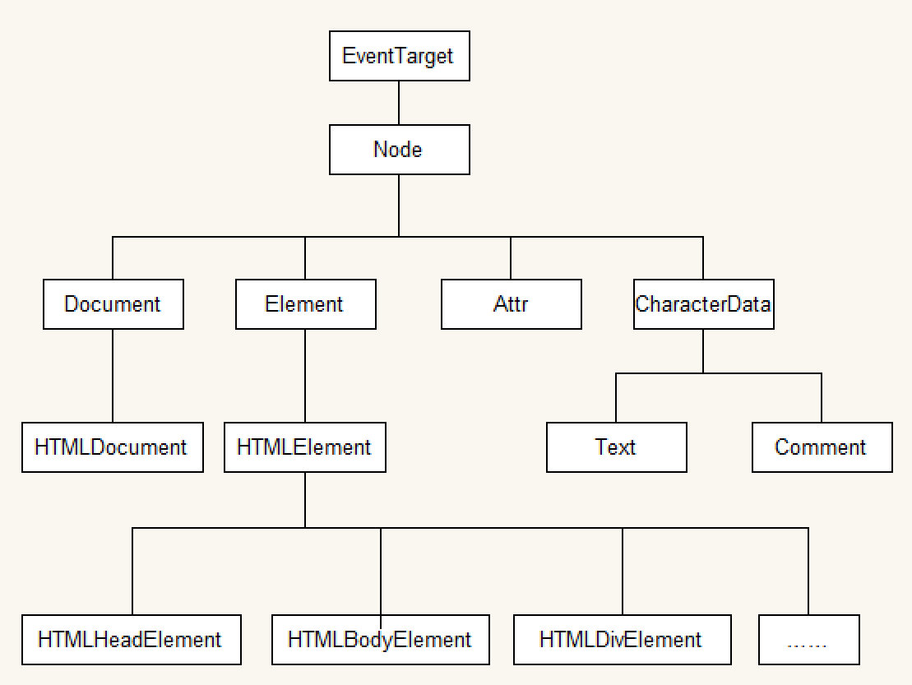

# 常见浏览器介绍

```
浏览器是网页运行的平台，五大浏览器：IE、火狐（Firefox）、谷歌（Chrome）、Safari和Opera。
```

## 浏览器内核 

```
浏览器内核又可以分成两部分：渲染引擎(layout engineer 或者 Rendering Engine)和 JS 引擎。

渲染引擎 它负责取得网页的内容（HTML、XML、图像等等）、整理讯息（例如加入 CSS 等），以及计算网页的显示方式，然后会输出至显示器或打印机。浏览器的内核的不同对于网页的语法解释会有不同，所以渲染的效果也不相同。

JS 引擎 则是解析 Javascript 语言，执行 javascript语言来实现网页的动态效果。

最开始渲染引擎和 JS 引擎并没有区分的很明确，后来 JS 引擎越来越独立，内核就倾向于只指渲染引擎。有一个网页标准计划小组制作了一个 ACID 来测试引擎的兼容性和性能。内核的种类很多，但是常见的浏览器内核可以分这四种：Trident、Gecko、Blink、Webkit。
五大浏览器采用的都是单内核，而随着浏览器的发展现在也出现了双内核。像360浏览器、QQ浏览器都是采用双内核。

四大内核分别是：Trident（也称IE内核）、webkit、Blink、Gecko
```

- IE浏览器内核：Trident内核，也是俗称的IE内核；
- Chrome浏览器内核：统称为Chromium内核或Chrome内核，以前是Webkit内核，现在是Blink内核；
- Firefox浏览器内核：Gecko内核，俗称Firefox内核；
- Safari浏览器内核：Webkit内核；
- Opera浏览器内核：最初是自己的Presto内核，后来是Webkit，现在是Blink内核；

## 移动端的浏览器内核

主要说的是系统内置浏览器的内核。

iPhone 和 iPad 等苹果 iOS 平台主要是 WebKit

Android 4.4 之前的 Android 系统浏览器内核是 WebKit，Android4.4 系统浏览器切换到了Chromium，内核是 Webkit 的分支 Blink

Windows Phone 8 系统浏览器内核是 Trident。

# Web标准

## Web 标准构成

 Web标准不是某一个标准，而是由W3C和其他标准化组织制定的一系列标准的集合。主要包括结构（Structure）、表现（Presentation）和行为（Behavior）三个方面。

```
结构标准：结构用于对网页元素进行整理和分类，主要包括XML和XHTML两个部分。
样式标准：表现用于设置网页元素的版式、颜色、大小等外观样式，主要指的是CSS。
行为标准：行为是指网页模型的定义及交互的编写，主要包括DOM和ECMAScript两个部分
```

理想状态我们的源码： .HTML    .css   .js 

# Web存储

### cookie，localStorage，sessionStorage，indexDB

我们先来通过表格学习下这几种存储方式的区别

| 特性         | cookie                                     | localStorage             | sessionStorage | indexDB                  |
| ------------ | ------------------------------------------ | ------------------------ | -------------- | ------------------------ |
| 数据生命周期 | 一般由服务器生成，可以设置过期时间         | 除非被清理，否则一直存在 | 页面关闭就清理 | 除非被清理，否则一直存在 |
| 数据存储大小 | 4K                                         | 5M                       | 5M             | 无限                     |
| 与服务端通信 | 每次都会携带在 header 中，对于请求性能影响 | 不参与                   | 不参与         | 不参与                   |

从上表可以看到，`cookie` 已经不建议用于存储。如果没有大量数据存储需求的话，可以使用 `localStorage` 和 `sessionStorage` 。对于不怎么改变的数据尽量使用 `localStorage` 存储，否则可以用 `sessionStorage` 存储。

sessionStorage/localStorage：将数据存储到本地

API：

```js
window.sessionStorage.setItem('name',name)
window.sessionStorage.getItem('name')
window.sessionStorage.removeItem('name')
window.sessionStorage.clear()
```

sessionStorage

1. 存储在当前页面内存中
2. 5M左右

localStorage

1. 同一个浏览器可以共享
2. 永久存储，存储在硬盘
3. 20M左右

对于 `cookie` 来说，我们还需要注意安全性。

| 属性      | 作用                                                         |
| --------- | ------------------------------------------------------------ |
| value     | 如果用于保存用户登录态，应该将该值加密，不能使用明文的用户标识 |
| http-only | 不能通过 JS 访问 Cookie，减少 XSS 攻击                       |
| secure    | 只能在协议为 HTTPS 的请求中携带                              |
| same-site | 规定浏览器不能在跨域请求中携带 Cookie，减少 CSRF 攻击        |

### Service Worker

Service Worker 是运行在浏览器背后的**独立线程**，一般可以用来实现缓存功能。使用 Service Worker的话，传输协议必须为 **HTTPS**。因为 Service Worker 中涉及到请求拦截，所以必须使用 HTTPS 协议来保障安全。

Service Worker 实现缓存功能一般分为三个步骤：首先需要先注册 Service Worker，然后监听到 `install` 事件以后就可以缓存需要的文件，那么在下次用户访问的时候就可以通过拦截请求的方式查询是否存在缓存，存在缓存的话就可以直接读取缓存文件，否则就去请求数据。以下是这个步骤的实现：

```js
// index.js
if (navigator.serviceWorker) {
  navigator.serviceWorker
    .register('sw.js')
    .then(function(registration) {
      console.log('service worker 注册成功')
    })
    .catch(function(err) {
      console.log('servcie worker 注册失败')
    })
}
// sw.js
// 监听 `install` 事件，回调中缓存所需文件
self.addEventListener('install', e => {
  e.waitUntil(
    caches.open('my-cache').then(function(cache) {
      return cache.addAll(['./index.html', './index.js'])
    })
  )
})

// 拦截所有请求事件
// 如果缓存中已经有请求的数据就直接用缓存，否则去请求数据
self.addEventListener('fetch', e => {
  e.respondWith(
    caches.match(e.request).then(function(response) {
      if (response) {
        return response
      }
      console.log('fetch source')
    })
  )
})
```

打开页面，可以在开发者工具中的 `Application` 看到 Service Worker 已经启动了


在 Cache 中也可以发现我们所需的文件已被缓存


当我们重新刷新页面可以发现我们缓存的数据是从 Service Worker 中读取的


## 应用缓存ApplicationCache

指定缓存文件，5M左右

```html
<html lang='en' manifest='demo.appcache'>
...
</html>
```

manifest=应用程序缓存清单路径，文件扩展名建议为appcache

appcache文件内容：

```config
#第一句
CACHE MANIFEST
#需要缓存的清单列表
CACHE:
../01.jpg
#*代表所有文件
#每次请求都需要重新获取的清单列表
NETWORK：
../02.jpg
#没找到时的替代文件
FALLBACK:
#被替代文件 替代文件
../03.jpg ../04.jpg
#/代表所有文件
```

不起作用时要配置IIS管理器（服务器）里的的MIME类型：text/cache-manifest

根据官方文档，AppCache 已经不推荐使用了，标准也不会再支持。 

## 多媒体标签

- embed：标签定义嵌入的内容
- audio：播放音频
- video：播放视频

### 多媒体 embed

embed可以用来插入各种多媒体，格式可以是 Midi、Wav、AIFF、AU、MP3等等。url为音频或视频文件及其路径，可以是相对路径或绝对路径。

```html
<embed src="http://player.youku.com/player.php/sid/XMTI4MzM2MDIwOA==/v.swf" allowFullScreen="true" quality="high" width="480" height="400" align="middle" allowScriptAccess="always" type="application/x-shockwave-flash"></embed>
```

### 多媒体 audio

```
<audio controls>
  <source src="horse.ogg" type="audio/ogg">
  <source src="horse.mp3" type="audio/mpeg">
您的浏览器不支持 audio 元素。
</audio>
```

**autoplay**：autoplay自动播放

**controls**：controls是否显示默认播放控件

**loop**：loop循环播放，loop='2'，-1为循环播放

目前<audio>元素支持三种音频格式文件: MP3, Wav, 和 Ogg由于版权等原因，不同的浏览器可支持播放的格式是不一样的

| 浏览器               | MP3  | Wav  | Ogg  |
| -------------------- | ---- | ---- | ---- |
| Internet Explorer 9+ | YES  | NO   | NO   |
| Chrome 6+            | YES  | YES  | YES  |
| Firefox 3.6+         | YES  | YES  | YES  |
| Safari 5+            | YES  | YES  | NO   |
| Opera 10+            | YES  | YES  | YES  |

多浏览器支持的方案，如下图

```
<audio src="" controls autoplay>
  <source src="bgs.mp3" />
  <source src="bgs.wav" />
  <source src="bgs.ogg" />
  你的浏览器不支持该audio音频播放
</audio>
```

### 多媒体 video

```
<video width="320" height="240" controls>
  <source src="movie.mp4" type="video/mp4">
  <source src="movie.ogg" type="video/ogg">
  您的浏览器不支持Video标签。
</video>
```

**autoplay** 自动播放

**controls** 是否显示默认播放控件

**loop** 循环播放

**width** 设置播放窗口宽度

**height**设置播放窗口的高度

当前， <video> 元素支持三种视频格式： MP4, WebM, 和 Ogg ，由于版权等原因，不同的浏览器可支持播放的格式是不一样的，如下图供参考

| 浏览器            | MP4                  | WebM | Ogg  |
| ----------------- | -------------------- | ---- | ---- |
| Internet Explorer | YES                  | NO   | NO   |
| Chrome            | YES                  | YES  | YES  |
| Firefox           | YES                  | YES  | YES  |
| Safari            | YES                  | NO   | NO   |
| Opera             | YES (从 Opera 25 起) | YES  | YES  |

**多浏览器支持的方案同音频**

## DOM操作

### 获取元素

document.getElementByClassName('class')类数组

document.getElementByTagName('tag')类数组

document.querySelector('')返回第一个匹配的元素

document.querySelectorAll('')类数组

### 类名操作

Node.classLisht.add('')

Node.classLisht.remove('')

Node.classLisht.toggle('')

Node.classLisht.contains('')

### 自定义属性

1. 在HTML5中我们可以自定义属性，其格式如下`data-*=""`，例如：`data-info="我是自定义属性"`，通过`Node.dataset['info']` 我们便可以获取到自定义的属性值。
2. 当我们如下格式设置时，则需要以驼峰格式才能正确获取：`data-my-name="itcast"`，获取`Node.dataset['myName']

# 浏览器缓存机制

缓存可以说是性能优化中**简单高效**的一种优化方式了，它可以**显著减少网络传输所带来的损耗**。

对于一个数据请求来说，可以分为发起网络请求、后端处理、浏览器响应三个步骤。浏览器缓存可以帮助我们在第一和第三步骤中优化性能。比如说直接使用缓存而不发起请求，或者发起了请求但后端存储的数据和前端一致，那么就没有必要再将数据回传回来，这样就减少了响应数据。

## 缓存位置

从缓存位置上来说分为四种，并且各自有**优先级**，当依次查找缓存且都没有命中的时候，才会去请求网络

1. Service Worker
2. Memory Cache
3. Disk Cache
4. Push Cache
5. 网络请求

### Service Worker

Service Worker 的缓存与浏览器其他内建的缓存机制不同，它可以让我们**自由控制**缓存哪些文件、如何匹配缓存、如何读取缓存，并且**缓存是持续性的**。

当 Service Worker 没有命中缓存的时候，我们需要去调用 `fetch` 函数获取数据。也就是说，如果我们没有在 Service Worker 命中缓存的话，会根据缓存查找优先级去查找数据。**但是不管我们是从 Memory Cache 中还是从网络请求中获取的数据，浏览器都会显示我们是从 Service Worker 中获取的内容。**

### Memory Cache

Memory Cache 也就是内存中的缓存，读取内存中的数据肯定比磁盘快。**但是内存缓存虽然读取高效，可是缓存持续性很短，会随着进程的释放而释放。** 一旦我们关闭 Tab 页面，内存中的缓存也就被释放了。

当我们访问过页面以后，再次刷新页面，可以发现很多数据都来自于内存缓存

从内存中读取缓存

那么既然内存缓存这么高效，我们是不是能让数据都存放在内存中呢？

先说结论，这是**不可能**的。首先计算机中的内存一定比硬盘容量小得多，操作系统需要精打细算内存的使用，所以能让我们使用的内存必然不多。内存中其实可以存储大部分的文件，比如说 JSS、HTML、CSS、图片等等。但是浏览器会把哪些文件丢进内存这个过程就很**玄学**了，我查阅了很多资料都没有一个定论。

当然，我通过一些实践和猜测也得出了一些结论：

- 对于大文件来说，大概率是不存储在内存中的，反之优先
- 当前系统内存使用率高的话，文件优先存储进硬盘

###Disk Cache

Disk Cache 也就是存储在硬盘中的缓存，读取速度慢点，但是什么都能存储到磁盘中，比之 Memory Cache **胜在容量和存储时效性上。**

在所有浏览器缓存中，Disk Cache 覆盖面基本是最大的。它会**根据 HTTP Herder 中的字段判断**哪些资源需要缓存，哪些资源可以不请求直接使用，哪些资源已经过期需要重新请求。**并且即使在跨站点的情况下，相同地址的资源一旦被硬盘缓存下来，就不会再次去请求数据。**

### Push Cache

Push Cache 是 HTTP/2 中的内容，当以上三种缓存都没有命中时，它才会被使用。**并且缓存时间也很短暂，只在会话（Session）中存在，一旦会话结束就被释放。**

Push Cache 在国内能够查到的资料很少，也是因为 HTTP/2 在国内不够普及，但是 HTTP/2 将会是日后的一个趋势。这里推荐阅读 [HTTP/2 push is tougher than I thought](https://link.juejin.im/?target=https%3A%2F%2Fjakearchibald.com%2F2017%2Fh2-push-tougher-than-i-thought%2F) 这篇文章，但是内容是英文的，我翻译一下文章中的几个结论，有能力的同学还是推荐自己阅读

- 所有的资源都能被推送，但是 Edge 和 Safari 浏览器兼容性不怎么好
- 可以推送 `no-cache` 和 `no-store` 的资源
- 一旦连接被关闭，Push Cache 就被释放
- 多个页面可以使用相同的 HTTP/2 连接，也就是说能使用同样的缓存
- Push Cache 中的缓存只能被使用一次
- 浏览器可以拒绝接受已经存在的资源推送
- 你可以给其他域名推送资源

### 网络请求

如果所有缓存都没有命中的话，那么只能发起请求来获取资源了。

那么为了性能上的考虑，大部分的接口都应该选择好缓存策略，接下来我们就来学习缓存策略这部分的内容。

## 缓存策略

通常浏览器缓存策略分为两种：**强缓存**和**协商缓存**，并且缓存策略都是通过设置 HTTP Header 来实现的。

### 强缓存

强缓存可以通过设置两种 HTTP Header 实现：`Expires` 和 `Cache-Control` 。**强缓存表示在缓存期间不需要请求**，`state code` 为 200。

#### Expires

```
Expires: Wed, 22 Oct 2018 08:41:00 GMT
```

`Expires` 是 HTTP/1 的产物，表示资源会在 `Wed, 22 Oct 2018 08:41:00 GMT` 后过期，需要再次请求。并且 `Expires` **受限于本地时间**，如果修改了本地时间，可能会造成缓存失效。

#### Cache-control

```
Cache-control: max-age=30
```

`Cache-Control` 出现于 HTTP/1.1，**优先级高于 Expires** 。该属性值表示资源会在 30 秒后过期，需要再次请求。

`Cache-Control` **可以在请求头或者响应头中设置**，并且可以组合使用多种指令

多种指令配合流程图

从图中我们可以看到，我们可以将**多个指令配合起来一起使用**，达到多个目的。比如说我们希望资源能被缓存下来，并且是客户端和代理服务器都能缓存，还能设置缓存失效时间等等。

接下来我们就来学习一些常见指令的作用

常见指令作用

###协商缓存

如果缓存过期了，就需要发起请求验证资源是否有更新。协商缓存可以通过设置两种 HTTP Header 实现：`Last-Modified` 和 `ETag` 。

当浏览器发起请求验证资源时，如果资源没有做改变，那么服务端就会返回 304 状态码，并且更新浏览器缓存有效期。

协商缓存

1. **Last-Modified 和 If-Modified-Since**

`Last-Modified` 表示本地文件最后修改日期，`If-Modified-Since` 会将 `Last-Modified` 的值发送给服务器，询问服务器在该日期后资源是否有更新，有更新的话就会将新的资源发送回来，否则返回 304 状态码。

但是 `Last-Modified` 存在一些**弊端**：

- 如果本地**打开**缓存文件，即使没有对文件进行修改，但还是会造成 `Last-Modified` 被修改，服务端不能命中缓存导致发送相同的资源
- 因为 `Last-Modified` 只能**以秒计时**，如果在不可感知的时间内修改完成文件，那么服务端会认为资源还是命中了，不会返回正确的资源

因为以上这些弊端，所以在 HTTP / 1.1 出现了 `ETag` 。

2. **ETag 和 If-None-Match**

`ETag` 类似于文件指纹，`If-None-Match` 会将当前 `ETag` 发送给服务器，询问该资源 `ETag` 是否变动，有变动的话就将新的资源发送回来。并且 `ETag` **优先级**比 `Last-Modified` **高**。

以上就是缓存策略的所有内容了，看到这里，不知道你是否存在这样一个疑问。**如果什么缓存策略都没设置，那么浏览器会怎么处理？**

对于这种情况，浏览器会采用一个**启发式的算法**，通常会取响应头中的 `Date` 减去 `Last-Modified` 值的 10% 作为缓存时间。

##实际场景应用缓存策略

单纯了解理论而不付诸于实践是没有意义的，接下来我们来通过几个场景学习下如何使用这些理论。

###频繁变动的资源

对于频繁变动的资源，首先需要使用 `Cache-Control: no-cache` 使浏览器每次都请求服务器，然后配合 `ETag` 或者 `Last-Modified` 来验证资源是否有效。这样的做法虽然不能节省请求数量，但是能显著减少响应数据大小。

###代码文件

这里特指除了 HTML 外的代码文件，因为 HTML 文件一般不缓存或者缓存时间很短。

一般来说，现在都会使用工具来打包代码，那么我们就可以对文件名进行哈希处理，只有当代码修改后才会生成新的文件名。基于此，我们就可以给代码文件设置缓存有效期一年 `Cache-Control: max-age=31536000`，这样只有当 HTML 文件中引入的文件名发生了改变才会去下载最新的代码文件，否则就一直使用缓存。

#浏览器渲染原理

学习浏览器渲染原理更多的是为了解决性能的问题，如果不了解这部分的知识，你就不知道什么情况下会对性能造成损伤。

我们知道执行 JS 有一个 JS 引擎，那么执行渲染也有一个渲染引擎。同样，渲染引擎在不同的浏览器中也不是都相同的。比如在 Firefox 中叫做 **Gecko**，在 Chrome 和 Safari 中都是基于 **WebKit** 开发的。在这节中，主要学习关于 **WebKit** 的这部分渲染引擎内容。

## 浏览器接收到 HTML 文件并转换为 DOM 树

当我们打开一个网页时，浏览器都会去请求对应的 HTML 文件。虽然平时我们写代码时都会分为 JS、CSS、HTML 文件，也就是字符串，但是计算机硬件是不理解这些字符串的，所以在网络中传输的内容其实都是 `0` 和 `1` 这些**字节数据**。当浏览器接收到这些字节数据以后，它会将这些**字节数据转换为字符串**，也就是我们写的代码。


当数据转换为字符串以后，浏览器会先将这些字符串通过词法分析转换为**标记**（token），这一过程在词法分析中叫做**标记化**（tokenization）。


那么什么是标记呢？这其实属于编译原理这一块的内容了。简单来说，标记还是字符串，是构成代码的**最小单位**。这一过程会将代码分拆成一块块，并给这些内容打上标记，便于理解这些最小单位的代码是什么意思。


当结束标记化后，这些标记会紧接着**转换为 Node**，最后这些 Node 会根据不同 Node 之前的联系构建为一颗 DOM 树。


以上就是浏览器从网络中接收到 HTML 文件然后一系列的转换过程。


当然，在解析 HTML 文件的时候，浏览器还会遇到 CSS 和 JS 文件，这时候浏览器也会去下载并解析这些文件，接下来就让我们先来学习浏览器如何解析 CSS 文件。

## 将 CSS 文件转换为 CSSOM 树

其实转换 CSS 到 CSSOM 树的过程和上一小节的过程是极其类似的


在这一过程中，浏览器会确定下每一个节点的**样式**到底是什么，并且这一过程其实是**很消耗资源**的。因为样式你可以自行设置给某个节点，也可以通过继承获得。在这一过程中，浏览器得**递归** CSSOM 树，然后确定具体的元素到底是什么样式。

如果你有点不理解为什么会消耗资源的话，我这里举个例子

```html
<div>
  <a> <span></span> </a>
</div>
<style>
  span {
    color: red;
  }
  div > a > span {
    color: red;
  }
</style>
```

对于第一种设置样式的方式来说，浏览器只需要找到页面中所有的 `span` 标签然后设置颜色，但是对于第二种设置样式的方式来说，浏览器首先需要找到所有的 `span` 标签，然后找到 `span` 标签上的 `a` 标签，最后再去找到 `div` 标签，然后给符合这种条件的 `span` 标签设置颜色，这样的递归过程就很复杂。所以我们**应该尽可能的避免写过于具体的 CSS 选择器**，然后对于 HTML 来说也**尽量少的添加无意义标签**，保证**层级扁平**。

## 生成渲染树

当我们生成 DOM 树和 CSSOM 树以后，就需要将这两棵树**组合为渲染树**。


在这一过程中，不是简单的将两者合并就行了。渲染树只会包括**需要显示的节点**和这些节点的样式信息，如果某个节点是 `display: none` 的，那么就不会在渲染树中显示。

当浏览器生成渲染树以后，就会根据渲染树来进行**布局**（也可以叫做回流），然后调用 GPU 绘制，合成图层，显示在屏幕上。对于这一部分的内容因为过于底层，还涉及到了硬件相关的知识，这里就不再继续展开内容了。

那么通过以上内容，我们已经详细了解到了浏览器从接收文件到将内容渲染在屏幕上的这一过程。接下来，我们将会来学习上半部分遗留下来的一些知识点。

## 为什么操作 DOM 慢

想必大家都听过操作 DOM 性能很差，但是这其中的原因是什么呢？

因为 DOM 是属于渲染引擎中的东西，而 JS 又是 JS 引擎中的东西。当我们**通过 JS 操作 DOM 的时候，其实这个操作涉及到了两个线程之间的通信，那么势必会带来一些性能上的损耗。**操作 DOM 次数一多，也就等同于一直在进行线程之间的通信，并且操作 DOM 可能还会带来重绘回流的情况，所以也就导致了性能上的问题。

> 经典面试题：插入几万个 DOM，如何实现页面不卡顿？

对于这道题目来说，首先我们肯定不能一次性把几万个 DOM 全部插入，这样肯定会造成卡顿，所以解决问题的重点应该是如何分批次部分渲染 DOM。大部分人应该可以想到通过 `requestAnimationFrame`（计时器）的方式去循环的插入 DOM，其实还有种方式去解决这个问题：**虚拟滚动**（virtualized scroller）。

**这种技术的原理就是只渲染可视区域内的内容，非可见区域的那就完全不渲染了，当用户在滚动的时候就实时去替换渲染的内容。**


从上图中我们可以发现，即使列表很长，但是渲染的 DOM 元素永远只有那么几个，当我们滚动页面的时候就会实时去更新 DOM，这个技术就能顺利解决这道经典面试题。如果你想了解更多的内容可以了解下这个 [react-virtualized](https://link.juejin.im/?target=https%3A%2F%2Fgithub.com%2Fbvaughn%2Freact-virtualized)。

## 什么情况阻塞渲染

首先渲染的前提是生成渲染树，所以 **HTML 和 CSS 肯定会阻塞渲染**。如果你想渲染的越快，你越应该降低一开始需要渲染的文件**大小**，并且**扁平层级，优化选择器**。

然后当浏览器在**解析到 `script` 标签时，会暂停构建 DOM**，完成后才会从暂停的地方重新开始。也就是说，如果你想首屏渲染的越快，就越**不应该在首屏就加载 JS 文件，这也是都建议将 `script` 标签放在 `body` 标签底部的原因。**

当然在当下，并不是说 `script` 标签必须放在底部，因为你可以给 `script` 标签添加 `defer` 或者 `async` 属性。

当 `script` 标签加上 `defer` 属性以后，表示该 JS 文件会并行下载，但是会放到 HTML 解析完成后顺序执行，所以对于这种情况你可以把 `script` 标签放在任意位置。

对于没有任何依赖的 JS 文件可以加上 `async` 属性，表示 JS 文件下载和解析不会阻塞渲染。

## 重绘（Repaint）和回流（Reflow）

重绘和回流会在我们设置节点样式时频繁出现，同时也会很大程度上影响性能。

- 重绘是当节点需要更改外观而不会影响布局的，比如改变 `color` 就叫称为重绘
- 回流是布局或者几何属性需要改变就称为回流。

回流**必定**会发生重绘，重绘**不一定**会引发回流。回流所需的成本比重绘高的多，改变父节点里的子节点很可能会导致父节点的一系列回流。

以下几个动作可能会导致性能问题：

- 改变 `window` 大小
- 改变字体
- 添加或删除样式
- 文字改变
- 定位或者浮动
- 盒模型

并且很多人不知道的是，重绘和回流其实也和 Eventloop 有关。

1. 当 Eventloop 执行完 Microtasks 后，会判断 `document` 是否需要更新，因为浏览器是 60Hz 的刷新率，每 16.6ms 才会更新一次。
2. 然后判断是否有 `resize` 或者 `scroll` 事件，有的话会去触发事件，所以 `resize` 和 `scroll` 事件也是至少 16ms 才会触发一次，并且自带节流功能。
3. 判断是否触发了 media query
4. 更新动画并且发送事件
5. 判断是否有全屏操作事件
6. 执行 `requestAnimationFrame` 回调
7. 执行 `IntersectionObserver` 回调，该方法用于判断元素是否可见，可以用于懒加载上，但是兼容性不好
8. 更新界面
9. 以上就是一帧中可能会做的事情。如果在一帧中有空闲时间，就会去执行 `requestIdleCallback`回调。

以上内容来自于 [HTML 文档](https://link.juejin.im/?target=https%3A%2F%2Fhtml.spec.whatwg.org%2Fmultipage%2Fwebappapis.html%23event-loop-processing-model)。

### 减少重绘和回流

- 使用 `transform` 替代 `top`

```js
<div class="test"></div>
<style>
  .test {
    position: absolute;
    top: 10px;
    width: 100px;
    height: 100px;
    background: red;
  }
</style>
<script>
  setTimeout(() => {
    // 引起回流
    document.querySelector('.test').style.top = '100px'
  }, 1000)
</script>
```

- 使用 `visibility` 替换 `display: none` ，因为前者只会引起重绘，后者会引发回流（改变了布局）

- 不要把节点的属性值放在一个循环里当成循环里的变量

  ```js
  for(let i = 0; i < 1000; i++) {
      // 获取 offsetTop 会导致回流，因为需要去获取正确的值
      console.log(document.querySelector('.test').style.offsetTop)
  }
  ```

- 不要使用 `table` 布局，可能很小的一个小改动会造成整个 `table` 的重新布局

- 动画实现的速度的选择，动画速度越快，回流次数越多，也可以选择使用 `requestAnimationFrame`

- CSS 选择符**从右往左**匹配查找，避免节点层级过多

- 将频繁重绘或者回流的节点设置为图层，图层能够阻止该节点的渲染行为影响别的节点。比如对于 `video` 标签来说，浏览器会自动将该节点变为图层。

  

  

  

  设置节点为图层的方式有很多，我们可以通过以下几个常用属性可以生成新图层

  - `will-change`
  - `video`、`iframe` 标签

## 思考题

> 思考题：在不考虑缓存和优化网络协议的前提下，考虑可以通过哪些方式来最快的渲染页面，也就是常说的关键渲染路径，这部分也是性能优化中的一块内容。

首先你可能会疑问，那怎么测量到底有没有加快渲染速度呢


当发生 `DOMContentLoaded` 事件后，就会生成渲染树，生成渲染树就可以进行渲染了，这一过程更大程度上和硬件有关系了。

**提示如何加速：**

1. 从文件大小考虑
2. 从 `script` 标签使用上来考虑
3. 从 CSS、HTML 的代码书写上来考虑
4. 从需要下载的内容是否需要在首屏使用上来考虑

# 前端优化

## 图片优化

### 计算图片大小

对于一张 100 * 100 像素的图片来说，图像上有 10000 个像素点，如果每个像素的值是 **RGBA** 存储的话，那么也就是说每个像素有 4 个通道，每个通道 1 个字节（8 位 = 1个字节），所以该图片大小大概为 39KB（10000 * 1 * 4 / 1024）。

但是在实际项目中，一张图片可能并不需要使用那么多颜色去显示，我们可以通过减少每个像素的调色板来相应缩小图片的大小。

了解了如何计算图片大小的知识，那么对于如何优化图片，想必大家已经有 2 个思路了：

- **减少像素点**
- **减少每个像素点能够显示的颜色**

### 图片加载优化

1. 不用图片。很多时候会使用到很多修饰类图片，其实这**类修饰图片**完全可以用 **CSS 去代替**。
2. 对于**移动端**来说，屏幕宽度就那么点，完全没有必要去加载原图浪费带宽。**一般图片都用 CDN 加载**，可以计算出适配屏幕的宽度，然后去请求相应裁剪好的图片。
3. **小图使用 base64 格式**
4. 将多个图标文件整合到一张图片中（**雪碧图**）
5. 选择正确的图片格式：
   - 对于能够显示 WebP 格式的浏览器尽量使用 WebP 格式。因为 WebP 格式具有更好的图像数据压缩算法，能带来更小的图片体积，而且拥有肉眼识别无差异的图像质量，缺点就是兼容性并不好
   - 小图使用 PNG，其实对于大部分图标这类图片，完全可以使用 SVG 代替
   - 照片使用 JPEG

## DNS 预解析

DNS 解析也是需要时间的，可以通过预解析的方式来预先获得域名所对应的 IP。

```html
<link rel="dns-prefetch" href="//yuchengkai.cn">
```

## 节流

考虑一个场景，滚动事件中会发起网络请求，但是我们并**不希望用户在滚动过程中一直发起请求，而是隔一段时间发起一次**，对于这种情况我们就可以使用节流。

理解了节流的用途，我们就来实现下这个函数

```js
// func是用户传入需要防抖的函数
// wait是等待时间
const throttle = (func, wait = 50) => {
  // 上一次执行该函数的时间
  let lastTime = 0
  return function(...args) {
    // 当前时间
    let now = +new Date()
    // 将当前时间和上一次执行函数时间对比
    // 如果差值大于设置的等待时间就执行函数
    if (now - lastTime > wait) {
      lastTime = now
      func.apply(this, args)
    }
  }
}

setInterval(
  throttle(() => {
    console.log(1)
  }, 500),
  1
)
```

## 防抖

考虑一个场景，有一个按钮点击会触发网络请求，但是我们并不希望每次点击都发起网络请求，而是**当用户点击按钮一段时间后没有再次点击的情况才去发起网络请求**，对于这种情况我们就可以使用防抖。

理解了防抖的用途，我们就来实现下这个函数

```js
// func是用户传入需要防抖的函数
// wait是等待时间
const debounce = (func, wait = 50) => {
  // 缓存一个定时器id
  let timer = 0
  // 这里返回的函数是每次用户实际调用的防抖函数
  // 如果已经设定过定时器了就清空上一次的定时器
  // 开始一个新的定时器，延迟执行用户传入的方法
  return function(...args) {
    if (timer) clearTimeout(timer)
    timer = setTimeout(() => {
      func.apply(this, args)
    }, wait)
  }
}
```

## 预加载

在开发中，可能会遇到这样的情况。**有些资源不需要马上用到，但是希望尽早获取，这时候就可以使用预加载。**

预加载其实是声明式的 `fetch` ，强制浏览器请求资源，并且不会阻塞 `onload` 事件，可以使用以下代码开启预加载

```html
<link rel="preload" href="http://example.com">
```

预加载可以一定程度上降低首屏的加载时间，因为可以将一些不影响首屏但重要的文件延后加载，唯一缺点就是兼容性不好。

## 预渲染

可以通过预渲染将下载的文件预先在后台渲染，可以使用以下代码开启预渲染

```html
<link rel="prerender" href="http://example.com"> 
```

预渲染虽然可以提高页面的加载速度，但是要确保该页面大概率会被用户在之后打开，否则就是白白浪费资源去渲染。

## 懒执行

懒执行就是将**某些逻辑延迟到使用时再计算**。该技术可以用于首屏优化，对于某些耗时逻辑并不需要在首屏就使用的，就可以使用懒执行。懒执行需要唤醒，一般可以通过定时器或者事件的调用来唤醒。

## 懒加载

懒加载就是**将不关键的资源延后加载**。

懒加载的原理就是只加载自定义区域（通常是可视区域，但也可以是即将进入可视区域）内需要加载的东西。对于图片来说，先设置图片标签的 `src` 属性为一张占位图，将真实的图片资源放入一个自定义属性中，当进入自定义区域时，就将自定义属性替换为 `src` 属性，这样图片就会去下载资源，实现了图片懒加载。

懒加载不仅可以用于图片，也可以使用在别的资源上。比如进入可视区域才开始播放视频等等。

## CDN

CDN 的原理是尽可能的在各个地方分布机房缓存数据，这样即使我们的根服务器远在国外，在国内的用户也可以通过国内的机房迅速加载资源。

因此，我们可以将静态资源尽量使用 CDN 加载，由于浏览器对于单个域名有并发请求上限，可以考虑使用多个 CDN 域名。并且对于 CDN 加载静态资源需要注意 CDN 域名要与主站不同，否则每次请求都会带上主站的 Cookie，平白消耗流量。

 

- 减少重绘避免重排，本质是合并修改

  1. css操作合并到一个类中，一次性修改
  2. 将Dom操作合并，一次性插入

- 减少DNS查找

  网页的呈现过程：域名解析 --> 发起TCP的3次握手 --> 建立TCP连接后发起http请求 --> 服务器响应http请求，浏览器得到html代码 --> 浏览器解析html代码，并请求html代码中的资源（如js、css、图片等） --> 浏览器对页面进行渲染呈现给用户 

  域名解析过程：浏览器DNS缓存-->系统DNS缓存-->host文件-->向DNS服务器发起域名解析请求...

  减少主机名的数量就可以减少DNS查找的数量。 

- 使用DNS预解析DNS（Domain Name System 域名系统）

  - DNS解析：通过主机名，最终得到该主机名对应的IP地址的过程。 DNS解析时间可能导致大量用户感知延迟，DNS解析所需的时间差异非常大，延迟范围可以从1ms（本地缓存结果）到普遍的几秒钟时间。所以利用DNS预解析是有意义的。 

  - DNS预解析是浏览器试图在用户访问链接之前解析域名，域名解析后，如果用户确实访问该域名，那么DNS解析时间将不会有延迟。 

  - DNS预解析在某个页面中包含非常多的域名非常有效，如搜索结果页。 

  - 遇到网页中的超链接，`DNS prefetching`从中提取域名并将其解析为IP地址，这些工作在用户浏览网页时，使用最少的CPU和网络在后台进行解析。

    当用户点击这些已经预解析的域名，可以平均减少200毫秒耗时（假设用户最近还未访问过该域名），更重要的是用户不会遇到DNS解析最坏的情况（往往超过1秒）。

    https://www.xuanfengge.com/dns-prefetching-analysis.html

- 压缩合并资源，减少请求

- 使用浏览器缓存

  Cache-Control 用于控制文件在本地缓存有效时长。最常见的，比如服务器回包：Cache-Control:max-age=600 表示文件在本地应该缓存，且有效时长是600秒（从发出请求算起）。在接下来600秒内，如果有请求这个资源，浏览器不会发出 HTTP 请求，而是直接使用本地缓存的文件。

  Last-Modified 是标识文件在服务器上的最新更新时间。下次请求时，如果文件缓存过期，浏览器通过 If-Modified-Since 字段带上这个时间，发送给服务器，由服务器比较时间戳来判断文件是否有修改。如果没有修改，服务器返回304告诉浏览器继续使用缓存；如果有修改，则返回200，同时返回最新的文件。

  Expires 是 HTTP1.0 标准中的字段，Cache-Control 是 HTTP1.1 标准中新加的字段，功能一样，都是控制缓存的有效时间。Expires 的值一个绝对的时间点，如：Expires: Thu, 10 Nov 2015 08:45:11 GMT，表示在这个时间点之前，缓存都是有效的。 当这两个字段同时出现时，Cache-Control 是高优化级的。

  Etag 也是和 Last-Modified 一样，对文件进行标识的字段。不同的是，Etag 的取值是一个对文件进行标识的特征字串。在向服务器查询文件是否有更新时，浏览器通过 If-None-Match 字段把特征字串发送给服务器，由服务器和文件最新特征字串进行匹配，来判断文件是否有更新。没有更新回包304，有更新回包200。Etag 和 Last-Modified 可根据需求使用一个或两个同时使用。两个同时使用时，只要满足基中一个条件，就认为文件没有更新。

  还有一些应用层的缓存机制比如：DOMStorage和appstorage等

- 非核心代码异步加载

- 使用CDN

  内容分发网络（Content delivery network或Content distribution network，缩写：CDN）。简单来说它主要的工作是把我们需要被分发的内容分发到世界各地的各个节点上，让世界各地的人都可以在距离最近的网络节点拿到想要拿到的内容，减少网络传输距离从而达到加速的目的。

  CDN的本质仍然是一个缓存，而且将数据缓存在里用户最近的地方，使用户以最快的速度获取数据，即网络访问第一跳。 

  适用于静态资源

- 减少DOM嵌套

- 将样式表放在头部，脚本放在底部

# 安全防范知识点

## XSS

> 涉及面试题：什么是 XSS 攻击？如何防范 XSS 攻击？什么是 CSP？

XSS 简单点来说，就是攻击者想尽一切办法将**可以执行的代码注入到网页中**。

XSS 可以分为多种类型，但是总体上我认为分为两类：**持久型和非持久型**。

持久型也就是攻击的代码被服务端写入进**数据库**中，这种攻击危害性很大，因为如果网站访问量很大的话，就会导致大量正常访问页面的用户都受到攻击。

举个例子，对于评论功能来说，就得防范持久型 XSS 攻击，因为我可以在评论中输入以下内容


这种情况如果前后端没有做好防御的话，这段评论就会被存储到数据库中，这样每个打开该页面的用户都会被攻击到。

非持久型相比于前者危害就小的多了，一般通过**修改 URL 参数**的方式加入攻击代码，诱导用户访问链接从而进行攻击。

举个例子，如果页面需要从 URL 中获取某些参数作为内容的话，不经过过滤就会导致攻击代码被执行

```html
<!-- http://www.domain.com?name=<script>alert(1)</script> -->
<div>{{name}}</div>                                                  
```

但是对于这种攻击方式来说，如果用户使用 Chrome 这类浏览器的话，浏览器就能自动帮助用户防御攻击。但是我们不能因此就不防御此类攻击了，因为我不能确保用户都使用了该类浏览器。


对于 XSS 攻击来说，通常有两种方式可以用来防御。

### 转义字符

首先，**对于用户的输入应该是永远不信任的**。最普遍的做法就是转义输入输出的内容，对于引号、尖括号、斜杠进行转义

```js
function escape(str) {
  str = str.replace(/&/g, '&amp;')
  str = str.replace(/</g, '&lt;')
  str = str.replace(/>/g, '&gt;')
  str = str.replace(/"/g, '&quto;')
  str = str.replace(/'/g, '&#39;')
  str = str.replace(/`/g, '&#96;')
  str = str.replace(/\//g, '&#x2F;')
  return str
}
```

通过转义可以将攻击代码 `<script>alert(1)</script>` 变成

```js
// -> &lt;script&gt;alert(1)&lt;&#x2F;script&gt;
escape('<script>alert(1)</script>')
```

但是对于显示富文本来说，显然不能通过上面的办法来转义所有字符，因为这样会把需要的格式也过滤掉。对于这种情况，通常采用**白名单过滤**的办法，当然也可以通过黑名单过滤，但是考虑到需要过滤的标签和标签属性实在太多，更加推荐使用白名单的方式。

```js
const xss = require('xss')
let html = xss('<h1 id="title">XSS Demo</h1><script>alert("xss");</script>')
// -> <h1>XSS Demo</h1>&lt;script&gt;alert("xss");&lt;/script&gt;
console.log(html)
```

以上示例使用了 `js-xss` 来实现，可以看到在输出中保留了 `h1` 标签且过滤了 `script` 标签。

### CSP

CSP **本质上就是建立白名单**，开发者明确告诉浏览器哪些外部资源可以加载和执行。我们只需要配置规则，如何拦截是由浏览器自己实现的。我们可以通过这种方式来尽量减少 XSS 攻击。

通常可以通过两种方式来开启 CSP：

1. 设置 HTTP Header 中的 `Content-Security-Policy`
2. 设置 `meta` 标签的方式 `<meta http-equiv="Content-Security-Policy">`

这里以设置 HTTP Header 来举例

- 只允许加载本站资源

  ```
  Content-Security-Policy: default-src ‘self’
  ```

- 只允许加载 HTTPS 协议图片

  ```
  Content-Security-Policy: img-src https://*
  ```

- 允许加载任何来源框架

  ```
  Content-Security-Policy: child-src 'none'
  ```

当然可以设置的属性远不止这些，你可以通过查阅 [文档](https://link.juejin.im/?target=https%3A%2F%2Fdeveloper.mozilla.org%2Fen-US%2Fdocs%2FWeb%2FHTTP%2FHeaders%2FContent-Security-Policy) 的方式来学习，这里就不过多赘述其他的属性了。

对于这种方式来说，只要开发者配置了正确的规则，那么即使网站存在漏洞，攻击者也不能执行它的攻击代码，并且 CSP 的兼容性也不错。


## CSRF

> 涉及面试题：什么是 CSRF 攻击？如何防范 CSRF 攻击？

CSRF 中文名为**跨站请求伪造**。原理就是攻击者构造出一个后端请求地址，诱导用户点击或者通过某些途径自动发起请求。如果用户是在登录状态下的话，后端就以为是用户在操作，从而进行相应的逻辑。

举个例子，假设网站中有一个通过 `GET` 请求提交用户评论的接口，那么攻击者就可以在钓鱼网站中加入一个图片，图片的地址就是评论接口

```

```

那么你是否会想到使用 `POST` 方式提交请求是不是就没有这个问题了呢？其实并不是，使用这种方式也不是百分百安全的，攻击者同样可以诱导用户进入某个页面，在页面中通过表单提交 `POST` 请求。

### 如何防御

防范 CSRF 攻击可以遵循以下几种规则：

1. Get 请求不对数据进行修改
2. 不让第三方网站访问到用户 Cookie
3. 阻止第三方网站请求接口
4. 请求时附带验证信息，比如验证码或者 Token

#### SameSite

可以对 Cookie 设置 `SameSite` 属性。该属性表示 **Cookie 不随着跨域请求发送**，可以很大程度减少 CSRF 的攻击，但是该属性目前并不是所有浏览器都兼容。

#### 验证 Referer

对于需要防范 CSRF 的请求，我们可以通过验证 Referer 来判断该请求是否为第三方网站发起的。

#### Token

服务器下发一个随机 Token，每次发起请求时将 Token 携带上，服务器验证 Token 是否有效。

## 点击劫持

> 涉及面试题：什么是点击劫持？如何防范点击劫持？

点击劫持是一种视觉欺骗的攻击手段。攻击者将需要攻击的网站通过 `iframe` 嵌套的方式嵌入自己的网页中，并将 `iframe` 设置为透明，在页面中透出一个按钮诱导用户点击。


对于这种攻击方式，推荐防御的方法有两种。

### X-FRAME-OPTIONS

`X-FRAME-OPTIONS` 是一个 HTTP 响应头，在现代浏览器有一个很好的支持。这个 HTTP 响应头 就是为了防御用 `iframe` 嵌套的点击劫持攻击。

该响应头有三个值可选，分别是

- `DENY`，表示页面不允许通过 `iframe` 的方式展示
- `SAMEORIGIN`，表示页面可以在相同域名下通过 `iframe` 的方式展示
- `ALLOW-FROM`，表示页面可以在指定来源的 `iframe` 中展示

### JS 防御

对于某些远古浏览器来说，并不能支持上面的这种方式，那我们只有通过 JS 的方式来防御点击劫持了。

```html
<head>
  <style id="click-jack">
    html {
      display: none !important;
    }
  </style>
</head>
<body>
  <script>
    if (self == top) {
      var style = document.getElementById('click-jack')
      document.body.removeChild(style)
    } else {
      top.location = self.location
    }
  </script>
</body>
```

以上代码的作用就是当通过 `iframe` 的方式加载页面时，攻击者的网页直接不显示所有内容了。

## 中间人攻击

> 涉及面试题：什么是中间人攻击？如何防范中间人攻击？

中间人攻击是**攻击方同时与服务端和客户端建立起了连接，并让对方认为连接是安全的，但是实际上整个通信过程都被攻击者控制了。攻击者不仅能获得双方的通信信息，还能修改通信信息。**

通常来说不建议使用公共的 Wi-Fi，因为很可能就会发生中间人攻击的情况。如果你在通信的过程中涉及到了某些敏感信息，就完全暴露给攻击方了。

当然防御中间人攻击其实并不难，只需要增加一个安全通道来传输信息。**HTTPS** 就可以用来防御中间人攻击，但是并不是说使用了 HTTPS 就可以高枕无忧了，因为如果你没有完全关闭 HTTP 访问的话，攻击方可以通过某些方式将 HTTPS 降级为 HTTP 从而实现中间人攻击。

# 从 V8 中看 JS 性能优化

> 注意：该知识点属于性能优化领域。

## 测试性能工具

Chrome 已经提供了一个大而全的性能测试工具 **Audits**

Audits 所处位置

点我们点击 Audits 后，可以看到如下的界面

Audits 界面

在这个界面中，我们可以选择想测试的功能然后点击 **Run audits** ，工具就会自动运行帮助我们测试问题并且给出一个完整的报告

Audits 工具给出的报告

上图是给掘金首页测试性能后给出的一个报告，可以看到报告中分别为**性能、体验、SEO** 都给出了打分，并且每一个指标都有详细的**评估**

指标中的详细评估

评估结束后，工具还提供了一些**建议**便于我们提高这个指标的分数

优化建议

我们只需要一条条根据建议去优化性能即可。

除了 **Audits** 工具之外，还有一个 **Performance** 工具也可以供我们使用。

Performance 工具给出的报告

在这张图中，我们可以详细的看到每个**时间段**中浏览器在处理什么事情，哪个过程最消耗时间，便于我们更加详细的了解性能**瓶颈**。

## JS 性能优化

JS 是编译型还是解释型语言其实并不固定。首先 JS 需要有引擎才能运行起来，无论是浏览器还是在 Node 中，这是解释型语言的特性。但是在 V8 引擎下，又引入了 `TurboFan` 编译器，他会在特定的情况下进行优化，将代码编译成执行效率更高的 **Machine Code**，当然这个编译器并不是 JS 必须需要的，只是为了提高代码执行性能，所以总的来说 JS 更偏向于解释型语言。

那么这一小节的内容主要会针对于 Chrome 的 **V8** 引擎来讲解。

在这一过程中，JS 代码首先会解析为**抽象语法树**（AST），然后会通过解释器或者编译器转化为 **Bytecode** 或者 **Machine Code**

V8 转化代码的过程

从上图中我们可以发现，JS 会首先被解析为 AST，解析的过程其实是略慢的。代码越多，解析的过程也就耗费越长，这也是我们需要压缩代码的原因之一。另外一种减少解析时间的方式是预解析，会作用于未执行的函数，这个我们下面再谈。

2016 年手机解析 JS 代码的速度

这里需要注意一点，对于函数来说，应该**尽可能避免声明嵌套函数**（类也是函数），因为这样会造成函数的重复解析。

```js
function test1() {
  // 会被重复解析
  function test2() {}
}
```

然后 **Ignition** 负责将 AST 转化为 Bytecode，**TurboFan** 负责编译出优化后的 Machine Code，**并且 Machine Code 在执行效率上优于 Bytecode**


那么我们就产生了一个疑问，**什么情况下代码会编译为 Machine Code？**

JS 是一门**动态类型**的语言，并且还有一大堆的规则。简单的加法运算代码，内部就需要考虑好几种规则，比如数字相加、字符串相加、对象和字符串相加等等。这样的情况也就势必导致了内部要增加很多判断逻辑，降低运行效率。

```js
function test(x) {
  return x + x
}

test(1)
test(2)
test(3)
test(4)
```

对于以上代码来说，如果一个函数被**多次调用**并且参数一直传入 `number` 类型，那么 V8 就会认为该段代码可以编译为 Machine Code，因为你**固定了类型**，不需要再执行很多判断逻辑了。

但是如果一旦我们传入的参数**类型改变**，那么 Machine Code 就会被 **DeOptimized** 为 Bytecode，这样就有性能上的一个损耗了。所以如果我们希望代码能多的编译为 Machine Code 并且 DeOptimized 的次数减少，就应该尽可能保证传入的**类型一致**。

那么你可能会有一个疑问，到底优化前后有多少的提升呢，接下来我们就来实践测试一下到底有多少的提升。

```js
const { performance, PerformanceObserver } = require('perf_hooks')

function test(x) {
  return x + x
}
// node 10 中才有 PerformanceObserver
// 在这之前的 node 版本可以直接使用 performance 中的 API
const obs = new PerformanceObserver((list, observer) => {
  console.log(list.getEntries())
  observer.disconnect()
})
obs.observe({ entryTypes: ['measure'], buffered: true })

performance.mark('start')

let number = 10000000
// 不优化代码
%NeverOptimizeFunction(test)

while (number--) {
  test(1)
}

performance.mark('end')
performance.measure('test', 'start', 'end')
```

以上代码中我们使用了 `performance` API，这个 API 在性能测试上十分好用。不仅可以用来测量代码的执行时间，还能用来测量各种网络连接中的时间消耗等等，并且这个 API 也可以在浏览器中使用。

优化与不优化代码之间的巨大差距

从上图中我们可以发现，优化过的代码执行时间只需要 9ms，但是不优化过的代码执行时间却是前者的二十倍，已经接近 200ms 了。在这个案例中，我相信大家已经看到了 V8 的性能优化到底有多强，**只需要我们符合一定的规则书写代码，引擎底层就能帮助我们自动优化代码。**

另外，编译器还有个骚操作 **Lazy-Compile**，当函数没有被执行的时候，会对函数进行一次预解析，直到代码被执行以后才会被解析编译。对于上述代码来说，`test` 函数需要被预解析一次，然后在调用的时候再被解析编译。**但是对于这种函数马上就被调用的情况来说，预解析这个过程其实是多余的**，那么有什么办法能够让代码不被预解析呢？

其实很简单，我们只需要给函数**套上括号**就可以了

```
(function test(obj) {
  return x + x
})
```

但是不可能我们为了性能优化，给所有的函数都去套上括号，并且也不是所有函数都需要这样做。我们可以通过 [optimize-js](https://link.juejin.im/?target=https%3A%2F%2Fgithub.com%2Fnolanlawson%2Foptimize-js) 实现这个功能，这个库会分析一些函数的使用情况，然后给需要的函数添加括号，当然这个库很久没人维护了，如果需要使用的话，还是需要测试过相关内容的。

## 小结

- 可以通过 **Audit** 工具获得网站的多个指标的性能报告
- 可以通过 **Performance** 工具了解网站的性能瓶颈
- 可以通过 **Performance** API 具体测量时间
- 为了减少编译时间，我们可以采用**减少代码文件的大小**或者**减少书写嵌套函数**的方式
- 为了让 V8 优化代码，我们应该尽可能保证传入参数的**类型一致**。这也给我们带来了一个思考，这是不是也是使用 TypeScript 能够带来的好处之一`

# Web API

## Web API介绍

### API的概念

API（Application Programming Interface,应用程序编程接口）是一些预先定义的函数，目的是提供应用程序与开发人员基于某软件或硬件得以访问一组例程的能力，而又无需访问源码，或理解内部工作机制的细节。

- 任何开发语言都有自己的API
- API的特征输入和输出(I/O)
- API的使用方法(console.log())

### Web API的概念

浏览器提供的一套操作浏览器功能和页面元素的API(BOM和DOM)

此处的Web API特指浏览器提供的API(一组方法)，Web API在后面的课程中有其它含义


### 掌握常见的浏览器提供的API的调用方式
[MDN-Web API](https://developer.mozilla.org/zh-CN/docs/Web/API)


### JavaScript的组成


#### ECMAScript - JavaScript的核心 

定义了javascript的语法规范

JavaScript的核心，描述了语言的基本语法和数据类型，ECMAScript是一套标准，定义了一种语言的标准与具体实现无关

#### BOM - 浏览器对象模型

一套操作浏览器功能的API

通过BOM可以操作浏览器窗口，比如：弹出框、控制浏览器跳转、获取分辨率等

#### DOM - 文档对象模型

一套操作页面元素的API

DOM可以把HTML看做是文档树，通过DOM提供的API可以对树上的节点进行操作

文档：一个页面就是一个文档

节点：页面上所有的内容，包括：属性，标签，文本

元素：页面上所有的标签

## BOM

### BOM的概念

BOM(Browser Object Model) 是指浏览器对象模型，浏览器对象模型提供了独立于内容的、可以与浏览器窗口进行互动的对象结构。BOM由多个对象组成，其中代表浏览器窗口的Window对象是BOM的顶层对象，其他对象都是该对象的子对象。

我们在浏览器中的一些操作都可以使用BOM的方式进行编程处理，

比如：刷新浏览器、后退、前进、在浏览器中输入URL等

### BOM的顶级对象window

window是浏览器的顶级对象，当调用window下的属性和方法时，可以省略window
注意：window下一个特殊的属性 window.name

### 对话框

- alert()
- prompt()
- confirm()


### 页面加载事件

- onload

```javascript
window.onload = function () {
  // 当页面加载完成执行
  // 当页面完全加载所有内容（包括图像、脚本文件、CSS 文件等）执行
}
```

- onunload

```javascript
window.onunload = function () {
  // 当用户退出页面时执行 ie8 还有onbeforeunload事件
}
```

### 定时器

#### setTimeout()和clearTimeout()

在指定的毫秒数到达之后执行指定的函数，只执行一次

```javascript
// 创建一个定时器，1000毫秒后执行，返回定时器的标示
var timerId = setTimeout(function () {
  console.log('Hello World');
}, 1000);

// 取消定时器的执行
clearTimeout(timerId);
```

#### setInterval()和clearInterval()

定时调用的函数，可以按照给定的时间(单位毫秒)周期调用函数

```javascript
// 创建一个定时器，每隔1秒调用一次
var timerId = setInterval(function () {
  var date = new Date();
  console.log(date.toLocaleTimeString());
}, 1000);

// 取消定时器的执行
clearInterval(timerId);
```

### console对象

console.log()：在控制台输出信息。

console.dir()：可以显示一个对象所有的属性和方法。 

console.trace()：用来追踪函数的调用轨迹。 

console.dirxml()：用来显示网页的某个节点(node)所包含的html/xml代码) 。

console.assert()：用来判断一个表达式或变量是否为真，只有表达式为false时，才输出一条相应作息，并且抛出一个异常 。

console.time()和console.timeEnd()：用来显示代码的运行时间，传入计时器标志

性能分析：就是分析程序各个部分的运行时间，找出瓶颈所在，使用的方法是console.profile()和console.proileEnd(); 

console.count()：统计代码被执行的次数 ，计数器

### location对象

location对象是window对象下的一个属性，时候的时候可以省略window对象

location可以获取或者设置浏览器地址栏的URL

#### URL

统一资源定位符 (Uniform Resource Locator, URL)

- URL的组成

```
scheme://host:port/path?query#fragment
scheme:通信协议
	常用的http,ftp,maito等
host:主机
	服务器(计算机)域名系统 (DNS) 主机名或 IP 地址。
port:端口号
	整数，可选，省略时使用方案的默认端口，如http的默认端口为80。
path:路径
	由零或多个'/'符号隔开的字符串，一般用来表示主机上的一个目录或文件地址。
query:查询
	可选，用于给动态网页传递参数，可有多个参数，用'&'符号隔开，每个参数的名和值用'='符号隔开。例如：name=zs
fragment:信息片断
	字符串，锚点.
```

#### location成员

- 使用chrome的控制台查看

- 查MDN

  [MDN](https://developer.mozilla.org/zh-CN/)

- 成员

  assign(‘url’)：页面跳转，存入历史

  reload()：重新加载

  replace()：替换成指定页面，不存入历史

  hash：#以及后面的内容

  host：主机名及端口号

  hostname：主机名

  path：文件的相对路径

  port：端口号

  protocol：协议

  search：搜索内容 

  href：页面地址，可以页面跳转，存入历史

#### 案例

解析URL中的query，并返回对象的形式

```javascript
function getQuery(queryStr) {
  var query = {};
  if (queryStr.indexOf('?') > -1) {
    var index = queryStr.indexOf('?');
    queryStr = queryStr.substr(index + 1);
    var array = queryStr.split('&');
    for (var i = 0; i < array.length; i++) {
      var tmpArr = array[i].split('=');
      if (tmpArr.length === 2) {
        query[tmpArr[0]] = tmpArr[1];
      }
    }
  }
  return query;
}
console.log(getQuery(location.search));
console.log(getQuery(location.href));
```

### history对象

- back()
- forward()
- go()

### navigator对象

- userAgent

通过userAgent可以判断用户浏览器的类型

- platform

通过platform可以判断浏览器所在的系统平台类型.

## DOM

### DOM的概念

文档对象模型（Document Object Model，简称DOM），是[W3C](http://baike.baidu.com/item/W3C)组织推荐的处理可扩展标志语言的标准编程接口。在网页上，组织页面（或文档）的对象被组织在一个树形结构中，用来表示文档中对象的标准模型就称为DOM。

DOM又称为文档树模型


- 文档：一个网页可以称为文档
- 节点：网页中的所有内容都是节点（标签、属性、文本、注释等）
- 元素：网页中的标签
- 属性：标签的属性

### 模拟文档树结构


```javascript
function Element(option) {
  this.id = option.id || '';
  this.nodeName = option.nodeName || '';
  this.nodeValue = option.nodeValue || '';
  this.nodeType = 1;
  this.children = option.children || [];
}

var doc = new Element({
  nodeName: 'html'
});
var head = new Element({
  nodeName: 'head'
});
var body = new Element({
  nodeName: 'body'
})
doc.children.push(head);
doc.children.push(body);

var div = new Element({
  nodeName: 'div',
  nodeValue: 'haha',
});

var p = new Element({
  nodeName: 'p',
  nodeValue: '段落'
})
body.children.push(div);
body.children.push(p);

function getChildren(ele) {
  for(var i = 0; i < ele.children.length; i++) {
    var child = ele.children[i];
    console.log(child.nodeName);
    getChildren(child);
  }
}
getChildren(doc);
```

### DOM经常进行的操作

- 获取元素
- 动态创建元素
- 对元素进行操作(设置其属性或调用其方法)
- 事件(什么时机做相应的操作)

## 获取页面元素

获取body：document.body // 元素

获取title：document.title // 内容

获取html：document.documentElement // 元素

### 根据id获取元素

```javascript
var div = document.getElementById('main');
console.log(div);

// 获取到的数据类型 HTMLDivElement，对象都是有类型的
// HTMLDivElement <-- HTMLElement <-- Element  <-- Node  <-- EventTarget
```

注意：由于id名具有唯一性，部分浏览器支持直接使用id名访问元素，但不是标准方式，不推荐使用。

### 根据标签名获取元素

```javascript
var divs = document.getElementsByTagName('div');// 返回伪数组
for (var i = 0; i < divs.length; i++) {
  var div = divs[i];
  console.log(div);
}
```

### 根据name获取元素*

```javascript
var inputs = document.getElementsByName('hobby');
for (var i = 0; i < inputs.length; i++) {
  var input = inputs[i];
  console.log(input);
}
```

### 根据类名获取元素

```javascript
var mains = document.getElementsByClassName('main');
for (var i = 0; i < mains.length; i++) {
  var main = mains[i];
  console.log(main);
}
```

### 根据选择器获取元素

```javascript
var text = document.querySelector('#text');
console.log(text);

var boxes = document.querySelectorAll('.box');
for (var i = 0; i < boxes.length; i++) {
    var box = boxes[i];
    console.log(box);
}
```

getXXXByXXX 获取的是动态集合，querySelector获取的是静态集合。

## 事件

事件：触发-响应机制

Event接口表示在DOM中发生的任何事件，一些是用户生成的（例如鼠标或键盘事件），而其他由API生成。

### 事件三要素

- 事件源:触发(被)事件的元素
- 事件类型:事件的触发方式(例如鼠标点击或键盘点击)
- 事件处理程序:事件**触发后**要执行的代码(函数形式)

### 注册/移除事件的三种方式

```javascript
var box = document.getElementById('box');
// onclick方式只能绑定1个事件
box.onclick = function () {
  console.log('点击后执行');
};
box.onclick = null;
// ie8不支持
// 参数1：事件类型；2：事件处理函数；3：事件触发方式
// this指当前对象
box.addEventListener('click', eventCode, false);
box.removeEventListener('click', eventCode, false);
// ie8
// 参数1：on+事件类型；2：事件处理函数；
// this指window
box.attachEvent('onclick', eventCode);
box.detachEvent('onclick', eventCode);

function eventCode() {
  console.log('点击后执行');
}
```

通常我们使用 `addEventListener` 注册事件，该函数的第三个参数可以是布尔值，也可以是对象。对于布尔值 `useCapture` 参数来说，该参数默认值为 `false` 。对于对象参数来说，可以使用以下几个属性

- `capture`：布尔值，和 `useCapture` 作用一样
- `once`：布尔值，值为 `true` 表示该回调只会调用一次，调用后会移除监听
- `passive`：布尔值，表示永远不会调用 `preventDefault`

一般来说，如果我们只希望事件只触发在目标上，这时候可以使用 `stopPropagation` 来阻止事件的进一步传播。通常我们认为 `stopPropagation` 是用来阻止事件冒泡的，其实该函数也可以阻止捕获事件。`stopImmediatePropagation` 同样也能实现阻止事件，但是还能阻止该事件目标执行别的注册事件。

```js
node.addEventListener(
  'click',
  event => {
    event.stopImmediatePropagation()
    console.log('冒泡')
  },
  false
)
// 点击 node 只会执行上面的函数，该函数不会执行
node.addEventListener(
  'click',
  event => {
    console.log('捕获 ')
  },
  true
)
```

### 兼容代码

```javascript
function addEventListener(element, type, fn) {
  if (element.addEventListener) {
    element.addEventListener(type, fn, false);
  } else if (element.attachEvent){
    element.attachEvent('on' + type,fn);
  } else {
    element['on'+type] = fn;
  }
}

function removeEventListener(element, type, fn) {
  if (element.removeEventListener) {
    element.removeEventListener(type, fn, false);
  } else if (element.detachEvent) {
    element.detachEvent('on' + type, fn);
  } else {
    element['on'+type] = null;
  }
}
```

### 事件的三个阶段

1. 捕获阶段，`window` 往事件触发处传播，遇到注册的捕获事件会触发（从外向内）true
2. 当前目标阶段，传播到事件触发处时触发注册的事件
3. 冒泡阶段，从事件触发处往 `window` 传播，遇到注册的冒泡事件会触发（从里向外）false

事件对象.eventPhase属性可以查看事件触发时所处的阶段：1，2，3

冒泡和捕获不会同时发生

### 事件委托

原理：事件冒泡

使用：同时给拥有共同父元素的多个子元素绑定事件

优点：减少与dom的交互次数，节省内存，提高性能，不需要给子节点注销事件

给父元素绑定事件，由于冒泡原理，子元素会触发父元素的事件。但是父元素也会触发事件，如果不需要，可以使用事件对象中的事件源属性进行过滤

```js
window.onload = function(){
　var oUl = document.getElementById("ul1");
　oUl.onclick = function(e){
　　var e = e || window.event;
　　var target = e.target || e.srcElement;// 兼容问题：e.target，IE浏览器用event.srcElement
　　if(target.nodeName.toLowerCase() == 'li'){
　 　　// TODO
　　}
　}
}
```

子元素进行不同的操作也可以利用事件委托进行优化，结合switch

```js
window.onload = function(){
 var oBox = document.getElementById("box");
 oBox.onclick = function (ev) {
     var ev = ev || window.event;
     var target = ev.target || ev.srcElement;
     if(target.nodeName.toLocaleLowerCase() == 'input'){
         switch(target.id){
         case 'add' :
         alert('添加');
         break;
         case 'remove' :
         alert('删除');
         break;
         case 'move' :
         alert('移动');
         break;
         case 'select' :
         alert('选择');
         break;
         }
     }
  }   
}
```

新添加的子元素也是有效果的，不需要多余的dom操作

参照：https://www.cnblogs.com/liugang-vip/p/5616484.html

适合用事件委托的事件：click，mousedown，mouseup，keydown，keyup，keypress，mouseover和mouseout虽然也有事件冒泡，但是处理它们的时候需要特别的注意，因为需要经常计算它们的位置，处理起来不太容易。

不适合的：mousemove，每次都要计算它的位置，非常不好把控；focus，blur等，没用冒泡的特性，自然就不能用事件委托了。

### 事件对象的属性和方法

- type：获取事件类型

- clientX/clientY：所有浏览器都支持，窗口位置

- pageX/pageY：IE8不支持，页面位置

- target || event.srcElement：用于获取触发事件的真实元素

- currentTarget：正在触发事件处理函数的元素

- preventDefault()：取消默认行为

  ie8不存在事件对象用window.event(谷歌也支持)代替：e=window.event||e

### 阻止事件传播的方式

- 标准方式 e（事件对象）.stopPropagation();
- IE低版本 window.event.cancelBubble = true; 标准中已废弃

### 阻止默认事件

- 阻止超链接跳转，在事件中return false
- event.preventDefault() 取消默认行为
- window.event.returnValue = false // IE

### 兼容代码

```js
function preventDefa(e){ 
	if(window.event){ 
		//IE中阻止函数器默认动作的方式  
		window.event.returnValue = false;  
	}else{ 
		//阻止默认浏览器动作(W3C)  
		e.preventDefault(); 
	}  
} 

function stopBubble(e) { 
	if(e && e.stopPropagation) { //非IE 
		e.stopPropagation(); 
	} else { //IE 
		window.event.cancelBubble = true; 
	} 
} 
```

### 常用的事件

鼠标键盘事件

- onmouseup 鼠标按键放开时触发
- onmousedown 鼠标按键按下触发
- onmousemove 鼠标移动触发
- onkeyup 键盘按键抬起触发
- onkeydown 键盘按键按下触发
- onfocus 获取焦点
- onblur 失去焦点


- scroll 滚动事件

#### enter、leave、over、out 的区别


## 属性操作

### 非表单元素的属性

href、title、id、src、className

```javascript
var link = document.getElementById('link');
console.log(link.href);
console.log(link.title);

var pic = document.getElementById('pic');
console.log(pic.src);
```

- innerHTML和innerText

  获取：innerText会拿到子元素的内文本不包括标签；

  ​	    innerHTML也会拿到子元素中的内容包括标签

```javascript
var box = document.getElementById('box');
box.innerHTML = '我是文本<p>我会生成为标签</p>';
console.log(box.innerHTML);
box.innerText = '我是文本<p>我不会生成为标签</p>';
console.log(box.innerText);
```
- innerText（低版本火狐不支持）和textContent（ie8不支持）

  获取：innerText会拿到子元素的内容不包括标签

  总结：设置文本也推荐使用innerHTML，因为没有兼容问题

- HTML转义符

```
"		&quot;
‘		&apos;
&		&amp;
<		&lt;    //less than  小于
>		&gt;   // greater than  大于
空格	   &nbsp;
©		&copy;
```

属性名中有-的属性js中改为驼峰表示

width和height属性不用加px

css中的样式是获取不到的只能获取style属性里的样式

### 表单元素属性

- value 用于大部分表单元素的内容获取(option除外)
- type 可以获取input标签的类型(输入框或复选框等)
- disabled 禁用属性
- checked 复选框选中属性
- selected 下拉菜单选中属性

属性值只有一个且和属性名相同的属性在js中的值可以写true或false

### 自定义属性操作

- getAttribute(“属性名”) 获取标签行内属性，可获取自定义属性
- setAttribute(“属性名”，“属性值”) 设置标签行内属性，可设置自定义属性
- removeAttribute(“属性名”) 移除标签行内属性，可移除自定义属性
- 与element.属性的区别: 上述三个方法用于获取任意的行内属性。

### 样式操作

- 使用style方式设置的样式显示在标签行内
```javascript
var box = document.getElementById('box');
box.style.width = '100px';
box.style.height = '100px';
box.style.backgroundColor = 'red';
```

- 注意

  通过样式属性设置宽高、位置的属性类型是字符串，需要加上px

  如果一次样式操作过多应该改用类名操作

### 类名操作

- 修改标签的className属性相当于直接修改标签的类名
```javascript
var box = document.getElementById('box');
box.className = 'clearfix';
```

- **classList属性**

  classList 属性返回元素的类名，作为 DOMTokenList 对象。

  该属性用于在元素中添加，移除及切换 CSS 类。

  classList 属性是只读的，但你可以使用 add() 和 remove() 方法修改它。

``````
document.getElementById("myDIV").classList.add("mystyle");
document.getElementById("myDIV").classList.remove("mystyle");
``````


## 创建元素的三种方式

### document.write()

```javascript
document.write('新设置的内容<p>标签也可以生成</p>');
```

页面加载完之后创建会清空页面上的所有内容

### innerHTML

```javascript
var box = document.getElementById('box');
box.innerHTML = '新内容<p>新标签</p>';
```

### document.createElement()

```javascript
var div = document.createElement('div');
document.body.appendChild(div);// 插入到最后面
```

### 性能问题

- innerHTML方法由于会对字符串进行解析，需要避免在循环内多次使用。
- 可以借助字符串或数组的方式进行替换，再设置给innerHTML
- 优化后与document.createElement性能相近

## 节点操作

在 HTML DOM （文档对象模型）中，每个部分都是节点：

- 文档本身是文档节点
- 所有 HTML 元素是元素节点
- 所有 HTML 属性是属性节点
- HTML 元素内的文本是文本节点 （包括回车符也是属于文本节点）
- 注释是注释节点

 Element 对象可以拥有类型为元素节点、文本节点、注释节点的子节点。

 NodeList 对象表示节点列表，比如 HTML 元素的子节点集合。

 元素也可以拥有属性。属性是属性节点。

 总结：元素是元素节点，是节点中的一种，但元素节点中可以包含很多的节点。

```javascript
var body = document.body;
var div = document.createElement('div');
body.appendChild(div);

var firstEle = body.children[0];
body.insertBefore(div,firstEle);// 插入子元素

body.removeChild(firstEle);// 移除子元素

var text = document.createElement('p');
body.replaceChild(text, div);// 替换子元素

div.cloneNode(true); //克隆节点，false表示只克隆标签，true表示克隆标签属性以及内容
```

### 节点属性

nodeType：1---标签，2---属性，3---文本

nodeName：标签，大写的标签名；属性，小写的属性名；文本，#text

nodeValue：标签，null；属性，属性值；文本，文本内容

### 节点获取

```javascript
var box = document.getElementById('box');
console.log(box.parentNode);// 获取父节点，最顶级为document
console.log(box.parentElement);// 获取父元素
console.log(box.childNodes);// 获取子节点，包括标签 文本
console.log(box.children);// 获取子元素
console.log(box.getAttributeNode("属性名"));// 获取属性节点
// 以下代码ie8节点表示元素，元素不支持undefined
console.log(box.nextSibling);
console.log(box.nextElementSibling);
console.log(box.previousSibling);
console.log(box.previousElementSibling);
console.log(box.firstChild);// 第一个子节点
console.log(box.firstElementChild);// 第一个子元素
console.log(box.lastChild);
console.log(box.lastElementChild);// 最后一个子元素
```

- 注意

  nextElementSibling，previousElementSibling，firstElementChild，lastElementChild有兼容性问题，IE9以后才支持

- 总结

```
节点操作，方法
	appendChild()
	insertBefore()
	removeChild()
	replaceChild()
节点层次，属性
	parentNode
	childNodes
	children
	nextSibling/previousSibling
	firstChild/lastChild
```

## 特效

### 偏移量offset

- offsetParent用于获取定位的父级元素

```javascript
var box = document.getElementById('box');
console.log(box.offsetParent);
console.log(box.offsetLeft); //脱标：自身的left和margin；未脱标：父margin至子margin
console.log(box.offsetTop);
console.log(box.offsetWidth);
console.log(box.offsetHeight);
```


### 客户区大小client

```javascript
var box = document.getElementById('box');
console.log(box.clientLeft); // 包含左边框宽度
console.log(box.clientTop); // 包含上边框宽度	
console.log(box.clientWidth);
console.log(box.clientHeight);
```


### 滚动偏移scroll

```javascript
var box = document.getElementById('box');
console.log(box.scrollLeft)
console.log(box.scrollTop)
console.log(box.scrollWidth)// 内容实际宽度，内容没有超出时是元素的宽，没有边框
console.log(box.scrollHeight)// 内容实际高度，内容没有超出时是元素的高，没有边框

// 浏览器
window.pageYOffset||document.documentElement.scrollTop||document.body.scrollTop||0// 浏览器向上滚动的距离兼容
window.pageXOffset||document.documentElement.scrollLeft||document.body.scrollLeft||0// 浏览器向左滚动的距离兼容
```


### 获取元素计算后的样式属性值

``````
window.getComputedStyle(ele, 伪类) // ie8不支持
ele.currentStyle // ie8

function getStylr(ele, attr) {
	return window.getComputedStyle ? window.getComputedStyle(ele, null)[attr] : ele.currentStyle[attr] // 兼容
}
``````

### 获取元素相对于视窗位置的集合getBoundingClientRect

**getBoundingClientRect()**

这个方法返回一个矩形对象，包含四个属性：left、top、right和bottom。分别表示元素各边与页面上边和左边的距离。


 ```javascript
var box=document.getElementById('box');         // 获取元素
alert(box.getBoundingClientRect().top);         // 元素上边距离页面上边的距离
alert(box.getBoundingClientRect().right);       // 元素右边距离页面左边的距离
alert(box.getBoundingClientRect().bottom);      // 元素下边距离页面上边的距离
alert(box.getBoundingClientRect().left);        // 元素左边距离页面左边的距离
 ```

注意：IE、Firefox3+、Opera9.5、Chrome、Safari支持，在IE中，默认坐标从(2,2)开始计算

```javascript
document.documentElement.clientTop;  // 非IE为0，IE为2
document.documentElement.clientLeft; // 非IE为0，IE为2
functiongGetRect (element) {
    var rect = element.getBoundingClientRect();
    var top = document.documentElement.clientTop;
    var left= document.documentElement.clientLeft;
    return{
        top    :   rect.top - top,
        bottom :   rect.bottom - top,
        left   :   rect.left - left,
        right  :   rect.right - left
    }
}
```


## 附录

### 元素的类型 

