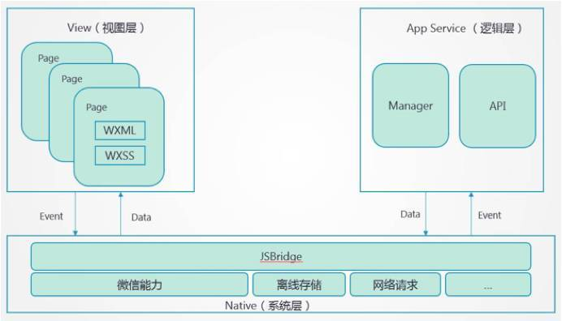
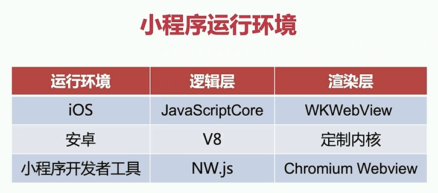

## 小程序

### 底层架构



#### 渲染层

wxml ==> js，因为需要动态渲染

wxss ==> js，处理rpx

渲染层，iframe，webview，容器，一个页面对应一个

> 调试微信开发者工具
>
> 微信开发者工具使用NW（类似electron）
>
> document.querySelectorAll('webview')[0].showDevTools(true, null) // 页面渲染时的渲染层
>
> 基于web component实现了一套组件，比如：wx-view
>
> 视图层基础库：WAWebview，提供事件监听处理，通信，

#### 逻辑层

js，

逻辑层，v8，jscore，webview，一个应用对应一个

> 调试工具输入document，会显示逻辑层，自己写的所有页面的js
>
> 基础库：WAService

两个不同的线程，不会相互阻塞，跨线程通讯




> 5个页面，1个逻辑层，5个渲染层

### 通信

### 上传编译

上线之前都编译成js，上线时发到微信服务器，用户点击应用：

准备运行环境，构建基础库（渲染层和逻辑层）

渲染层加载初始化配置的首页js，逻辑层加载应用代码

开始通信

> wxappUnpacker库：可以反编译

**渲染层基础库：**

加载基础库

> 基础库：
>
> foundation 基础模块 发布订阅 EventEmit env
>
> jsbridge（消息模块），on监听native，publish发布消息（兼容处理），invoke调用原生方法，subscribe逻辑层消息，消息订阅转发：invokeCallbackHandler，subscribeHandler
>
> exparser 组件系统，基于web component，衔接原生组件，将自定义组件的功能抛出
>
> \__VirtualDOM__，构建虚拟dom，调用组件系统进行页面渲染
>
> 
>
> 监听了generateFuncReady事件，保存generateFunc函数，判断WeixinJSBridge是否准备完毕，触发WeixinJSBridge发布消息给逻辑层，publish

加载wxmljs，wxssjs

路由改为当前组件路由，加载当前页面config合并全局config，

执行wxssjs（将style插入头部）

执行wxmljs，生成渲染器generateFunc，等待逻辑层数据到达后执行（基础库监听逻辑层）

派发事件generateFuncReady传递generateFunc

> 自定义事件，CustomEvent

**逻辑层基础库：**

> 基础库：foundation 基础模块 发布订阅 EventEmit env
>
> jsbridge（消息模块）
>
> app实例
>
> 生命周期
>
> setData，调用节流

### 事件接收

### app/page/wx

基础库提供

### setData

### 基础库

提供了以上所有东西，运行环境

可以基于虚拟dom构建视图

dom diff

> console: 
>
> help > // 查看客户端暴露出来的方法
>
> openVender() > // 打开基础库，wcc，WXML Compile，编译WXML；wcsc，WeChat Stylesheet Complier
>
> // WXML编译成js，要处理动态属性
>
> // 编译后的js是一个函数$gwx
>
> // 执行这个函数，返回一个函数（渲染器）
>
> // 继续执行（传入数据，动态构建，数据从逻辑层来），返回虚拟dom对象，会给到基础库
>
> 
>
> // WXSS编译成j
>
> // 处理适配
>
> // 处理rpx，其他都是字符串
>
> ​	// 创建style，makeup计算px替换rpx，插入
>
> 
>
> 逻辑层基础库：WAService
>
> 视图层基础库：WAWebview

## v8和Linux异步机制

### nodejs系统体系

nodejs是c/c++和js写的

nodejs不是单线程，js是单线程语言，js没有创建多线程的机制

#### 运作机制


体系结构和运作机制图

根据上图，Node.js的运行机制如下：

1. 写的JavaScript脚本会交给V8引擎解析
2. V8只负责解析，解析后的代码，调用Node API，Node会交给 [Libuv库](https://link.juejin.im/?target=https%3A%2F%2Fgithub.com%2Fjoyent%2Flibuv) 处理
3. [Libuv库](https://link.juejin.im/?target=https%3A%2F%2Fgithub.com%2Fjoyent%2Flibuv) 将不同的任务分配给不同的线程，形成一个Event Loop（事件循环），以异步的方式将任务的执行结果返回给V8引擎
4. V8引擎再将结果返回给用户 

NodeBindings就像一个交换机，V8要调用更底层的东西需要穿过NodeBindings

#### **Event Loop**

有请求时，将响应事件放到事件序列（关联了回调函数），调用更底层的东西，由工作线程线程控制（文件系统，网络，进程）调用操作系统的系统调用发送http请求（操作系统的网络调用栈），发出请求到远程服务器返回的这段时间较长，程序不会阻塞，响应回来之后，再进行回调，工作线程中有一个独立的线程，这个线程会等待响应，但是不能直接跨线程回调，要把响应数据交回给事件循环统一调度，事件循环找到事件，执行回调函数

程序执行时依赖nodejs主线程，主线程包括应用程序，V8，NodeBindings，事件队列和事件循环。事件循环和工作线程之间的调用通过线程间通信，比如消息传递，共享内存等


数据流向图（非阻塞事件驱动）

同步异步：运作机制

阻塞非阻塞：调用机制

#### nodejs结构

从代码层面


nodejs包括：

API，nodejs+库，js写的

NodeBindings，nodejs自己的核心，c/c++写的

Add-One，插件，功能性，不参与机制，c/c++写的

其他的都是别人的

### 异步IO和事件循环

本质上是调用的操作系统

#### 用户态和内核态

Linux程序执行时的用户态（自己写的代码）和内核态（调用API）

为什么要区分？保证代码执行时的安全，防止互相干扰

用户不能直接调用内核（二进制），以库的形式调用

比如输入a，b，计算a+b，保存c，会多次切换用户态和内核态

怎么从用户空间进入内和空间？系统调用

nodejs用户和内核的切换在工作线程

#### Linux的信号机制

软中断信号(signal，又简称为信号)用来通知进程发生了异步事件。进程之间可以互相通过系统调用kill发送软中断信号。 内核也可以因为内部事件而给进程发送信号，通知进程发生了某个事件。信号只是用来通知某进程发生了什么事件，并不给该进程传递任何数据。

对信号的处理方法:

1、对于需要处理的信号，进程可以指定处理函数，由该函数来处 理。

2、忽略某个信号，对该信号不做任何处理，就象未发生过一样。其中，有两个信号不能忽略:SIGKILL及SIGSTOP;

3、对该信号的处理保留系统的默认值，这种缺省操作，对大部分的信 号的缺省操作是使得进程终止。进程通过系统调 用signal来指定进程对某个信号的处理行为。

内核处理一个进程收到的信号的时机是在一个进程从内核态返回用户态时。所以，当一个进程在内核态下运行时，软中断信 号并不立即起作用，要等到将返回用户态时才处理。进程只有处理完信号才会返回用户态，进程在用户态下不会有未处理完 的信号。

可使用 linux 命令 kill -l 查看所有信号的定义

linux：unix有前31个

信号是进程间通信的唯一一个异步通信机制

进程和操作系统之间通过操作系统和其他进程，通过操作系统调用操作系统的系统调用的一种异步通信机制，唯一的异步通信机制

信号是最简单的信息载体，一个状态/动作/指令

信号只是通知不发送数据

进程一和进程二的通信：

不能直接发送数据，会混乱

进程一准备好数据放到共享内存，发信号给进程二，进程二去共享内存拿数据，这就是一种异步机制，后面的异步IO模型都用到了信号，不用主动处理，底层已经封装了

在程序内部，通过回调函数通知信号（参数）

信号由内核产生

#### linux的4种IO模型

**同步和异步**，流程上

同步：调用别人时需要等待

**阻塞和非阻塞**，操作上

属于两个维度

每一个模型都有应用场景


##### 同步阻塞IO

同步阻塞I/O模型是最常见的模型之一

用户空间的应用程序在执行系统调用 之后会被阻塞，直到系统调用完成 (数据传输完成或者出现错误)。此 时应用程序只是处于简单的等待响应状态不会消耗CPU

站在CPU的角度他是高效的。


##### 同步非阻塞

同步阻塞I/O的一种变体是效率较 低的同步非阻塞I/O。

非阻塞意味着如果I/O操作不能立即完成，则需要应用程序多次调用直到任务完成。

这可能非常低效，因为大多数时候应用程序必须忙等待或者尝试做其他事情直到数据可用。


比较低效的调用方式

调用时进入内核态，内核继续往下安排任务并且返回状态，切换到用户态

二次调用询问，还没完成，返回状态

三次调用，完成，返回结果

被分割了很多时间间隙

很少用

##### 异步阻塞

设备以非阻塞方式打开，然后应用程序阻塞 在select系统调用中，用它来监听可用的I/ O操作。

select系统调用最大的好处是可以监听多个 描述符，而且可以指定每个描述符要监听的 事件:可读事件、可写事件和发生错误事件

select系统调用的主要问题是效率不高。虽 然它是一个非常方便的异步通知模型，但不 建议将其用于高性能I/O中。

高性能场景一般使用epoll系统调用


调用阻塞api

select，操作系统提供，统一进行等待

linux将硬件操作当作文件操作，会给一个文件描述符，select帮我们维护文件描述符，同步阻塞式程序维护

select属于异步模型，内部反复询问，效率不高，并发上限是固定的，1000多个，定义在内核中不好改

##### select

select模型的关键是使用一种有序的方式，对多个套接字进行统一管 理与调度

select模型的缺点:

- 单个进程能够监视的文件描述符的数量存在最大限制，通常是 1024，当然可以更改数量，但由于select采用轮询的方式扫描 文件描述符，文件描述符数量越多，性能越差;(在linux内核 头文件中，有这样的定义:#define __FD_SETSIZE 1024)

- 内核/用户空间内存拷贝问题，select需要复制大量的句柄数据 结构，产生巨大的开销;

- select返回的是含有整个句柄的数组，应用程序需要遍历整个 数组才能发现哪些句柄发生了事件;

- select的触发方式是水平触发，应用程序如果没有完成对一个 已经就绪的文件描述符进行IO操作，那么之后每次select调用 还是会将这些文件描述符通知进程。


##### 异步非阻塞

异步非阻塞I/O模型是可以并行处理I/O的 模型

异步非阻塞I/O模型的读请求会立即返 回，表明读操作成功启动。然后应用程 序就可以在读操作完成之前做其他的事 情。当读操作完成时，内核可以通过信 号或者基于线程的回调函数来通知应用 程序读取数据。

在单个进程可以并行执行多个I/O请求是 因为CPU的处理速度要远大于I/O的处理 速度。 当一个或多个I/O请求在等待处理 时，CPU可以处理其他任务或者处理其他 已完成的I/O请求。


进行多任务

用户空间分了三段，调用非阻塞api时，主线程将工作交给其他过程在另外的线程/进程里，帮我们等待，回来之后交给主过程处理

效率高，资源消耗多

#### 事件驱动

linux内部没有提供，第三方库libuv

nginx复合式，用到了事件循环和异步非阻塞的多工作进程，一个进程里面一个循环

#### epoll模型

epoll模型的优点: 支持一个进程打开大数目的socket描述符 IO效率不随FD数目增加而线性下降 使用mmap加速内核与用户空间的消息传递

高并发解决方案

用到了多进程，没用到时间循环，每个进程都有一个连接池，不够时新开进程，还用到了分层

关键在分层上，每一层负责不同工作，比如负责连接，收到数据后向下一层传递，用到了mmap（高效率内存复制模式）

连接层

数据存储层

数据处理层

epoll 的两种工作模式:

LT(level triggered，水平触发模式)是缺省的工作方式，并且同时支持 block 和 non-block socket。在这种做法中，内核告诉你一个文件描述符是否就绪了，然后你可以对这个就绪的fd 进行IO操作。如果你不作任何操作，内核还是会继续通知你的，所以，这种模式编程出错误可 能性要小一点。比如内核通知你其中一个fd可以读数据了，你赶紧去读。你还是懒懒散散，不 去读这个数据，下一次循环的时候内核发现你还没读刚才的数据，就又通知你赶紧把刚才的 数据读了。这种机制可以比较好的保证每个数据用户都处理掉了。

ET(edge-triggered，边缘触发模式)是高速工作方式，只支持no-block socket。在这种模式 下，当描述符从未就绪变为就绪时，内核通过epoll告诉你。然后它会假设你知道文件描述符 已经就绪，并且不会再为那个文件描述符发送更多的就绪通知，等到下次有新的数据进来的 时候才会再次出发就绪事件。简而言之，就是内核通知过的事情不会再说第二遍，数据错过 没读，你自己负责。这种机制确实速度提高了，但是风险相伴而行。

#### iocp模型

windows的高效IO模型

层次不清

1:创建一个完成端口。 2:创建一个线程A。

3:A线程循环调用GetQueuedCompletionStatus()函数来得到IO操作结果，这个 函数是个阻塞函数。

4:主线程循环里调用accept等待客户端连接上来。

5:主线程里accept返回新连接建立以后，把这个新的套接字句柄用 CreateIoCompletionPort关联到完成端口，然后发出一个异步的 WSASend或者 WSARecv调用，因为是异步函数，WSASend/WSARecv会马上返回，实际的发 送或者接收数据的操作由WINDOWS系统去做。

6:主线程继续下一次循环，阻塞在accept这里等待客户端连接。 7:WINDOWS系统完成WSASend或者WSArecv的操作，把结果发到完成端口。

8:A线程里的GetQueuedCompletionStatus()马上返回，并从完成端口取得刚完 成的

9:在A线程里对这些数据进行处理(如果处理过程很耗时，需要新开线程处 理)，然后接着发

#### libuv

很多底层机制的封装，两大块，异步驱动模型和io操作，还有进程管理等

官网：http://docs.libuv.org/en/v1.x/

代码：

两大平台，unix和win，为了统一接口

libuv 是用 C 写的，因此，它具有很高的可移植性，非常适用嵌 入到像 JavaScript 和 Python 这样的高级语言中。

libuv使用异步，事件驱动的编程方式，核心是提供 i/o 的事件循 环和异步回调。

libuv的API包含有时间，非阻塞的网络，异步文件操作，子进程 等等。

当程序在等待i/o完成的时候，我们希望cpu不要被这个等待中的 程序阻塞，libuv提供的编程方式使我们开发异步程序变得简单。

### V8源码

#### 渲染引擎

渲染引擎 - 能够能够将HTML/ CSS/JavaScript文本及相应的资 源文件转换成图像结果.

渲染引擎的种类：

Tridend(IE)

Gecko(FF)

WebKit(Safari,Chrome,Andrio d浏览器)等，处于独立的进程中，现都浏览器都是多进程

#### webkit体系结构


#### JavaScript引擎与渲染引擎

渲染引擎（css解析器也能处理部分逻辑）使用JS引擎的接口来处理逻辑代码并获取结果

JS引擎通过桥接接口访问渲染引擎中的DOM及CSSOM

> js引擎处理渲染引擎逻辑时如何调取dom？
>
> 不是直接调用渲染引擎接口，会造成调用环路产生死锁
>
> 此时用到桥接接口，相当于发一个消息：
>
> js调用时发一个数据包给消息传递的框架然后发到webkit进行处理避免死锁，数据包包括事件名称（指令）和数据
>
> 渲染引擎提供桥接API


html解析和js解析在不同线程，不能同时工作

#### JavaScript引擎工作流程


V8源码，谷歌的开发者网站下载

src：编译器，解释源代码变成抽象语法树，再转成字节码（都是属于预处理，把文本形式的源码转换成更加高效的形式），解析器，处理代码执行代码，同时还需要内存管理（垃圾回收和内存分析），现在V8多了一个JIT用来提高效率，just in time，即时编译，转换成二进制代码，不依赖解析器，解析器会将频繁执行的代码会交给JIT（JIT处理全部代码还是挺久的），JIT处理成本地代码（直接跑在cpu不通过解释器，效率高）交然后给解析器一个调用方式

JIT：最早从c#和java来的，python和ruby也引入了

字节码：来源于js引擎的虚拟机化，对比java的jvm，跨平台

抽象语法树，有一条主干

#### V8 与 JavaScript Core

JavaScript Core 引擎是WebKit中默认的JavaScript引擎，也是苹果开源的一个项 目，应用较为广泛。最初，性能不是很好，从2008年开始了一系列的优化，重新实 现了编译器和字节码解释器，使得引擎的性能有较大的提升。随后内嵌缓存、基于正 则表达式的JIT、简单的JIT及字节码解释器等技术引入进来，JavaScriptCore引擎也 在不断的迭代和发展。

JavaScriptCore与V8有一些不同之处，其中最大的不同就是新增了字节码的中间表 示，并加入了多层JIT编译器(如:简单JIT编译器、DFG JIT编译器、LLVM等)优化 性能，不停的对本地代码进行优化。

v8倾向于减少资源占用

jscore倾向于增加处理层次，增加执行效率

文章：js引擎是怎样将var转换为JIT的

> 确定频繁执行的代码：两套分析模式，快粗略，慢精细，先用快的分析，保存到内存区域，统计使用频率，然后交给慢的然后转换为JIT，做一个映射替换代码

#### 源码分析

文档:https://v8.dev/docs 

源码:https://cs.chromium.org/chromium/src/v8/ 

通过源码可以学到的东西：

增强对JavaScript的理解

前端算法

内存管理与CG算法

编译原理、操作系统等知识

面试装逼的高级方式

V8 引擎源码都看什么

工作过程

数据表示

类型

内存管理 绑定机制与扩展机制 字节码与JIT

##### libuv

c语言

入口在头文件（.h）include，uv.h

先看头文件，公共的函数声明，让其他文件引入的

事件循环的实现：

queue.h

使用宏编写，可以使生成的二进制代码更加紧凑，防止过多的函数调用栈，不能断点调试

strcpy.h

复制字符串

loop.h

##### V8

heap

内存管理，基于链表实现的堆

##### node

c++

lib，js层面上实现的api

src，运行机制，核心node bindings

sample，例子，嵌入v8

shell

## WASM

webAssembly

参考：webAssembly正式成为web的第四种语言

严格来说不是一种语言，是一套标准，机制

**依赖低层基础架构的高性能应用程序**

**核心是一种虚拟指令集体系结构**（类似于虚拟机，不是直接给cpu的，跨平台），可在web上运行高性能应用程序，随着运算量的增大，运行时间可以减少一半，比js快一倍，并可在其他许多环境中使用。WebAssembly 的实现有多种，包括浏览器和独立系统。WebAssembly 可用于视频和音频编解码器，图形和 3D，多媒体和游戏，密码计算或便携式语言实现等领域。

**WebAssembly 增强 Web 性能**

WebAssembly 是虚拟机和执行环境，可以让加载的页面作为本机编译代码运行，从而提高了 Web 性能和功耗。换句话说，WebAssembly 可以实现接近本机的性能以及优化的加载时间，并且最重要的是可以为现有的代码库提供编译目标。

尽管本机类型的数量很少，但相对于 JavaScript 而言，性能的提高大部分归功于其对一致类型的使用。WebAssembly 对编译语言进行了几十倍的优化，针对其字节码的紧凑性和流传输进行了优化。在下载其余代码时，网页就可以开始执行。网络与 API 访问通过随附的 JavaScript 库进行。它的安全模型与 JavaScript 相同。

现在还没有很成熟，但也好用

**未来版本已经在开发中**

其中包括：

- 线程

线程提供了共享内存多线程和原子内存访问的诸多好处。

- **Fixed-width** SIMD

并行执行循环中的向量操作（物理，人工智能）。

- 引用类型

允许 WebAssembly 代码直接引用宿主对象。

- 尾调用

能够使用额外的栈空间去调用函数。

- ECMAScript 模块集成

通过将 WebAssembly 可执行文件加载为 ES6 模块来与 JavaScript 进行交互。

### WASM 的特点

高效

WebAssembly 有一套完整的语义，实际上 wasm 是体积小且加载快的**二进制格式**， 其目标就是充分发挥硬件能力以达到原生执行效率

> 用c写，编译完成后cpu可以直接执行，但是浏览器要跑的时候，还要进行转换，转换成虚拟容器可以执行的二进制代码

安全

WebAssembly 运行在一个**沙箱化**的执行环境中（现代浏览器也是一种沙箱，不会影响到操作系统），甚至可以在现有的 JavaScript 虚拟机中实现。在web环境中， WebAssembly将会严格遵守**同源策略以及浏览器安全策略**。

开放

WebAssembly 设计了一个非常规整的文本格式用来、调试、测试、实验、优化、学习、教学或者编写程序。可以 以这种文本格式在web页面上查看wasm模块的源码。可以反编译

标准

WebAssembly 在 web 中被设计成**无版本、特性可测试、向后兼容**的。WebAssembly 可以被 JavaScript 调用，进入 JavaScript 上下文，也可以像 Web API 一样调用浏览器的功能。当然，WebAssembly 不仅可以运行在浏览器 上，也可以运行在非web环境下。

c go rust ts等语言都可以写，都有对应的编译工具

### 执行过程对比


js性能较低，预处理阶段比较长（前三个阶段，执行之前都是预处理），GC也会影响一些

wasm：解码（load二进制文件，js是文本，处理二进制更快），编译+优化（解码出来的内容进行转化，优化），执行，无GC（wasm和js内存是分开的，wasm有独立内存区域，没有动态内存管理，手动管理，将时间平摊到运行时期）

WebAssembly版本和原生JavaScript版本的递归无优化的Fibonacci函数，下图是这两个函数在值是45、48、50的时候的性能对比。


### WASM 的工具

AssemblyScript:支持直接将 TypeScript 编译成 WebAssembly。这对于前端来 说，入门的门槛很低的。

**Emscripten**:可以说是 WebAssembly 的灵魂工具。将其他的高级语言，编译成 WebAssembly。

> Emscripten 相对复杂，需要配置
>
> https://emscripten.org/docs/getting_started/downloads.html
>
> 还需要其他语言的编译器，会调用到，c用到gcc，mac的xcode自带
>
> 参考文档：clone 克隆 emsdk，更新版本，激活，激活环境变量（一次性，关闭会话后失效，每次都要激活）
>
> 在线版
>
> https://wasdk.github.io/WasmFiddle/

WABT:将 WebAssembly在字节码和文本格式相互转换的一个工具，方便开发者去理解这个 wasm 到底是在做什么事。反编译，有点像汇编指令

WebAssembly 中文网：只供参考

http://webassembly.org.cn

w3c官网

### 运作机制

无论用什么写的最终都要用js调用的

#### jsAPI

所有的，已经固定：

方法

1.WebAssembly.validate() // 验证二进制字节码是否合法

2.WebAssembly.compile() // 把二进制代码编译成虚拟指令

3.WebAssembly.instantiate() // 代码实例化，变成一个进程

类

1.WebAssembly.Module // 导入

2.WebAssembly.Instance // 函数导出

3.WebAssembly.Memory // 创建内存，管理内存。wasm需要初始内存，没执行时将代码放进去，执行时需要的内存变大需要申请内存，一次申请一个单元（页面，一个64k）

4.WebAssembly.Table // 专门提供给js的包装，是一个映射表，连接js和wasm。要进行数据交换时，简单变量直接传参，复杂变量需要Memory参与

5.WebAssembly.CompileError // 编译期错误

6.WebAssembly.LinkError // 关联错误，错误位置

7.WebAssembly.RuntimeError // 运行时错误

123导入-12使用-34运行，数据交换-567异常

引入模块

```js
const importObject = { 
  func: {
		log: (num)=> document.write(num) 
  }
}
fetch('test.wasm')
.then(response=>response.arrayBuffer()) 
.then(types=>WebAssembly.instantiate(bytes, importObject)) 
.then(({instance}) => window.test = instance.exports.test)
```

webpack提供的wasm-loader可以使用import导入不需要123

使用 文本格式 编写 WebAssembly

文本格式 基于S-表达式

可以用于调试、学习、手写WebAssembly

文章参考：用WebAssembly在浏览器对视频进行转码 使用FFmpeg

> 视频的编码格式，怎么压缩，H.264（视频），ACC（音频）
>
> 视频的封装格式，网络传输，mp4

### 实践

xx.c

emac xx.c -o xx.js --xx.js/xx.wasm，js是给nodejs调的，js调wasm

生成的js代码很多，做了很多容错

emac xx.c -o xx.html--xx.html/xx.js/xx.wasm，js，wasm和node生成的是一样的

浏览器执行不能是本地代码，需要服务器

html中的脚本是给js准备环境的，页面上显示的类似终端的东西

编译库和程序不一样

## webpack优化

开发时优化：版本升级

构建时：prepack

从两个层面：

编译速度，loader，plugin，babel-loader换成swc-loader

文件大小

### 版本升级

4

> speed-measure-webpack-plugin 打包速度分析，包裹一下配置
>
> // 4中的很多优化插件5用不了
>
> thread-loader慎用，消耗系统资源，js线程通信，不一定会更快，大项目可以试
>
> cache：
>
> cache-loader，webpack5已经自己实现了一套cache的体系
>
> hard-source-webpack-plugin，全局缓存
>
> 5里中设置一下cache就可以
>
> terser-webpack-plugin // 并行压缩，开启压缩缓存，5可用，不如esbuild

5，编译出来比4小很多，少了很多polyfill，使用箭头函数（babel不能编译，webpack的template），有的浏览器会挂掉

内置很多loader，静态资源指定一下type就可以

#### Prepack

深层次执行代码，自己有一个代码解释器

对静态代码进行执行

webpack5模拟了一部分

> webpack为什么慢？
>
> 他是js运行到V8，要经过JIT，要转化
>
> esbuild，go写的，直接编译成bin（二进制，字节码），vite就是基于esbuild，esbuild+koa
>
> swc，rust写的，直接编译成bin，对标babel和esbuild

### 5优化

cache设置

terser-webpack-plugin // 并行压缩，开启压缩缓存，5可用，不如esbuild

esbuild-loader // 有自己的一套，可以只使用压缩工具，swc-loader对标babel-loader速度对标esbuild，迁移成本小；也可以使用esbuild+prepack替代webpack

#### 工程上的优化

构建配置设计成一个库，比如:hjs-webpack、Neutrino、webpack-blocks

抽成一个工具进行管理，比如:create-react-app, kyt, nwb

更多的快速构建工具:lerna 、brunch、 rome 、snowpack (过往Browserify、 Rollup.js、Gulp、Parcel、Microbundle)

更友好的提示错误 

friendly-errors-webpack-plugin 

webpack-build-notifier 

set-iterm2- badge && node-bash-title 标题和窗口内容修改

使用动态 polyfill

它会根据你的浏览器 UA 头，判断你是否支持某些特性，从而返回给你一个合适的polyfill。

### dist分析

## 小程序基础架构

双线程，逻辑线程（jscore或v8，执行js逻辑接收数据处理数据）和视图线程（web view或iframe，接收事件渲染页面），基于基础库，视图层基础库，组件系统，事件系统，虚拟dom，渲染；逻辑层基础库，jsbridge，page实例，app实例，setData，微信sdk

工程化，复用 --> 框架，脚手架

编译时

js运行时

1. page实例 data event 生命周期 配置
2. app实例 data event 生命周期 配置

### 多端

完全编译时框架，上线之前，自定义语法，vue - template，react - jsx都会编译成js，taro 类jsx，编译成wxml，wxss，js

分析打包出的代码，taro的createComponent，初始化，更新

运行时：

基于vue，生命周期，事件代理，数据同步，维护两个运行时

template作用1构建wxml，2构建render

重写patch，构建虚拟dom和setData

页面挂载时构建page实例

框架，mpvue，uniapp

基于react，没有模版，自定义模版，通过给的动态数据结构和一套基础模版，嵌套解析

其他和基于vue一样

remax

## 微前端

来源于微服务，微服务是独立服务，微前端是独立模块


eventBus，跨技术栈通信，xstate

微前端(Micro-Frontend)，是将微服务(Micro-Services)理念应用于前端技术后的 相关实践，使得一个前端项目能够经由多个团队独立开发以及独立部署。

### 特性

技术无关，各个开发团队都可以自行选择技术栈，不受同一项目中其它团队影响; 

代码独立，各个交付产物都可以被独立使用，避免和其它交付产物耦合;

样式隔离，各个交付产物中的样式不会污染到其它组件; 

原生支持，各个交付产物都可以自由使用浏览器原生 API，而非要求使用封装后的 API;

### 微前端核心解决问题和步骤

传统开发模式，巨石应用(Frontend Monolith)

⻚面加载 动态的分发路由

服务发现 客户端服务发现、服务端服务发现、分自注册和第三方注册。自注册不言而喻。第三方注册就是 一个保活机制，定期检查服务状态。

根据服务发现结果加载资源 

iframe是一种微前端

改造成本低，可以快速上线

不可控制
 iframe嵌入的显示区大小不容易控制，存在一定局限性。

bfcache! URL的记录完全无效，⻚面刷新不能够被记忆，刷新会 返回首⻚，iframe功能之间跳转也无效

兼容性坑 iframe的样式显示、兼容性等都具有局限性

性能开销 iframe 阻塞 onload、占用连接池、多层嵌套⻚ 面崩溃。。

### 必须要解决的问题

一个前端需要对应多个后端

提供一套应用注册机制，完成应用的无缝整合

在应用之前团队开发者要制定好使 用CSR或SSR的技术方案

构建时集成应用和应用独立发布部署

微前端具体要解决好的 10 个问题

### 微应用的注册、异步加载和生命周期管理;

微应用之间、主从之间的消息机制;

微应用之间的安全隔离措施;

微应用的框架无关、版本无关;

微应用之间、主从之间的公共依赖的库、业务逻辑(utils)以及版本怎么管理;

微应用独立调试、和主应用联调的方式，快速定位报错(发射问题);

微应用的发布流程;

微应用打包优化问题;

微应用专有云场景的出包方案;

渐进式升级:用微应用方案平滑重构老项目。


### 微前端交付产物

发布静态资源+后台路由和服务

发布组件启动时机全由父级决定

发布局部应用配置过程由自身决定

前端静态+后端

每个项目独立通过代码版本管理库独立分组、统一技术方案，合成整体技术架构。 https://micro-frontends.org/

常见的部署方式

大仓库拆分独立的模块，统一构建

大仓库通过 monorepo methodology 做成npm包，集成主项目

大仓库拆分子仓库，构建应用出独立的服务/应用

大仓库拆分多仓库，构建后集成到主应用

### mpa解决方案-yog2

2012年的技术栈

实战

新建项目yog2 init project，mpa，主站，基座

app放路由，子项目

新建子项目yog2 init app，可以直接放进主站的app，可以独立运行

fis-conf维护了namespace

有两份代码

release --dest debug，后代码自动发送到主站

再新建一个子项目

可以跨项目使用组件，修改路径即可

可以新建一个公共项目common

bigpipe让后台以chunk形式输出

lazyload管理静态资源，并发，缓存

mod模块化

page管理容器，spa，融合了单页和多页

listenerjs通讯（或者xstate，都是全局变量）

### spa解决方案

基座，systemjs解决模块，listenerjs通讯

子项目

远程组件（在别的地方使用该组件），方法一快速原型开发（vue-cli），方法二webpack的entry，方法三rollup

方法一：

vue serve 单页.vue 报错。。。

方法二：

entry，编译，主站复制文件component直接引入，两份代码，不能显示，js没有执行

使用systemjs，安装webpack-system-register，编译时包裹一下，包裹成systemjs可以使用的模块，在基座中使用systemjs引入

方法三：

rollup

安装rollup，rollup-plugin-vue@next，rollup-plugin-css-only，编译出来比较纯净

缺点：还是单页

维护映射表

#### 乾坤

核心是自己实现了一套沙盒机制

子项目修改较复杂，侵入性较强

破坏html结构规范

### 基于web components

custom elements

HTML imports，废弃

HTML template，存放暂时不需要渲染的HTML

shadow dom

### 基于webpack5

#### 联邦模块

csr

使用lerna管理项目

lerna init

参考demo代码

#### 原理


```js
import('aa.js') // chunk，异步，可以then
import 'aa.js' // 直接引入到当前文件
```

4，index.js - a.js - b.js --> main.js - 0.js - 1.js     index.js - b.js --> main.js - 0.js

5，index.js - a.js - b.js --> main.js - src_a_js.js - src_b_js.js，上线环境main.js - md5.js

模块固定：trunkIds和moduleIds配置，4中需要在注释中写webpackChunkName

4

```js
异步模块
window["webpackJsonp"]中push数组
[['filename'], {'/.src/data.js': function(){}}]
不能共享出去，模块名是0，同名会使顺序错乱，依赖关系紊乱

// 总结
// 异步a.js
// e，load文件，创建script，src为这个文件
// 返回状态，成功后放入modules
```

5

```js
异步模块
self['webpackChunkProjectName']，为联邦模块做的一些准备
main：
// 找到对应模块，返回promise
.e('./src/data.js')
// 重新二次bind
.then(__webpack_require__.bind(__webpack_require__, './src/data.js'))
.then((_) => {...})
// 模块缓存
// 加载模块
// polyfill
// __webpack_require__.e加载异步chunk专用
// __webpack_require__.f遍历所有异步模块，最后执行
// 加载异步模块
// 重写push
// 判断超时和出错，4判断状态

// 总结和4类似
// timeout不太一样，之前是回调，现在bind一个函数
```

### 沙箱环境

## SOLID和AOP

面向对象（传统方式动态的引⼊需要的类） -- 工厂模式（业务层不需要关注实例到底怎么生成的） -- 面向切面（不用再写⼯厂类， 直接从IOC容器中创建好的实例例取）

oop是静态的抽象 aop是动态的抽象

SOLID (单一功能、开闭原则、⾥氏替换、接口隔离以及依赖反转)指代了面向对象编程和面向对象设计的五个基本原则。开发容易进行软件维护和扩展的系统，被典型的应⽤用在测试驱动开发上，并且是敏捷开发以及自适应软件开发的基本原则的重要组成部分。

**单⼀功能原则** 

认为**对象应该仅具有一种单一功能**的概念。 换句话说就是让⼀个类只做一种类型责任，当这个类需要承担其他类型的责任的时候，就需要分解这个类。单一责任原则可以看作是低耦合、高内聚在面向对象原则上的引申，将责任定义为引起变化的原因，以提⾼内聚性来减少引起变化的原因。责任过多，可能引起它变化的原因就越多，这将导致责任依赖，相互之间就产⽣生影响， 从⽽极⼤大的损伤其内聚性和耦合度。单一责任，通常意味着单⼀的功能，因此不要为⼀个模块实现过多的功能点，以保证实体只有一个引起它变化的原因。

**开闭原则(ocp)** 

认为“软件体应该是对于扩展开放的，但是对于修改封闭的”的概念。 **软件实体应该是可扩展⽽不可修改的。也就是说你可以新增功能但不不能去修改源码**。可以使用变化和不变来说明:封装不变部分，开放变化部分，一般使⽤**接口继承实现**⽅式来实现“开放”应对变化。

抽象类

**⾥氏替换原则**

认为“**程序中的对象应该是可以在不改变程序正确性的前提下被它的子类所替换的**” 的概念，即:子类应该可以替换任何基类能够出现的地方，并且经过替换以后，代码还能正常⼯工作。另外，不应该在代码中出现if/else之类对子类型进行判断的条件。⾥氏替换原则LSP是使代码符合开闭原则的⼀一个重要保证。正是由于⼦类型的可替换性才使得父类型的模块在无需修改的情况下就可以扩展。 在很多情况下，在设计初期我们类之间的关系不不是很明确，LSP则给了了我们⼀个判断和设计类之间关系的基准: 需不不需要继承，以及怎样设计继承关系。 当⼀个⼦类的实例应该能够替换任何其超类的实例时，它们之间才具有is-A关系。继承对于OCP，就相当于多态性对于⾥氏替换原则。子类可以代替基类，客户使用基类，他们不需要知道派生类所做的事情。这是⼀个针对行为职责可替代的原则，如果S是T的子类型，那么S对象就应该在不改变任何抽象属性情况下替换所有T对象。

**接口隔离原则**

认为“多个特定客户端接⼝要好于一个宽泛⽤用途的接口”的概念。 不能强迫用户去依赖那些他们不使用的接⼝。换句句话说，使用多个专⻔的接⼝⽐使用单一的总接⼝总要好**(JavaScript** ⼏乎没有接⼝口的概念所以使用**ts)**。注意:在代码中应⽤用ISP并不一定意味着服务就是绝对安全的。仍然需要采⽤良好的编码实践，以确保正确的验证与授权。 这个原则起源于施乐公司，他们需要建立一个新的打印机系统，可以执⾏多种任务。此系统软件创建从底层开始编制，并实现了这些任务功能，但是不断增⻓的软件功能却使软件本身越来越难适应变化和维护。每⼀次改变，即使是最⼩的变化，有⼈可能需要近 一个小时的重新编译和重新部署。所以他们聘请罗伯特Robert帮助他们。他们首先设计了一个主要类Job,几乎能够⽤用于实现所有任务功能。只要调⽤用Job类的一个方法 就可以实现⼀个功能，Job类就变动⾮常⼤，是一个胖模型，对于客户端如果只需要一个打印功能，但是其他⽆关打印的⽅法功能也和其耦合，ISP 原则建议在客户端和Job类之间增加一个接⼝层，对于不同功能有不同接口，⽐如打印功能就是Print接口，然后将大的Job类切分为继承不同接口的⼦类，这样有一个Print Job类，等等。

**依赖倒置原则(Dependency Inversion Principle，DIP)**

规定:代码应当取决于抽象概念，⽽不是具体实现。
高层模块不应该依赖于低层模块，⼆者都应该依赖于抽象抽象不应该依赖于细节，细节应该依赖于抽象 **(**总结解耦**)** 。

类可能依赖于其他类来执行其工作。但是，它们不应当依赖于该类的特定具体实现，而应当是它的抽象。这个原则实在是太重要了了，社会的分⼯化，标准化都 是这个设计原则的体现。 显然，这一概念会⼤大提高系统的灵活性。如果类只关心它们⽤用于支持特定契约⽽不不是特定类型的组件，就可以快速⽽而轻松地修改这些低级服务的功能，同时最⼤限度地降低对系统其余部分的影响。

依赖注⼊

当某个⻆色要另⼀个⻆色协助时，通常由调用者来创建被调⽤者的实例。现在创建实例由容器来完成注入调⽤者			 		 		 	

注入过程

如果需要调⽤用另⼀一个对象协助时，⽆须在代码中创建被调⽤者，而是依赖外部的注入

两种⽅式

设值注入，构造注入

### IOC

控制反转

控制反转(Inversion of Control，缩写为IoC)，是⾯向对象编程中的 ⼀种设计原则，可以用来减低计算机代码之间的耦合度。其中最常⻅的⽅式叫做**依赖注⼊**(Dependency Injection，简称DI)，还有⼀种⽅式叫**“依赖查找”**(Dependency Lookup)。通过控制反转，对象在被创建的时候，由⼀个调控系统内所有对象的外界实体，将其所依赖的对象的引用传递给它。也可以说，依赖被注⼊到对象中。

依赖查找DL: 容器提供回调接口
和上下文条件给组件。

> IoC容器，它就是一个创建工厂，你要什么对象，它就给你什么对象，有了IoC容器，依赖关系就变了，
>
> 原先的依赖关系就没了，它们都依赖IoC容器了，通过IoC容器来建立它们之间的关系。

依赖注入DI: 组件不做定位查询，只提供普通的方法让容器去决定依赖关系。


### AOP

在计算领域，面向方面的编程 (AOP) 是一种编程范式，旨在通过允许分离横切关注点来增加模块化。它通过向现有代码添加额外行为（建议）而不修改代码本身来实现这一点，而是通过“切入点”规范单独指定修改了哪些代码，例如“当函数名称以‘set’开头时记录所有函数调用”。这允许将不属于业务逻辑核心的行为（例如日志记录）添加到程序中，而不会将代码核心与功能混淆。

在软件业，AOP为Aspect Oriented Programming 的缩写，意为:面向切面编程，通过预编译⽅式和运行期动态代理实现程序功能的统一维护的一种技术。AOP是OOP的补充和延续，也是Spring框架中的一个重要内容，是函数式编程的一种衍⽣范型。利用AOP可以对业务逻辑的各个部分进行隔离，从而使得业务逻辑各部分之间的耦合度降低，提高程序的可重用性，同时提高了开发的效率。

⾯向对象编程将程序分解成各个层次的对象，面向切⾯编程将程序运行过程分解成各个切面。

Filter(过滤器)也是一种AOP它利⽤⼀种称为"横切"的技术，剖解开封装的对象内部，**并将那些影响了多个类的公共行为封装到⼀个可重用模块，并将其命名为 "Aspect"，即切面**。

AOP的好处就是你只需要干你的正事，其它事情别人帮你干。在你访问数据库之前，自动帮你开启事务，当你访问数据库结束之后，自动帮你提交/回滚事务!

比如：考察业务模型可以发现，`BookService`关心的是自身的核心逻辑，但整个系统还要求关注安全检查、日志、事务等功能，这些功能实际上“横跨”多个业务方法，为了实现这些功能，不得不在每个业务方法上重复编写代码。面向切面可以理解成把权限检查视作一种切面（Aspect），把日志、事务也视为切面，然后，以某种自动化的方式，把切面织入到核心逻辑中，从而实现解耦。

IOC，DI的关系：IOC是目的，DI是技术手段

### inversify实践

00:32:27

node的IOC框架

使用provide将类送到容器里，service类，provide直接执行

controller类封装provideThrowable（fluentProvide(identifier).whenTargetNamed(name).done();）指定激活时机，使用inversify-koa-utils封装好的controller，interface等自动注册路由

在app中让所有的provide生效，注到容器中，

### 实现ioc

01:15

使用元编程reflect-metadata

## 数据结构与算法

### 数据结构

数据结构，用计算机来存储、组织数据的方式

算法，流程

数据，统称

数据对象，更细的划分

数据元素，比如数组中的每一位，数据结构的基本单位

数据项，数据元素中的某个属性，最小单位

数据结构，研究的就是数据元素和数据元素之间的关系


数据元素相互之间的关系称为结构。数据结构是与算法紧密结合的。 

逻辑结构: 反映数据元素之间的逻辑关系，和计算机无关。 **线性结构，数结构**，图，集合

存储结构: 数据结构在计算机中的表示，逻辑结构在计算机里的实现。链表，顺序（数组，连续的），索引（key-value，复合型结构），散列

算法: 对数据的操作


内存与存储结构

1、内存的原理与构造。 

内存本质就是个大数组

2、地址、指针与引用。 

地址类似下标

想要找一个随机地址需要指针

引用是指针的封装，因为指针要手动计算偏移量，容易出错

3、存储结构与内存管理

#### 集合

无序，不重复，无关联

#### 线性表

线性结构中的数据元素之间是一对一的关系。也就是数据元素一个接一个地排列，连续

用来存放特定的某一个类型的元素

物理结构为顺序表（数组）和链表

**衍生结构**：栈，队列，串，流

##### 串

数组存放的元素以一个字节/字符为单位，比如字符串，有自己的操作：求子串，子串出现次数等，只要是数组中某几个连续元素，并且是简单类型就归位串

##### 流

一般都被封装好了，类似水龙头，数据只能操作一次，只能将它放到缓冲区，再进行二次操作

##### 栈

栈是一种被限制操作的线性表，只能操作一个端，栈顶

LIFO(Last In First Out) 

用途：

函数调用栈

解决括号匹配检查

浏览器的后退或编辑器的undo功能

##### 队列

队列是一种被限制操作的线性表，只能操作两个端

 FIFO(First In First Out) 

用途：

消息队列、游戏，视频弹幕

维护打印机任务

衍生：优先队列（消息队列）

#### 树

树是由若干个有限节点组成的一个具有层次关系的集合

数学基础是:图论

一棵树中每两个点之间都有且只有一条路径

一颗有N个点的树有N-1条边


**遍历**

按照某种规则，不重复地访问某种树的所有节点。

树是自相似的结构，可以递归

先序遍历(深度优先) 根左右

中序遍历(深度优先) 左根右

后序遍历(深度优先) 左右根

层序遍历(广度优先)


树的衍生

无序树:树中任意节点的子结点之间没有顺序关系，这种树称为无序树，也称为自由树 

有序树:树中任意节点的子结点之间有顺序关系 

二叉树:每个节点最多含有两个子树的树称为二叉树 

完全二叉树:除了最后一层，其它各层节点数都达到最大 

满二叉树:每一层上的结点数都是最大结点数 

霍夫曼树:带权路径最短的二叉树，也叫最优二叉树，用在压缩

树的用途，一般用在搜索，搜索二叉树，使用二分法，要先生成树

#### 图

由顶点的集合(不能是空集)和边的集合组成的结构，表现的是多对多的关系 

数学基础是:图论

几个基本概念:

顶点

边

权

有向图与无向图

应用领域：流体力学，神经网络

### 算法

算法是完成某个特定任务的过程。通常数据结构作为工具来辅助之行算法。所以有了一个 流传甚广的公式:程序 = 数据结构+算法。

算法不是数学，但是可以用数学来描述

我们要做一件事情，这个过程本身就是算法

我们最常用的增删改查是算法的一部分

算法可以用自然语言、流程图、伪代码和计算机语言等手段来表示

在面向对象语言中，算法通常通过类的方法实现

基本算法：排序+查找

推荐算法

贪心算法

**算法的五大特征**

有穷性：算法必须能在执行有限个步骤之后终止

确切性：每一步骤必须有确切的定义，不能有歧义

输入项：有0个或多个输入，用来规定初始情况，所谓0个输入是指算法本身定出了 初始条件

输出项：有一个或多个输出，是对输入数据处理后的结果。没有输出的算法毫无意义

可行性：算法中执行的任何计算步骤都是可以被分解为基本的可执行的操作步，每个计算步都可以在有限时间内完成(也称之为有效性)。

**怎样衡量算法的好坏**

算法的好坏主要通过算法复杂度来衡量

- 时间复杂度，输入数据规模和操作步骤次数增长的关系

- 空间复杂度，额外空间

正确性

可读性，可维护

健壮性，容错能力

**常见的复杂度**


常见的常数阶，比如map查找，是常见的空间换时间

对数阶，比如二分

立方阶，树的完全比较，dom diff没有完全比较，剪枝优化

动态规划本质是穷举

**计算算法复杂度**

随着问题规模 n 的不断增大，时间复杂度不断增大，算法的执行效率越低。

一般做算法复杂度分析的时候，遵循下面的技巧: 

有几重循环，一般来说一重就是O(n)，两重就是 O(n^2)，以此类推

如果有二分，则为O(logN)

保留最高项，去除常数项

循环套二分循环，线性对数阶

#### 枚举算法

核心思想:枚举所有的可能。 

本质:就是从所有候选答案中去搜索正确的解,使用该算法需要满足两个条件

(1)可预先确定候选答案的数量;

(2)候选答案的范围在求解之前必须有一个确定的集合。 

特点:

枚举算法简单粗暴，暴力的枚举所有可能，尽可能地尝试所有的方法。

速度可能很慢，却是我们最应该优先考虑的。

实现最简单，并且得到的结果总是正确的。

#### 递归算法

核心思想:通过重复将问题分解为同类的子问题而解决问题的方法。 

特点:

函数可以通过调用自身来进行递归

递归可以完全取代循环

递归由下面两部分组成:

(1)递归主体，就是要循环解决问题的代码 

(2)递归的跳出条件，递归不能一直递归下去，需要完成一定条件后跳出

防止爆栈和死循环

循环和递归可以互相转换

#### 排序算法


稳定性，相等的元素的排序结果和输入的数据顺序一致

#### 查找算法 


#### 算法思维

养成算法思维是一个长期的过程，要时刻问自己几个问题: 

结果是什么?

步骤是什么?

判断结果的标准是什么?

**化繁为简**

很难在第一时间内得到正确的思路的，这时候可以尝试一种由简至繁的思路。首先把问题规模缩小到非常容易解答 的地步。用来解决动态规划问题

**分而治之**

把问题分为两半，变成两个与原来问题同构的问题 当尝试这种思路时，其实只需要考虑两个问题: 

1.一分为二以后，问题是否被简化了? 

2.根据一分为二的两个问题的解，能否方便地得出整个问题的解?

**化虚为实**

使用另外一种形式进行替换

面试的时候，在遇见算法题目的时候，应该揣摩面试官的意图，听好关键词，比如:有序的数列 做查找、要求算法复杂度是O(logN)这类一般就是用二分的思想。

算法题目的解题思路分以下四步: 

1.先降低数量级，拿可以计算出来的情况(数据)来构思解题步骤

2.根据解题步骤编写程序，优先将特殊情况做好判断处理，比如一个大数组的问题，如果数组为两个数长度的情况

3.检验程序正确性 

4.是否可以优化(由浅到深)，有能力的话可以故意预留优化点，这样可以体现个人技术能力

### 刷题

按类型进行针对性训练

#### 计算机原理

位运算，效率高，尤其是底层，使用频繁较高

一个字节8位

左移n位 num*2^n <<

右移>>

子网掩码：子网，与ip做与运算，&，255.255.255.0/24，分左右，左边全是1，右边全是0

#### 双指针

用在数组或链表

**快慢指针**，主要用于链表，比如链表是否包含环

链表默认单链表

从同一个方向开始遍历，只要快指针和慢指针重合就存在环

已知有环，找起始位置：先快慢，直到重合，将一个指针移到开头，然后同速移动，再重合时就是起点

寻找链表中点：快指针走两步，慢指针走一步

寻找倒数第k个：快指针先走k步

**左右指针**，主要用于数组，比如二分查找

判断是否回文

二分查找

有序数组，两数相加等于目标数，按顺序返回下标，下标从1开始：只要数组有序，就应该想到双指针技巧。这道题的解法有点类似二分查找，通过内外循环，外循环n，计算target-left，内循环二分查找差值

反转数组

滑动窗口算法：

也叫尺取法，可以用来解决一些查找满足一定条件的连续区间的性质(⻓度等)的问题。 由于区间连续，因此当区间发生变化时，可以通过旧有的计算结果对搜索空间进行剪枝，这样便减少了重复计算，降低了时间复杂度。往往类似于“请找到满足xx的最x的区间(子串、子数组)的xx”这类问题 都可以使用该方法进行解决。

分固定长度窗口和不固定长度

Leetcode 3. 无重复字符的最⻓子串

LeetCode 76. 最小覆盖子串

Leetcode 209. ⻓度最小的子数组

Leetcode 1004. 最大连续1的个数 III

#### 递归

#### 广度优先与深度优先

#### 算法范式

##### 暴力破解法

暴力破解法简单直接，根据问题声明的定义，找到所有可变化的因子(Divisor)，穷举所有可能解决题的方法，逐个尝试。

所以，根据暴力破解法的定义，理论上讲任何问题都可以使用暴力破解法来解决，只是在实际应用中算 法对时间和空间的需求则无法满足。

将暴力破解法应用于数据查找，由于查找比较次数与给定目标的规模直接相关，所以也称为线性查找 (Linear Search)。

线性查找有很多典型应用:

选择排序(Selection Sort)

冒泡排序(Bubble Sort)

顺序查找(Sequential Search)

暴力字符串匹配(Naive String Match)

大规模的穷举需要做剪枝

##### 分治法

分治法(Divide-and-Conquer)，即 "分而治之"，是将原问题划分成 n 个规模较小而结构与原问题相似的子问题，递归地解决这些问题，然后再合并其结果，以得到原问题的解。

当我们遇到一个大问题时，总是习惯把问题的规模变小，这样便于分析讨论。这些规模变小后的问题和 原来的问题是同质的，除了规模变小，其它的都是一样的，本质上它还是同一个问题，规模变小后的问 题其实是原问题的子问题。

分治模式在每一层上都有三个步骤:

1. 分解(Divide):将原问题分解成一系列与原问题同质的子问题;
2. 解决(Conquer):递归地解决各个子问题。若子问题足够小，则直接求解; 
3. 合并(Combine):将子问题的结果合并成原问题的解。

分治法所能解决的问题一般具有以下几个特征:

1. 可以将问题分解为若干个规模较小的相同问题;
2. 问题的规模缩小到一定程度后就可以很容易地解决;
3. 问题分解出的子问题的解可以合并为该问题的解;
4. 问题所分解出的各个子问题是相互独立的，即子问题之间不再包含公共的孙问题。

符合 1,2,3 条特征是使用分治法的关键，而特征 4 将涉及到分治法的效率问题。而如果不符合 3,4 特征 的问题可以尝试考虑使用动态规划或贪心算法来解决。

分治法的典型应用:

合并排序(Merge Sort)

快速排序(Quick Sort)

二分查找(Binary Search)

##### 动态规划DP

动态规划的过程可以描述为多阶段最优化解决问题的过程，每一次的决策依赖于当前的状态，随即又引起状态的转移，以此类推在变化的状态中产生出决策序列。

动态规划算法通常基于一个**递推公式**及一个或多个**初始状态**，当前子问题的解将由上一次子问题的解推出。使用动态规划来解题通常只需要多项式时间复杂度，所以会比回溯法、暴力法等要快许多。

动态规划方法中的关键词包括:阶段(Stage)、状态(State)、决策(Decision)、递推关系 (Recurrent Relation)。

动态规划首先将待求解的问题分解为若干个子问题(阶段)，按顺序求解子问题。前一子问题的解为后 一子问题的求解提供了有用的信息。在求解任一子问题时，列出各种可能的局部解，通过决策保留那些 有可能达到最优的局部解，丢弃其他局部解。以此类推解决各子问题，最后一个子问题的解就是初始问 题的解。

动态规划与分治法最大的差别是:适合于用动态规划法求解的问题，经分解后得到的子问题往往不是互 相独立的(即下一个子问题的求解是建立在上一个子问题的解的基础上，进行进一步的求解)。

动态规划所能解决的问题一般具有以下几个特征:

1. 最优化原理(Mathematical Optimization):如果问题的最优解所包含的子问题的解也是最优 的，就称该问题具有最优子结构(Optimal Substructure)，即满足最优化原理。
2. 无后效性:即某阶段状态一旦确定，就不受这个状态以后决策的影响。也就是说，某状态以后的过 程不会影响以前的状态，只与当前状态有关。
3. 有重叠子问题(Overlapping Subproblems):即子问题之间是不独立的，一个子问题在下一阶 段决策中可能被多次使用到。

特征 3 并不是动态规划适用的必要条件，但是如果没有这条性质，动态规划算法同其他算法相比就不具 备优势。

动态规划的基本步骤:

1. 划分阶段:按照问题的时间或空间特征，把问题分为若干个阶段。注意划分后的阶段一定要是有序 的或者是可排序的，否则问题就无法求解。
2. 确定状态和状态变量:将问题发展到各个阶段时所处于的各种客观情况用不同的状态表示出来。状 态的选择要满足无后效性。
3. 确定决策并写出状态转移方程:因为决策和状态转移有着天然的联系，状态转移就是根据上一阶段 的状态和决策来导出本阶段的状态。所以如果确定了决策，状态转移方程也就可写出。但事实上常 常是反过来做，根据相邻两个阶段的状态之间的关系来确定决策方法和状态转移方程。
4. 寻找边界条件:给出的状态转移方程是一个递推式，需要一个递推的终止条件或边界条件。

和贪心法都是解决运筹学方面的问题，运筹学就是该怎么分步解决问题，使效益最大化

必定求出全剧最优

https://hawstein.com/2013/03/26/dp-novice-to-advanced/

题目1：

如果我们有面值为1元、3元和5元的硬币若干枚，如何用最少的硬币凑够11元？

分析：

我们用d(i)=j来表示凑够i元最少需要j个硬币。于是我们已经得到了d(0)=0， 表示凑够0元最小需要0个硬币。当i=1时，只有面值为1元的硬币可用， 因此我们拿起一个面值为1的硬币，接下来只需要凑够0元即可。所以，d(1)=d(1-1)+1=d(0)+1=0+1=1。当i=2时， 仍然只有面值为1的硬币可用，于是我拿起一个面值为1的硬币， 接下来我只需要再凑够2-1=1元即可。 所以d(2)=d(2-1)+1=d(1)+1=1+1=2。当i=3时，我们能用的硬币就有两种了：1元的和3元的既然能用的硬币有两种，我就有两种方案。如果我拿了一个1元的硬币，我的目标就变为了： 凑够3-1=2元需要的最少硬币数量。即d(3)=d(3-1)+1=d(2)+1=2+1=3。 这个方案说的是，我拿3个1元的硬币；第二种方案是我拿起一个3元的硬币， 我的目标就变成：凑够3-3=0元需要的最少硬币数量。即d(3)=d(3-3)+1=d(0)+1=0+1=1. 这个方案说的是，我拿1个3元的硬币。要用最少的硬币数量来凑够3元，所以， 选择d(3)=1，怎么来的呢？具体是这样得到的：d(3)=min{d(3-1)+1, d(3-3)+1}。

d(i)表示凑够i元需要的最少硬币数量，我们将它定义为该问题的”状态”，按照上面的规律可以得到状态转移方程：d(i)=min{ d(i-vj)+1 }，其中i-vj >=0，vj表示第j个硬币的面值

代码如下：

```js
function min(arr) {
  let min = arr[0]
  for(let i = 1; i < arr.length ; i++) {
    if(arr[i] < min) min = arr[i]
  }
  return min
}
const jarr = [1 ,3 ,5]
// 递归，爆栈
// function dp(n) {
// 	if (n <= 0) return 0
//   const	arr = []
//   for(j of jarr) {
//     const res = dp(n - j)+1
//     arr.push(res)
//   }
// 	return min(arr)
// }

// 改为循环
function dp(n) {
  const	map = new Map()
  map.set(0, 0)
  for(let i = 1; i <= n; i++) {
  	const	arr = []
    for(j of jarr) {
      const last = map.get(i - j)
      const res = last + 1
      arr.push(res)
    }
  	map.set(i, min(arr))
  }
	return map.get(n)
}
```

题目2：

一个序列有N个数：A[1],A[2],…,A[N]，求出最长非降子序列的长度。 (讲DP基本都会讲到的一个问题LIS：longest increasing subsequence)

如果我们要求的这N个数的序列是：

```
1 5，3，4，8，6，7 
```

根据上面找到的状态，我们可以得到：（下文的最长非降子序列都用LIS表示）

- 前1个数的LIS长度d(1)=1(序列：5)
- 前2个数的LIS长度d(2)=1(序列：3；3前面没有比3小的)
- 前3个数的LIS长度d(3)=2(序列：3，4；4前面有个比它小的3，所以d(3)=d(2)+1)
- 前4个数的LIS长度d(4)=3(序列：3，4，8；8前面比它小的有3个数，所以 d(4)=max{d(1),d(2),d(3)}+1=3)

OK，分析到这，我觉得状态转移方程已经很明显了，如果我们已经求出了d(1)到d(i-1)， 那么d(i)可以用下面的状态转移方程得到：

`d(i) = max{1, d(j)+1},其中j<i,A[j]<=A[i]`

##### 贪心算法

所谓贪心算法是指，在对问题求解时，总是做出在当前看来最好的选择。也就是说，不从整体最优上加以考虑，它所做出的仅是在某种意义上的局部最优解。

贪心算法没有固定的算法框架，算法设计的关键是贪心策略的选择。贪心策略适用的前提是:局部最优 策略能导致产生全局最优解。所以实际上，贪心算法适用的情况很少。

贪心算法不是对所有问题都能得到整体最优解，选择的贪心策略必须具备无后效性，即某个状态以后的 过程不会影响以前的状态，只与当前状态有关。所以对所采用的贪心策略一定要仔细分析其是否满足无 后效性。

贪心算法的基本思路:

1. 建立数学模型来描述问题。
2. 把求解的问题分成若干个子问题。
3. 对每一子问题求解，得到子问题的局部最优解。 4. 把子问题的解局部最优解合成原来问题的一个解。

只能求出局部最优解

##### 回溯法

本质是暴力法

回溯法描述了一种选优搜索过程，按选优条件向前搜索，以达到目标。但当探索到某一步时，发现原先 的选择并不优或达不到目标，就**退回一步重新选择**，这种走不通就退回再走的方法称为回溯法，而满足 回溯条件的某个状态的点称为 "回溯点"。

回溯法可以理解为隐式的深度优先搜索算法。其在包含问题的所有解的解空间树中，按照深度优先搜索 的策略，从根节点出发深度探索解空间树。当探索到某一节点时，要先判断该节点是否包含问题的解， 如果包含，就从该节点出发继续探索下去，如果该节点不包含问题的解，则逐层向其祖先节点回溯。

许多复杂的，规模较大的问题都可以使用回溯法，有 "通用解题方法" 的美称。 回溯法的一般步骤:

1. 针对给定问题，确定问题的解空间，问题的解空间应至少包含问题的一个(最优)解; 

2. 确定节点的扩展搜索规则;
3. 以深度优先方式搜索解空间，并在搜索过程中用剪枝函数避免无效搜索;

八皇后问题

##### 分支限界法

对回溯法的剪枝，用到决策树思想/搜索树

类似于回溯法，分支限界法也是一种在问题的解空间树上搜索问题解的算法。但在一般情况下，分支限 界法与回溯法的求解目标不同。回溯法的求解目标是找出树中满足约束条件的所有解，而分支限界法的 求解目标则是找出满足约束条件的一个解，或是在满足约束条件的解中找出使某一目标函数值达到极大 或极小的解，即在某种意义下的最优解。

所谓 "分支" 就是采用广度优先搜索算法，依次搜索节点的所有分支，抛弃不满足约束条件的节点，然后 从余下的节点中选择一个节点作为下一个搜索节点继续搜索。

由于求解目标不同，导致分支限界法与回溯法在解空间树上的搜索方式也不相同。回溯法以深度优先的 方式搜索解空间树，而分支限界法则以广度优先或以最小耗费优先的方式搜索解空间树。

分支限界法的搜索策略是:在扩展节点处，先生成其所有的儿子节点(分支)，然后再从当前的活节点 表中选择下一个扩展节点。为了有效地选择下一扩展节点，以加速搜索的进程，在每一活节点处，计算 一个函数值(限界)，并根据这些已计算出的函数值，从当前活节点表中选择一个最有利的节点作为扩 展节点，使搜索朝着解空间树上有最优解的分支推进，以便尽快地找出一个最优解。

#### 刷题步骤

思路

实现

优化

题解

总结，卡在哪一步，针对练习

复盘，分析各种解决方案的优缺点

按照频率和重要性：

数组，难度，前三个必写，同一类型可总结思路

**高频题：字符串，排序，二分查找，二叉树，链表，双指针，哈希表**

次高频：动态规划，字典树，并查集，难度比较高

leedcode2：两数相加

给你两个 非空 的链表，表示两个非负的整数。它们每位数字都是按照 逆序 的方式存储的，并且每个节点只能存储 一位 数字。

请你将两个数相加，并以相同形式返回一个表示和的链表。

你可以假设除了数字 0 之外，这两个数都不会以 0 开头。

> 注意位数不等的情况
>
> 等速双指针指向两个链表头部
>
> 相加，标记进位plus，个位存入新链表，进位时生成后继节点
>
> 移动指针，检查进位标记，相加，进位再加1，重置进位标记
>
> ...

```js
const addTwoNumbers = function(l1, l2) {
  // 数组
  let plus = 0
  let i = 0
  const result = []
  while(l1[i] || l2[i] || plus) {
    const a = l1[i] || 0
    const b = l2[i] || 0
    let temp = a + b + plus
    plus = temp >= 10 ? 1 : 0
    result[i] = temp % 10
    i++
  }
  return result
  
  // 链表
  // // 创建临时的链表
  // let resNode = new ListNode(0);
  // // 记录好相关的临时链表信息
  // let res = resNode;
  // // 记录是否进行进位运算
  // let flag = 0;
  // //当l1不为空或l2不为空或不需要进位时
  // while(l1 || l2 || flag) {
  //     // 记录其相关的值
  //     let val1 = l1?l1.val:0;
  //     let val2 = l2?l2.val:0;
  //     let sum = val1 + val2 + flag;
  //     //判断是否需要进位
  //     flag = sum >= 10 ? 1 : 0;
  //     //链表所存储的元素只能为余数
  //     sum = sum % 10;
  //     //当相关的链表不为空时，则链表一次向下遍历
  //     if(l1) {
  //         l1 = l1.next;
  //     }
  //     if(l2) {
  //         l2 = l2.next;
  //     }
  //     //向临时创建的链表追加元素
  //     resNode.next = new ListNode(sum);
  //     resNode = resNode.next;
  // }
  // console.log(res)
    // return res.next;
}
const l1 = [9,9,9,9,9,9,9]
const l2 = [9,9,9,9]
addTwoNumbers(l1, l2)
```

leedcode4：寻找两个正序数组的中位数

给定两个大小分别为 `m` 和 `n` 的正序（从小到大）数组 `nums1` 和 `nums2`。请你找出并返回这两个正序数组的 **中位数** 。

> 合并排序：
>
> 不等速双指针，判断较小元素，放入新数组，该指针向后移动
>
> 优化：
>
> 分别二分，找到对应的另一个数组的最接近位置，确定区间，重复之前的动作

```js

```

leedcode21：合并2个有序链表

将两个升序链表合并为一个新的 **升序** 链表并返回。新链表是通过**拼接**给定的两个链表的所有节点组成的。 

> 双指针，比较首节点，断开较小的首节点，形成新链表，指针重新指向首节点，都指向空时结束
>
> 注意边界处理，指向空时停止操作

```js

```

leedcode23：合并k个升序链表

给你一个链表数组，每个链表都已经按升序排列。

请你将所有链表合并到一个升序链表中，返回合并后的链表。

> 暴力法：
>
> 不断寻找数组中的最小首节点，断开首节点，重新指向下一个节点
>
> 优化：归并查找/分治合并（两两合并）/优先队列合并（空间高）

```js

```

leedcode28：实现strStr()

给你两个字符串 haystack 和 needle ，请你在 haystack 字符串中找出 needle 字符串出现的第一个位置（下标从 0 开始）。如果不存在，则返回  -1 。

> 滑动窗口+双指针（暴力算法）：
>
> 判断指针与字串第一位是否相等，记住第一个字母相等的位置，移动第二个指针，没有匹配时重置第二个指针，第一个指针向后移动

```js

```

leedcode33：搜索旋转排序数组

整数数组 nums 按升序排列，数组中的值 互不相同 。

在传递给函数之前，nums 在预先未知的某个下标 k（0 <= k < nums.length）上进行了 旋转，使数组变为 [nums[k], nums[k+1], ..., nums[n-1], nums[0], nums[1], ..., nums[k-1]]（下标 从 0 开始 计数）。例如， [0,1,2,4,5,6,7] 在下标 3 处经旋转后可能变为 [4,5,6,7,0,1,2] 。

给你 旋转后 的数组 nums 和一个整数 target ，如果 nums 中存在这个目标值 target ，则返回它的下标，否则返回 -1 。

> 找到旋转点，找到指定数组，在数组中二分查找

leedcode54：螺旋矩阵

给你一个 `m` 行 `n` 列的矩阵 `matrix` ，请按照 **顺时针螺旋顺序** ，返回矩阵中的所有元素。

> 即按照一定规则展开二维数组

leedcode51：N皇后

n 皇后问题 研究的是如何将 n 个皇后放置在 n×n 的棋盘上，并且使皇后彼此之间不能相互攻击。

给你一个整数 n ，返回所有不同的 n 皇后问题 的解决方案。

每一种解法包含一个不同的 n 皇后问题 的棋子放置方案，该方案中 'Q' 和 '.' 分别代表了皇后和空位。

> 回溯

## 前端中的数据结构

堆区存储，引用类型

栈区存储，简单类型或堆区引用

闭包是特殊的，一直有一个堆区的引用

```js
var a = {n: 1}
a.x = a = {n: 2}
console.log(a.x) // undefined，.优先于=，a.x指向于{n: 1}，但是a又被重新赋值，所以a.x就取不到了
```

js模拟指针移动

### 堆和栈

内存栈：函数执行会把局部变量压到一个栈里面

内存堆：new出来的原型链和obj

栈空间8m，内存向低位增长

堆空间，向高位增长，空间比栈大，效率比栈低

1. 栈区(stack): 由编译器自动分配释放，存放函数的参数值，局部变量的值等，其操作方式类似于数据结构的栈。

2. 堆区(heap): 一般是由程序员分配释放，若程序员不释放的话，程序结束时可能由OS回收，值得注意的是他与数据结构的堆是两回事，分配方式倒是类似于数据结构的链表。

3. 全局区(static): 也叫静态数据内存空间，存储全局变量和静态变量，全局变量和静态变量的存储是放一块的，初始化的全局变量和静态变量放 一块区域，没有初始化的在相邻的另一块区域，程序结束后由系统释放。

4. 文字常量区: 常量字符串就是放在这里，程序结束后由系统释放。 

5. 程序代码区: 存放函数体的二进制代码。

### V8角度的对象和map实现原理

代码参考：demo-collection/html+css+js/03js/memory

一些概念

- 常规属性 (properties) 和排序属性 (element)

- 对象内属性 (in-object properties)
- 快属性fast和慢属性slow
- 快数组(FastElements)慢数组(SlowElements)
- Map和Set的实现原理对比

#### 对象

JavaScript 对象像一个字典是由一组组属性和值组成的，由**map(map 一般也称为 HiddenClass)、propertiesOrHash、elements**三个内置属性组成，所以最简单的方式是使用一个字典来保存属性和值，但是由于字典是非线性结构，所以如果使用字典，读取效率会大大降低。

> new 很多次不会很浪费性能，因为都是一个map/HiddenClass

V8 为了提升存储和查找效率，V8 在对象中添加了两个隐藏属性，**排序属性和常规属性**， element 属性指向了 elements 对象，在 elements 对象中，会按照**顺序**存放排序属性。 properties 属性则指向了 properties 对象，在 properties 对象中，会按照**创建时的顺序**保存常规属性。

##### 常规属性 (properties) 和排序属性 (element)

```js
// 1.数字属性被最先打印出来了，并且是按照数字大小的顺序打印的
// 2.设置的字符串属性依然是按照之前的设置顺序打印的
// 原因:ECMAScript 规范中定义了数字属性应该按照索引值大小升序排列，字符串属性根据创建时的顺序升序排列

function Foo() {
	this[100] = 'test-100'
  this[1] = 'test-1'
  this["B"] = 'bar-B'
  this[50] = 'test-50'
  this[9] = 'test-9'
  this[8] = 'test-8'
  this[3] = 'test-3'
  this[5] = 'test-5'
  this["A"] = 'bar-A'
  this["C"] = 'bar-C'
}
var bar = new Foo() 
for(key in bar){
	console.log(`index:${key} value:${bar[key]}`) 
}
console.log(bar);
 
```

> ```js
> const sin = {
> 	test1: 'naixes', // 对象内属性
> 	15: 'xxx' // 排序属性，element
> }
> ```
>
> 在浏览器的memory的快照中可以看到对象在内存中具体是什么样的

在对象中的**数字属性称为排序属性**，在 V8 中被称为 *elements*(elements 对象中，会按照顺序存放排序属性)，in-object 属性知道了其属性值的索引之后，直接根据对象的首地址进行偏移即可， fast 和 in-object 是互补的。

默认情况下，添加的属性优先按 in-object 形式进行处理，当整体 in-object 属性的数量超过一定上限时，属性会被添加到 fast 的 PropertyArray 中。

**字符串属性就被称为常规属性**，在 V8 中被称为 *properties*(按照创建时的顺序保存了常规属性)。bar 对象恰好包含了这两个隐藏属性。


> element 是一个线性结构，数组，连续的内存，properties，应该是一个字典，但是V8进行了优化

如上在 V8 内部，为了有效地提升存储和访问这两种属性的性能，分别**使用了两个线性数据结构来分别保存排序属性和常规属性**。分解成这两种线性数据结构之后，如果执行索引操作，那么 V8 会先从 elements 属性中按照顺序读取所有的元素，然后再在 properties 属性中读取所有的元素，这样就完成一次索引操作。

当我们在浏览器里打印出来以后，并没有发现 *properties* 原因是bar.B这个语句来查找 B 的属性值，那么在 V8 会先查找出 properties 属性所指向的对象 properties，然后再在 properties 对象中查找 B 属性，这种方式在查找过程中增加了一步操作，因此会影响到元素 的查找效率。

所以V8 采取了一个权衡的策略以加快查找属性的效率，这个策略是**将部分常规属性直接存储到对象本身，我们把这称为对象内属性 (in-object properties)**。对象在内存中的展现形式 你可以参看下图:


不过对象**内属性的数量是固定的**，默认是 19 个，如果添加的属性超出了对象分配的空间， 则它们将被保存在常规属性存储中。虽然属性存储多了一层间接层，但可以自由地扩容。 **保存在线性数据结构中的属性称之为“快属性”**，因为线性数据结构中只需要通过索引即可以访问到属性，虽然访问线性结构的速度快，但是如果从线性结构中添加或者删除大量的属性时，则执行效率会非常低，这主要因为会产生大量时间和内存开销。 因此，如果一个对象的属性过多时，V8 就会采取另外一种存储策略，那就是“慢属性”策 略，但**慢属性的对象内部会有独立的非线性数据结构 (词典) 作为属性存储容器**。所有的属性元信息不再是线性存储的，而是直接保存在属性字典中。


> 动态添加的属性放到properties里
>
> 在浏览器快照中查看element时，浏览器会在外层多显示一份，实际上内存中是没有的，可以使用V8提供的%DebugPrint查看最原始的样子
>
> ```js
> // 字面量创建的对象
> const sin = {
> 	test1: 'naixes', // 对象内属性
> 	15: 'xxx' // 排序属性，element
> }
> console.log('origin', %DebugPrint(sin)) // 要使用 node --allow-natives-syntax xx.js 执行，允许使用原生方法
> ```
>
> 
>
> 
>
> in-obj和elements都是快属性
>
> 深层次的快：FastProperties，整个对象是快对象
>
> 当动态加入属性时：
>
> ```js
> // 字面量创建的对象
> const sin = {
> 	test1: 'naixes', // 对象内属性
> 	15: 'xxx' // 排序属性，element
> }
> // console.log('origin', %DebugPrint(sin)) // 要使用 node --allow-natives-syntax xx.js 执行，允许使用原生方法
> sin['test2'] = 'xxxx'
> ```
>
> 查看内存快照：会出现properties，中有test2，in-obj也有test2，因为in-obj还没有达到界限，properties在一定数量级内还是线性的还没有字典
>
> V8中显示：
>
> 
>
> FastProperties没变，整个对象还是快对象
>
> inobject properties没有变
>
> test2 后面多了propertirs[0]
>
> 由FixedArray退化成ProperArray
>
> 当动态添加突破极限时（19），FastProperties会变为DictionaryProprties，ProperArray变为NameDictionary字典
>
> redux**不可变状态**，不能在原对象上进行操作，会破坏掉FastProperties
>
> vue中推广的Object.create(null)，没有原型链，但是刚开始就是慢对象DictionaryProprties
>
> **Hidden Classes**
>
> 同一个class，new的实例是同一个，所有的对象形成一个栈
>
> 
>
> back pointer可以往回找，最好不要破坏back pointer
>
> ```js
> function Sin(val) {
> this.prop = val;
> }
> 
> //新创建了 堆的引用属性不同 -> 隐藏类
> const a = new Sin('foo'); //c++ 对象
> const b = new Sin('bar'); //按址引用发生了 混乱
> 
> console.log('🐻🐻🐻js中是否一致', a == b); // false
> console.log('📚V8中是否是同一指向', %HaveSameMap(a, b)); // true
> b.prop2 = 'baz'; // 打乱了结构
> console.log('📚V8修改之后', %HaveSameMap(a, b)); // false
> ```
>
> 不破坏结构对象操作需要注意的地方：
>
> delete：
>
> ```js
> //破坏对象的执行时间
> const startTime = +new Date();
> for (let i = 0; i < 1000000; i++) {
> const a = {
>  a: '1',
>  b: '2',
>  c: '3',
> };
> a.b = undefined; // 推荐，没有破坏结构，操作也几乎不消耗内存
> // delete a.b; // 干掉了c的back pointer，变成慢对象，delete操作也慢
> // delete a.c; // 没改变back pointer，按照顺序delete没影响
> }
> const endTime = +new Date();
> console.log(endTime - startTime);
> ```
>
> 创建对象：
>
> ```js
> // 写ts的时候和写JS的时候
> class Obj {
> // 提前声明，减少内存消耗
> private a:number = 22;
> a = null;
> constructor(options) {
>  if (options && options.a) {
>    this.a = options.a;
>  } else {
>    // 会创建hidden class消耗内存
>    // 改变类型也会
>    this.a = null;
>  }
> }
> }
> 
> const objs = [];
> for (let i = 0; i < 300000; i++) {
> const obj = new Obj();
> console.log('🐻最初的样子', %DebugPrint(obj));
> objs.push(obj);
> }
> ```
>
> 静态使用对象，动态使用map

inobject 和 fast 都是「偏静态」的优化手段，而 slow 则是完全动态的形式，当对象频繁地 动态添加属性、或者执行了 delete 操作，则预测它很可能未来还会频繁的变动，那么使用 纯动态的形式可能会更好，所以切换成 slow 模式。当你把一个对象给到一个函数的原型链 的时候他会⻢上切换为slow

在 V8 的新版本(≥ 6.0)中，提供了一个新途径，当删除的属性满足如下 6 点条件时对象不 会退化为字典模式:

1. 对象是常规 JavaScript 对象。
2. 传入的属性名是常量化字符串(不可是变量)或 Symbol。 
3. 删除的属性是最后添加到对象内的。
4. 此属性是可以被删除的。
5. backpointer引用的类型必须是 。
6. 最后一次 Map Transition 只能由于对象新增属性而触发。

我们可以将如上部分小结如下:

- 对象的属性有三种模式:inobject，elements，properties

- 三种模式的属性访问效率由左往右递减

- 属性默认使用 inobject 型，数字属性属于 elements，动态添加的属于 properties，都属于 fast 型，超过预留配额后，会切换到 slow 型

- 当继续超过 fast 型的配额或者操作不当后，对象整个切换到 slow 型

- 初始 inobject 的配额会因为使用的是「构造函数创建」还是「对象字面量」创建而不同，前者根据编译器收集的信息(大致属性数 + 8，且上限为 252)，后者是固定的 4 

- 使用 Object.create(null) 创建的对象直接是 slow 型

- 对于任意对象 A，在其声明周期内，使用 delete 删除了除最后顺位以外的其余顺位 的属性，或者将 A 设置为另一个构造函数的 prototype 属性，都会将对象 A 整个切 换为 slow 型，神奇的是再次new就可以被优化了

- 目前来看，切换到 slow 型后将不能再回到 fast 型

在实际使用时，我们不必考虑上面的细节，只要确保在有条件的情况下:

- 尽可能使用构造函数(或者字面量)的方式创建对象，换句话说是尽可能的减少属性的 动态创建。实际上，像这样尽可能让 JS 代码体现出更多的静态性，是迎合引擎内部优 化方式以获得更优性能的核心原则，同样的操作包括尽可能的保持变量的类型始终唯 一、以避免 JIT 失效等

- 如果需要大量的动态添加属性，或者需要删除属性，直接使用 Map 对象会更好(虽然引 擎内部也会自动切换，但是直接用 Map 更符合这样的场景，也省去了内部切换的消耗)

以上资料参考自 https://v8.dev/blog/fast-properties

#### 数组

数组 它的这种特定的存储结构(连续存储空间存储同一类型数据)决定了，优点就是可以 随机访问(可以通过下标随机访问数组中的任意位置上的数据)，缺点(对数据的删除和插 入不是很友好)。*JavaScript*的数组过于灵活。

```js
// --+当栈用--+
let stack = [1, 2, 3] /% 进栈
stack.push(4)
// 出栈
stcak.pop()
//--+当队列用--+
let queue = [1, 2, 3]
// 进队
queue.push(4)
// 出队
queue.shift()

//综上所述:有以下的结论
//查找: 根据下标随机访问的时间复杂度为 O(1); *插入或删除: 时间复杂度为 O(n);
```

##### 数组为什么可以保存不同类型

```js
//JSArray 是继承自 JSObject 的，所以在 JavaScript 中，数组可以是一个特殊的对象，内部也是以 key-value 形式存储数据，所以 JavaScript 中的数组可以存放不同类型的值。
// The JSArray describes JavaScript Arrays
// Such an array can be in one of two modes:
// - fast, backing storage is a FixedArray and length <- elements.length();
// Please note: push and pop can be used to grow and shrink the array.
// - slow, backing storage is a HashTable with numbers as keys. class JSArray: public JSObject {
public:
// [length]: The length property. DECL_ACCESSORS(length, Object)
// ..0
// Number of element slots to pre-allocate for an empty array.
static const int kPreallocatedArrayElements = 4; };
 
```

##### 数组是如何存储的

JSArray 继承于 JSObject ，从注释上看，它有两种存储方式:

fast: 存储结构是 FixedArray ，并且数组⻓度 <= elements.length() ， push 或 pop 时可能会伴随着动态扩容或减容

slow: 存储结构是 HashTable (哈希表)，并且数组下标作为 key

fast 模式下数组在源码里面叫 FastElements ，而 slow 模式下的叫做 SlowElements 。

**快数组(FastElements)**

FixedArray 是 V8 实现的一个类似于数组的类，它表示一段连续的内存，可以使用索引直接定位。新创建的空数组默认就是快数组。当数组满(数组的⻓度达到数组在内存中申请的内存容量最大值)的时候，继续 push 时， JSArray 会进行动态的扩容，以存储更多的元素。

**慢数组(SlowElements)**

慢数组以哈希表的形式存储在内存空间里，它不需要开辟连续的存储空间，但需要额外维护一个哈希表，与快数组相比，性能相对较差。

##### 什么时候会从 fast 转变为 slow

当处于以下情况时，快数组会被转变为慢数组:

- 当加入的索引值 index 比当前容量 capacity 差值大于等于 1024 时(index - capacity >= 1024)

- 快数组新增数据后新容量是扩容后的容量 3 倍以上时

例如:向快数组里增加一个大索引同类型值

##### 从 slow 转变为 fast

smi，硬件的串行接口，限制了数据流向

当慢数组的元素可存放在快数组中且⻓度在 smi 之间且节省了50%的空间，则会转变为快数组

总之很困难，置为null也可以

##### 动态扩容与减容

扩容后新容量计公式：即老的容量的 1.5 倍加上 16

初始化为 4 个，当 push 第 5 个的时候，容量将会变成: /%new_capacity = 4 / 2 + 4 + 16 = 22，接着申请一块这么大的内存，把老的数据拷过去，把新元素放在当前 length 位置，然后将数组 的 length + 1，并返回 length。

当数组 pop 后，如果数组容量大于等于 length 的 2 倍，则进行容量调整，使用 RightTrimFixedArray 函数，计算出需要释放的空间大小，做好标记，等待 GC 回收;如果数组 容量小于 length 的 2 倍，则用 holes 对象

扩容和减容影响不是很大，快慢数组影响比较大

##### 总结

JavaScript 中， JSArray 继承自 JSObject ，或者说它就是一个特殊的对象，内 部是以 key-value 形式存储数据，所以 JavaScript 中的数组可以存放不同类型的值。 它有两种存储方式，快数组与慢数组，初始化空数组时，使用快数组，快数组使用连续的内存空间，当数组⻓度达到最大时， JSArray 会进行动态的扩容，以存储更多 的元素，相对慢数组，性能要好得多。当数组中 hole 太多时，会转变成慢数组，即以哈希表的方式( key-value 的形式)存储数据，以节省内存空间。

#### map


「Object」不同于「Map」，它不仅仅是表面所看到的。「Map」只包含你所定义的键值对，但是「Object」对象具有其原型中的一些内置属性

「Map」是一个纯哈希结构，始终保持对⻓度的跟踪，使其能够在*O(1)*复杂度中进行访问

另一方面，对于「Object」而言，想要获得对象的属性⻓度，需要手动对其进行迭代，使 其为*O(n)*复杂度，属性⻓度为*n* 。

「Map」始终保持按插入顺序返回键名。但「Object」却不是。所以当你需要频繁操作数据的时候也可以优先考虑 *Map*

> 不要将「Map」作为普通「Object」的替代品，而应该是普通对象的补充

### 执行堆栈

当Javascript代码执行的时候会将不同的变量存于内存中的不同位置:堆(heap)和栈 (stack)中来加以区分。其中，堆里存放着一些对象。而栈中则存放着一些基础类型变量 以及对象的指针。 但是我们这里说的执行栈和上面这个栈的意义却有些不同。

js 在执行可执行的脚本时，首先会创建一个全局可执行上下文globalContext，每当执行到一个函数调用时都会创建一个可执行上下文(execution context)EC。当然可执行程序可能会存在很多函数调用，那么就会创建很多EC，所以 JavaScript 引擎创建了执行上下文栈 (Execution context stack，ECS)来管理执行上下文。当函数调用完成，JS会退出这个执行环境并把这个执行环境销毁，回到上一个方法的执行环境... 这个过程反复进行，直到执行栈中的代码全部执行完毕，如下是以上的几个关键词:

- 执行栈(Execution Context Stack)
- 全局对象(GO Global Context)
- 活动对象(Activation Object)
- 变量对象(Variable Object)
- 全局上下文(GC global execution context )
- 执行上下文(EC execution context)
- 函数调用栈(Callee Stack)
- 执行上下文栈(ECS execution context Stack )
- 垃圾回收(GC Garbage Collection )
- 词法环境(LexicalEnvironment)
- 变量环境(VariableEnvironment)
- 环境记录(Environment record)

**执行栈(Execution Context Stack)**：浏览器解释器执行 js 是单线程的过程，这就意味着同一时间，只能有一个事情在进行。其他的活动和事件只能排队等候，生成出一个等候队列执行栈(Execution Stack)。

#### 执行栈压栈顺序

一开始执行代码的时候，便确定了一个全局执行上下文 global execution context 作 为默认值。如果在你的全局环境中，调用了其他的函数，程序将会再创建一个新的 EC，然 后将此 EC推入进执行栈中 execution stack

如果函数内再调用其他函数，相同的步骤将会再次发生:创建一个新的EC -> 把EC推入执行 栈。一旦一个EC执行完成，会从执行栈中推出(pop)。ESP指针负责EC出栈指向。

> this永远是ESP的指向，即ECS执行栈栈顶

```js
ECStack = [
	globalContext // window就在这里，不会回收
];


function fun3() { 
  console.log('fun3')
}
function fun2() {
	fun3(); 
}
function fun1() {
  fun2();
}
fun1(); 
//执行fun1 结果如下 
ECStack = [
  fun3, // ESP
  fun2,
	fun1,
  globalContext
]
```

**变量对象(Variable Object)**：变量对象VO是与执行上下文相关的特殊对象,用来存储上下文的函数声明，函数形参和变量。

```js
// "变量对象VO存储上下文中声明的以下内容 
{
//"1-1 函数声明FD(如果在函数上下文中)，—-不包含函数表达式，这就是为什么匿名函数的this是window，没有参加到VO
//"1-2 函数形参function arguments
//"1-3 变量声明–注意b=10不是变量，但是var b = 10;是变量，有变量声明提升 /"alert(a); /" undefined
//"alert(b); /" “b” 没有声明
//"b = 10;
//"var a = 20;
}
var a = 10;
function test(x) { 
  var b = 20;
};
test(30);
// 全局上下文的变量对象
VO(global execution context) = { 
  a: 10,
  test: <reference to function>
};
// test函数上下文的变量对象 
VO(test functionContext) = {
  x: 30,
  b: 20 
};
// VO分为全局上下文的变量对象VO，函数上下文的变量对象VO
VO(global execution context) === Global Context === globalThis;
```

> scope链就是靠VO维持的

**活动对象(Activation Object)**：在函数上下文中，变量对象被表示为活动对象AO，当函数被调用后，这个特殊的活动对象就被创建了。它包含普通参数与特殊参数对象(具有索引属性的参数映射表)。活动对象在函 数上下文中作为变量对象使用。

```js
// 1.在函数执行上下文中，VO是不能直接访问的，此时由活动对象扮演VO的⻆色。 
// 2.Arguments对象它包括如下属性:callee 、length 
// 3.内部定义的函数
// 4.以及绑定上对应的变量环境;
// 5.内部定义的变量 
VO(functionContext) === AO; 
function test(a, b) {
  var c = 10;
  function d() {}
  var e = function _e() {}; 
  (function x() {});
}
test(10); // call
// 当进入带有参数10的test函数上下文时，AO表现为如下: 
// AO里并不包含函数“x”。这是因为“x” 是一个函数表达式(FunctionExpression, 缩写为 FE) 而不是函数声明，函数表达式不会影响VO
AO(test) = {
  a: 10,
  b: undefined,
  c: undefined,
  d: <reference to FunctionDeclaration "d">,
  e: undefined
};
```

> AO分为两步：定义阶段（提升阶段）和执行阶段（赋值阶段）
>
> 变量提升发生在AO阶段

**深度活动对象(Activation Object)**

```js
//Activation Object 分为创建阶段和执行阶段 
function foo(i) {
  var a = 'hello';
  var b = function privateB() { };
  function c() {
  }
}
foo(22); 
//当我们执行foo(22)的时候，EC创建阶段会类似生成下面这样的对象: 
fooExecutionContext = {
	  // 作用域链
    scopeChain: { Scope },
    AO: {
        arguments: {
            0: 22,
						length: 1 
        },
        i: 22,
        c: pointer to function c()
  			// 函数变量提升
        a: undefined,
        b: undefined
    },
	  // 外部的
    VO:{...}
    Scope: [AO, VO,GO],
}
// 在创建阶段，会发生属性名称的定义，但是并没有赋值(变量提升阶段)。一旦创建阶段 (creation stage)结束，变进入了激活 / 执行阶段，那么fooExecutionContext便会完成 赋值，变成这样:
//【 运行函数内部的代码，对变量赋值，代码一行一行的被解释执行 】 
fooExecutionContext = {
  scopeChain: { ..) },
  AO: {
    arguments: {
      0: 22,
      length: 1 
    },
    i: 22,
    c: pointer to function c()
    a: 'hello',
    b: pointer to function privateB()
  },
  VO:{...}
  Scope: [AO, VO, GO], 
  this: { 运行时确认 } // ESP，ECS执行栈栈顶
}
```

**补充活动对象(Activation Object)**

```js
var x = 10; 
function foo() {
  var x = 100
  var barFn = new Function('alert(x); alert(y); const c = 2'); // 10, "y" is not defined 
  // var barFn = () => {alert(x); alert(y)}; // 100, "y" is not defined 
  // var barFn = function() {alert(x); alert(y)}; // 100, "y" is not defined 
  barFn(); // 10, "y" is not defined 
}
foo(); 
alert(c)
//1.通过函构造函数Function创建的函数的[[scope]]属性总是唯一的全局对象(全局 LexicalEnvironment)。内存泄漏
//2.Eval code - eval 函数包含的代码块也有同样的效果
```

> 闭包会出栈，会去堆区，不回收

整合体运行流程如下

```js
// VO函数上下文的链接 AO是函数自身的 
ECStack = [
        fun3
        fun2,
        fun1,
        globalContext
];
```

当一个异步代码(如发送ajax请求数据)执行后会如何呢?

接下来需要了解的另一个概念就是事件队列(Task Queue)。 当js引擎遇到一个异步事件后，其实不会说一直等到异步事件的返回，而是先将异步事件进行挂起。等到异步事件执行完毕后，会被加入到事件队列中。(注意，此时只是异步事件执行完成，其中的回调函数并没有去执行。)当执行队列执行完毕，主线程处于闲置状态时， 会去异步队列那抽取最先被推入队列中的异步事件，放入执行栈中，执行其中的回调同步代 码。如此反复，这样就形成了一个无限的循环。这就是这个过程被称为“事件循环(Event Loop)”的原因。

```js
function test() { 
  var result = []
  for (var i = 0; i < 10; i++) {
    //(function (i) {
       result[i] = function() {
 				 return i 
       }
    //})(i)
	}
  return result
}
let r = test() 
r.forEach(fn => {
	console.log('fn',fn()) 
})
//1.函数test执行完出栈，留下AO(test)有个i的指向 
//2.函数在执行的时候，函数的执行环境才会生成。所以fn执行的时候生成作用域链条指向如下 
//3.AO(result[i]) --> AO(fn) --> VO(G) test执行完，出栈，i已经去堆区了，i是从全局找的，解决：加个闭包就立⻢创建了执行环境，固定i的值，使用立即执行函数或者let解决
<ul>
    <li>1</li>
    <li>2</li>
    <li>3</li>
    <li>4</li>
    <li>5</li>
    <li>6</li>
</ul>
var list_li = document.getElementsByTagName("li"); 
for (var i = 0; i < list_li.length; i++) {
  list_li[i].onclick = function () {
    console.log(i);
  }
}
```

那么其实一切也就迎刃而解了。闭包的原理是Scope(堆空间中存储closure(foo))，this的原 理是动态绑定，作用域链的原理是Scope: [AO, VO,GO]。eval不能回收的原理是推不进AO，变量提升的原理是AO的准备阶段，异步队列的原理是ECS.

#### ES5+

```js
// this 值的决定，也被称为 This Binding。(即 this 绑定) 
// LexicalEnvironment(词法环境)
// VariableEnvironment(变量环境)
ExecutionContext = {
	ThisBinding = <this value>, // 之前是AO执行阶段创建this，由于箭头函数，现在开始就绑定了
  LexicalEnvironment = { ... }, 
  VariableEnvironment = { ... },
}
```

```js
// 全局执行上下文 
GlobalExectionContext = {
	// 词法环境 
  LexicalEnvironment: {
		// 环境记录 
    EnvironmentRecord: {
			Type: "Object", // 全局环境
			// ... 标识符绑定在这里
			outer: <null>, // 对外部环境的引用
		} 	
  }
}
// 函数执行上下文 
FunctionExectionContext = {
    LexicalEnvironment: {
        EnvironmentRecord: {
					Type: "Declarative",// 函数环境
          // ..) 标识符绑定在这里
          // 对全局环境或外部函数环境的引用
          outer: <Global or outer function environment reference>,
        }
    }
}
```

为了继续去适配早期的JS的var等，新的规范增加了**变量环境**(VariableEnvironment)。变量环境也是一个词法环境，其**环境记录器**包含了由**变量声明语句**

在ES6 中，词法环境组件和变量环境组件的区别在与**前者用于存储函数声明和变量( let 和 const )绑定**，而**后者仅用与存储变量( var )绑定**。

```js
let a = 20;
const b = 30;
var c;
function multiply(e, f){
  var g = 20;
  return e*f*g;
};
c = multiply(20, 30); 

// 全局执行上下文
GlobalExectionContext = {
	ThisBinding: <Global Object>, 
  // 词法环境
  LexicalEnvironment: {
  	EnvironmentRecord: {
      Type: "Object",
      // 标识符绑定，let、const、函数声明 
  		a: <uninitialized>, // 未初始化，TDZ
      b: <uninitialized>,
      multiply:< func >
    }
    outer: <null>
  },
  // 变量环境 
  VariableEnvironment: {
    EnvironmentRecord: {
      Type: "Object",
      // 标识符绑定，var 声明
      c: undefined,
    }
    outer: <null>
  }
}
// 函数执行上下文 
FunctionExectionContext = {
  ThisBinding: <Global Object>,
  LexicalEnvironment: {
    EnvironmentRecord: {
			Type: "Declarative",
			// 标识符绑定
			Arguments: { 0:20, 1:30, length: 2},
    },
    VariableEnvironment: {
      EnvironmentRecord: {
        Type: "Declarative", // 在这里绑定标识符
          g: undefined
      }
      outer: <GlobalLexicalEnvironment>
    },
	},
}
```

以上 let 和 const 定义的变量并没有关联任何值 **uninitialized(未初始化)** ，但 var 定义的变量被初始化成 undefined 。这也就是造成**TDZ的原因**了。

接下来就是执行阶段，完成对所有变量的分配，最后执行代码。无论是ES3还是ES5，上下文的生命周期包括三个阶段：**创建阶段 -> 执行阶段 -> 回收阶段**。

#### 模版

koa-swig模版原理：

模版，输入到模版引擎，通过正则匹配语法，解析模版，拼接函数 - 返回一个**new Function** - 执行代码，通过传入的template，data，filter生成最终的html - 输出

vue模版：

Vue 的编译模块包含 4 个目录:

- compiler-core 
- compiler-dom // 浏览器 
- compiler-sfc // 单文件组件 
- compiler-ssr // 服务端渲染

Vue 的编译分为三个阶段，分别是:parse、 transform、codegen。

其中 parse 阶段将模板字符串转化为语法抽象树 AST。

transform 阶段则是对 AST 进 行了一些转换处理。

codegen 阶段根据 AST 生成对应的 render 函数字符串。

##### parse

在解析模板字符串时，可分为两种情况:以 < 开头的字符串和不以 < 开头的字符串。

不以 < 开头的字符串有两种情况:它是文本节点或 {{ exp }} 插值表达式。

其实解析 HTML 类似于编译原理中的有限状态机。

"<" 字符前后的文本，"<" 字符前的就当做文本处理，"<" 字符后的通过正则判断，可推算 出有限的几种状态。

而以 < 开头的字符串又分为以下几种情况:

1. 元素开始标签 <div>
2. 元素结束标签 <"div>
3. 注释节点 <!-% 123 --(
4. 文档声明 <!DOCTYPE html>


```js
while (s.length) {
  if (startsWith(s, '{{')) {
    // 如果以 '{{' 开头
    node = parseInterpolation(context, mode) 
  } else if (s[0] ==$ '<') {
    // 以 < 标签开头
    if (s[1] ==$ '!') {
      if (startsWith(s, '<!-(')) { // 注释
      	node = parseComment(context)
      } else if (startsWith(s, '<!DOCTYPE')) {
        // 文档声明，当成注释处理
        node = parseBogusComment(context) 
      }
    } else if (s[1] ==$ '/') {
      // 结束标签
    	parseTag(context, TagType.End, parent) 
    } else if (/[a-z]/i.test(s[1])) {
      // 开始标签
      node = parseElement(context, ancestors) 
    }
  } else {
    // 普通文本节点
    node = parseText(context, mode) 
  }
}
//parseChildren()，主入口。 
//parseInterpolation()，解析双花插值表达式。 
//parseComment()，解析注释。 
//parseBogusComment()，解析文档声明。 
//parseTag()，解析标签。 
//parseElement()，解析元素节点，它会在内部执行 parseTag()。 
//parseText()，解析普通文本。 
//parseAttribute()，解析属性。
```

每解析完一个标签、文本、注释等节点时，Vue 就会生成对应的 AST 节点，并且会把已经解析完的字符串给截断。

Vue 会用一个栈 stack 来保存解析到的元素标签。当它遇到开始标签时，会将这个标签推入栈，遇到结束标签时，将刚才的标签弹出栈。它的作用是保存当前已经解析了，但还没解析完的元素标签。这个栈还有另一个作用，在解析到某个字节点时，通过stack[stack.length - 1] 可以获取它的父元素。

解析完的 <div 字符串截断，然后解析它的属性。Vue 的属性有两种情况: 

1. HTML普通属性

2. Vue指令

##### codegen

> 1 https://vue-next-template-explorer.netlify.app/ 
>
> 2 simple html parser

with(this)

```js
with (this) {
 	return _c('div', [
    message ? _c('h2', [_v(_s(message))]) : _e(),
    _v(' '),
    _c('button', { on: { click: showName } }, [_v('showName')]),
  ]); 
}
```

虚拟dom会在内存中常驻

### 递归

webpack 的依赖分析就是递归，koa 原理也是递归和一些函数组合

### 去重和查询

需求：


双循环 - set/map - trie树

复杂度：


Set一般是使用红黑树实现的，红黑树是一种平衡 查找二叉树，它的查找时间复杂度为O(logN)。从 O(N)变成O(logN)，而总体时间从O(N2)变成

O(NlogN)。

如果Set是用树的实现，这段代码是时间复杂度为 O(NlogN)，所以总的时间为O(2NlogN)，但是由 于大O是不考虑系数的，O(2NlogN) 还是等于 O(NlogN)，当数据量比较小的时侯，这个系数会 起到很大的作用，而数据量比较大的时候，指数级 增长的O(N2)

Chrome V8的Set是用哈希实现的，它是一个哈希 Set，哈希的查找复杂度为O(1)，因此总的时间复杂度为O(N)，Set/Map都是这样

哈希的存储空间通常为数据大小的两倍，典型的用空间换时间的算法。

> benchmark跑分
>
> 100个数据
>
> for < set < map
>
> \> 1000/10000
>
> set = map </<< for
>
> V8的set是用hash实现的查找时间复杂度1

### 应用

mt库，增量更新方案

主题色提取

TV客户端焦点管理，投影算法，平面区域划分算法

## dom diff

### vue

两个树的完全的 diff 算法是一个时间复杂度为 O(n^3) 的问题。但是 在前端当中，很少会跨越层级地移动DOM元素。所以 Virtual DOM 只会对同一个层级的元素进行对比。下面的div只会和同一层级的div对比，第二层级的只会跟第二层级对 比。这样算法复杂度就可以达到 O(n)。

#### vue2

头尾双指针

递归，使用while蹦极函数进行了优化


分四种情况：

头尾一致

头或尾一致

新增节点

删除节点

> 比如：
>
> old：1 2 3 4 5 6 7 8 9 10
>
> new：1 9 11 7 3 4 5 6 2 10
>
> - 头尾一致，移动指针
>
> ​             |                   |
>
> old：  1 2 3 4 5 6 7 8 9 10
>
> ​             |                   |       
>
> new：1 9 11 7 3 4 5 6 2 10
>
> 1 2 3 4 5 6 7 8 9 10
>
> - 头或尾一致，将2插到9后面，直接操作dom，移动指针
>
> ​                |                 |
>
> old：  1 2 3 4 5 6 7 8 9 10
>
> ​            |                 |       
>
> new：1 9 11 7 3 4 5 6 2 10
>
> 1  3 4 5 6 7 8 9 2 10
>
> - 头或尾一致，将9插到1后面，直接操作dom，移动指针
>
> ​                |             |
>
> old：  1 2 3 4 5 6 7 8 9 10
>
> ​                |             |       
>
> new：1 9 11 7 3 4 5 6 2 10
>
> 1  9 3 4 5 6 7 8 2 10
>
> - 根据id查找是否存在，不存在，新增节点，直接插入，移动指针
>
> ​                |             |
>
> old：  1 2 3 4 5 6 7 8 9 10
>
> ​                   |          |       
>
> new：1 9 11 7 3 4 5 6 2 10
>
> 1  9 11 3 4 5 6 7 8 2 10
>
> 边diff边patch，页面会闪
>
> - 根据id查找是否存在，存在，复制一份，将原来的置为undefined，将找到的节点7插入到11后面
>
> ​                |                    |
>
> old：  1 2 3 4 5 6 undef 8 9 10
>
> ​                      |        |       
>
> new：1 9 11 7 3 4 5 6 2 10
>
> 1  9 11 7 3 4 5 6 8 2 10
>
> - 头一致
>
> ​                         |           |
>
> old：  1 2 3 4 5 6 undef 8 9 10
>
> ​                               ||       
>
> new：1 9 11 7 3 4 5 6 2 10
>
> 1  9 11 7 3 4 5 6 8 2 10
>
> - new越界，把old剩下的remove掉
>
> ​                              |      |
>
> old：  1 2 3 4 5 6 undef 8 9 10
>
> ​                              e  s       
>
> new：1 9 11 7 3 4 5 6 2 10
>
> 1  9 11 7 3 4 5 6 2 10

将每个节点都diff了一遍

```js
function updateChildren(
  parentElm,
  oldCh,
  newCh,
  insertedVnodeQueue,
  removeOnly
) {
  var oldStartIdx = 0; //旧节点开始index
  var newStartIdx = 0; //新节点开始index
  var oldEndIdx = oldCh.length - 1; //旧节点结束index
  var oldStartVnode = oldCh[0]; //旧节点开始节点VNode
  var oldEndVnode = oldCh[oldEndIdx]; //旧节点结束节点
  var newEndIdx = newCh.length - 1; //新节点结束index
  var newStartVnode = newCh[0]; //新节点开始节点VNode
  var newEndVnode = newCh[newEndIdx]; //新节点结束虚拟节点VNode

  //核心dom-diff 算法
  //新旧节点两个指针，做比较
  while (oldStartIdx <= oldEndIdx && newStartIdx <= newEndIdx) {
    //1.旧开始节点 === undefined
    if (isUndef(oldStartVnode)) {
      oldStartVnode = oldCh[++oldStartIdx];
      //2.旧结束节点 === undefined
    } else if (isUndef(oldEndVnode)) {
      oldEndVnode = oldCh[--oldEndIdx];

      //3.旧开始节点 === 新开始节点
    } else if (sameVnode(oldStartVnode, newStartVnode)) {
      patchVnode(
        oldStartVnode,
        newStartVnode,
        insertedVnodeQueue,
        newCh,
        newStartIdx
      );
      oldStartVnode = oldCh[++oldStartIdx];
      newStartVnode = newCh[++newStartIdx];

      //4.旧结束节点 === 新结束节点
    } else if (sameVnode(oldEndVnode, newEndVnode)) {
      patchVnode(
        oldEndVnode,
        newEndVnode,
        insertedVnodeQueue,
        newCh,
        newEndIdx
      );
      oldEndVnode = oldCh[--oldEndIdx];
      newEndVnode = newCh[--newEndIdx];

      //5.旧开始节点 === 新结束节点
    } else if (sameVnode(oldStartVnode, newEndVnode)) {
      patchVnode(
        oldStartVnode,
        newEndVnode,
        insertedVnodeQueue,
        newCh,
        newEndIdx
      );

      //操作真实dom:将老开始节点放置在老结束节点的后面,占了老节点的结束节点位置
      canMove &&
        nodeOps.insertBefore(
          parentElm,
          oldStartVnode.elm,
          nodeOps.nextSibling(oldEndVnode.elm)
        );
      oldStartVnode = oldCh[++oldStartIdx];
      newEndVnode = newCh[--newEndIdx];

      //6.旧结束节点 === 新开始节点
    } else if (sameVnode(oldEndVnode, newStartVnode)) {
      patchVnode(
        oldEndVnode,
        newStartVnode,
        insertedVnodeQueue,
        newCh,
        newStartIdx
      );

      //操作真实dom：将结束节点放置在开始节点前面，因为这里指针有移动，作用就是原本的位置
      canMove &&
        nodeOps.insertBefore(parentElm, oldEndVnode.elm, oldStartVnode.elm);
      oldEndVnode = oldCh[--oldEndIdx];
      newStartVnode = newCh[++newStartIdx];

      //7.都不是
    } else {
      if (isUndef(oldKeyToIdx)) {
        //返回老节点的key-index的映射表
        oldKeyToIdx = createKeyToOldIdx(oldCh, oldStartIdx, oldEndIdx);
      }

      idxInOld = isDef(newStartVnode.key)
        ? oldKeyToIdx[newStartVnode.key]
        : findIdxInOld(newStartVnode, oldCh, oldStartIdx, oldEndIdx);

      //index不存在，就是新增的元素
      if (isUndef(idxInOld)) {
        //实操dom：新增VNode,并且添加到dom中
        createElm(
          newStartVnode,
          insertedVnodeQueue,
          parentElm,
          oldStartVnode.elm,
          false,
          newCh,
          newStartIdx
        );
      } else {
        //不是新增元素，则移动
        //需要移动的VNode
        vnodeToMove = oldCh[idxInOld];
        //比较需要移动的VNode和现在新开始节点是否相同
        if (sameVnode(vnodeToMove, newStartVnode)) {
          //打补丁，以及遍历子节点
          patchVnode(
            vnodeToMove,
            newStartVnode,
            insertedVnodeQueue,
            newCh,
            newStartIdx
          );
          //将老虚拟dom此处的VNode删除
          oldCh[idxInOld] = undefined;
          //实操dom
          canMove &&
            nodeOps.insertBefore(parentElm, vnodeToMove.elm, oldStartVnode.elm);
        } else {
          createElm(
            newStartVnode,
            insertedVnodeQueue,
            parentElm,
            oldStartVnode.elm,
            false,
            newCh,
            newStartIdx
          );
        }
      }
      newStartVnode = newCh[++newStartIdx];
    }
  }
  /*
        1.如果开始下标大于结束下标，说明遍历老节点遍历结束
        2.老节点遍历完毕，新节点的下标+1的值，添加进去
        3.如果新节点遍历完了，就删除老节点中开始到结束下标的值
      */
  if (oldStartIdx > oldEndIdx) {
    refElm = isUndef(newCh[newEndIdx + 1]) ? null : newCh[newEndIdx + 1].elm;
    addVnodes(
      parentElm,
      refElm,
      newCh,
      newStartIdx,
      newEndIdx,
      insertedVnodeQueue
    );
  } else if (newStartIdx > newEndIdx) {
    //老的没有遍历完，新的遍历完了
    //删除老的的节点，从start开始，end结束，包括end
    //这里原先移动了节点，用undefined占位，直接删除不影响任何节点
    removeVnodes(oldCh, oldStartIdx, oldEndIdx);
  }
}
```

#### vue3

完全重写，对比头尾，查找最长递增子序列

使用单指针循环，先遍历头部直到不同的节点，再遍历尾部直到不同的节点，然后判断是否遍历完成，完成则进行挂载和删除，否则进行核心逻辑


> 案例：
>
> ```js
> // realDom
> 1 2 3 4 5 6 7 8 9 10
> //old VNode
> s1                           e1
> [1, 2, 3, 4, 5, 6, 7, 8, 9, 10]
> //new VNode
> s2                            e2
> [1, 9, 11, 7, 3, 4, 5, 6, 2, 10]
> ```
>
> 先遍历新节点生成key-index映射表keyToNewIndexMap
>
> 遍历旧节点，通过旧节点的key查询映射表，没有就删除旧节点，最后生成一个newIndex-oldIndex+1映射表newIndexToOldIndexMap
>
> 通过newIndexToOldIndexMap获取最长升序子序列的index集合
>
> 同时从后向前遍历newch和newIndexToOldIndexMap和index集合，map在index中没有时，对应的ch节点就需要移动，存在就不需要移动，map中0对应的ch为新增节点

1. 从前往后比较，相同节点 ["a"] 进行 patch，遇到不相同的节点停止比较

2. 从后往前比较，相同节点 ["f"] 进行 patch，遇到不相同的节点停止比较

3. 如果 c1 中的所有节点都已经比较完了，c2 中剩余没有比较的节点都是新数据，执行 mount

4. 如果 c2 中的所有节点都已经比较完了，c1 中剩余没有比较的节点都是需要删除的，执行 unmount 

5. 如果 c1 和 c2 中都有剩余节点，对剩余节点进行比较

   a). 找出需要删除的节点，执行 unmount

   b). 找出新、旧节点的对应关系，利用 “最长递增子序列” 优化节点的移动、新增。这一步是 diff 算法的核心

>old:   a b c d e f g h
>
>new: a b d f c e x y g h
>
>i=0，e1老树=7，e2新树=9
>
>找到头部相同的节点 a b
>
>再从尾部开始比较找到相同的 g h
>
>old:   c d e f
>
>new: d f c e x y
>
>新元素没有比较完成的 keyToNewIndexMap {0: {d: 2}; 1: {f: 3}; 2: {c: 4}; 3: {e: 5}; 4: {x: 6}; 5: {y: 7};}
>
>老元素没有比较完成的 newIndexToOldIndexMap
>
>最大递增子序列 increasingNewIndexSubsequence
>
>根据长度填充newIndexToOldIndexMap: 0 0 0 0 0 0
>
>根据旧元素进行修正newIndexToOldIndexMap：{0: 4; 1: 6; 2: 3; 3: 5; 4: 0; 5: 0}
>
>newIndexToOldIndexMap中为0的说明是新增数据，mount进去
>
>根据newIndexToOldIndexMap找到最大递增子序列 [2, 3]即[c, e]
>
>根据newIndexToOldIndexMap和最大递增子序列进行节点移动

react没有找最大递增子序列

```js
const patchKeyedChildren = (
  c1,
  c2,
  container,
  parentAnchor,
  parentComponent,
  parentSuspense,
  isSVG,
  optimized
) => {
  let i = 0;
  const l2 = c2.length;
  let e1 = c1.length - 1; // prev ending index
  let e2 = l2 - 1; // next ending index
  // 1. sync from start
  // (a b) c
  // (a b) d e
  while (i <= e1 && i <= e2) {
    const n1 = c1[i];
    const n2 = (c2[i] = optimized
      ? cloneIfMounted(c2[i])
      : normalizeVNode(c2[i]));
    if (isSameVNodeType(n1, n2)) {
      patch(
        n1,
        n2,
        container,
        parentAnchor,
        parentComponent,
        parentSuspense,
        isSVG,
        optimized
      );
    } else {
      break;
    }
    i++;
  }
  // 2. sync from end
  // a (b c)
  // d e (b c)
  while (i <= e1 && i <= e2) {
    //获取末尾的值
    const n1 = c1[e1];
    const n2 = (c2[e2] = optimized
      ? cloneIfMounted(c2[e2])
      : normalizeVNode(c2[e2]));
    if (isSameVNodeType(n1, n2)) {
      patch(
        n1,
        n2,
        container,
        parentAnchor,
        parentComponent,
        parentSuspense,
        isSVG,
        optimized
      );
    } else {
      break;
    }
    e1--;
    e2--;
  }
  // 3. common sequence + mount
  // (a b)
  // (a b) c
  // i = 2, e1 = 1, e2 = 2
  // (a b)
  // c (a b)
  // i = 0, e1 = -1, e2 = 0
  //旧节点遍历完全，patch c2剩下的节点
  if (i > e1) {
    if (i <= e2) {
      const nextPos = e2 + 1;
      const anchor = nextPos < l2 ? c2[nextPos].el : parentAnchor;
      while (i <= e2) {
        patch(
          null,
          (c2[i] = optimized ? cloneIfMounted(c2[i]) : normalizeVNode(c2[i])),
          container,
          anchor,
          parentComponent,
          parentSuspense,
          isSVG
        );
        i++;
      }
    }
  }
  // 4. common sequence + unmount
  // (a b) c
  // (a b)
  // i = 2, e1 = 2, e2 = 1
  // a (b c)
  // (b c)
  // i = 0, e1 = 0, e2 = -1
  //新节点遍历完全，卸载老节点上的多余节点
  else if (i > e2) {
    while (i <= e1) {
      unmount(c1[i], parentComponent, parentSuspense, true);
      i++;
    }
  }
  // 5. unknown sequence
  // [i ... e1 + 1]: a b [c d e] f g
  // [i ... e2 + 1]: a b [e d c h] f g
  // i = 2, e1 = 4, e2 = 5
  else {
    const s1 = i; // prev starting index
    const s2 = i; // next starting index
    // 5.1 build key:index map for newChildren
    const keyToNewIndexMap = new Map();
    for (i = s2; i <= e2; i++) {
      const nextChild = (c2[i] = optimized
        ? cloneIfMounted(c2[i])
        : normalizeVNode(c2[i]));
      if (nextChild.key != null) {
        if (
          process.env.NODE_ENV !== "production" &&
          keyToNewIndexMap.has(nextChild.key)
        ) {
          warn(
            `Duplicate keys found during update:`,
            JSON.stringify(nextChild.key),
            `Make sure keys are unique.`
          );
        }
        keyToNewIndexMap.set(nextChild.key, i);
      }
    }

    // 5.2 loop through old children left to be patched and try to patch
    // matching nodes & remove nodes that are no longer present
    let j;
    let patched = 0;
    const toBePatched = e2 - s2 + 1;
    let moved = false;
    let maxNewIndexSoFar = 0; // used to track whether any node has moved
    // works as Map<newIndex, oldIndex>
    // Note that oldIndex is offset by +1
    // and oldIndex = 0 is a special value indicating the new node has
    // no corresponding old node.
    // used for determining longest stable subsequence
    const newIndexToOldIndexMap = new Array(toBePatched);
    for (i = 0; i < toBePatched; i++) newIndexToOldIndexMap[i] = 0;
    //先遍历老节点
    for (i = s1; i <= e1; i++) {
      //老的子节点
      const prevChild = c1[i];

      //挂载完成，删除当前老的子节点
      if (patched >= toBePatched) {
        unmount(prevChild, parentComponent, parentSuspense, true);
        continue;
      }

      //获取newIndex
      let newIndex;
      if (prevChild.key != null) {
        newIndex = keyToNewIndexMap.get(prevChild.key);
      } else {
        // key-less node, try to locate a key-less node of the same type
        //没有key的节点，尝试去定位一个与其相同类型的节点
        //遍历新节点
        for (j = s2; j <= e2; j++) {
          //遍历s2到e2，找出和prevChild类型相同的节点，并将j赋值给newIndex
          if (
            newIndexToOldIndexMap[j - s2] === 0 &&
            isSameVNodeType(prevChild, c2[j])
          ) {
            newIndex = j;
            break;
          }
        }
      }

      //newIndex不存在，则卸载节点
      if (newIndex === undefined) {
        unmount(prevChild, parentComponent, parentSuspense, true);
      } else {
        //新节点存在
        newIndexToOldIndexMap[newIndex - s2] = i + 1; //i为s1
        if (newIndex >= maxNewIndexSoFar) {
          maxNewIndexSoFar = newIndex;
        } else {
          moved = true;
        }
        patch(
          prevChild,
          c2[newIndex],
          container,
          null,
          parentComponent,
          parentSuspense,
          isSVG,
          optimized
        );
        patched++;
      }
    }

    // 5.3 move and mount
    // generate longest stable subsequence only when nodes have moved
    //新节点数组中最大升序子集，返回的是index集合
    const increasingNewIndexSequence = moved
      ? getSequence(newIndexToOldIndexMap)
      : EMPTY_ARR;
    j = increasingNewIndexSequence.length - 1;

    //向后循环，以便我们可以使用最后一个补丁节点作为锚
    for (i = toBePatched - 1; i >= 0; i--) {
      //新的子节点下标和新的子节点
      const nextIndex = s2 + i;
      const nextChild = c2[nextIndex];
      //nextIndex后面一个节点为锚点
      const anchor = nextIndex + 1 < l2 ? c2[nextIndex + 1].el : parentAnchor;
      //为0则是新增
      if (newIndexToOldIndexMap[i] === 0) {
        // 挂载新节点
        patch(
          null,
          nextChild,
          container,
          anchor,
          parentComponent,
          parentSuspense,
          isSVG
        );
      } else if (moved) {
        //在没有稳定升序子集的的情况，或者现在的节点不在稳定升序子集里面，则移动
        //i是遍历需要移动节点集合的指针，从后往前
        //j是从后往前遍历increasingNewIndexSequence的指针
        // j<0则最长升序子集遍历完成 i!== 子序列中的值，说明需要移动
        if (j < 0 || i !== increasingNewIndexSequence[j]) {
          move(nextChild, container, anchor, 2 /* REORDER */);
        } else {
          j--;
        }
      }
    }
  }
};
```

## webAssembly

Wasm 是一种基于堆栈式虚拟机的二进制指令集，它被 设计成为编程语言的可移植编译目标。借助 Web 平台提 供的相关接口，我们可以在 Web 浏览器中高效地调用从 Wasm 模块中导出的函数

如图所示的 V8 引擎编译管道中你可以看出。相较 于 JavaScript 而言，浏览器引擎在执行 Wasm 字节码时不需要经过诸如“生成 AST”、“生成 Bytecode 字节 码”、“生成 IR” 以及“收集运行时信息”等多个步骤。 JavaScript 引擎的优化编译器后端可以直接将 Wasm 字 节码转换为经过优化的机器码，进而以接近 Native 代 码的效率来执行。

不仅如此，Wasm 字节码在实际的执行过程中，也不会存在类似 JavaScript 代码的“去优化”过程，因此性能表现会更加稳定。

中间媒介表示形式(IR)


应用

除了使用 JavaScript 编写的“应用程序代码”，以及经 过编译生成的 Wasm 字节码格式的框架代码以外，我们 的项目中还会多出来一部分用作 “Glue Code”(胶水代 码)的 JavaScript 代码。

- 完全重写现有框架，代价大

将整个 Web 框架的全部功能，使用同样的 Wasm 版本进行代替，而应用代码仍然使用 JavaScript 进行编写。 

1. 由于现阶段 Wasm MVP 标准的限制，在这种方案下，无法直接在 Wasm 字节码中操作 HTML ⻚面上的 DOM 元素。我们不得不借助 JavaScript Glue Code 的帮助来实现框架的部分功能。

2. Glue Code 的代码越来越多时，Wasm 与 JavaScript 两个上下文环境之间的函数频繁调用。在某些情况下，这可能会产生严重的性能损耗。
 

因此结合现实情况来看，整个方案的可用性并不高。

- 配合框架增强应用的部分功能，最佳实践

我们仅使用 Wasm 来作为 Web 框架的辅助，以优化 Web 应用的某一方面功能。在这种方案中，框架本身的代码 结构不会有任何的变化。

事实上，这是 Wasm 在 Web 上的一种最为典型和常⻅的 应用方式。Wasm 并不尝试取代 JavaScript，而是通过利用其优势来补足或者加以提升 Web 应用在某方面的短板。一 个最为常⻅的例子便是前端的“数据编解码”。“编解码”实际上 是十分单纯的数学计算，那么这便是 Wasm 能够大显身手的 地方。由于这个过程不涉及与 Web API 的频繁交互，

Wasm 所能够带来的性能提升程度更是显而易⻅的。


- 重写现有框架的核心逻辑，正在尝试

我们尝试仅使用 Wasm 来重写框架的核心部分，比如 React Fiber 架构中的 Reconciler 组件。这类组件通常并不 含有过多需要与 Web API 打交道的地方，相对纯粹的计算 逻辑更易于 Wasm 能力的发挥。同时这种方案也是现阶段大多数 Web 框架正在尝试的，与 Wasm 进行交互的“常规”方式。
 这部分逻辑不会涉及与 DOM 或者 Web API 的频繁交互，但其本身却又是“计算密集(compute-intensive)”的 (包含有大量的纯数学计算逻辑)。Wasm 十分擅⻓处理这 样的计算密集型逻辑。

- 使用其他语言构建 Web 前端框架，未来

即使你不懂 Rust，但如果你熟悉 React，仍然可以发现基于 Yew 构建的 Web 前端应用，它的代码组织结构与 React 十分类 似，整个应用也同样被划分为不同的“生命周期”。比如在上面的代 码中，“create” 方法对应应用的创建时刻;update 方法对应应用 的状态更新时刻，以及最后用于渲染应用 UI 的 view 方法等等。 不仅如此，在 Yew 中也同样拥有组件的概念，使用方式与 React 类似。

相对来说，抛开语言本身带来的成本不谈，单从性能来看，在 目前 Wasm 的 MVP 标准下，Yew 这类框架的潜力还没有实际的显露出来。Yew 希望能够借助 Wasm 的能力，将视图(VDOM) 差异的计算过程以更高性能的方式进行实现。但鉴于目前 MVP 标 准下的一些限制，实际上在最后的编译产物中，Glue Code 执行 时所带来的成本则会与 Wasm 带来的性能提升相互抵消。不仅如 此，考虑到目前 JavaScript 在构建 Web 应用时的丰富生态和资 源，单从性能⻆度进行考量而使用 Yew 等框架也不是一个实际可 行的方案。因此，未来这类“跨语言” Web 前端框架的生态会变得如何，也只能够让我们拭目以待了。 

**eBay**扫码

微内核**Unikraft**

“字节码联盟”成立于 2019 年末，是一个由个人和公司 组成的团体。最初的一批创始成员为 Mozilla、Fastly、 Intel 以及 Red Hat。联盟旨在通过协作的方式，来共同 实现 Wasm 及 WASI 相关标准，并通过提出新标准的方 式来共同打造 Wasm 在浏览器之外的未来。

纳米进程(Nano-Process)+ 虚拟机运行时（安全）

当一个含有恶意代码的 Wasm 模块被“链接”到整个应用的依赖树中 时，应用各依赖模块所能够使用的资源及系统接口权限，便全部来自于 最上层的调用者。也就是说需要在应用运行的入口模块中被指定，然后 再由该模块向下层依赖模块进行分发。当恶意模块的内部代码需要使用 某种未经授权的额外资源或能力时，整个模块依赖树的 “Import Section” 签名便会发生错误，这个错误会在运行时向上层用户抛出对应异常，提 示某个模块的某些特定资源或者权限没有被导入。在这种情况下，特殊 的权限调用便会引起人们的注意。即便恶意代码获得了特定操作系统接 口的执行权限，但恶意代码想要从其他应用依赖模块的实例中，获取对 应内存段中的敏感信息，也并非易事。

我们为了能够基于 “Nanoprocess” 模式来构建安全可靠的 Wasm 应 用，一定少不了在 out-of-web 领域提供 Wasm 字节码解析和执行能力的 基础设施。并且在一定程度上，我们还需要它们为我们提供的 WASI 系 统接口的访问能力。而“字节码联盟”便负责培养和发展这样一批，能够提 供这些能力的优秀基础设施及相关组件。它们主要包括:Wasm 运行时 (虚拟机)、Wasm 运行时组件(实现)以及 Wasm 语言相关的工具。

补充

AssemblyScript，将 ts 转换为 webAssembly，ts的node项目使用gulp插件

什么时候用 Clang(LLVM) 编译 Wasm?而什么时候又该用 Emscripten 编译 Wasm?

需要在 Web 浏览器中运行的 Wasm 应用，一定要使用 Emscripten 来 进行编译;而需要在 out-of-web 环境中使用的 Wasm(WASI) 应用， 可以使用 Clang 来编译。当然，Clang 与 Emscripten 两者在可编译和 生成 Wasm 字节码这个能力上，有着一定的重叠。毕竟 Emscripten 就是借助了 LLVM 的后端来生成 Wasm 格式的。但不同的是， Emscripten 会在编译过程中，为所编译代码在 Web 平台上的功能适 配性进行一定的调整。比如 OpenGL 到 WebGL 的适配、文件操作到 虚拟文件操作的适配等等。而使用 Clang 编译 Wasm 应用，不会进行 上述这些针对 Web 平台的适配。因此仅在编译 WASI 应用时选择使 用 Clang 来进行交叉编译。大多数时候，你的最佳选择仍然是 Emscripten。

## vite原理

vite快，不打包，直接使用esmodule

swc-loader，机器码执行 esbuild

0配置 vite server

拦截路由，js ts vue根据文件后缀名，动态添加中间件

实质上vite就是一个koaServer

1. 新建httpserver
2. 中间件
3. 加载项目，处理ts，vue等使用中间件执行
4. 遇到node_modules拷贝到目录
5. hot-reload，注入websocket
6. 在html写入一个本地文件，配合更新

## webpack原理

命令中的webpack从bin里来的，软链到webpack/bin/webpack

判断是否安装cli，提示安装，runCli()，执行cli.js

引入V8-compile-cache，加速js冷启动，没人访问时就回收

判断webpack是否存在，runCLI

cli.run()，初始化工作

​	createCompiler()，compiler = this.webpack(...)

​		compiler = createCompiler(webpackOptions)

​			统一化options参数

​			const complier = new Compiler()

​			初始化所有的插件，注入插件钩子函数，plugin.apply(compiler)

​			初始化options

​			初始化内部插件

​		如果有回调，放到run中，compiler.run()

​		调度compiler.run()开始执行构建

​	watch，变化后重新run

​	开启缓存体系

使用tabable管理


compilation，代表一次构建

compiler，代表整个webpack

chunk，先分析entry自己，放入depend ency，通过parser确定依赖关系

parser，生成ast，确定依赖关系，数组

dependency，

module，根据配置文件调度loader，完成后放入depend ency

template，相对独立的模块

chunk - parser - module - dependency 形成一个递归


## 设计模式

设计模式:在**面向对象**软件设计过程中针对 特定问题的简洁而优雅的解决方案。

### 单例模式

保证一个类只有一个实例，并提供一个访问 它的全局访问点，如window对象。当我们单击登录按钮的时候页面出现一个登陆浮窗，这个悬浮窗是唯一的，无论单击多少次登陆按钮，这个浮 窗都只会被创建一次，这个登陆的浮窗就适合用单例模式创建。

> 插件copilot
>
> code.fun根据ps或sketch生成html

```js
class Singleton {
  private static instance: Singleton;
  private constructor() {}
  static getInstance(): Singleton {
    if (!Singleton.instance) {
      Singleton.instance = new Singleton();
    }
    return Singleton.instance;
  }
}

Singleton.getInstance();
```

### 工厂模式

工厂模式是我们最常用的实例化对象模式了，是用工 厂方法代替new操作的一种模式。著名的Jive论坛，就大量使用了工厂模式，工厂模式在Java程序系统可以说是随处可见。因为工厂模式就相当于创建实例对象的new，我们经常要根据类Class生成实例对象，如A a=new A() 工厂模式也是用来创建实例对象的，所以以后new时就要多个心眼，是否可以考虑使用工厂模 式，虽然这样做，可能多做一些工作，但会给你系统带来更大的可扩展性和尽量少的修改量。

```js
// ts中可以作为类型的
// interface A{}
// type xx = {}
// class B{}
// abstract class C{}

// 内置类型
// const x:HTMLDivElement = null as any;
// const y:PropertyKey = null as any;
abstract class INoodles {
  public abstract desc(): void;
}

class LzNoodles extends INoodles {
  public desc(): void {
    console.log('兰州拉面');
  }
}

class PaoNoodles extends INoodles {
  public desc(): void {
    console.log('方便面');
  }
}

class GankouNoodles extends INoodles {
  public desc(): void {
    console.log('干扣面');
  }
}

class SimpleNoodlesFactory {
  public static TYPE_LZ: number = 1; //兰州拉面
  public static TYPE_PM: number = 2; //泡面
  public static TYPE_GK: number = 3; //干扣面
  public static createNoodles(type: number): INoodles {
    switch (type) {
      case SimpleNoodlesFactory.TYPE_LZ:
        return new LzNoodles();
      case SimpleNoodlesFactory.TYPE_PM:
        return new PaoNoodles();
      case SimpleNoodlesFactory.TYPE_GK:
        return new GankouNoodles();
      default:
        return new LzNoodles();
    }
  }
}
const noodles: INoodles = SimpleNoodlesFactory.createNoodles(
  SimpleNoodlesFactory.TYPE_LZ
);
noodles.desc();
```

### 代理模式

为一个对象提供一个代用品或占位符，以便控制对它的访问。很多明星都有自己经纪人，比如开演唱会经纪人会代替明星细节和谈好报酬之后再跟明星签合同。即核心是当客户不方便直接访问一个对象或者不满足需要的时候，提供一个替身对象控制这个对象的访问，替身对象对请 最初一些处理之后再把请求转交给本体对象。

比如根据不同的网速加载不同图片

代理不能超越本体的功能，使用接口进行限制

```js
interface IUserDao {
  save(): void;
}

class UserDao implements IUserDao {
  public save(): void {
    console.log('----已经保存数据!----');
  }
}

class UserDaoProxy implements IUserDao {
  private target: IUserDao;
  constructor(target: IUserDao) {
    this.target = target;
  }
  save(): void {
    console.log('开始事物');
    //目标本体对象 本体不方便的时候
    //使用了TS控制了设计模式的约束
    this.target.save();
    console.log('结束事物');
  }
}

const target: UserDao = new UserDao();
const proxy: UserDaoProxy = new UserDaoProxy(target);
proxy.save();

```

### 策略模式

在程序设计中，经常会遇到实现某一个功能有多种方案可以选择。比如一个压缩文件程序， 既可以选择zip算法也可以选择gzip算法。这些算法灵活多样，而且可以互相替换。这种解决方案就是策略模式(定义一系列算法，把它们一个个封装起来，并且可以相互替换)。

在JavaScript中，策略模式往往被函数锁替代。这种就是”隐式“的策略模式。

当算法和调用分离时使用，否则没有必要，比如在线excel

```js
var S = function (salary) { return salary * 4;};
var A = function (salary) {return salary * 3; };
var B = function (salary) { return salary * 2;};
var calculateBounds = function (func, salary) {
	return func(salary); 
};
calculateBounds(S, 10000);

// ts案例
// 具体的算法和策略类 相互独立
interface PriceStrategy {
  countPrice(originalPrice: number): number;
}

class PcStrategy implements PriceStrategy {
  public countPrice(originalPrice: number): number {
    return originalPrice * 0.5;
  }
}
class KcStrategy implements PriceStrategy {
  public countPrice(originalPrice: number): number {
    return originalPrice * 1;
  }
}
class HcStrategy implements PriceStrategy {
  public countPrice(originalPrice: number): number {
    return originalPrice * 2;
  }
}

class PriceContext {
  private riceStrategy: PriceStrategy;
  constructor(riceStrategy: PriceStrategy) {
    this.riceStrategy = riceStrategy;
  }
  public countPrice(originalPrice: number): number {
    return this.riceStrategy.countPrice(originalPrice);
  }
}
//具体行为策略
const pcStrategy: PriceStrategy = new PcStrategy();
const kcStrategy: PriceStrategy = new KcStrategy();
const hcStrategy: PriceStrategy = new HcStrategy();

//用户选择不同的策略
const pcContext: PriceContext = new PriceContext(pcStrategy);
const kcContext: PriceContext = new PriceContext(kcStrategy);
const hcContext: PriceContext = new PriceContext(hcStrategy);

console.log('拼车价格 = ' + pcContext.countPrice(10));
console.log('快车价格 = ' + kcContext.countPrice(10));
console.log('豪车价格 = ' + hcContext.countPrice(10));
// 看起来有点多余，可以直接调用，当算法和调用分离时使用
```

### 命令模式

命令模式中的命令指的是一个执行某些特定事情的指令，有时候需要向某些特定事情的指 令。常见的应用场景有时候需要向某些对象发送 请求，但是并不知道请求的接受者是谁，也不知道被请求的操作是什么。假如我们去快餐店，我们可以点餐，取消，但是我们并不用关心厨师是谁怎么做。

可以撤销

```js
// 1.接收者角色类 👩🏻‍🍳
class Receiver {
  /**
   * 真正执行命令相应的操作
   */
  public action(): void {
    console.log('执行操作');
  }
}

// 2.抽象命令角色类 💁🏻
interface Command {
  execute(): void;
}
//服务员
class ConcreteCommand implements Command {
  private receiver: Receiver = null;
  constructor(receiver: Receiver) {
    this.receiver = receiver;
  }
  public execute(): void {
    throw new Error('Method not implemented.');
  }
}

//你去饭店点菜 👨🏻
class Invoker {
  private command: Command = null;
  constructor(command: Command) {
    this.command = command;
  }
  public action(): void {
    this.command.execute();
  }
}

const receiver: Receiver = new Receiver();
const command: Command = new ConcreteCommand(receiver);
const invoker: Invoker = new Invoker(command);
invoker.action();

```

### 发布订阅模式

发布-订阅模式又叫观察者模式，它定义对象间的一种一对多的依赖关系，当一个对象的状态发生改变时，所有依赖它的对象都将得到通知。 现实生活中，如我们去售楼中心服务人员A接待了我们，然后再有客户找到A，这个时候暂时没房了，等到有房的时候不可能服务人员A挨个打 电话通知而是订阅A的公共提醒服务。

```js
//观察者接口 （买房子的人）
interface Observer {
  //当主题状态改变时,更新通知
  update(version: number): void;
}
// 小哥的公众号 大家都关注小哥的公众号
interface Subject {
  //添加观察者
  addObserver(key: string, obj: Observer): void;
  //移除观察者
  deleteObserver(key: string): void;
  //当主题方法改变时,这个方法被调用,通知所有的观察者
  notifyObserver(): void;
}
// 某某杂志(卖房子的小哥)
class MagazineSubject implements Subject {
  //存放订阅者
  // private List<Observer> observers = new ArrayList<Observer>();
  private observers: Map<string, Observer> = new Map<string, Observer>();
  //期刊版本
  private version: number = 0;

  public addObserver(key: string, obj: Observer): void {
    // observers.add(obj);
    this.observers.set(key, obj);
  }

  public deleteObserver(key: string): void {
    if (this.observers.has(key)) {
      this.observers.delete(key);
    } else {
      throw new Error(`Observer的对象上不存在${key}`);
    }
  }

  public notifyObserver(): void {
    for (const item of this.observers) {
      // console.log("🍌", item);
      const o: Observer = item[1];
      o.update(this.version);
    }
  }

  //该杂志发行了新版本
  public publish() {
    //新版本
    this.version++;
    //信息更新完毕，通知所有观察者
    this.notifyObserver();
  }
}
// 买房子的具体人 订阅杂志的人
class CustomerObserver implements Observer {
  //订阅者名字
  private name: string;
  private version: number;

  constructor(name: string) {
    this.name = name;
  }

  public update(version: number): void {
    this.version = version;
    console.log('该杂志出新版本了');
    this.buy();
  }

  public buy(): void {
    console.log(`${this.name} + "购买了第" + ${this.version} + "期的杂志!"`);
  }
}

//创建主题(被观察者)
const magazine: MagazineSubject = new MagazineSubject();
//创建三个不同的观察者
const a: CustomerObserver = new CustomerObserver('A');
const b: CustomerObserver = new CustomerObserver('B');
const c: CustomerObserver = new CustomerObserver('C');
//将观察者注册到主题中
magazine.addObserver('a', a);
magazine.addObserver('b', b);
magazine.addObserver('c', c);

//更新主题的数据，当数据更新后，会自动通知所有已注册的观察者
magazine.publish();

```

### 职责链模式

使多个对象都有机会处理请求，从而避免请 求的发送者和接受者之间的耦合关系，将这些关系连成一条链，并沿着这条链传递该请求，直到 一个对象处理它为止。现实生活中如我们座公交车人太多，我们把公交卡交给售票员，让前面的人不停的往前递直到售票员刷卡结束。

应用：**整理model中的逻辑**`router.get('/', blogModel.newsList, blogModel.newsComments, ...) // model中使用next()进行传递 `

```js
// js


// ts
// 抽象类可以实现部分接口
abstract class Handler {
  public sucesser: Handler;
  //定义一个抽象的处理请求的方法
  public abstract handlerRequest(user: string, days: number): void;

  //获取当前角色的下一个处理者角色
  public getNextHandler(): Handler {
    return this.sucesser;
  }
  //设置当前角色的下一个处理者角色
  public setNextHandler(sucesser: Handler): void {
    this.sucesser = sucesser;
  }
}
//班主任处理请假请求
class HeadTeacher extends Handler {
  public handlerRequest(user: string, days: number): string {
    if (days < 5) {
      console.log('班主任同意' + user + '同学的请假请求');
    } else {
      console.log('班主任无法处理' + user + '同学的请假请求');
    }
    // 如果下一个执行者不为空，由下一个执行者执行
    if (this.getNextHandler() != null) {
      const nextHandler = this.getNextHandler();
      nextHandler.handlerRequest(user, days);
      return;
      // return this.getNextHandler().handlerRequest(user, days);
    }
    return null;
  }
}
//院系主任处理请假请求
class Department extends Handler {
  public handlerRequest(user: string, days: number): string {
    if (days < 30) {
      console.log('院系主任同意' + user + '同学的请假请求');
    } else {
      console.log('院系主任无法处理' + user + '同学的请假请求');
    }
    if (this.getNextHandler() != null) {
      const nextHandler = this.getNextHandler();
      nextHandler.handlerRequest(user, days);
      return;
    }
    return null;
  }
}
//校级主任处理请假请求
class Leader extends Handler {
  public handlerRequest(user: string, days: number): string {
    if (days >= 30) {
      console.log('校级主任同意' + user + '同学的请假请求');
    } else if (this.getNextHandler() != null) {
      const nextHandler = this.getNextHandler();
      nextHandler.handlerRequest(user, days);
      return;
      //return getNextHandler().handlerRequest(user, days);
    }
    return null;
  }
}
class SimpleFactory {
  public static TYPE_HeadTeacher: number = 1; //兰州拉面
  public static TYPE_Department: number = 2; //泡面
  public static TYPE_Leader: number = 3; //干扣面

  public static createHandler(type: number): Handler {
    switch (type) {
      case SimpleFactory.TYPE_HeadTeacher:
        return new HeadTeacher();
      case SimpleFactory.TYPE_Department:
        return new Department();
      case SimpleFactory.TYPE_Leader:
      default:
        return new Leader();
    }
  }
}
// 获取三个不同的处理者对象
const h1: Handler = SimpleFactory.createHandler(SimpleFactory.TYPE_HeadTeacher);
const h2: Handler = SimpleFactory.createHandler(SimpleFactory.TYPE_Department);
const h3: Handler = SimpleFactory.createHandler(SimpleFactory.TYPE_Leader);
// 设置角色的处理层次
h1.setNextHandler(h2);
h2.setNextHandler(h3);

h1.handlerRequest('李四', 35);
// console.log("*************************");
// h2.handlerRequest("王五", 15);
// console.log("*************************");
// h2.handlerRequest("朱七", 30);

```

### 装饰者模式

在传统面向对象过程中，经常使用继承。但完成复杂的复用时，有可能创建大量的子类。 比如4种自行车，每种自行车又得加3种型号。这就需要4*3=12个子类，但是如果把这些型号参 数动态组合到自行车上就只需要3个子类。

这种给对象动态地增加职责的方式称为装饰模式，他不会改变对象本身。跟继承相比更加灵活，这是一种即付即用的模式。如:天冷加衣

类似高阶函数，ts中的@就是高阶函数

```js
//抽象构件角色（对应动物类）
interface Component {
  fn(): void;
}
// 具体构件角色（对应狗）
class ConcreteComponent implements Component {
  public fn(): void {
    console.log('基本功能：呼吸+觅食+睡觉');
  }
}
//装饰角色
class Decorator implements Component {
  //持有一个Component类型的对象引用
  private component: Component;
  constructor(component: Component) {
    this.component = component;
  }
  public fn(): void {
    //客户端的调用委派给具体的子类
    this.component.fn();
  }
}

class ConcreteDecorator extends Decorator {
  constructor(component: Component) {
    super(component);
  }

  public fn(): void {
    super.fn();
    console.log('附加功能：');
    this.eat();
    this.bellow();
  }

  private eat(): void {
    console.log('吃肉');
  }

  private bellow(): void {
    console.log('吼叫');
  }
}

//测试
const component: Component = new ConcreteComponent();
console.log('------装饰前：-------');
component.fn();
const newComponent: Component = new ConcreteDecorator(component);
console.log('------装饰后：-------');
newComponent.fn();

```

### 享元模式

享元模式(flyweight)是一种性能优化的模式， 它的核心是运用技术来有效支持大量细粒度的对象，如果系统中因为创建大量类似的对象而导致 内存占用过高，它就很有用了。使用好的关键的 区别是内部状态和外部状态，可以被共享的通常划分为内部状态。

前端开发中比如一个上传对象，同时长传100 个文件，这个时候就可以利用享元模式。

解决内存问题，高频率创建对象时

```js
interface Shape {
  draw(): void;
}

class Circle implements Shape {
  private color: string;
  private x: number;
  private y: number;
  private radius: number;

  constructor(color: string) {
    this.color = color;
  }

  public setX(x: number): void {
    this.x = x;
  }

  public setY(y: number): void {
    this.y = y;
  }

  public setRadius(radius: number): void {
    this.radius = radius;
  }

  public draw(): void {
    console.log(
      'Circle: Draw() [Color : ' +
        this.color +
        ', x : ' +
        this.x +
        ', y :' +
        this.y +
        ', radius :' +
        this.radius
    );
  }
}

//创建一个工厂，生成基于给定信息的实体类的对象。
class ShapeFactory {
  private static circleMap = new Map<string, Shape>();

  public static getCircle(color: string): Shape {
    let circle: Circle = <Circle>this.circleMap.get(color);

    if (circle == null) {
      circle = new Circle(color);
      this.circleMap.set(color, circle);
      console.log('创建实例--》🐻🐻🐻🐻 : ' + color);
    }
    return circle;
  }
}

//使用该工厂，通过传递颜色信息来获取实体类的对象。

class FlyweightPatternDemo {
  private static colors: string[] = ['Red', 'Green', 'Blue', 'White', 'Black'];
  constructor() {
    for (let i = 0; i < 20; ++i) {
      const circle: Circle = <Circle>(
        ShapeFactory.getCircle(FlyweightPatternDemo.getRandomColor())
      );
      circle.setX(FlyweightPatternDemo.getRandomX());
      circle.setY(FlyweightPatternDemo.getRandomY());
      circle.setRadius(100);
      circle.draw();
    }
  }
  private static getRandomColor(): string {
    // console.log(
    //   '🐼🐼🐼🐼🐼',
    //   <number>Math.ceil(Math.random() * (this.colors.length - 1))
    // );
    return this.colors[
      <number>Math.ceil(Math.random() * (this.colors.length - 1))
    ];
  }
  private static getRandomX(): number {
    return <number>(Math.random() * 100);
  }
  private static getRandomY(): number {
    return <number>(Math.random() * 100);
  }
}

new FlyweightPatternDemo();

//100个○ 颜色 位置 半径

//30个红色 位置 半径不一样

//创建1个红色的即可 复用这个红色的○
```

### ioc

```js
interface IContainer<T extends new () => any> {
  callback: () => InstanceType<T>;
  singleton: boolean;
  instance?: InstanceType<T>;
}
interface NewAble<T> {
  new (...args: any[]): T;
}
type TBind<T> = [key: string, Fn: NewAble<T>];
class CreateIoc {
  private container = new Map<string, IContainer<any>>();
  public bind<T>(...params: TBind<T>) {
    this.helpBind(params, false);
  }
  public singleton<T>(...params: TBind<T>) {
    this.helpBind(params, true);
  }
  private helpBind<T>(params: TBind<T>, singleton: boolean) {
    const [key, Fn] = params;
    //  new Fn == InstanceType 实例
    const callback = () => new Fn();
    const _instance: IContainer<typeof Fn> = { callback, singleton };
    this.container.set(key, _instance);
  }
  public restore(key: string) {
    this.container.delete(key);
  }
  public use<T>(namspace: string) {
    const item = this.container.get(namspace);
    if (item !== undefined) {
      if (item.singleton && !item.instance) {
        item.instance = item.callback();
      }
      return item.singleton ? <T>item.instance : <T>item?.callback();
    } else {
      throw new Error('没有找到item');
    }
  }
}
interface IUserService {
  test(str: string): void;
}
class UserService implements IUserService {
  constructor() {}
  public test(str: string): void {
    console.log('[ str ]', str);
  }
}
const ioc = new CreateIoc();
ioc.bind<IUserService>('userService', UserService);
const user = ioc.use<IUserService>('userService');
user.test('naixes');
```
